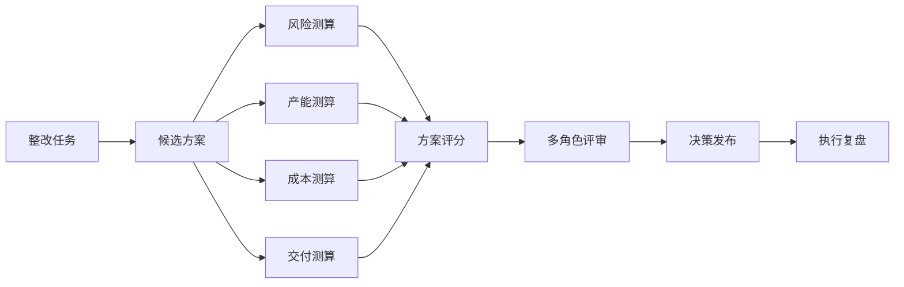
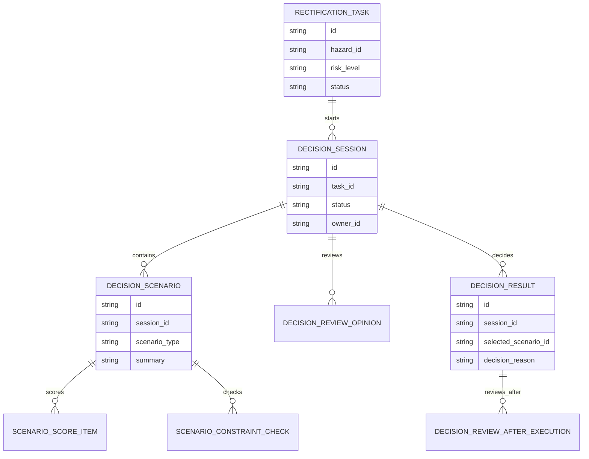
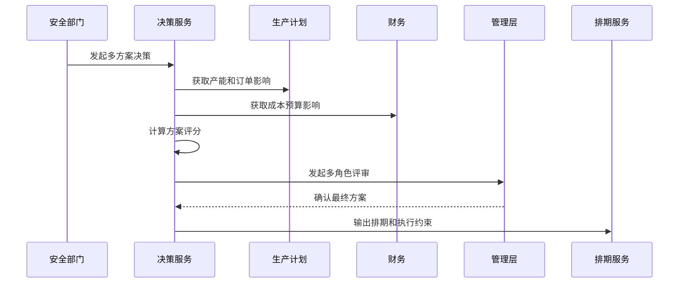
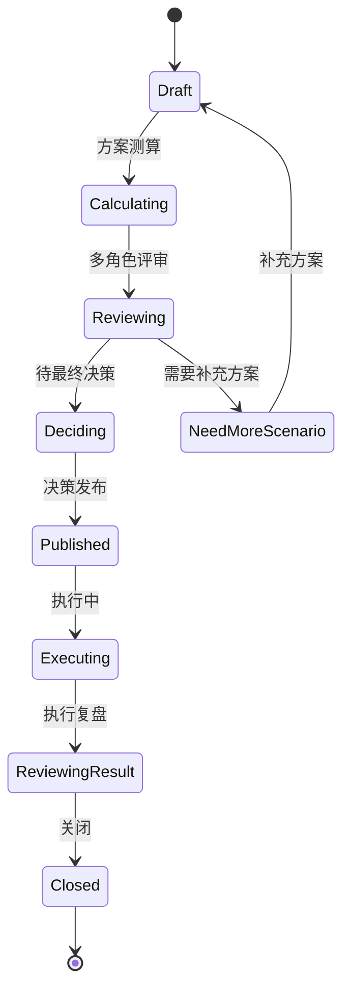
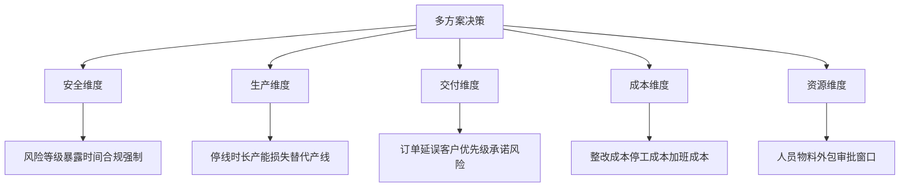

# 生产安全整改多方案决策项目案例

## 适合谁看

- 想理解生产安全整改如何在多个方案之间进行安全、产能、成本和交付权衡的前端开发者。
- 正在做 EHS、安全整改、生产计划、成本管理、设备维保或工厂协同系统的团队。
- 希望避免“只有一个整改方案，业务只能接受或反对，无法做有依据的决策”的项目负责人。

## 业务目标

生产安全整改产线影响评估能算出不同停线或限速方案的影响，但最终决策通常需要安全、生产、计划、财务和管理层共同参与。多方案决策要把各个方案的风险、成本、产能、交付和合规信息放在同一张决策表里。

多方案决策要解决：

- 多个整改方案如何统一建模和比较。
- 每个方案的安全风险、生产损失、订单影响和预算占用如何量化。
- 哪些方案需要升级审批，哪些方案可以直接执行。
- 决策过程如何记录各角色意见和最终选择原因。
- 方案执行后如何复盘实际结果和决策偏差。

## 多方案决策链路

多方案决策的核心不是让系统替人拍板，而是把决策依据结构化，减少部门之间的主观争论。

## 核心概念

| 概念 | 说明 |
| --- | --- |
| 候选方案 | 针对同一整改任务的不同执行方式，例如立即停线、计划停线、局部隔离或替代产线。 |
| 决策维度 | 安全风险、产能损失、订单影响、预算成本、合规要求和资源可用性。 |
| 评分模型 | 按维度权重对方案进行量化评分。 |
| 约束条件 | 强制要求，例如高风险隐患必须在指定时间内处理。 |
| 评审意见 | 安全、生产、计划、财务和管理层对方案的专业意见。 |
| 决策偏差 | 实际执行结果和决策时预测结果之间的差异。 |

## 数据模型

决策会话和方案要分开。一个整改任务可能经历多轮决策，每轮都要保留当时的候选方案和评分。

## 推荐表结构

| 表 | 作用 | 关键字段 |
| --- | --- | --- |
| `decision_session` | 保存决策会话 | `task_id`、`status`、`owner_id`、`started_at` |
| `decision_scenario` | 保存候选方案 | `session_id`、`scenario_type`、`summary`、`expected_start_at` |
| `scenario_score_item` | 保存评分项 | `scenario_id`、`dimension`、`score`、`weight`、`reason` |
| `scenario_constraint_check` | 保存约束校验 | `scenario_id`、`constraint_type`、`result`、`block_reason` |
| `decision_review_opinion` | 保存评审意见 | `session_id`、`reviewer_role`、`scenario_id`、`opinion` |
| `decision_result` | 保存决策结果 | `session_id`、`selected_scenario_id`、`decision_reason`、`approved_by` |
| `decision_review_after_execution` | 保存执行复盘 | `result_id`、`actual_loss`、`actual_delay`、`deviation_reason` |

## 决策评审流程

最终方案发布后要输出给排期模块，否则决策结论仍然停留在报告里。

## 决策状态设计

如果评审阶段发现所有方案都不可接受，应回到补充方案，而不是在坏方案里硬选一个。

## 决策维度拆解

评分模型不应隐藏理由。每个维度的分数都要能展开查看来源数据和说明。

## 前端页面拆分

| 页面 | 核心内容 | 设计重点 |
| --- | --- | --- |
| 决策会话列表 | 整改任务、风险等级、方案数、状态、决策人 | 优先展示高风险和待决策事项。 |
| 方案对比 | 多方案表格、维度评分、约束结果、推荐方案 | 支持横向比较和展开证据。 |
| 评审意见 | 安全、生产、计划、财务、管理层意见 | 让不同角色表达专业判断。 |
| 决策发布 | 最终方案、选择原因、执行约束、通知对象 | 输出结构化结论。 |
| 执行复盘 | 预测与实际差异、偏差原因、模型改进 | 让决策模型持续变准。 |

## 接口拆分建议

| 接口 | 作用 |
| --- | --- |
| `GET /api/safety-rectification-decision-sessions` | 查询决策会话。 |
| `POST /api/safety-rectification-decision-sessions` | 创建决策会话。 |
| `GET /api/safety-rectification-decision-sessions/:id` | 查询决策详情。 |
| `POST /api/safety-rectification-decision-sessions/:id/scenarios` | 添加候选方案。 |
| `POST /api/safety-rectification-decision-sessions/:id/calculate` | 计算方案评分。 |
| `POST /api/safety-rectification-decision-sessions/:id/review` | 提交评审意见。 |
| `POST /api/safety-rectification-decision-sessions/:id/decide` | 发布最终决策。 |
| `POST /api/safety-rectification-decision-results/:id/review-after-execution` | 提交执行复盘。 |

## 实际项目常见问题

### 1. 方案只有文字描述

管理层看不出方案之间的差异。解决方式是把安全、生产、交付、成本和资源维度结构化。

### 2. 推荐方案没有解释

系统给出最高分方案，但用户不知道为什么。解决方式是每个评分项都保留来源数据和评分理由。

### 3. 高风险约束被平均分掩盖

某方案总体分高，但违反安全强制要求。解决方式是约束校验要优先于综合评分。

### 4. 决策记录散落在会议纪要

后续事故复盘无法证明当时为什么选这个方案。解决方式是评审意见和最终原因结构化留痕。

### 5. 执行后不复盘

预测停线 2 小时，实际停了 8 小时，却没有修正模型。解决方式是执行后记录预测与实际偏差。

## 权限与审计

| 权限 | 说明 |
| --- | --- |
| 创建决策会话 | 可以为整改任务发起多方案决策。 |
| 维护候选方案 | 可以添加或编辑候选方案。 |
| 查看敏感影响 | 可以查看订单、成本和产能影响。 |
| 提交评审意见 | 可以按角色发表专业意见。 |
| 发布最终决策 | 可以确认最终执行方案。 |

候选方案、评分模型、评审意见、最终决策和执行复盘都要保留审计记录。

## 验收清单

- 能为整改任务创建多方案决策会话。
- 能维护多个候选方案并结构化比较。
- 能计算安全、生产、交付、成本和资源评分。
- 能识别强制约束并阻断不可执行方案。
- 能记录多角色评审意见。
- 能发布最终方案并输出排期约束。
- 能复盘实际执行和预测偏差。

## 下一步学习

- [生产安全整改产线影响评估项目案例](/projects/production-safety-rectification-line-impact-assessment-case)
- [生产安全整改资源排期项目案例](/projects/production-safety-rectification-resource-scheduling-case)
- [预算管理项目案例](/projects/budget-management-case)
