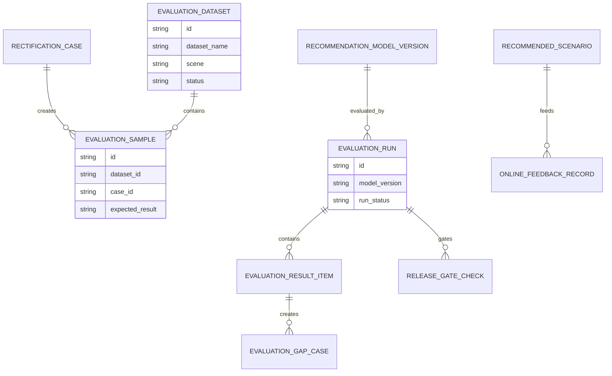
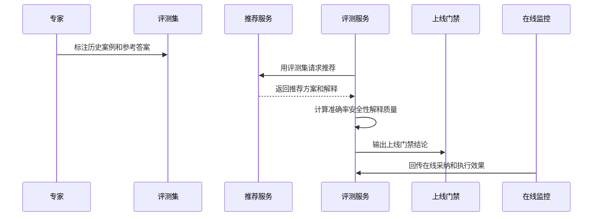
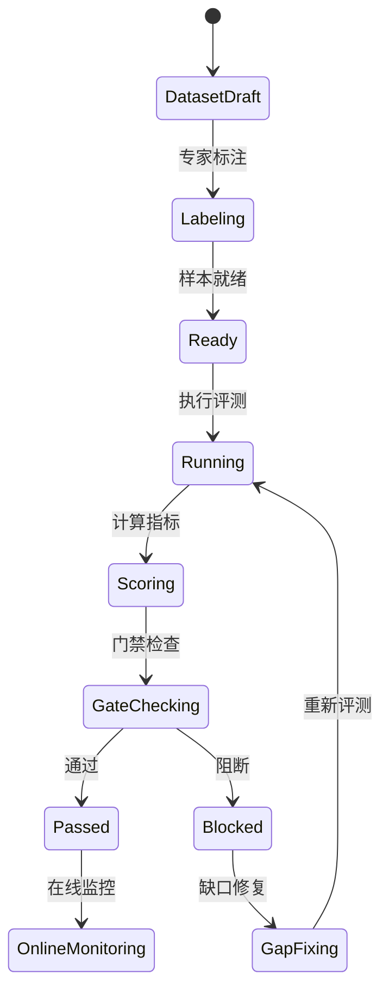
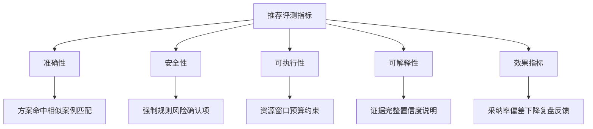
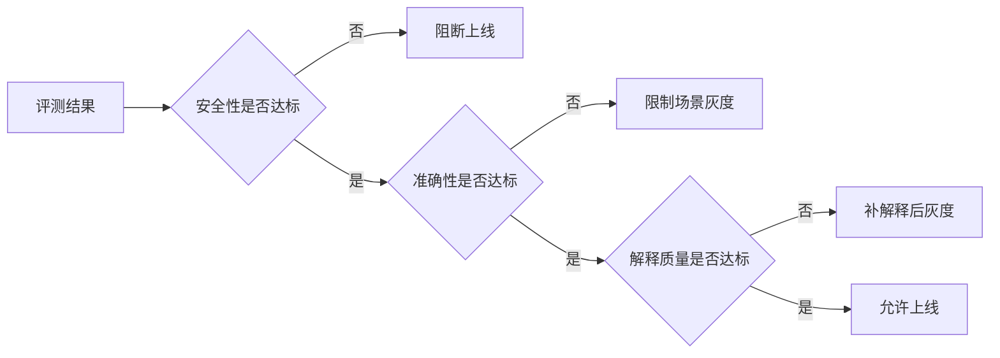

# 生产安全整改决策推荐评测项目案例

## 适合谁看

- 想理解生产安全整改智能推荐上线前后如何评估质量的前端开发者。
- 正在做 EHS、安全整改、智能推荐、AI 工程、评测平台或决策支持系统的团队。
- 希望避免“推荐功能看起来智能，但不知道推荐是否准确、安全、可解释”的项目负责人。

## 业务目标

生产安全整改决策智能推荐能生成候选方案，但推荐结果必须被持续评测。安全整改属于高风险场景，推荐不能只看点击率或采纳率，还要评估安全约束是否正确、方案是否可执行、解释是否充分、是否遗漏高风险确认项、执行后偏差是否下降。

推荐评测要解决：

- 推荐质量用哪些指标衡量。
- 历史案例如何构建离线评测集。
- 在线推荐如何收集采纳、驳回和执行效果。
- 安全规则是否被推荐系统绕过。
- 评测结果如何影响模型版本、规则配置和上线门禁。

## 推荐评测链路

推荐评测要同时覆盖上线前和上线后。离线评测证明基础能力，在线评测证明真实效果。

## 核心概念

| 概念 | 说明 |
| --- | --- |
| 评测集 | 从历史整改任务、决策方案、执行结果和复盘知识中构建的测试样本。 |
| 参考答案 | 历史最终方案、专家标注方案或安全规则要求。 |
| 离线评测 | 在固定样本上评估推荐准确性、覆盖率和安全约束。 |
| 在线评测 | 在真实使用中评估采纳、驳回、偏差、风险和解释质量。 |
| 安全门禁 | 推荐版本上线前必须满足的最低评测要求。 |
| 评测缺口 | 推荐失败、解释不足、安全规则遗漏或效果偏差的样本集合。 |

## 数据模型

评测集要版本化，否则模型版本之间无法公平比较。

## 推荐表结构

| 表 | 作用 | 关键字段 |
| --- | --- | --- |
| `evaluation_dataset` | 保存评测集 | `dataset_name`、`scene`、`version_no`、`status` |
| `evaluation_sample` | 保存评测样本 | `dataset_id`、`case_id`、`expected_result`、`risk_level` |
| `recommendation_model_version` | 保存推荐版本 | `model_version`、`rule_version`、`published_at`、`status` |
| `evaluation_run` | 保存评测执行 | `dataset_id`、`model_version`、`run_status`、`started_at` |
| `evaluation_result_item` | 保存指标结果 | `run_id`、`metric_code`、`metric_value`、`threshold` |
| `evaluation_gap_case` | 保存失败样本 | `run_id`、`sample_id`、`gap_type`、`analysis_status` |
| `online_feedback_record` | 保存在线反馈 | `scenario_id`、`feedback_type`、`actual_result`、`deviation` |
| `release_gate_check` | 保存上线门禁 | `run_id`、`gate_result`、`block_reason`、`approved_by` |

## 评测执行流程

安全类推荐评测必须有专家参与，不能只依赖历史最终方案。

## 评测状态设计

评测不通过时要能看到失败样本，而不是只显示一个分数。

## 评测指标拆解

安全性指标的权重要高于采纳率。被采纳不代表推荐安全。

## 上线门禁矩阵

安全性不达标时不能通过人工审批强行上线，只能修复后重新评测。

## 前端页面拆分

| 页面 | 核心内容 | 设计重点 |
| --- | --- | --- |
| 评测集管理 | 样本、风险等级、参考答案、标注状态 | 支持专家标注和版本管理。 |
| 评测运行 | 模型版本、评测集、运行状态、指标结果 | 让团队对比不同版本。 |
| 失败样本分析 | 样本上下文、推荐结果、参考答案、失败类型 | 支持定位模型或规则问题。 |
| 上线门禁 | 安全、准确、解释和效果指标门槛 | 服务发布决策。 |
| 在线评测 | 采纳、驳回、执行偏差、风险事件 | 持续监控真实效果。 |

## 接口拆分建议

| 接口 | 作用 |
| --- | --- |
| `GET /api/safety-rectification-recommendation-datasets` | 查询评测集。 |
| `POST /api/safety-rectification-recommendation-datasets` | 创建评测集。 |
| `POST /api/safety-rectification-recommendation-datasets/:id/samples` | 添加评测样本。 |
| `POST /api/safety-rectification-recommendation-evaluations` | 创建评测运行。 |
| `GET /api/safety-rectification-recommendation-evaluations/:id` | 查询评测详情。 |
| `GET /api/safety-rectification-recommendation-evaluations/:id/gaps` | 查询失败样本。 |
| `POST /api/safety-rectification-recommendation-evaluations/:id/gate-check` | 执行上线门禁。 |
| `GET /api/safety-rectification-recommendation-online-metrics` | 查询在线评测指标。 |

## 实际项目常见问题

### 1. 只看采纳率

用户采纳不代表推荐安全。解决方式是安全约束和执行偏差必须作为核心指标。

### 2. 评测样本没有专家标注

历史最终方案不一定是最优方案。解决方式是高风险样本需要专家复核参考答案。

### 3. 失败样本不可追踪

分数低但不知道错在哪里。解决方式是保留推荐输入、输出、证据和失败类型。

### 4. 上线门禁可以绕过

安全风险被业务压力压过。解决方式是安全性不达标强制阻断。

### 5. 上线后不持续评测

模型效果随数据变化下降。解决方式是在线反馈和执行复盘持续回写评测平台。

## 权限与审计

| 权限 | 说明 |
| --- | --- |
| 管理评测集 | 可以创建样本和维护参考答案。 |
| 执行评测 | 可以对模型版本运行评测。 |
| 查看失败样本 | 可以查看推荐输入输出和风险证据。 |
| 管理门禁 | 可以配置上线门槛。 |
| 查看在线指标 | 可以查看真实使用效果。 |

评测集变更、样本标注、评测执行、门禁结论、失败分析和在线反馈都要留痕。

## 验收清单

- 能构建整改推荐评测集。
- 能维护专家标注和参考答案。
- 能对推荐版本执行离线评测。
- 能计算准确性、安全性、可执行性和解释质量。
- 能识别失败样本并分类。
- 能用评测结果控制上线门禁。
- 能采集在线反馈并持续评估推荐效果。

## 下一步学习

- [生产安全整改决策智能推荐项目案例](/projects/production-safety-rectification-decision-intelligent-recommendation-case)
- [AI 工程评测](/ai-engineering/evaluation)
- [生产安全整改决策知识库项目案例](/projects/production-safety-rectification-decision-knowledge-base-case)
