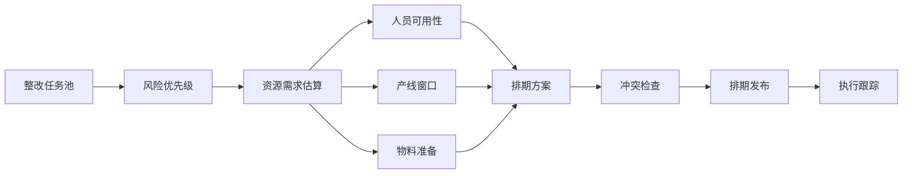
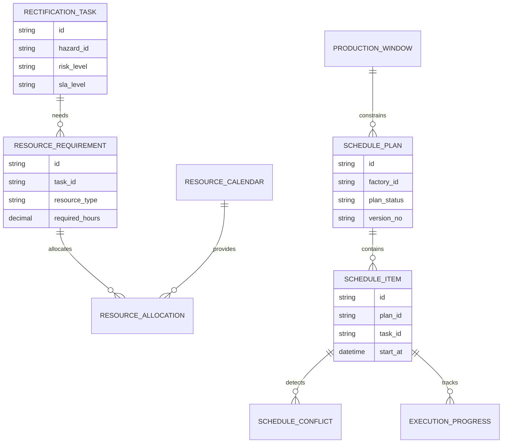
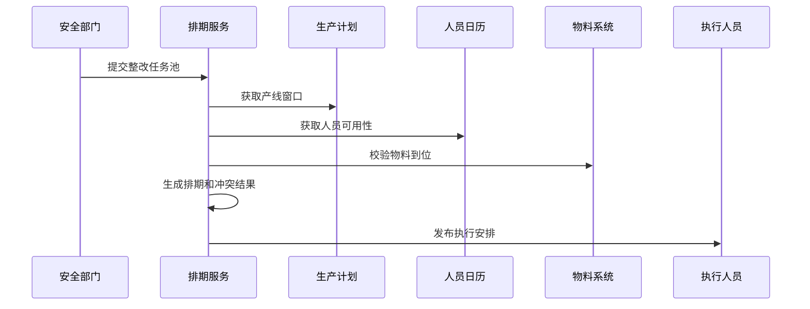
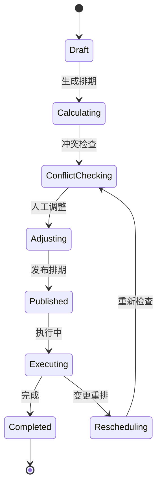
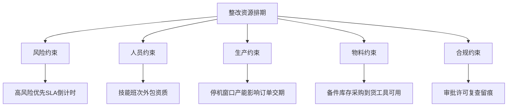

# 生产安全整改资源排期项目案例

## 适合谁看

- 想理解生产安全整改如何分配人员、停机窗口、物料和预算资源的前端开发者。
- 正在做 EHS、安全隐患整改、生产计划、设备维保、工厂协同或制造执行系统的团队。
- 希望避免“整改任务很多，但人、设备、产线和物料排不开，最后 SLA 逾期”的项目负责人。

## 业务目标

生产安全整改预算预测解决“需要多少钱”的问题，但真实执行还要回答“谁来做、什么时候做、影响哪条线、要不要停机、物料是否到位”。

资源排期要解决：

- 高风险整改任务优先级如何确定。
- 维修人员、安全员、外包服务商和产线窗口如何协调。
- 停机整改如何与生产计划冲突检查。
- 物料、备件、工具和审批是否已准备好。
- 排期变化后，SLA、预算和风险暴露时间如何重新计算。

## 资源排期链路

资源排期不是日历组件。它本质上是“风险优先级、生产影响、人员能力、物料到位和 SLA 约束”的组合决策。

## 核心概念

| 概念 | 说明 |
| --- | --- |
| 整改任务 | 来自安全隐患、事故复盘、巡检或审核的整改事项。 |
| 资源需求 | 完成整改需要的人员角色、工时、设备、物料、外包和停机窗口。 |
| 产线窗口 | 可以停机或低负荷作业的时间段。 |
| 排期冲突 | 同一人员、设备、产线或物料在同一时间被多个任务占用。 |
| 风险暴露时间 | 从发现隐患到完成整改之间风险持续存在的时间。 |
| 排期重算 | 任务延期、人员变化、物料缺货或生产计划变化后重新生成排期。 |

## 数据模型

排期计划要版本化。安全整改排期经常因为生产计划、人员、物料和审批变化而调整，只有版本化才能解释延期原因。

## 推荐表结构

| 表 | 作用 | 关键字段 |
| --- | --- | --- |
| `rectification_task` | 保存整改任务 | `hazard_id`、`risk_level`、`sla_due_at`、`status` |
| `resource_requirement` | 保存资源需求 | `task_id`、`resource_type`、`skill_code`、`required_hours` |
| `resource_calendar` | 保存资源日历 | `resource_id`、`resource_type`、`available_start`、`available_end` |
| `production_window` | 保存产线窗口 | `line_id`、`window_type`、`start_at`、`end_at` |
| `schedule_plan` | 保存排期计划 | `factory_id`、`version_no`、`plan_status`、`published_at` |
| `schedule_item` | 保存排期明细 | `plan_id`、`task_id`、`start_at`、`end_at`、`owner_id` |
| `schedule_conflict` | 保存冲突结果 | `item_id`、`conflict_type`、`severity`、`suggestion` |

## 排期生成流程

排期发布前必须做冲突检查。否则前端展示的是计划，现场执行会变成临时协调。

## 排期状态设计

重排不是失败状态。重排要保留原因，例如物料延迟、产线插单、人员请假或风险升级。

## 排期约束拆解

约束拆解能帮助前端解释“为什么这个任务排在这里”，否则用户会认为系统随意排序。

## 前端页面拆分

| 页面 | 核心内容 | 设计重点 |
| --- | --- | --- |
| 整改任务池 | 风险等级、SLA、位置、资源需求、状态 | 先显示高风险和临期任务。 |
| 排期看板 | 日历、甘特图、产线窗口、人员占用 | 适合调度人员拖拽调整。 |
| 冲突中心 | 人员冲突、产线冲突、物料缺口、审批缺口 | 冲突要给出处理建议。 |
| 资源详情 | 人员技能、班次、工时、外包资质 | 避免把任务派给不具备资质的人。 |
| 执行跟踪 | 开始、暂停、完工、复查、延期原因 | 排期和现场执行要闭环。 |

## 接口拆分建议

| 接口 | 作用 |
| --- | --- |
| `GET /api/safety-rectification-tasks` | 查询整改任务池。 |
| `POST /api/safety-rectification-schedule-plans` | 创建排期计划。 |
| `POST /api/safety-rectification-schedule-plans/:id/calculate` | 生成排期方案。 |
| `GET /api/safety-rectification-schedule-plans/:id/conflicts` | 查询冲突结果。 |
| `POST /api/safety-rectification-schedule-items/:id/adjust` | 调整排期项。 |
| `POST /api/safety-rectification-schedule-plans/:id/publish` | 发布排期。 |
| `GET /api/safety-rectification-schedule-items/:id/progress` | 查询执行进度。 |

## 实际项目常见问题

### 1. 只按截止时间排序

高风险任务可能比低风险临期任务更重要。解决方式是综合风险等级、SLA、影响范围和资源准备度生成优先级。

### 2. 日历显示很清楚，但现场做不了

排期没有校验人员技能、物料到位和停机窗口。解决方式是排期发布前做资源约束检查。

### 3. 生产计划变化后整改排期失效

产线临时插单或停机窗口取消后，整改任务还按旧计划执行。解决方式是监听生产计划变化并触发排期重算。

### 4. 资源冲突只提示“有冲突”

用户不知道怎么处理。解决方式是冲突结果要给出建议，例如换人、拆分任务、调整窗口或升级审批。

### 5. 延期原因没有沉淀

任务延期后只改时间，后续无法复盘。解决方式是每次重排都记录原因、影响和审批人。

## 权限与审计

| 权限 | 说明 |
| --- | --- |
| 创建排期 | 可以基于任务池生成排期计划。 |
| 调整排期 | 可以拖拽或编辑排期项。 |
| 发布排期 | 可以通知执行人员和产线负责人。 |
| 处理冲突 | 可以确认冲突处理方案。 |
| 查看资源 | 可以查看人员、物料和产线窗口。 |

排期生成、人工调整、冲突忽略、发布和重排都要写审计日志，尤其是高风险整改任务。

## 验收清单

- 能从整改任务池生成资源需求。
- 能展示人员、物料、产线窗口和审批约束。
- 能生成排期计划并检测冲突。
- 能对冲突给出可执行建议。
- 能发布排期并通知执行人员。
- 能跟踪执行进度、延期和重排原因。
- 能复盘资源占用、SLA 逾期和风险暴露时间。

## 下一步学习

- [生产安全整改预算预测项目案例](/projects/production-safety-rectification-budget-forecast-case)
- [生产安全整改 SLA 项目案例](/projects/production-safety-rectification-sla-case)
- [生产排程项目案例](/projects/production-scheduling-case)
