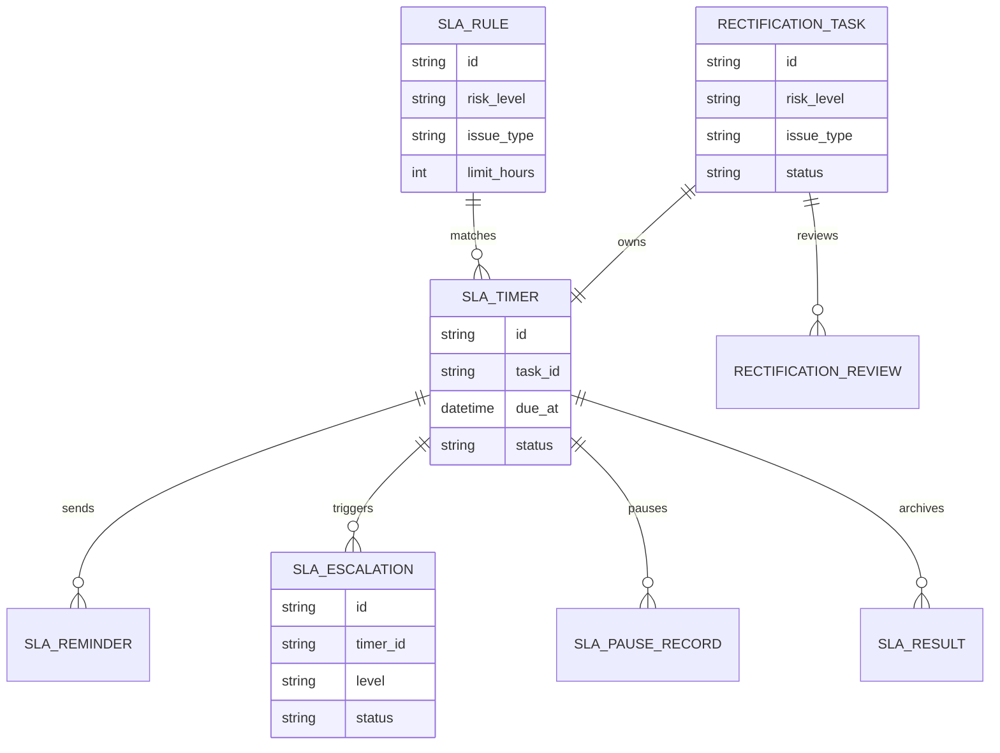
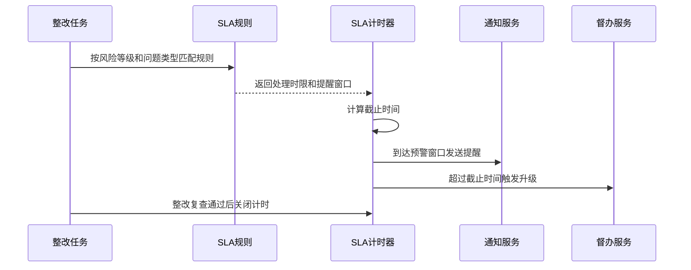
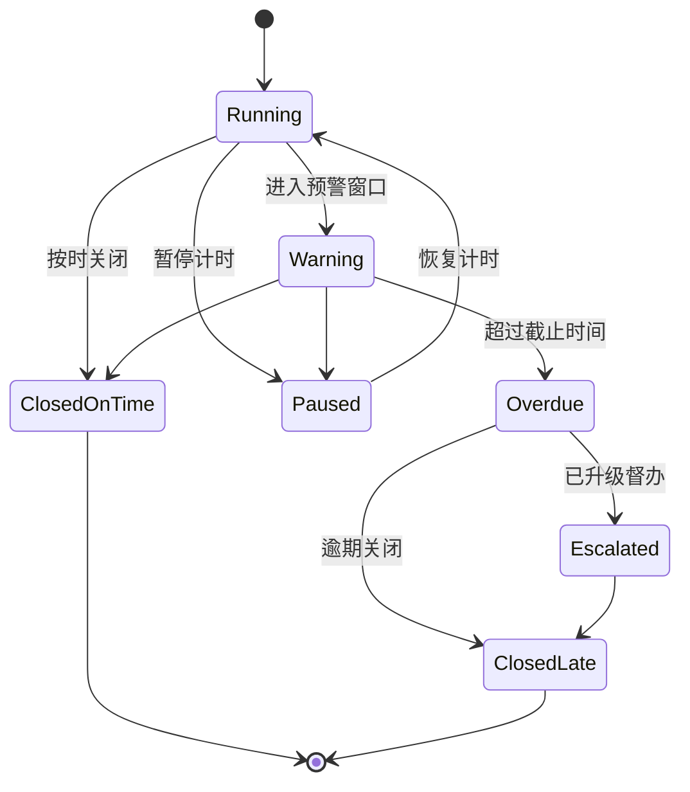
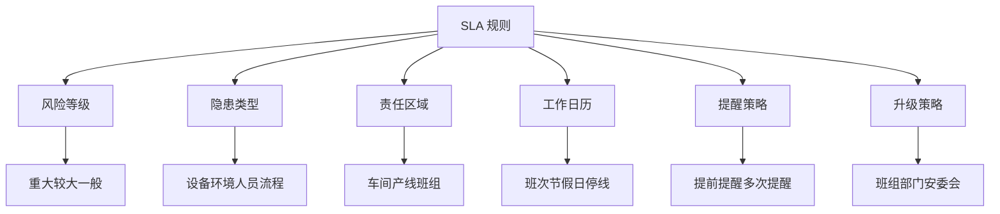

# 生产安全整改 SLA 项目案例

## 适合谁看

- 想理解生产安全整改如何设置时限、升级、预警和责任追踪的前端开发者。
- 正在做 EHS、安全隐患、整改闭环、车间管理、风险画像或督办系统的团队。
- 希望避免“整改任务很多，但没有明确时限、逾期升级和责任闭环”的项目负责人。

## 业务目标

生产安全整改看板能看到整改状态，但管理者还需要知道：哪些任务已经超过处理时限、哪些即将逾期、哪些必须升级到部门负责人或安委会。

生产安全整改 SLA 的目标是：

- 按风险等级、隐患类型、区域和责任组织配置整改时限。
- 在任务即将逾期时提醒责任人。
- 在任务逾期后自动升级并留下督办记录。
- 对多次逾期、重复隐患、高风险未闭环做专项追踪。
- 为安全考核、审计检查和管理复盘提供证据。

## SLA 闭环链路

SLA 不是简单的 `deadline` 字段。它包含规则匹配、时钟计算、暂停恢复、提醒升级、最终评价和审计记录。

## 核心概念

| 概念 | 说明 |
| --- | --- |
| SLA 规则 | 根据风险等级、问题类型、区域、责任部门定义处理时限。 |
| 截止时间 | 根据规则、日历和暂停时间计算出来的任务完成时间。 |
| 预警窗口 | 距离截止时间还有一段时间时提前提醒。 |
| 逾期升级 | 超过截止时间后自动通知上级或生成督办记录。 |
| 暂停计时 | 因停产、外部检测、备件等待等合理原因暂停 SLA。 |
| SLA 结果 | 按时完成、逾期完成、逾期未完成、豁免关闭等结果。 |

## 数据模型

整改任务和 SLA 计时器建议分表。整改任务关注业务状态，SLA 计时器关注时间规则和升级结果，后续调整 SLA 逻辑不会污染任务主表。

## 推荐表结构

| 表 | 作用 | 关键字段 |
| --- | --- | --- |
| `sla_rule` | 保存 SLA 规则 | `risk_level`、`issue_type`、`area_type`、`limit_hours`、`enabled` |
| `sla_timer` | 保存任务 SLA 计时 | `task_id`、`rule_id`、`started_at`、`due_at`、`status` |
| `sla_reminder` | 保存提醒记录 | `timer_id`、`remind_type`、`receiver_id`、`sent_at` |
| `sla_escalation` | 保存升级督办 | `timer_id`、`escalation_level`、`receiver_id`、`status` |
| `sla_pause_record` | 保存暂停记录 | `timer_id`、`reason`、`started_at`、`ended_at`、`approved_by` |
| `sla_result` | 保存最终结果 | `timer_id`、`result_type`、`delay_hours`、`closed_at` |

## SLA 计算流程

SLA 计算要考虑工作日历。很多制造企业有班次、节假日、停线时间，如果只按自然小时计算，业务上会有争议。

## SLA 状态设计

暂停计时必须有审批和原因。否则责任人可能滥用暂停来避免逾期，导致 SLA 指标失真。

## SLA 规则拆解

规则维度不能一开始就无限扩展。建议先支持风险等级、隐患类型、责任组织、工作日历四类核心维度，再根据实际管理需要补充特殊规则。

## 前端页面拆分

| 页面 | 核心内容 | 设计重点 |
| --- | --- | --- |
| SLA 规则配置 | 规则条件、处理时限、提醒窗口、升级层级 | 条件组合要清楚，避免用户配置冲突。 |
| 整改 SLA 看板 | 即将逾期、已逾期、升级中、按时率 | 管理者优先看风险和责任组织。 |
| 任务 SLA 详情 | 计时开始、截止时间、提醒记录、暂停记录、升级记录 | 时间线要清晰展示为什么逾期。 |
| 逾期督办列表 | 逾期任务、责任人、升级层级、处理状态 | 支持批量督办和跟进。 |
| SLA 复盘 | 按部门、区域、风险类型统计 SLA 表现 | 用于考核和制度优化。 |

## 接口拆分建议

| 接口 | 作用 |
| --- | --- |
| `GET /api/safety-sla-rules` | 查询 SLA 规则。 |
| `POST /api/safety-sla-rules` | 新增 SLA 规则。 |
| `PUT /api/safety-sla-rules/:id` | 修改 SLA 规则。 |
| `GET /api/safety-sla-dashboard/overview` | 查询 SLA 看板总览。 |
| `GET /api/safety-sla-timers/:taskId` | 查询任务 SLA 详情。 |
| `POST /api/safety-sla-timers/:id/pause` | 申请暂停计时。 |
| `POST /api/safety-sla-timers/:id/resume` | 恢复计时。 |
| `POST /api/safety-sla-escalations/:id/handle` | 处理升级督办。 |

## 实际项目常见问题

### 1. 所有隐患都用同一个截止时间

重大风险和一般问题用同一时限，会导致高风险响应太慢、低风险管理过重。解决方式是按风险等级和问题类型配置规则。

### 2. 只记录截止时间，不记录计算依据

用户不知道截止时间为什么是这个时间。解决方式是在 SLA 计时器里保存匹配到的规则、日历和暂停记录。

### 3. 逾期后只提醒责任人

责任人已经没处理时继续提醒没有意义。解决方式是按逾期时长逐级升级到班组长、部门负责人、安全管理人员。

### 4. 暂停计时没有审批

暂停容易被滥用。解决方式是暂停必须填写原因、上传证据，并由有权限的人审批。

### 5. SLA 指标只看部门排名

排名会诱导人为关闭或低报风险。解决方式是同时看高风险未闭环、重复隐患、复查退回率和暂停比例。

## 权限与审计

| 权限 | 说明 |
| --- | --- |
| 配置 SLA 规则 | 可以新增、修改、停用 SLA 规则。 |
| 查看 SLA 看板 | 可以查看组织范围内 SLA 指标。 |
| 申请暂停 | 可以为任务申请暂停计时。 |
| 审批暂停 | 可以审核暂停申请。 |
| 处理督办 | 可以处理逾期升级任务。 |

规则变更、暂停审批、逾期升级和任务关闭都要写审计日志。SLA 相关日志要能证明“当时为什么这么算”。

## 验收清单

- 能按风险等级、隐患类型和责任组织匹配 SLA 规则。
- 能自动计算整改任务截止时间。
- 能在预警窗口发送提醒。
- 能在逾期后触发逐级升级。
- 能申请、审批和追踪暂停计时。
- 能查看单个任务的 SLA 时间线。
- 能统计按时率、逾期率、暂停率和升级处理情况。

## 下一步学习

- [生产安全整改看板项目案例](/projects/production-safety-rectification-dashboard-case)
- [生产安全风险整改复查项目案例](/projects/production-safety-risk-rectification-review-case)
- [生产安全风险画像项目案例](/projects/production-safety-risk-profile-case)
