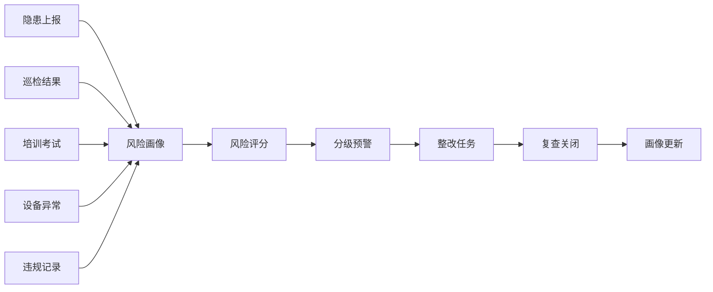
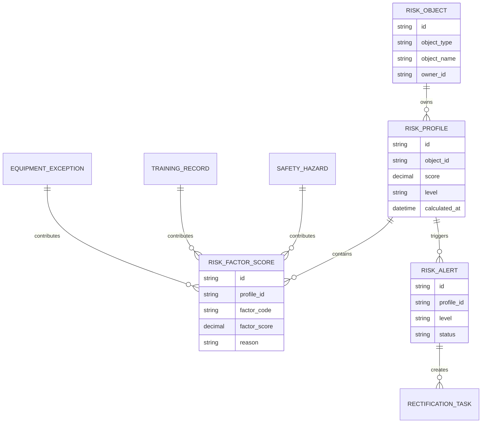
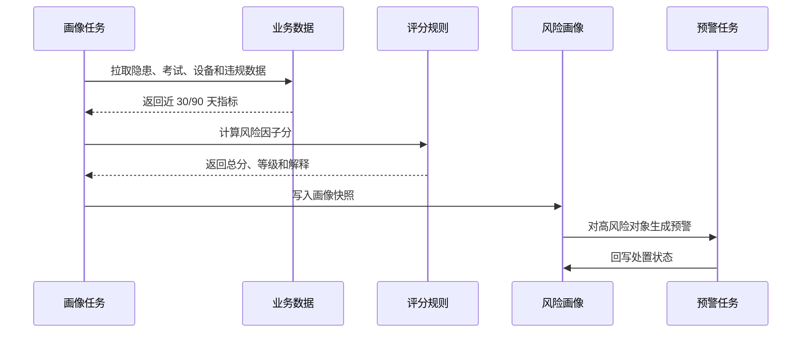
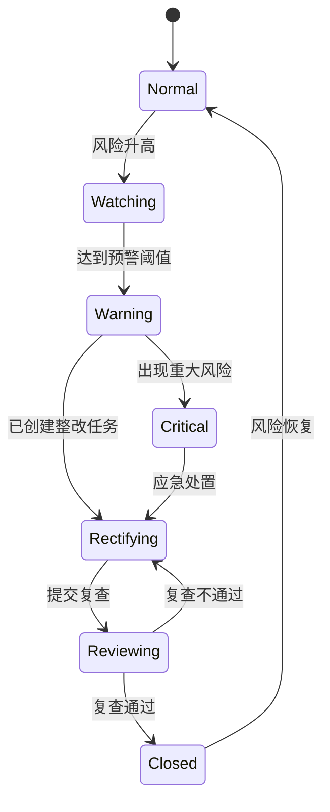
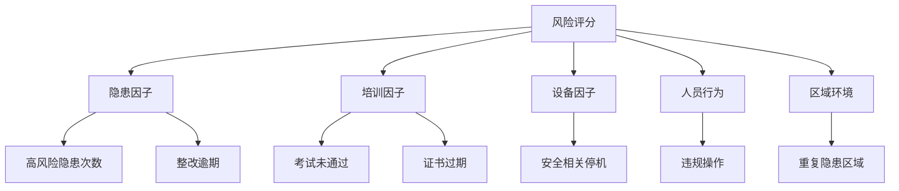

# 生产安全风险画像项目案例

## 适合谁看

- 想理解制造业安全管理、风险分级和整改闭环的前端开发者。
- 正在做 EHS、MES、巡检、培训或设备安全系统的团队。
- 希望把安全隐患、培训、考试、设备和人员资质统一起来做风险分析的项目负责人。

## 业务目标

生产安全风险画像的目标，是把现场隐患、违规记录、培训考试、岗位资质、设备异常和区域风险整合成可解释的风险等级。

它不是为了给员工“贴标签”，而是帮助管理者更早发现：

- 哪些区域隐患反复出现。
- 哪些岗位资质不足。
- 哪些班组近期风险上升。
- 哪些设备异常可能带来安全事故。
- 哪些整改任务逾期未关闭。

## 风险画像链路

初学者可以把风险画像理解成“把散落在各系统里的安全线索合并到一张风险卡片上”。

## 核心概念

| 概念 | 说明 | 举例 |
| --- | --- | --- |
| 风险对象 | 被评估的主体 | 人员、班组、区域、设备、工序 |
| 风险因子 | 影响风险的指标 | 隐患次数、考试未通过、设备停机 |
| 风险权重 | 不同因子的影响程度 | 重大隐患权重大于一般隐患 |
| 风险等级 | 画像的输出结果 | 低、中、高、重大 |
| 整改闭环 | 从发现问题到验证关闭 | 上报、分派、整改、复查 |
| 解释原因 | 为什么是这个等级 | 最近 30 天 3 次高风险隐患 |

## 数据模型

## 推荐表结构

| 表 | 关键字段 | 作用 |
| --- | --- | --- |
| `risk_object` | `object_type`、`object_id`、`object_name`、`owner_id` | 统一画像对象 |
| `risk_profile` | `object_id`、`score`、`level`、`calculated_at` | 保存画像结果 |
| `risk_factor_score` | `factor_code`、`factor_score`、`weight`、`reason` | 保存因子解释 |
| `risk_alert` | `profile_id`、`level`、`trigger_reason`、`status` | 记录风险预警 |
| `rectification_task` | `alert_id`、`owner_id`、`deadline_at`、`status` | 管理整改任务 |
| `risk_profile_snapshot` | `profile_id`、`snapshot_json`、`version` | 保留历史快照 |

## 画像计算流程

## 风险状态设计

## 风险因子拆解

第一版不要做复杂机器学习。用清晰可解释的规则更容易上线，例如：

- 重大隐患未关闭：直接高风险。
- 安全证书过期且仍在岗：直接高风险。
- 30 天内重复出现同类隐患：风险加分。
- 整改逾期超过 7 天：风险加分。

## 前端页面拆分

| 页面 | 主要内容 | 设计重点 |
| --- | --- | --- |
| 风险总览 | 高风险对象、区域热力、趋势、整改逾期 | 先展示需要处理的风险 |
| 风险画像列表 | 对象类型、风险等级、分数、主因、负责人 | 支持按区域、班组、设备筛选 |
| 画像详情 | 因子贡献、历史趋势、关联隐患、证书状态 | 必须能解释评分原因 |
| 预警中心 | 风险预警、等级、触发原因、处置状态 | 支持升级和关闭 |
| 整改跟踪 | 整改任务、复查结果、逾期原因 | 关注闭环，而不是只看上报数 |

## 接口拆分建议

| 接口 | 方法 | 说明 |
| --- | --- | --- |
| `/api/safety-risk/profiles` | GET | 查询风险画像 |
| `/api/safety-risk/profiles/:id` | GET | 查询画像详情 |
| `/api/safety-risk/profiles/:id/factors` | GET | 查询因子解释 |
| `/api/safety-risk/alerts` | GET | 查询风险预警 |
| `/api/safety-risk/alerts/:id/tasks` | POST | 创建整改任务 |
| `/api/safety-risk/calculate` | POST | 手动触发画像计算 |
| `/api/safety-risk/trends` | GET | 查询风险趋势 |

## 实际项目常见问题

### 1. 风险分数业务不认可

通常是因为系统只给分数，不给原因。画像详情必须展示因子贡献和原始证据。

例如“风险 82 分”没有意义，“重大隐患未关闭 + 证书过期 + 整改逾期 5 天”才有意义。

### 2. 数据来自多个系统，时间口径不一致

画像计算要固定统计窗口，例如近 30 天、近 90 天，并在页面展示计算时间。

跨系统数据要保存快照，否则今天看到的画像无法解释昨天为什么触发预警。

### 3. 风险对象不好统一

建议用 `object_type + object_id` 管理对象。对象类型可以是人员、班组、设备、区域或工序。

不要为每种对象做一套完全不同的页面。详情区域可以按对象类型展示扩展字段。

### 4. 高风险太多，没人处理

需要分级处置。高风险只代表需要关注，重大风险才必须立即升级。

页面上要区分“待确认风险”和“已进入整改”的风险，避免管理者看到一堆无法行动的红色状态。

### 5. 画像更新太频繁导致指标跳动

可以采用每日定时计算，加上重大事件实时触发。页面展示最近一次计算时间，并保留历史趋势。

## 权限与审计

| 动作 | 权限建议 | 审计内容 |
| --- | --- | --- |
| 查看风险画像 | 安全管理员、车间负责人 | 查询对象和范围 |
| 修改评分规则 | 安全负责人 | 修改前后规则和原因 |
| 创建整改任务 | 安全管理员 | 任务内容和责任人 |
| 关闭风险预警 | 复查人员或主管 | 关闭证据 |
| 导出风险清单 | 安全管理员 | 导出范围和字段 |

## 验收清单

- 能按人员、班组、区域、设备生成风险画像。
- 每个风险等级都有可解释原因。
- 高风险对象能自动生成预警或整改任务。
- 整改完成后风险状态可以复查关闭。
- 页面能展示历史趋势和计算时间。
- 评分规则调整后能保留版本和审计记录。

## 下一步学习

完成这个案例后，可以继续学习：

- [生产现场安全隐患项目案例](/projects/production-safety-hazard-case)
- [生产安全培训闭环项目案例](/projects/production-safety-training-closed-loop-case)
- [生产安全考试认证项目案例](/projects/production-safety-exam-certification-case)

