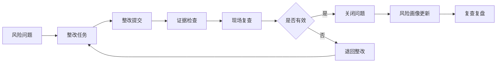
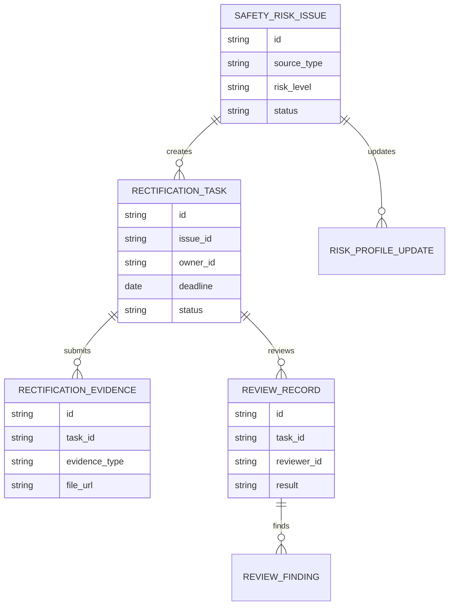
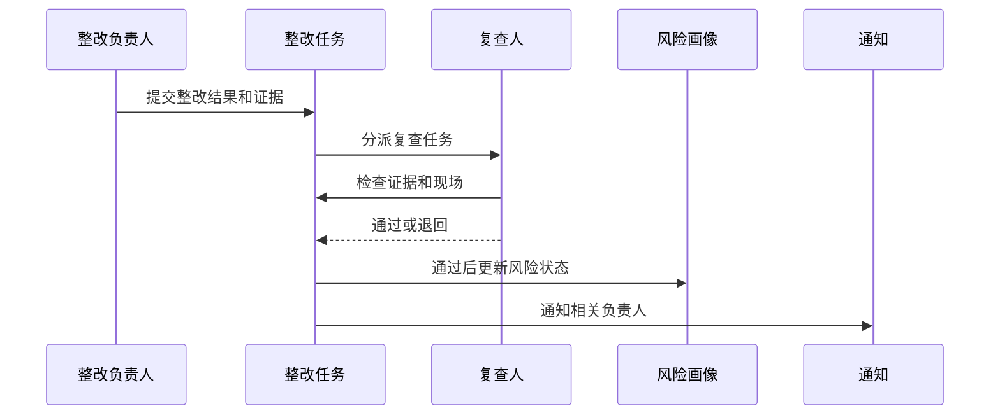
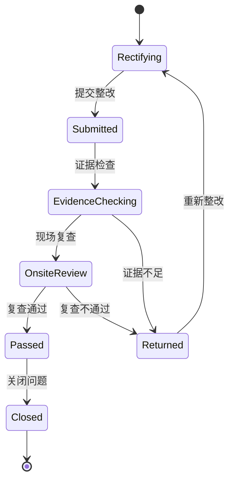
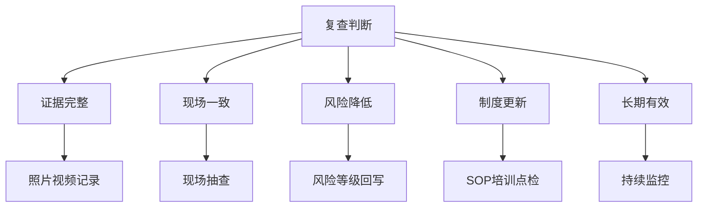

# 生产安全风险整改复查项目案例

## 适合谁看

- 想理解安全隐患从发现、整改到复查关闭全过程的前端开发者。
- 正在做 EHS、安全巡检、隐患治理、生产现场管理或风险画像系统的团队。
- 希望把“整改已提交”升级为“整改有效、证据充分、风险真的下降”的项目负责人。

## 业务目标

生产安全风险整改复查的目标，是确保安全隐患、事故问题、演练问题或风险画像预警在整改后经过复查验证，确认风险已经被控制。

它解决的不是“任务做完了吗”，而是“问题真的解决了吗”。

常见复查对象包括：

- 现场安全隐患。
- 事故复盘整改措施。
- 应急演练问题。
- 高风险区域整改。
- 设备防护改造。

## 整改复查链路

可以把它理解成“安全风险的验收系统”。整改人提交完成只是中间步骤，复查通过才是闭环。

## 核心概念

| 概念 | 说明 | 例子 |
| --- | --- | --- |
| 风险问题 | 需要整改的安全风险 | 防护栏缺失、通道堵塞 |
| 整改措施 | 责任人执行的改进动作 | 安装护栏、清理通道 |
| 复查标准 | 判断整改是否有效的条件 | 现场照片、点检记录、验收结果 |
| 整改证据 | 证明整改完成的材料 | 照片、视频、施工单 |
| 复查结论 | 通过、退回、升级 | 证据不足退回 |
| 风险回写 | 复查结果影响风险画像 | 高风险降为中风险 |

## 数据模型

## 推荐表结构

| 表 | 关键字段 | 作用 |
| --- | --- | --- |
| `safety_risk_issue` | `source_type`、`risk_level`、`description`、`status` | 风险问题 |
| `rectification_task` | `issue_id`、`owner_id`、`deadline_at`、`status` | 整改任务 |
| `rectification_evidence` | `task_id`、`evidence_type`、`file_url`、`description` | 整改证据 |
| `review_standard` | `issue_type`、`standard_items_json`、`required_evidence_json` | 复查标准 |
| `review_record` | `task_id`、`reviewer_id`、`result`、`comment` | 复查记录 |
| `review_finding` | `review_id`、`finding_type`、`description`、`level` | 复查发现 |
| `risk_profile_update` | `issue_id`、`before_level`、`after_level`、`reason` | 风险回写 |

## 整改复查流程

## 复查状态设计

## 复查维度拆解

复查标准要提前定义。否则不同复查人标准不一致，同样的问题有人通过，有人退回。

## 前端页面拆分

| 页面 | 主要内容 | 设计重点 |
| --- | --- | --- |
| 整改任务列表 | 问题、等级、责任人、截止时间、状态 | 突出逾期和高风险 |
| 整改提交页 | 措施说明、附件、完成时间、影响范围 | 移动端方便上传证据 |
| 复查工作台 | 待复查任务、证据、标准、现场记录 | 让复查人按标准判断 |
| 复查详情 | 整改前后对比、复查意见、退回原因 | 形成完整证据链 |
| 风险回写 | 风险等级变化、画像更新、后续监控 | 连接风险画像系统 |

## 接口拆分建议

| 接口 | 方法 | 说明 |
| --- | --- | --- |
| `/api/safety-rectifications` | GET | 查询整改任务 |
| `/api/safety-rectifications/:id/submit` | POST | 提交整改 |
| `/api/safety-rectifications/:id/evidence` | POST | 上传证据 |
| `/api/safety-rectifications/:id/review` | POST | 提交复查结果 |
| `/api/safety-rectifications/:id/return` | POST | 退回整改 |
| `/api/safety-rectifications/:id/close` | POST | 关闭问题 |
| `/api/safety-review-standards` | GET | 查询复查标准 |

## 实际项目常见问题

### 1. 整改照片无法证明真的整改

照片要尽量带时间、地点、设备或区域信息。关键问题可以要求复查人现场确认。

对高风险问题，不建议只靠整改人上传照片自动关闭。

### 2. 复查人和整改人是同一个人

高风险问题应要求独立复查。系统可以限制复查人不能等于整改负责人。

普通低风险问题可以允许主管抽查，但要记录规则。

### 3. 整改后风险画像没有更新

复查通过后要回写风险画像，把问题状态、风险等级和复查结论同步过去。

否则管理看板仍显示高风险，会造成信息不一致。

### 4. 复查标准不清晰

不同类型问题要有不同标准。例如设备防护类要看改造验收，培训类要看考试和签到，现场环境类要看现场照片。

### 5. 逾期整改没有升级

逾期未提交、复查退回多次、重大风险未关闭都应自动升级给主管。

升级不是发消息而已，还要记录升级原因和处理结果。

## 权限与审计

| 动作 | 权限建议 | 审计内容 |
| --- | --- | --- |
| 提交整改 | 整改负责人 | 措施和附件 |
| 复查通过 | 复查人 | 复查意见和证据 |
| 退回整改 | 复查人 | 退回原因 |
| 强制关闭 | 安全主管 | 特殊原因 |
| 修改复查标准 | 安全管理员 | 标准变化 |

## 验收清单

- 整改任务能从风险问题生成。
- 整改提交必须包含措施和证据。
- 复查人能按标准通过或退回。
- 高风险问题支持独立复查。
- 复查通过后能回写风险画像。
- 逾期和多次退回能自动升级。

## 下一步学习

完成这个案例后，可以继续学习：

- [生产安全风险画像项目案例](/projects/production-safety-risk-profile-case)
- [生产安全事故复盘项目案例](/projects/production-safety-incident-review-case)
- [生产现场安全隐患项目案例](/projects/production-safety-hazard-case)

