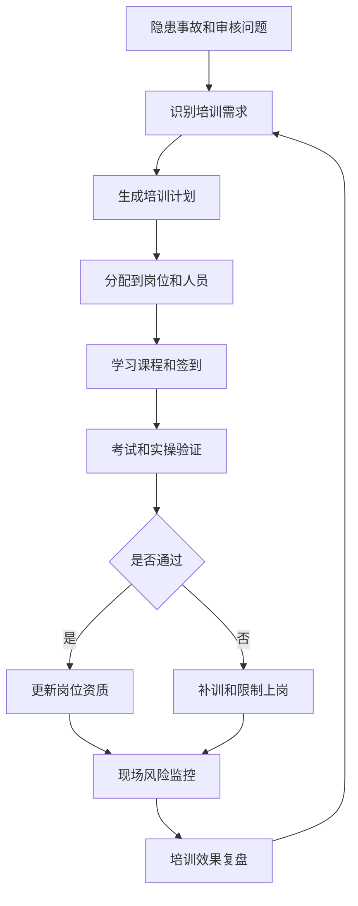
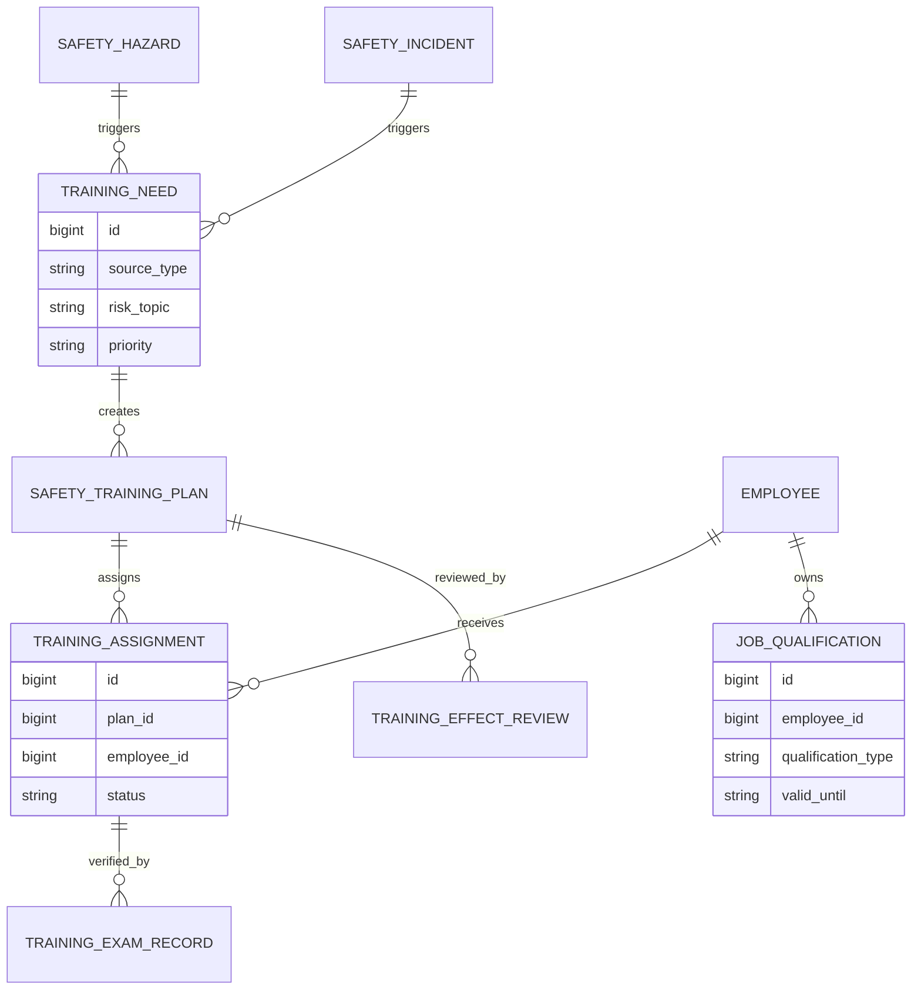
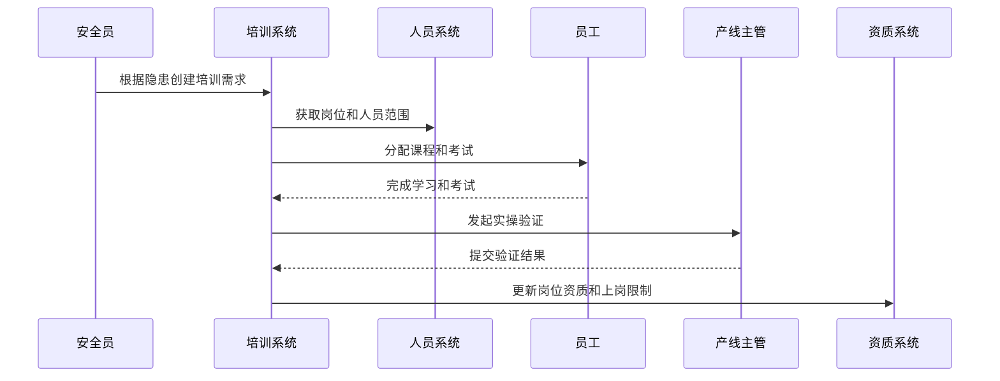
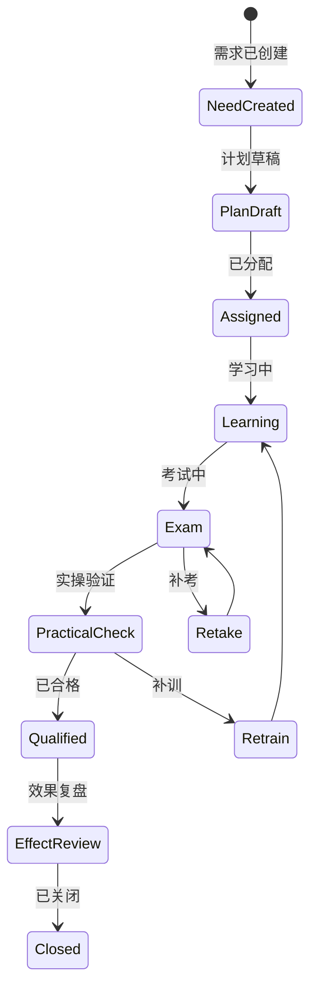
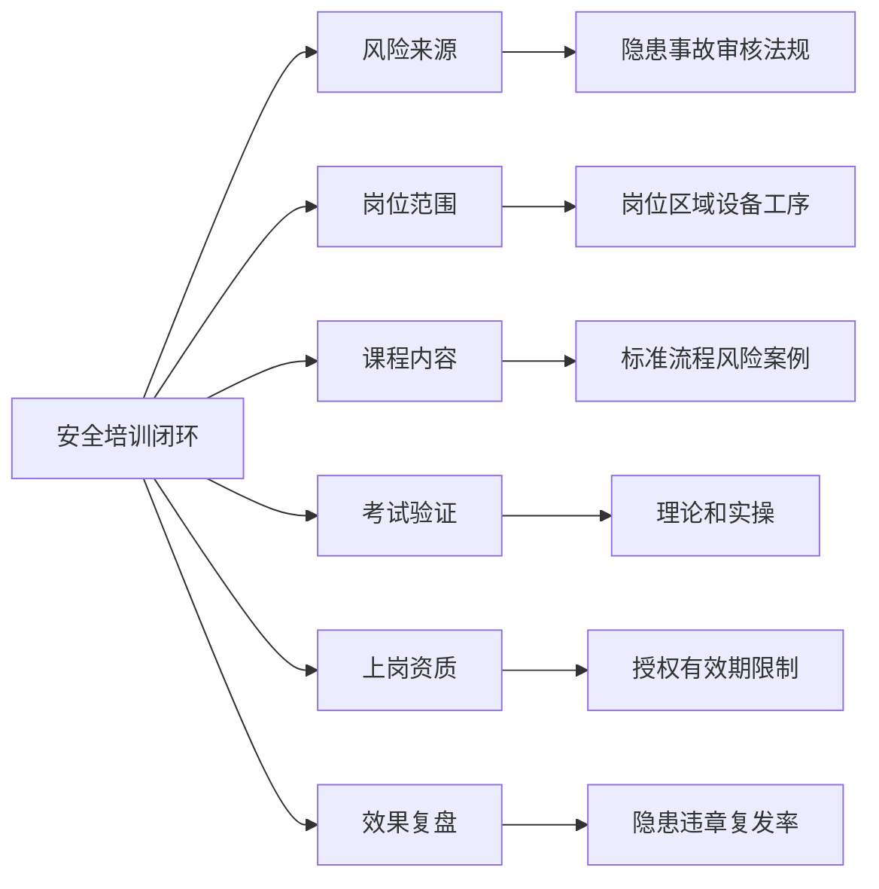

# 生产安全培训闭环项目案例

## 适合谁看

如果你做过生产现场安全隐患、生产过程审核、生产异常 CAPA、教育培训平台或设备维保，但还不清楚如何把现场隐患和事故复盘转成安全培训，并验证培训是否真的有效，可以学习这个案例。

生产安全培训闭环关注的是从隐患、事故、违章、岗位风险和审核问题中识别培训需求，生成培训计划、课程、考试、签到、整改和效果验证。它不是简单上传几个课程，而是让培训和现场风险形成闭环。

## 业务目标

生产安全培训闭环要回答 6 个问题：

- 哪些岗位、区域、设备和工序需要安全培训。
- 培训需求来自隐患、事故、审核、法规还是新员工上岗。
- 员工是否完成培训、考试是否通过、实操是否达标。
- 培训后同类隐患和违章是否减少。
- 未完成培训的人员是否能继续上岗。
- 培训结果如何反哺岗位授权、现场检查和 CAPA。

真实项目里，培训系统常常只记录“学过没有”。安全培训更关心的是“学完之后现场风险有没有下降”。

## 生产安全培训闭环链路

这条链路说明，培训不是完成课程就结束，而是要和岗位资质、上岗控制和风险复盘关联。

## 核心概念

| 概念 | 说明 | 新手理解 |
| --- | --- | --- |
| 培训需求 | 为什么要培训 | 隐患、事故、新岗位、法规 |
| 培训计划 | 谁在什么时候学什么 | 计划和安排 |
| 岗位资质 | 员工能否上岗操作 | 没资质不能操作设备 |
| 考试验证 | 检查是否掌握知识 | 理论考试和实操 |
| 补训 | 未通过后的再次培训 | 不通过不能直接关闭 |
| 上岗限制 | 培训未完成的控制措施 | 禁止操作高风险设备 |
| 效果复盘 | 培训后风险是否下降 | 看隐患和违章变化 |

安全培训的重点不是课程数量，而是岗位风险是否被覆盖。

## 数据模型

培训需求要保留来源。后续复盘时要知道这次培训是因为哪个隐患、事故或审核问题触发的。

## 推荐表结构

| 表 | 用途 | 关键字段 |
| --- | --- | --- |
| `training_need` | 培训需求 | source_type、source_id、risk_topic、target_role、priority |
| `safety_training_plan` | 安全培训计划 | plan_no、topic、scope_type、start_date、end_date、status |
| `training_assignment` | 培训任务 | plan_id、employee_id、role_code、status、complete_time |
| `training_exam_record` | 考试记录 | assignment_id、exam_score、pass_flag、retry_count |
| `practical_operation_check` | 实操验证 | assignment_id、checker_id、result、comment |
| `job_qualification` | 岗位资质 | employee_id、qualification_type、valid_until、status |
| `training_effect_review` | 培训效果复盘 | plan_id、hazard_before、hazard_after、conclusion |

安全培训通常需要理论和实操两种验证。只做在线考试，可能无法证明员工会安全操作设备。

## 培训闭环流程

培训流程要能追踪未完成人员。高风险岗位未完成培训时，系统要提醒主管或限制上岗。

## 培训状态设计

安全培训不能只分“完成”和“未完成”。未通过考试、未通过实操、补训中都应该明确区分。

## 培训因素拆解

培训内容最好来自真实隐患和事故案例。员工更容易理解为什么要这样操作。

## 前端页面拆分

| 页面 | 核心内容 | 设计建议 |
| --- | --- | --- |
| 培训需求页 | 来源、风险主题、岗位范围、优先级 | 显示来自哪个隐患或事故 |
| 培训计划页 | 课程、人员、时间、考试要求 | 支持批量分配 |
| 员工学习页 | 课程、签到、考试、补训 | 移动端可用 |
| 实操验证页 | 检查项、结果、照片、签名 | 适合主管现场确认 |
| 岗位资质页 | 员工资质、有效期、上岗状态 | 到期前预警 |
| 未完成看板 | 未学习、未考试、未验证、逾期 | 给主管追踪 |
| 效果复盘页 | 培训前后隐患和违章变化 | 判断培训是否有效 |

移动端学习和签到要轻，后台计划和复盘要完整。不要把复杂管理表单搬给现场员工。

## 接口拆分建议

| 接口 | 方法 | 说明 |
| --- | --- | --- |
| `/api/safety-training/needs` | GET/POST | 查询和创建培训需求 |
| `/api/safety-training/plans` | GET/POST | 查询和创建培训计划 |
| `/api/safety-training/assignments` | GET | 查询员工培训任务 |
| `/api/safety-training/assignments/:id/complete` | POST | 提交学习完成 |
| `/api/safety-training/assignments/:id/exam` | POST | 提交考试结果 |
| `/api/safety-training/assignments/:id/practical-check` | POST | 提交实操验证 |
| `/api/safety-training/effect-reviews` | GET/POST | 查询和创建效果复盘 |

培训接口要支持和隐患、事故、岗位资质系统关联。否则培训只是独立模块，无法形成闭环。

## 实际项目常见问题

### 1. 培训和隐患脱节

现场反复出现同类隐患，但培训内容没有变化。

解决方式：

- 隐患和事故可以生成培训需求。
- 培训课程引用真实案例。
- 重复隐患自动触发专题培训。
- 培训效果复盘看复发率。

### 2. 只看课程完成，不看考试和实操

员工点完课程就算通过，但未必真的会操作。

解决方式：

- 高风险岗位必须考试和实操验证。
- 考试不通过进入补考。
- 实操不通过进入补训。
- 资质更新依赖验证结果。

### 3. 未完成培训仍然上岗

系统没有和岗位授权联动。

解决方式：

- 培训任务关联岗位资质。
- 未完成或过期资质限制上岗。
- 主管看板显示未完成名单。
- 特殊放行需要审批和审计。

### 4. 培训计划无法覆盖临时人员

外包、临时工、新员工漏培训。

解决方式：

- 培训范围按岗位和入场状态生成。
- 新增人员自动匹配必修培训。
- 外包人员也进入人员台账。
- 入场前检查培训完成情况。

### 5. 复盘只写总结，不看数据

培训是否有效没有证据。

解决方式：

- 统计培训前后隐患数量和违章次数。
- 对比同类区域和岗位。
- 效果差的课程进入优化任务。
- 课程改版保留版本记录。

## 权限与审计

| 权限点 | 控制原因 |
| --- | --- |
| 创建培训需求 | 会影响岗位和人员安排 |
| 发布培训计划 | 触发批量任务 |
| 提交考试结果 | 影响是否合格 |
| 提交实操验证 | 影响岗位资质 |
| 特殊放行上岗 | 涉及安全责任 |
| 导出培训记录 | 用于审计和监管 |

安全培训记录可能用于事故调查和监管检查，关键数据必须可追溯。

## 验收清单

- 隐患、事故和审核问题可以生成培训需求。
- 培训计划能按岗位、区域和设备分配人员。
- 员工培训支持学习、考试和实操验证。
- 未通过可以补考或补训。
- 岗位资质能和培训结果联动。
- 未完成培训能预警或限制上岗。
- 培训效果能按隐患复发率复盘。

## 下一步学习

学完这个案例后，可以继续看：

- [生产现场安全隐患项目案例](/projects/production-safety-hazard-case)
- [生产过程审核项目案例](/projects/production-process-audit-case)
- [生产异常 CAPA 项目案例](/projects/production-exception-capa-case)
- [教育培训平台项目案例](/projects/education-training-platform-case)

