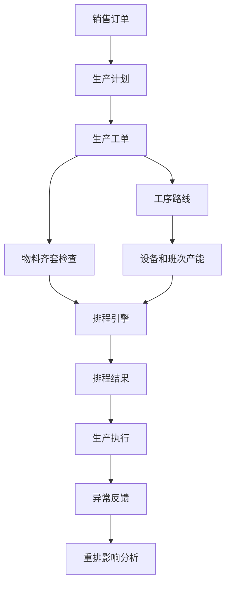
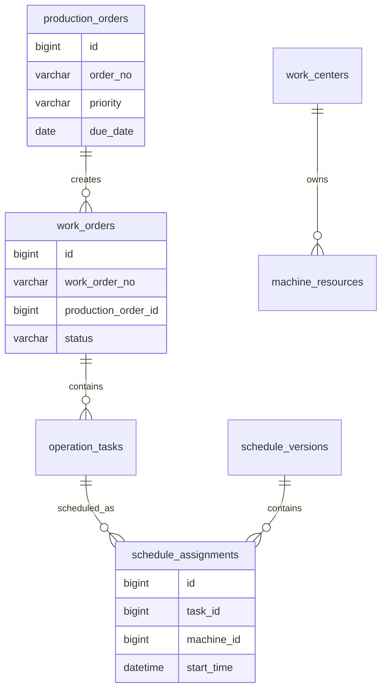
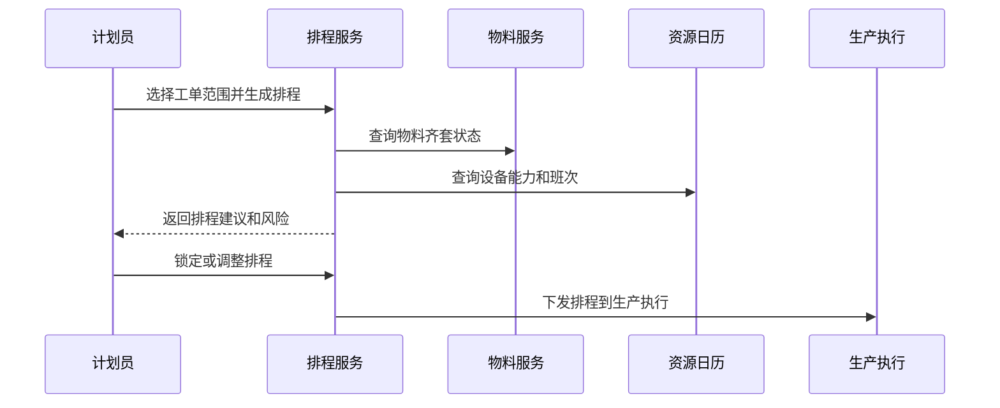

# 生产排程项目案例

## 适合谁看

适合需要做生产计划、工单排程、设备产能、工序约束、物料齐套、插单、换线成本和排程调整的开发者。

生产排程不是“把工单按日期排到设备上”。真实项目里，排程要同时考虑订单交期、BOM 物料、设备能力、工序顺序、班次、人员、模具、换线时间和异常停机。排程结果还要能解释为什么这样排，以及调整后会影响哪些订单。

## 业务目标

第一版生产排程支持：

- 维护生产订单、工单、工序和设备资源。
- 计算物料齐套状态。
- 按交期、优先级和产能生成排程建议。
- 支持设备、班次和工序约束。
- 支持插单、改期和排程锁定。
- 支持排程甘特图和影响分析。
- 支持排程执行跟踪和异常反馈。

## 生产排程链路

核心原则：排程建议要保存约束和计算快照。业务调整排程时，需要知道哪些结果是系统算出来的，哪些是人工锁定的。

## 数据模型

## 推荐表结构

| 表 | 作用 | 关键字段 |
| --- | --- | --- |
| `production_orders` | 生产订单 | `order_no`、`product_id`、`quantity`、`due_date`、`priority` |
| `work_orders` | 生产工单 | `work_order_no`、`production_order_id`、`status` |
| `operation_routes` | 工艺路线 | `product_id`、`operation_code`、`sequence_no` |
| `operation_tasks` | 工序任务 | `work_order_id`、`operation_code`、`plan_qty`、`status` |
| `work_centers` | 工作中心 | `center_code`、`name`、`capacity_type` |
| `machine_resources` | 设备资源 | `center_id`、`machine_code`、`status`、`capability_json` |
| `shift_calendars` | 班次日历 | `resource_id`、`work_date`、`start_time`、`end_time` |
| `schedule_versions` | 排程版本 | `version_no`、`status`、`generated_by` |
| `schedule_assignments` | 排程分配 | `version_id`、`task_id`、`machine_id`、`start_time`、`end_time` |
| `schedule_change_logs` | 排程变更 | `assignment_id`、`change_reason`、`operator_id` |

排程版本很重要。没有版本，业务无法比较“调整前”和“调整后”的交期、产能和风险。

## 排程约束

| 约束 | 说明 | 第一版处理方式 |
| --- | --- | --- |
| 交期 | 订单需要在某天前完成 | 逾期任务高亮 |
| 工序顺序 | 上一道工序完成后才能做下一道 | 按路线顺序约束 |
| 设备能力 | 某设备只能加工特定工序 | 使用能力白名单 |
| 班次 | 设备只有部分时间可用 | 使用班次日历 |
| 物料齐套 | 物料不足不能开工 | 标记不可排或低优先级 |
| 换线时间 | 产品切换有准备时间 | 第一版可用固定换线时长 |

第一版排程不必追求最优解。先做到规则清晰、结果可解释、人工可调整，比黑盒最优更实用。

## 排程生成流程

排程下发后，生产执行的异常要回传排程系统，例如设备停机、工序延期、报工不足和物料异常。

## 前端页面拆分

| 页面或组件 | 作用 | 注意点 |
| --- | --- | --- |
| 排程工作台 | 查看待排工单和风险 | 展示逾期、缺料、产能不足 |
| 甘特图排程 | 按设备和时间展示任务 | 支持拖拽但要校验约束 |
| 工单池 | 未排和待调整工单 | 可按交期、优先级筛选 |
| 资源日历 | 查看设备和班次 | 停机维护要可见 |
| 物料齐套 | 查看工单物料状态 | 缺料原因要明确 |
| 影响分析 | 插单或改期前预估影响 | 展示受影响订单 |
| 排程版本 | 查看历史排程版本 | 支持版本对比 |
| 执行反馈 | 看生产进度和异常 | 和 MES 状态同步 |

甘特图不是唯一入口。计划员还需要工单池、风险列表和影响分析，否则很难处理大量异常。

## 常见问题

### 问题 1：排程结果业务不认可

通常是约束和优先级不可见。排程结果要展示交期、优先级、物料状态、设备能力和计算原因。

### 问题 2：插单后大量订单延期

插单前必须做影响分析。展示被挤占的设备时间、受影响工单和新的预计完工时间。

### 问题 3：生产现场已经停机，但排程还在继续

设备状态和异常反馈没有同步。MES 或设备系统要把停机、维修、报工异常回传给排程。

### 问题 4：拖拽甘特图后工序顺序乱了

拖拽后必须重新校验工序顺序、设备能力和班次日历，不允许直接保存非法排程。

## 验收清单

- 工单、工序、设备和班次数据清晰。
- 排程支持版本和人工锁定。
- 物料齐套状态能进入排程判断。
- 设备能力和班次日历能约束排程。
- 甘特图拖拽后会重新校验。
- 插单和改期有影响分析。
- 排程结果能解释关键原因。
- 排程下发后能跟踪执行状态。
- 停机和异常能触发重排提示。
- 历史版本能对比交期和资源占用变化。

## 下一步学习

继续学习 [生产制造项目案例](/projects/manufacturing-execution-case)、[供应链计划项目案例](/projects/supply-chain-planning-case)、[库存管理项目案例](/projects/inventory-management-case) 和 [项目管理项目案例](/projects/project-management-case)。
