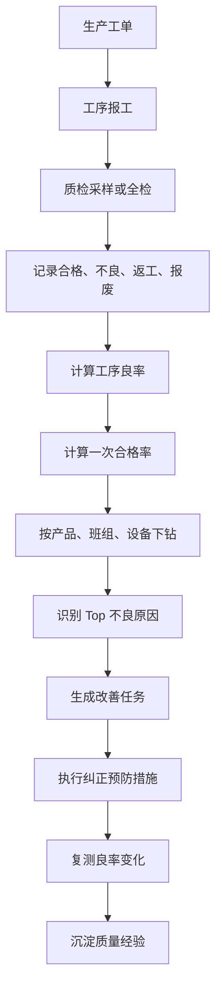
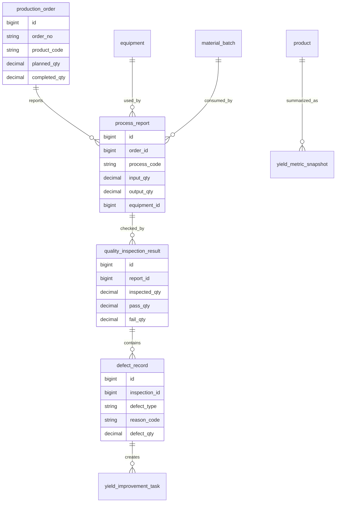
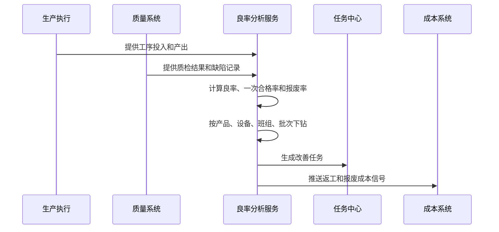
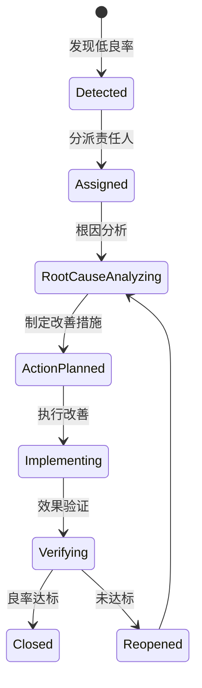
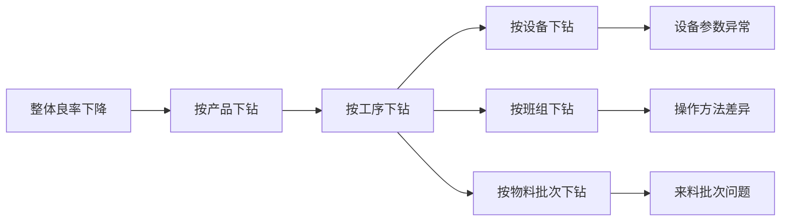

# 生产良率分析项目案例

## 适合谁看

如果你做过生产制造、质量追溯或生产质量异常，但还不清楚“良率为什么不是合格数除以总数这么简单”，可以先看这一篇。

生产良率分析关注的是产品、工单、工序、班组、设备、物料批次和质检结果之间的质量转化效率。它要帮助企业发现不良原因、定位瓶颈工序、验证改善效果。

## 业务目标

良率分析系统要回答 6 个问题：

- 每个产品、工单、工序和班组的一次合格率是多少。
- 不良主要发生在哪个工序、设备、人员或物料批次。
- 返工后合格和一次合格是否分开统计。
- 不良原因、缺陷类型和责任归因是否准确。
- 改善措施是否真的提升了良率。
- 良率变化如何影响成本、交期和客户质量投诉。

良率分析不是质量异常列表，而是从生产过程数据中找出“哪里损失了产出”。

## 生产良率分析链路

良率分析要尽量和工序、设备、物料批次关联。只按产品汇总，很难定位具体原因。

## 核心概念

| 概念 | 说明 | 项目里的典型字段 |
| --- | --- | --- |
| 良率 | 合格数量占投入或产出数量比例 | yield_rate |
| 一次合格率 | 不经过返工直接合格的比例 | first_pass_yield |
| 返工率 | 不良品返工后重新进入流程的比例 | rework_rate |
| 报废率 | 无法修复并报废的比例 | scrap_rate |
| 缺陷类型 | 外观、尺寸、功能、性能等问题 | defect_type |
| 不良原因 | 人、机、料、法、环、测等原因 | reason_code |
| 质量批次 | 产品或物料追溯批次 | batch_no |
| 改善任务 | 针对不良原因的整改闭环 | improvement_task |

一次合格率比普通良率更能反映过程能力。返工后合格虽然最终可用，但已经消耗了额外成本和交期。

## 数据模型

良率指标最好生成快照。历史报工或质检数据调整后，要能知道当时日报、周报和月报使用的是哪次计算结果。

## 推荐表结构

| 表 | 用途 | 关键字段 |
| --- | --- | --- |
| process_report | 工序报工 | order_id、process_code、input_qty、output_qty、equipment_id、team_id |
| quality_inspection_result | 质检结果 | report_id、inspection_type、inspected_qty、pass_qty、fail_qty |
| defect_record | 缺陷记录 | inspection_id、defect_type、reason_code、defect_qty、responsible_type |
| yield_metric_snapshot | 良率指标快照 | period、product_code、process_code、yield_rate、first_pass_yield |
| yield_improvement_task | 良率改善任务 | defect_type、reason_code、owner_id、due_date、status |
| yield_analysis_dimension | 分析维度 | dimension_type、dimension_key、dimension_name |

良率分析需要维度表。产品、工序、设备、班组、物料批次都可能成为分析维度。

## 良率计算流程

良率计算要明确分母。按投入数量、产出数量、检验数量计算，结果会完全不同。

## 良率任务状态设计

良率改善要闭环到效果验证。只记录“已整改”不能证明质量真的改善。

## 良率下钻分析

页面上可以用这种下钻思路：先从总览发现异常，再逐层定位到可处理对象。

## 前端页面拆分

| 页面 | 主要功能 | 新手容易漏掉 |
| --- | --- | --- |
| 良率总览 | 产品、工序、班组、设备良率 | 同时展示良率和一次合格率 |
| 工序良率页 | 每道工序投入、产出、不良 | 工序间转化损失要可见 |
| 缺陷分析页 | 缺陷类型、原因、数量、趋势 | 缺陷原因不要只用文本 |
| 批次追溯页 | 物料批次和成品批次关联 | 支持反查供应商和来料 |
| 改善任务页 | 根因、措施、负责人、验证 | 任务关闭要看效果数据 |
| 良率报表页 | 日报、周报、月报、趋势 | 报表要说明计算口径 |
| 成本影响页 | 报废、返工、延误成本 | 质量问题要能关联成本 |

良率页面最重要的是下钻路径，不是把所有指标堆在同一张表里。

## 接口拆分建议

| 接口 | 方法 | 说明 |
| --- | --- | --- |
| /api/yield/overview | GET | 查询良率总览 |
| /api/yield/processes | GET | 查询工序良率 |
| /api/yield/defects | GET | 查询缺陷分析 |
| /api/yield/snapshots/calculate | POST | 计算良率快照 |
| /api/yield/improvement-tasks | GET/POST | 查询和创建改善任务 |
| /api/yield/improvement-tasks/:id/actions | POST | 提交改善动作 |
| /api/yield/cost-impact | GET | 查询质量成本影响 |

良率接口要支持维度筛选，例如 product_code、process_code、equipment_id、team_id、batch_no。

## 实际项目常见问题

### 问题 1：良率口径天天变

团队有时按报工数量算，有时按质检数量算。

解决方式：

- 在报表上明确计算口径。
- 指标快照保存分子、分母和计算时间。
- 一次合格率、最终合格率分开。
- 口径变更需要版本说明。

### 问题 2：返工后合格掩盖真实问题

最终合格率很高，但返工成本很大。

解决方式：

- 单独统计一次合格率和返工率。
- 返工次数进入质量成本。
- 高频返工缺陷生成改善任务。
- 报表同时展示最终合格和一次合格。

### 问题 3：缺陷原因无法统计

质检员手工输入原因，导致同义词很多。

解决方式：

- 建立缺陷类型和原因字典。
- 支持“其他”但要定期治理。
- 缺陷原因按人机料法环测分类。
- 高频原因可以升级为标准字典项。

### 问题 4：改善任务关闭后良率没提升

任务关闭只看动作完成，没有看结果。

解决方式：

- 关闭前对比改善前后良率。
- 设置观察期。
- 未达标自动重新打开任务。
- 改善效果写入复盘记录。

## 权限与审计

| 权限 | 建议 |
| --- | --- |
| 查看良率 | 按工厂、产线、产品线授权 |
| 查看成本影响 | 财务、质量负责人和管理层 |
| 维护缺陷字典 | 质量管理员 |
| 创建改善任务 | 质量或生产主管 |
| 关闭改善任务 | 质量负责人复核 |
| 导出良率报表 | 导出条件和水印审计 |

质量数据会影响供应商、班组和绩效评价，需要防止随意修改和导出。

## 验收清单

- 良率、一次合格率、返工率、报废率口径清楚。
- 指标能按产品、工序、设备、班组、批次下钻。
- 缺陷类型和原因有字典。
- 低良率能自动生成改善任务。
- 改善任务关闭前有数据验证。
- 良率变化能关联报废和返工成本。
- 报表能显示计算时间、分母和分子。

## 下一步学习

建议继续阅读：

- [生产制造项目案例](/projects/manufacturing-execution-case)
- [生产质量异常项目案例](/projects/production-quality-exception-case)
- [质量追溯项目案例](/projects/quality-traceability-case)
- [制造成本差异分析项目案例](/projects/manufacturing-cost-variance-case)
