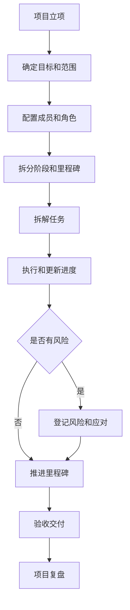
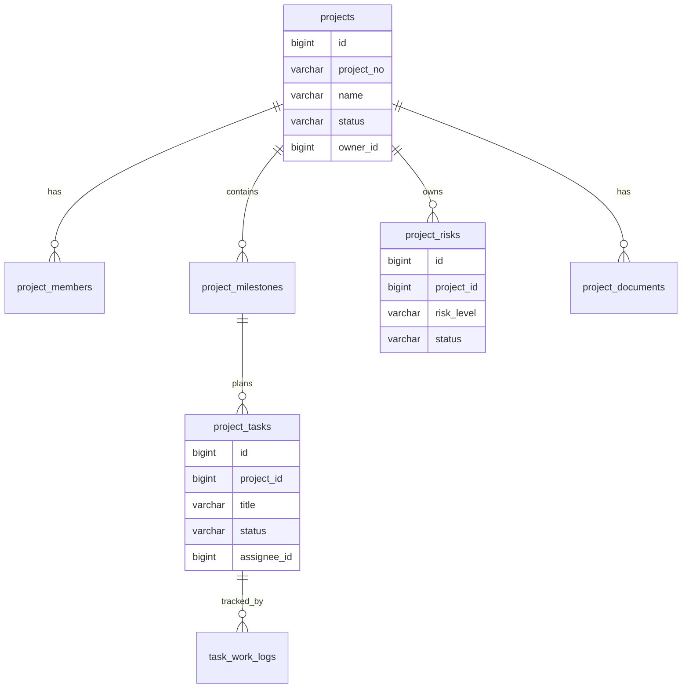
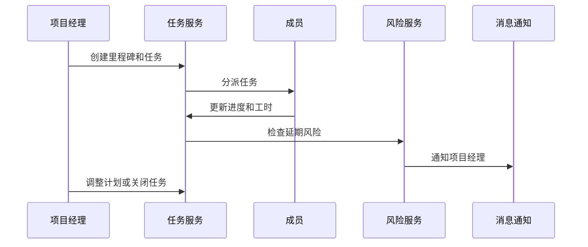

# 项目管理项目案例

## 适合谁看

适合需要做企业内部项目、研发项目、交付项目、任务协作、里程碑、工时、风险、文档和项目看板的开发者。

项目管理不是“任务列表加看板”。真实项目里，项目会涉及项目立项、成员角色、范围、计划、任务拆解、里程碑、风险、变更、工时、文档、验收和复盘。系统要帮助团队知道当前项目进度、风险在哪、谁负责、什么时候交付。

## 业务目标

第一版项目管理支持：

- 创建项目和项目成员。
- 配置项目阶段和里程碑。
- 拆解任务和子任务。
- 支持任务状态流转。
- 记录工时和进度。
- 管理项目风险和问题。
- 支持项目文档和附件。
- 支持项目验收和复盘。

## 项目交付链路

项目管理的核心不是看板漂亮，而是让范围、进度、风险和责任人可追踪。

## 数据模型

## 推荐表结构

| 表 | 作用 | 关键字段 |
| --- | --- | --- |
| `projects` | 项目主表 | `project_no`、`name`、`status`、`owner_id`、`start_date`、`end_date` |
| `project_members` | 项目成员 | `project_id`、`user_id`、`role_code`、`joined_at` |
| `project_milestones` | 项目里程碑 | `project_id`、`name`、`due_date`、`status` |
| `project_tasks` | 项目任务 | `project_id`、`milestone_id`、`assignee_id`、`status`、`priority` |
| `task_work_logs` | 工时记录 | `task_id`、`user_id`、`hours`、`work_date` |
| `project_risks` | 项目风险 | `project_id`、`risk_level`、`owner_id`、`response_plan` |
| `project_documents` | 项目文档 | `project_id`、`file_id`、`doc_type`、`version_no` |
| `project_change_requests` | 项目变更 | `project_id`、`change_type`、`impact_scope`、`status` |

任务、风险、文档和变更都要关联项目。不要把它们做成互不关联的独立模块，否则项目详情页无法给出完整视角。

## 任务流转流程

任务延期不只是任务状态问题。它可能影响里程碑、验收时间和项目风险等级。

## 状态设计

| 对象 | 状态 | 注意点 |
| --- | --- | --- |
| 项目 | 草稿、进行中、暂停、已完成、已关闭 | 关闭后限制编辑 |
| 里程碑 | 未开始、进行中、延期、已完成 | 延期需要原因 |
| 任务 | 待处理、处理中、待验收、已完成、已取消 | 取消要记录原因 |
| 风险 | 已识别、处理中、已缓解、已关闭 | 风险需要责任人 |
| 变更 | 待审批、已通过、已拒绝、已执行 | 影响范围要明确 |

状态流转要服务协作，不要让所有人都能任意改状态。

## 前端页面拆分

| 页面 | 作用 | 注意点 |
| --- | --- | --- |
| 项目列表 | 查询项目状态和负责人 | 支持按阶段、负责人、风险筛选 |
| 项目概览 | 展示进度、里程碑、风险和最近动态 | 不要只显示任务数量 |
| 任务看板 | 管理任务状态 | 支持拖拽但后端校验状态 |
| 里程碑 | 跟踪关键交付节点 | 延期原因必填 |
| 工时记录 | 成员填写工作量 | 和任务关联 |
| 风险问题 | 记录风险和应对计划 | 高风险要提醒 |
| 项目文档 | 管理需求、设计、验收文档 | 版本可追溯 |
| 复盘记录 | 沉淀项目经验 | 可回写问题库 |

## 实际项目常见问题

### 问题 1：项目进度一直显示 80%

进度不能只靠手填百分比。可以按任务完成、里程碑验收和关键交付物综合计算，并允许项目经理说明偏差。

### 问题 2：任务看板拖动后状态不一致

前端拖拽只是交互，后端必须校验状态流转权限和前置条件，例如未开始不能直接变成已完成。

### 问题 3：项目变更影响交付但没有记录

需求范围、交付时间、预算和人员变更都应该进入变更记录，并影响项目计划。

## 验收清单

- 项目有负责人、成员和角色。
- 阶段、里程碑和任务层级清晰。
- 任务状态流转有权限和校验。
- 工时记录关联任务。
- 风险有等级、责任人和应对计划。
- 项目变更可审批和追踪。
- 项目文档有版本。
- 延期和取消必须记录原因。
- 项目概览能展示进度、风险和最近动态。
- 项目关闭后关键数据只读。

## 下一步学习

继续学习 [项目阶段任务](/projects/project-stage-tasks)、[工作流配置器项目案例](/projects/workflow-builder-case) 和 [故障复盘模板](/projects/incident-review)。
