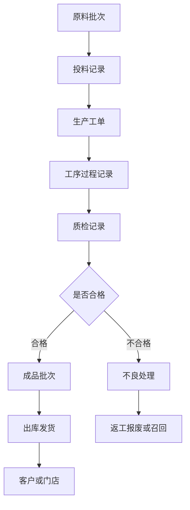
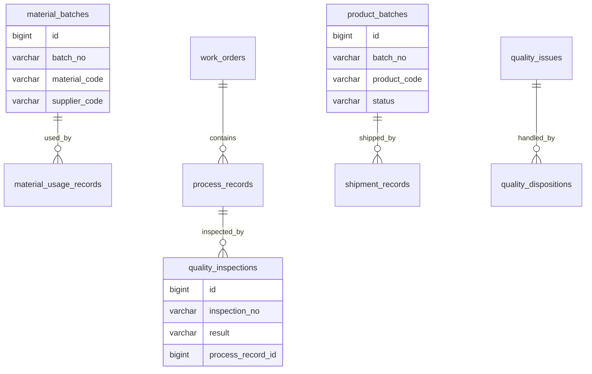
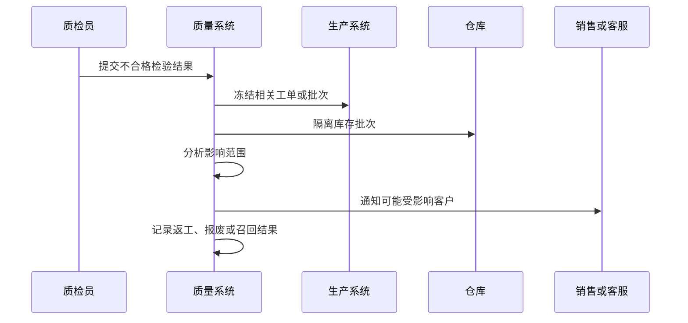

# 质量追溯项目案例

## 适合谁看

适合需要做批次追踪、原料追溯、生产过程记录、质检结果、不良品处理、召回范围和质量分析的开发者。

质量追溯不是“记录质检结果”。真实制造、食品、医药和硬件项目里，一旦出现质量问题，系统要能回答“用了哪些原料、经过哪些工序、哪些设备生产、哪些批次发给了哪些客户、需要召回多少”。如果追溯链路断了，质量事故只能靠人工翻表。

## 业务目标

第一版质量追溯支持：

- 记录原料批次、生产批次和成品批次。
- 记录生产工序、设备、人员和时间。
- 记录质检方案、检验结果和不良原因。
- 支持正向追踪和反向追溯。
- 支持不良品隔离、返工、报废和召回。
- 支持质量问题复盘和趋势分析。

## 质量追溯链路

核心原则：追溯要连接批次、工序、设备、质检和流向。只记录某一环节，无法完成真正的质量追溯。

## 数据模型

## 推荐表结构

| 表 | 作用 | 关键字段 |
| --- | --- | --- |
| `material_batches` | 原料批次 | `batch_no`、`material_code`、`supplier_code`、`received_at` |
| `material_usage_records` | 投料记录 | `material_batch_id`、`work_order_id`、`used_qty` |
| `product_batches` | 成品批次 | `batch_no`、`product_code`、`work_order_id`、`status` |
| `process_records` | 工序记录 | `work_order_id`、`operation_code`、`machine_id`、`operator_id` |
| `quality_inspections` | 质检记录 | `inspection_no`、`target_type`、`result`、`inspector_id` |
| `quality_inspection_items` | 检验项 | `inspection_id`、`item_code`、`standard_value`、`actual_value` |
| `quality_issues` | 质量问题 | `issue_no`、`batch_no`、`defect_type`、`severity` |
| `quality_dispositions` | 不良处理 | `issue_id`、`action_type`、`handled_qty`、`status` |
| `shipment_records` | 发货流向 | `product_batch_id`、`customer_id`、`ship_qty`、`shipped_at` |

批次号必须稳定且唯一。原料批次、半成品批次和成品批次可以分类型管理，但不能随意重号。

## 追溯方向

| 方向 | 要回答的问题 | 示例 |
| --- | --- | --- |
| 正向追踪 | 某批原料流向哪里 | 原料 A 用到了哪些成品批次 |
| 反向追溯 | 某成品来自哪里 | 成品 B 用了哪些原料和设备 |
| 过程追踪 | 生产中发生了什么 | 经过哪些工序、谁操作、设备状态 |
| 质量追踪 | 哪些检验不合格 | 不良原因、处理动作、复检结果 |
| 召回追踪 | 需要召回哪些客户 | 发货批次、客户、数量 |

追溯查询要支持多跳关系。只查一张批次表不够，要沿着投料、工序、质检和发货链路查询。

## 质量问题处理流程

质量问题一旦确认，应能自动冻结相关批次，避免继续出库或继续投入生产。

## 前端页面拆分

| 页面或组件 | 作用 | 注意点 |
| --- | --- | --- |
| 批次查询 | 查询原料、半成品和成品批次 | 支持扫码或批次号搜索 |
| 追溯图谱 | 展示批次上下游关系 | 图过大时分层展开 |
| 质检记录 | 查看检验项和结果 | 展示标准值和实际值 |
| 不良处理 | 处理返工、报废、让步接收 | 必须记录原因和数量 |
| 召回分析 | 计算影响客户和数量 | 支持导出通知清单 |
| 质量看板 | 查看不良率、缺陷类型、供应商表现 | 指标口径固定 |
| 批次冻结 | 冻结或解冻批次 | 解冻需要审批和原因 |

追溯图谱要避免一次性展开所有节点。先展示核心链路，再按原料、工序、质检、发货逐步展开。

## 常见问题

### 问题 1：出了质量问题但查不到用了哪些原料

说明投料记录没有绑定原料批次。生产报工和投料必须记录批次号，不能只记录物料编码。

### 问题 2：质检不合格后批次仍然可以出库

质检结果要影响库存状态。不合格或待处理批次应自动冻结，直到处理完成。

### 问题 3：召回范围过大

如果批次粒度太粗，就只能扩大召回范围。要根据业务成本设计合理批次粒度。

### 问题 4：追溯图谱加载很慢

追溯查询要限制深度，分层加载，并对批次关系建立索引。不要一次性返回全量上下游。

## 验收清单

- 原料、半成品和成品批次有稳定编号。
- 投料记录绑定原料批次和工单。
- 工序记录包含设备、人员和时间。
- 质检记录包含标准值、实际值和结果。
- 不合格批次能自动冻结。
- 不良处理记录返工、报废或让步接收。
- 支持正向追踪和反向追溯。
- 发货记录能关联成品批次和客户。
- 召回范围能根据批次计算。
- 追溯图谱支持分层展开和性能控制。

## 下一步学习

继续学习 [生产制造项目案例](/projects/manufacturing-execution-case)、[生产排程项目案例](/projects/production-scheduling-case)、[仓储物流项目案例](/projects/warehouse-logistics-case) 和 [数据质量专项项目案例](/projects/data-quality-special-case)。
