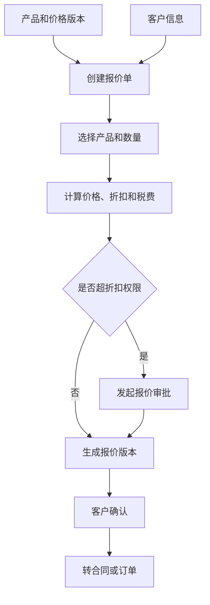
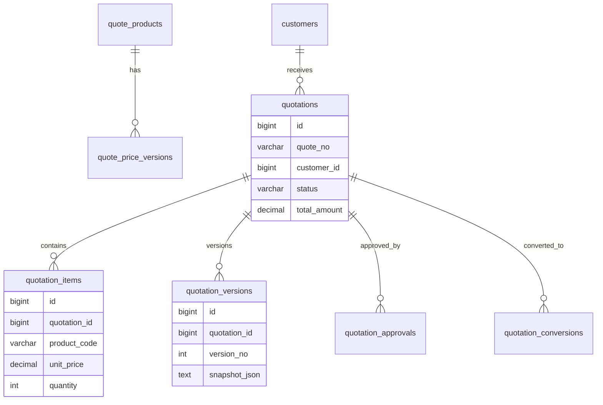
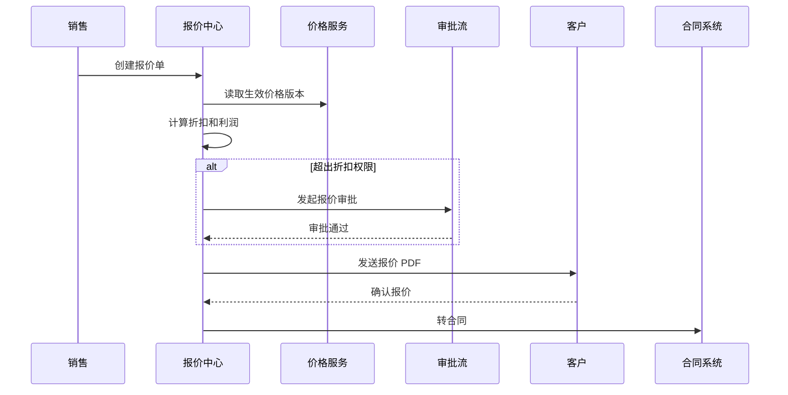

# 报价中心项目案例

## 适合谁看

适合需要做销售报价、产品价格、折扣审批、报价单、客户确认、报价版本、合同转化和利润测算的开发者。

报价中心不是“填一个价格导出 PDF”。真实项目里，报价会涉及产品目录、价格版本、客户等级、折扣权限、税费、币种、有效期、审批、报价版本、合同转化和毛利控制。报价系统做不好，最容易出现销售私改价格、客户拿到过期报价、合同金额和报价金额对不上的问题。

## 业务目标

第一版报价中心支持：

- 维护可报价产品。
- 管理价格版本。
- 创建报价单。
- 支持报价明细和折扣。
- 支持报价审批。
- 支持报价版本。
- 支持报价有效期。
- 支持生成 PDF。
- 支持转合同或订单。

## 报价链路图

报价单要保存价格快照。后续产品调价不能影响已经发给客户的报价版本。

## 数据模型

## 推荐表结构

| 表 | 作用 | 关键字段 |
| --- | --- | --- |
| `quote_products` | 可报价产品 | `product_code`、`name`、`unit`、`status` |
| `quote_price_versions` | 价格版本 | `product_id`、`version_no`、`price_config`、`effective_at` |
| `quotations` | 报价单主表 | `quote_no`、`customer_id`、`status`、`valid_until`、`total_amount` |
| `quotation_items` | 报价明细 | `quotation_id`、`product_code`、`quantity`、`unit_price`、`discount_rate` |
| `quotation_versions` | 报价版本 | `quotation_id`、`version_no`、`snapshot_json`、`pdf_file_id` |
| `quotation_approvals` | 报价审批 | `quotation_id`、`approval_reason`、`approval_status`、`approved_by` |
| `quotation_conversions` | 转化记录 | `quotation_id`、`target_type`、`target_id`、`converted_at` |
| `quotation_audit_logs` | 报价审计 | `quotation_id`、`action`、`operator_id`、`detail_json` |

报价金额建议拆成原价、折扣、税费、优惠和总价。只保存最终价会导致审批和利润分析困难。

## 报价审批流程

报价审批要记录为什么需要审批，例如折扣超过权限、毛利低于阈值、客户信用等级异常。

## 报价规则

| 规则 | 示例 | 注意点 |
| --- | --- | --- |
| 价格版本 | 使用本月生效价格 | 历史报价保存快照 |
| 折扣权限 | 销售最多 95 折 | 超权限走审批 |
| 有效期 | 报价 15 天内有效 | 过期不能转合同 |
| 税费 | 按地区和发票类型计算 | 税率要进入快照 |
| 币种 | 支持 CNY、USD | 汇率要有来源和时间 |
| 毛利阈值 | 低于 20% 需审批 | 保护利润底线 |

## 前端页面拆分

| 页面 | 作用 | 注意点 |
| --- | --- | --- |
| 产品价格 | 维护可报价产品和价格版本 | 发布后不可直接改历史价格 |
| 报价列表 | 查看报价状态和有效期 | 过期报价明显标记 |
| 报价编辑 | 添加产品、数量和折扣 | 实时展示价格构成 |
| 报价审批 | 审核超权限报价 | 展示毛利和折扣原因 |
| 报价版本 | 查看历史版本和 PDF | 客户收到的是固定版本 |
| 客户确认 | 记录客户确认状态 | 关联确认时间和附件 |
| 转合同 | 报价转合同或订单 | 金额必须和确认版本一致 |

## 实际项目常见问题

### 问题 1：客户看到的报价和系统当前报价不一致

这是正常现象，但必须可解释。客户看到的是报价版本快照，系统当前价格可能已经变更。

### 问题 2：销售绕过审批给了过低折扣

折扣权限不能只在前端限制。后端保存和提交报价时都要校验折扣权限。

### 问题 3：报价转合同后金额对不上

转合同时必须基于客户确认的报价版本，而不是重新按当前价格计算。

## 验收清单

- 产品价格有版本和生效时间。
- 报价单保存价格、折扣、税费和总价明细。
- 报价版本有快照和 PDF。
- 折扣超权限需要审批。
- 报价有效期可校验。
- 过期报价不能直接转合同。
- 转合同使用客户确认版本。
- 报价关键操作有审计。
- 后端校验折扣和金额。
- 报价列表能按客户、状态、有效期筛选。

## 下一步学习

继续学习 [合同管理项目案例](/projects/contract-management-case)、[计费中台项目案例](/projects/billing-platform-case) 和 [审批流项目案例](/projects/approval-workflow-case)。
