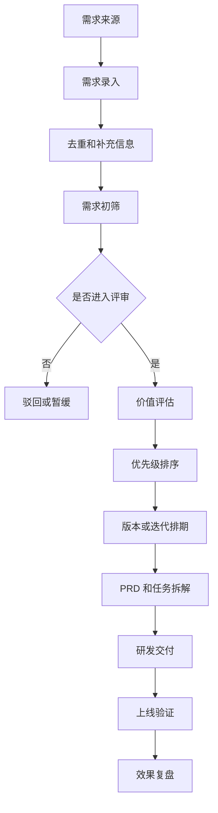
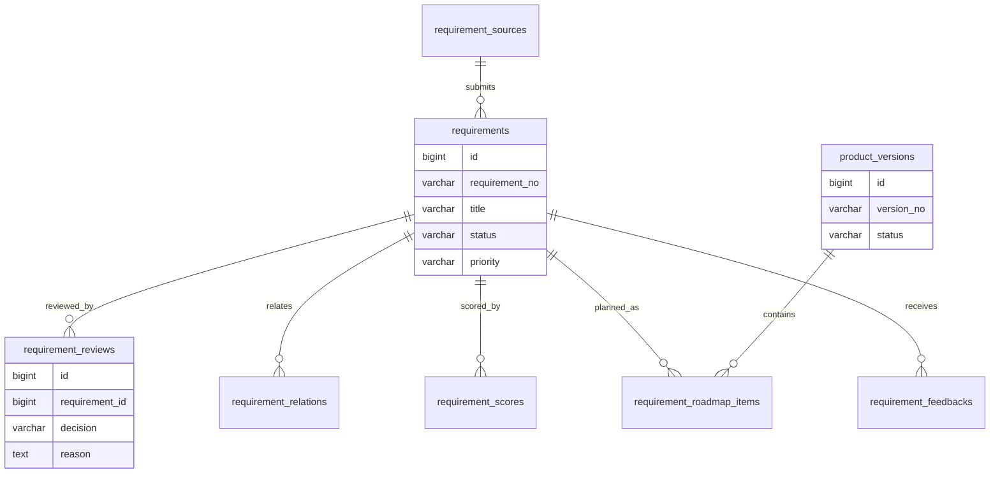
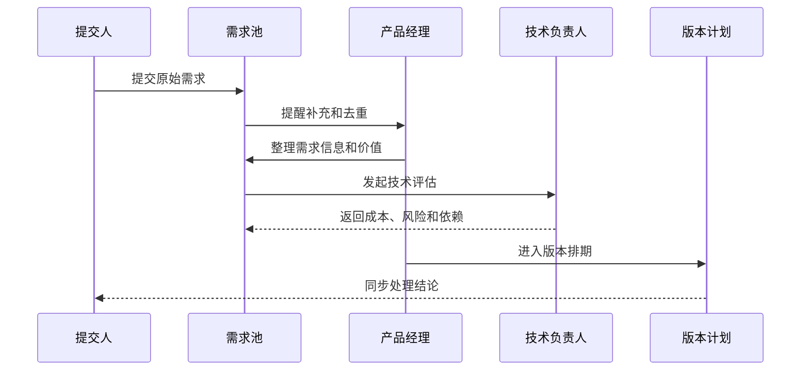

# 研发需求池项目案例

## 适合谁看

适合需要做产品需求池、需求收集、需求评审、优先级、排期、PRD、研发任务、版本规划、需求反馈和研发效能协作的开发者。

研发需求池不是“待办列表”。真实团队里，需求可能来自客户、销售、客服、运营、老板、数据分析和技术团队。需求池要解决的是：需求从哪里来、是否重复、价值有多大、谁评审、什么时候做、做到什么版本、上线后效果如何。

## 业务目标

第一版研发需求池支持：

- 收集多来源需求。
- 识别重复需求和关联需求。
- 支持需求分类、价值评估和优先级。
- 支持需求评审、驳回、暂缓和进入排期。
- 支持需求拆分为 PRD、任务和缺陷。
- 关联版本、迭代、项目和发布计划。
- 记录需求状态流转和决策原因。
- 支持需求反馈和上线效果复盘。
- 输出需求看板和研发排期视图。

## 需求池流转链路

需求池的核心不是收集更多需求，而是让需求可比较、可决策、可追踪。没有决策记录的需求池，很快会变成没人维护的列表。

## 核心概念

| 概念 | 说明 | 示例 |
| --- | --- | --- |
| 原始需求 | 提交人描述的问题或期望 | “客户想批量导入合同” |
| 需求项 | 产品团队整理后的需求 | “合同批量导入能力” |
| 关联需求 | 与当前需求有关的其他需求 | 导入、校验、错误报告 |
| 价值评分 | 对业务价值和影响范围的评估 | 收入影响、客户数量、效率提升 |
| 优先级 | 当前阶段的处理顺序 | P0、P1、P2、P3 |
| 版本计划 | 需求进入的版本或迭代 | V1.8、2026 Q3 |
| 决策记录 | 为什么做或不做 | 价值不足、技术成本高、法规要求 |

需求池一定要区分“谁提出”和“谁决策”。提出需求的人可以很多，但进入版本必须有明确决策机制。

## 数据模型

## 推荐表结构

| 表 | 作用 | 关键字段 |
| --- | --- | --- |
| `requirement_sources` | 需求来源 | `source_type`、`source_name`、`submitter_id` |
| `requirements` | 需求主表 | `requirement_no`、`title`、`category`、`status`、`priority` |
| `requirement_details` | 需求详情 | `requirement_id`、`problem_desc`、`expected_value`、`acceptance_criteria` |
| `requirement_relations` | 需求关联 | `requirement_id`、`related_requirement_id`、`relation_type` |
| `requirement_scores` | 需求评分 | `requirement_id`、`score_type`、`score_value`、`reason` |
| `requirement_reviews` | 评审记录 | `requirement_id`、`decision`、`reviewer_id`、`reason` |
| `product_versions` | 产品版本 | `version_no`、`release_date`、`status` |
| `requirement_roadmap_items` | 版本排期 | `requirement_id`、`version_id`、`plan_status` |
| `requirement_feedbacks` | 需求反馈 | `requirement_id`、`feedback_type`、`content`、`created_by` |
| `requirement_activity_logs` | 动态日志 | `requirement_id`、`action_type`、`operator_id`、`created_at` |

需求详情不要只放一个富文本。问题描述、业务价值、验收标准、影响范围和约束条件最好结构化保存，方便评审和搜索。

## 需求评审流程

评审结果必须能解释。需求没有进入版本，不应该只是状态变成“驳回”，要写清楚原因，例如价值不足、已有替代方案、依赖未满足或不符合产品方向。

## 状态设计

| 状态 | 含义 | 下一步 |
| --- | --- | --- |
| 待补充 | 信息不完整 | 提交人补充场景、价值和案例 |
| 待初筛 | 产品未处理 | 产品经理去重和归类 |
| 待评审 | 准备进入评审 | 业务、产品、技术一起决策 |
| 已暂缓 | 当前阶段不做 | 定期重新评估 |
| 已驳回 | 明确不做 | 保留原因和替代方案 |
| 已排期 | 已进入版本计划 | 拆 PRD 和任务 |
| 开发中 | 已进入研发 | 关联任务和迭代 |
| 已上线 | 功能已发布 | 收集反馈和效果 |
| 已关闭 | 需求生命周期结束 | 保留复盘 |

状态流转要限制权限。提交人可以补充需求，但不能直接把需求改成已排期；研发可以反馈成本，但不应单独决定业务优先级。

## 优先级评分模型

| 维度 | 说明 | 示例问题 |
| --- | --- | --- |
| 业务价值 | 是否带来收入、续费、降本或合规价值 | 不做会不会丢客户 |
| 用户范围 | 影响多少客户或内部用户 | 是个别客户还是通用问题 |
| 紧急程度 | 是否有明确截止时间 | 是否影响合同交付 |
| 技术成本 | 实现复杂度和风险 | 是否改核心模型 |
| 战略匹配 | 是否符合产品方向 | 是否符合当前版本主题 |
| 依赖条件 | 是否依赖其他系统或团队 | 是否要等权限系统改造 |

评分不是为了算出一个绝对正确的数字，而是让团队对“为什么先做这个”有共同语言。

## 前端页面拆分

| 页面或组件 | 作用 | 注意点 |
| --- | --- | --- |
| 需求池列表 | 查询需求和状态 | 支持来源、分类、优先级、版本筛选 |
| 需求提交页 | 提交原始需求 | 用表单引导用户描述问题和价值 |
| 需求详情 | 展示需求全貌 | 包含来源、评分、评审、关联和动态 |
| 去重合并 | 合并重复需求 | 合并后保留所有来源和反馈 |
| 评审面板 | 记录评审结论 | 必填决策原因 |
| 路线图视图 | 查看版本排期 | 支持按版本、季度和产品线展示 |
| 反馈列表 | 查看用户反馈 | 关联上线后的效果数据 |
| 需求看板 | 按状态推进需求 | 后端校验状态流转 |

需求提交页要降低门槛，但需求评审页要结构化。前者帮助用户说清问题，后者帮助团队做决策。

## 接口拆分建议

| 接口 | 作用 | 注意点 |
| --- | --- | --- |
| `POST /requirements` | 提交需求 | 创建后进入待补充或待初筛 |
| `GET /requirements` | 查询需求池 | 支持组合筛选和全文搜索 |
| `GET /requirements/{id}` | 查看需求详情 | 聚合评分、评审、版本和动态 |
| `POST /requirements/{id}/review` | 提交评审结论 | 必填决策和原因 |
| `POST /requirements/{id}/score` | 保存评分 | 保存评分人和理由 |
| `POST /requirements/merge` | 合并重复需求 | 保留来源和反馈 |
| `POST /requirements/{id}/roadmap` | 加入版本计划 | 校验版本状态 |
| `POST /requirements/{id}/feedback` | 添加反馈 | 可来自客户、销售、客服或运营 |

## 实际项目常见问题

### 问题 1：需求池里全是“老板说要做”

解决方案是把需求拆成问题、影响范围、业务价值、期望结果和决策记录。即使是高优需求，也要说明为什么高优，否则团队无法复盘。

### 问题 2：重复需求很多，搜索不到已有项

要建立需求标题、关键词、客户、业务对象和来源单据的搜索索引。合并重复需求时不要删除来源，要把多个来源挂到同一个需求项上，方便看到需求热度。

### 问题 3：排期后频繁插队

插队不是不能发生，但要有变更记录。需求进入版本后，如果优先级变化，需要记录影响范围，例如哪些需求延期、哪些迭代目标变化。

### 问题 4：上线后没人知道需求有没有价值

需求上线后要回收效果数据，例如使用次数、客户反馈、续费影响、工单减少量或人工节省时间。没有效果复盘，下一次评审仍然靠感觉。

## 权限与协作

需求池权限至少要区分：

- 提交需求。
- 编辑自己提交的需求。
- 编辑需求分类和优先级。
- 提交评审结论。
- 进入版本排期。
- 合并重复需求。
- 关闭需求。
- 查看内部技术评估。
- 导出需求列表。

需求池通常跨团队使用，权限要避免两个极端：所有人都能改优先级，或者只有产品能看见需求。推荐让提交人能看到处理进度和结论，但评审、排期和关闭由产品或负责人控制。

## 验收清单

- 需求来源清晰。
- 需求详情包含问题、价值、验收标准和影响范围。
- 重复需求可合并且保留来源。
- 需求评审必须记录决策原因。
- 优先级有评分依据。
- 需求能关联版本、迭代、任务和发布。
- 状态流转有权限和校验。
- 插队和排期变更有记录。
- 上线后可以收集反馈和效果。
- 需求看板、路线图和详情数据一致。

## 下一步学习

继续学习 [项目管理项目案例](/projects/project-management-case)、[工作流配置器项目案例](/projects/workflow-builder-case)、[知识库平台项目案例](/projects/knowledge-base-case) 和 [前后端联调排查](/projects/integration-debugging)。
