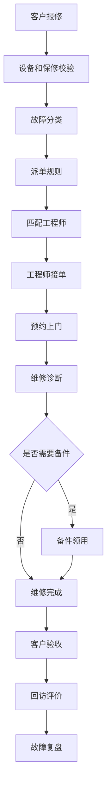
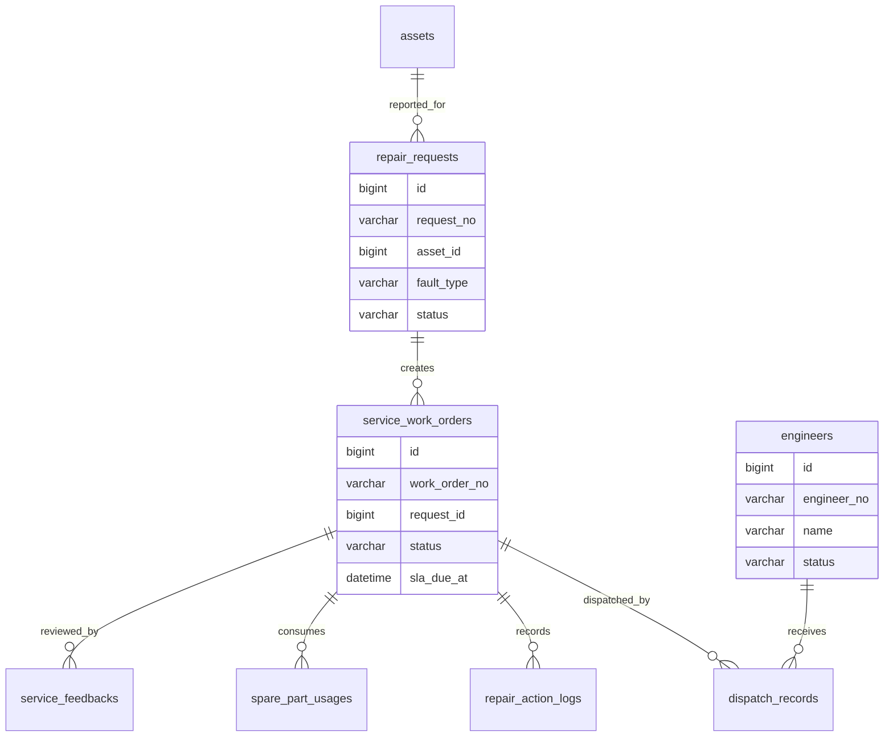
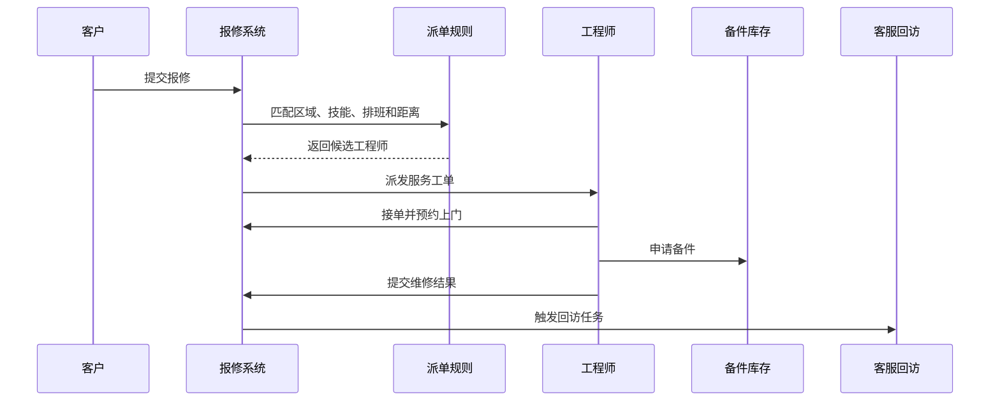

# 报修派单项目案例

## 适合谁看

适合需要做设备报修、服务工单、维修派单、工程师调度、上门服务、备件领用、维修回访和 SLA 管理的开发者。

报修派单不是“用户提交一个问题，客服转给维修人员”。真实项目里，报修会连接客户、设备、保修政策、服务网点、工程师技能、距离、备件库存、SLA、费用结算和客户回访。系统要能把报修从提交、诊断、派单、上门、维修、验收到复盘完整串起来。

## 业务目标

第一版报修派单支持：

- 客户或客服提交报修。
- 识别设备、故障类型和保修状态。
- 根据区域、技能、排班和距离派单。
- 支持工程师接单、转派和改约。
- 记录上门、诊断、维修和备件使用。
- 支持维修费用、保修费用和客户确认。
- 支持 SLA 超时预警和升级。
- 支持回访评价和故障分析。
- 对接设备台账、库存、售后和客服工单。

## 报修派单链路

这条链路的关键是派单规则。不是所有工单都应该派给最近的人，还要考虑技能、排班、备件、服务等级和当前负载。

## 核心概念

| 概念 | 说明 | 示例 |
| --- | --- | --- |
| 报修单 | 客户或客服提交的维修请求 | 空调无法启动 |
| 服务工单 | 内部执行维修的任务 | 分配给工程师 A |
| 派单规则 | 决定派给谁的规则 | 区域、技能、负载、距离 |
| SLA | 服务响应和完成时限 | 2 小时响应、24 小时修复 |
| 备件 | 维修需要的物料 | 主板、传感器、电源 |
| 保修状态 | 是否免费维修 | 保内、保外、人为损坏 |
| 回访 | 客户确认维修效果 | 满意度、问题是否解决 |

报修单和服务工单可以分开。报修单代表客户诉求，服务工单代表内部执行任务。复杂场景下，一个报修可能拆出多个服务工单。

## 数据模型

## 推荐表结构

| 表 | 作用 | 关键字段 |
| --- | --- | --- |
| `repair_requests` | 报修单 | `request_no`、`customer_id`、`asset_id`、`fault_type`、`status` |
| `service_work_orders` | 服务工单 | `work_order_no`、`request_id`、`priority`、`sla_due_at`、`status` |
| `engineers` | 工程师 | `engineer_no`、`name`、`service_region`、`status` |
| `engineer_skills` | 工程师技能 | `engineer_id`、`skill_code`、`level`、`enabled` |
| `engineer_schedules` | 工程师排班 | `engineer_id`、`work_date`、`time_slot`、`capacity` |
| `dispatch_records` | 派单记录 | `work_order_id`、`engineer_id`、`dispatch_type`、`reason` |
| `repair_action_logs` | 维修过程 | `work_order_id`、`action_type`、`content`、`created_at` |
| `spare_part_usages` | 备件使用 | `work_order_id`、`part_id`、`quantity`、`warehouse_id` |
| `service_feedbacks` | 回访评价 | `work_order_id`、`score`、`comment`、`resolved` |
| `sla_escalation_logs` | SLA 升级 | `work_order_id`、`level`、`notified_user_id`、`created_at` |

工单状态要保存关键时间点，例如提交、派单、接单、到场、完成、验收。SLA 统计不能只靠最后状态。

## 派单处理流程

自动派单失败时要进入人工派单池。不要让工单卡在“待派单”无人处理。

## 派单规则设计

| 规则 | 说明 | 注意点 |
| --- | --- | --- |
| 区域匹配 | 工程师服务区域覆盖客户地址 | 地址要标准化 |
| 技能匹配 | 工程师具备设备或故障技能 | 技能等级影响优先级 |
| 排班匹配 | 工程师当前时段有容量 | 避免超量派单 |
| 距离匹配 | 离客户更近优先 | 距离不是唯一条件 |
| SLA 优先 | 高优先级工单优先派发 | 超时前要升级 |
| 备件可用 | 工程师或网点有备件 | 没备件要提示预计到货 |
| 负载均衡 | 避免同一人任务过多 | 需要当前未完成工单数 |

第一版可以先做规则评分，不必上复杂调度算法。关键是每次派单要保存匹配原因，方便解释和复盘。

## 前端页面拆分

| 页面或组件 | 作用 | 注意点 |
| --- | --- | --- |
| 报修入口 | 客户或客服提交报修 | 引导选择设备和故障类型 |
| 报修单列表 | 查看报修状态 | 支持客户、设备、优先级筛选 |
| 工单详情 | 展示报修、派单、维修和回访时间线 | 客户信息和内部备注分开 |
| 派单工作台 | 查看待派单和候选工程师 | 展示匹配原因和 SLA |
| 工程师日程 | 查看排班、容量和位置 | 支持改约和转派 |
| 备件领用 | 申请和记录备件 | 影响库存和费用 |
| SLA 看板 | 监控超时和即将超时 | 按服务等级分组 |
| 回访评价 | 记录满意度和是否解决 | 低分进入复盘 |

派单工作台要把候选工程师排序原因展示出来，例如“区域匹配、技能匹配、今天剩余容量 2、距离 4.3 公里”。

## 接口拆分建议

| 接口 | 作用 | 注意点 |
| --- | --- | --- |
| `POST /repair/requests` | 创建报修 | 校验设备、客户和保修状态 |
| `GET /repair/requests` | 查询报修单 | 支持故障、状态、客户筛选 |
| `POST /service-work-orders/{id}/dispatch` | 派单 | 保存派单原因和候选记录 |
| `POST /service-work-orders/{id}/accept` | 工程师接单 | 记录首次响应时间 |
| `POST /service-work-orders/{id}/reschedule` | 改约 | 校验 SLA 和客户确认 |
| `POST /service-work-orders/{id}/actions` | 添加维修记录 | 支持图片、备注和诊断结果 |
| `POST /service-work-orders/{id}/parts` | 登记备件 | 关联库存扣减 |
| `POST /service-work-orders/{id}/complete` | 完成维修 | 必填处理结果和费用 |
| `POST /service-work-orders/{id}/feedback` | 提交回访 | 低分自动生成复盘任务 |

## 实际项目常见问题

### 问题 1：自动派单总是派给同一个工程师

通常是规则只看距离，没有考虑负载和排班。解决方案是加入未完成工单数、当天容量和技能等级，并保存派单评分明细。

### 问题 2：工程师到场才发现没有备件

派单前要检查常用备件库存。需要备件但无库存时，要提示调拨或预约时间，不要直接派单造成二次上门。

### 问题 3：SLA 统计不准确

SLA 需要明确起止点，例如提交到首次响应、接单到到场、到场到修复。每个关键时间点都要单独记录，不能用最后更新时间代替。

### 问题 4：客户说没修好，但工单已经关闭

维修完成和客户验收要分开。工程师提交完成后，客户确认或客服回访通过后才最终关闭。低分或未解决要重新打开或生成返修单。

## 权限与审计

报修派单权限至少要区分：

- 创建报修。
- 查看报修。
- 人工派单。
- 转派工单。
- 工程师接单。
- 登记维修结果。
- 登记备件。
- 修改 SLA 等级。
- 关闭工单。
- 查看服务报表。

转派、关闭、SLA 等级调整、费用调整和备件领用都要审计。服务类系统后续经常需要追责和复盘。

## 验收清单

- 报修单能关联客户、设备和故障类型。
- 能识别保修状态和服务等级。
- 派单规则考虑区域、技能、排班、距离、负载和 SLA。
- 自动派单失败能进入人工池。
- 工单有完整时间线和关键时间点。
- 工程师可接单、改约、转派和提交结果。
- 备件领用能影响库存。
- SLA 超时有预警和升级。
- 客户验收和工程师完成状态分离。
- 回访低分能进入复盘或返修流程。

## 下一步学习

继续学习 [售后服务项目案例](/projects/after-sales-service-case)、[设备维保项目案例](/projects/equipment-maintenance-case)、[客服工单项目案例](/projects/support-ticket-case) 和 [库存管理项目案例](/projects/inventory-management-case)。
