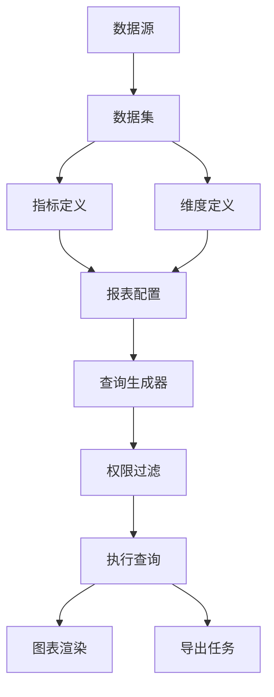
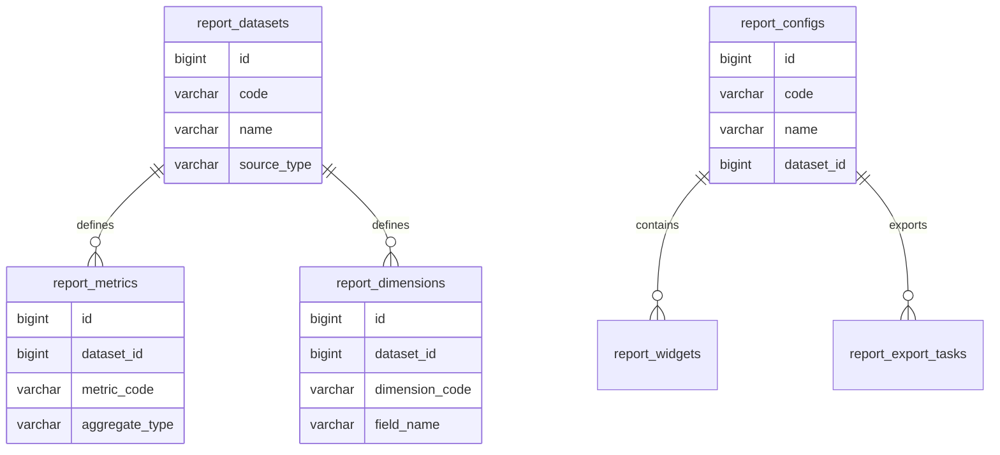
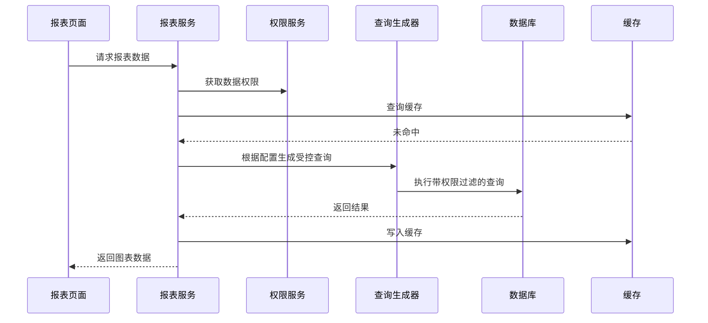

# 报表配置器项目案例

## 适合谁看

适合需要做自定义报表、指标配置、维度筛选、图表配置、导出、权限过滤和报表调度的开发者。

报表配置器不是“让用户写 SQL”。真实项目里，报表要处理数据源、指标口径、维度权限、查询性能、缓存、导出、图表展示和口径治理。如果直接开放 SQL，安全、性能和维护都会很难控制。

## 业务目标

第一版报表配置器支持：

- 配置数据集。
- 配置指标和维度。
- 配置筛选条件。
- 配置表格或图表展示。
- 支持报表权限。
- 支持查询缓存。
- 支持导出。
- 支持定时生成报表。

## 模块关系图

报表配置器的关键是“让用户配置受控能力”，而不是把数据库查询能力完全暴露给用户。

## 数据模型

## 推荐表结构

| 表 | 作用 | 关键字段 |
| --- | --- | --- |
| `report_datasets` | 数据集 | `code`、`name`、`source_type`、`base_table` |
| `report_metrics` | 指标定义 | `metric_code`、`field_name`、`aggregate_type` |
| `report_dimensions` | 维度定义 | `dimension_code`、`field_name`、`data_type` |
| `report_configs` | 报表配置 | `dataset_id`、`layout_json`、`filter_json` |
| `report_widgets` | 图表组件 | `report_id`、`widget_type`、`config_json` |
| `report_query_logs` | 查询日志 | `report_id`、`latency_ms`、`row_count` |
| `report_export_tasks` | 导出任务 | `report_id`、`query_snapshot`、`file_id` |

指标和维度要有业务说明。否则报表变多后，没人知道“销售额”到底是否含退款和优惠。

## 查询流程

查询生成器必须白名单化字段和聚合方式。不要拼接用户输入的任意 SQL。

## 指标口径

| 指标 | 示例口径 | 注意点 |
| --- | --- | --- |
| 订单数 | 已支付订单数量 | 是否排除退款单 |
| 销售额 | 支付金额减退款金额 | 是否含优惠券 |
| 活跃用户 | 当天有登录或操作的用户 | 活跃定义要固定 |
| 转化率 | 支付人数 / 访问人数 | 分母分子时间范围一致 |

报表配置器必须让指标口径可见。只展示图表，不展示口径，会导致业务误读。

## 前端页面拆分

| 页面 | 作用 | 注意点 |
| --- | --- | --- |
| 数据集管理 | 配置可查询数据源 | 字段要有业务说明 |
| 指标维度管理 | 配置指标和维度 | 限制聚合和字段类型 |
| 报表设计器 | 拖拽图表和筛选器 | 配置要实时预览 |
| 报表查看页 | 查看图表和表格 | 展示口径、更新时间 |
| 导出任务页 | 查看导出进度 | 导出使用 query snapshot |
| 查询日志页 | 排查慢报表 | 记录耗时和行数 |

## 常见问题

### 问题 1：用户配置的报表把数据库拖慢

限制查询时间范围、分页大小、聚合字段和最大导出行数。慢查询要进入日志和告警。

### 问题 2：同一个指标不同报表数值不一致

说明指标口径分散在多个地方。要把指标定义集中管理，报表引用指标而不是复制公式。

### 问题 3：导出数据比页面多

导出必须复用同一份查询配置、筛选条件和权限过滤，并保存 `query_snapshot`。

## 验收清单

- 数据集字段白名单化。
- 指标和维度有业务说明。
- 查询生成器不接受任意 SQL。
- 报表查询带权限过滤。
- 慢查询有日志。
- 导出保存查询快照。
- 图表展示指标口径和更新时间。
- 查询范围、分页和导出行数有限制。
- 报表配置变更有版本或审计记录。

## 下一步学习

继续学习 [数据看板项目案例](/projects/analytics-dashboard-case)、[数据库索引与查询优化](/database/indexes) 和 [复杂财务对账项目案例](/projects/finance-reconciliation-case)。
