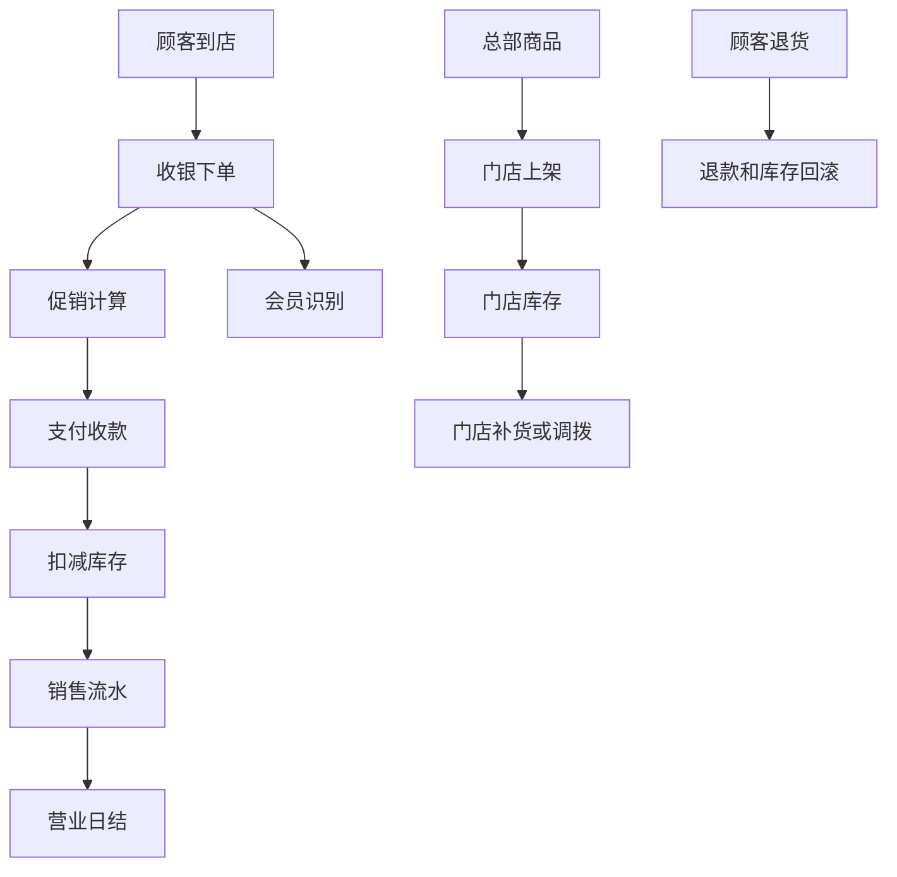
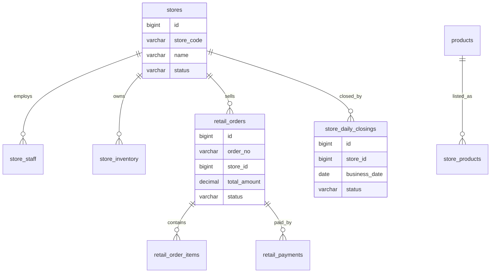
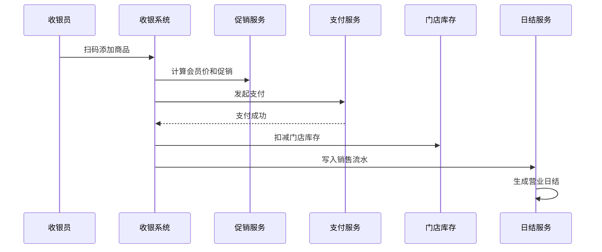

# 门店零售管理项目案例

## 适合谁看

适合需要做连锁门店、商品上架、门店库存、收银、会员、促销、门店调拨、日结和经营看板的开发者。

门店零售管理不是“商品列表加收银”。真实项目里，门店会连接总部商品、价格、库存、会员、支付、促销、发票、退货和财务日结。它是一个典型行业项目，适合练习多门店、多角色、多终端、多业务单据的系统设计。

## 业务目标

第一版门店零售管理支持：

- 维护门店和员工。
- 管理门店商品和价格。
- 管理门店库存。
- 支持收银下单和退款。
- 支持会员识别和积分。
- 支持促销活动。
- 支持门店调拨。
- 支持营业日结。
- 支持经营数据看板。

## 门店业务链路

门店系统最重要的是保证收银、支付、库存和日结口径一致。否则门店账、库存账和财务账会对不上。

## 数据模型

## 推荐表结构

| 表 | 作用 | 关键字段 |
| --- | --- | --- |
| `stores` | 门店 | `store_code`、`name`、`region_id`、`status` |
| `store_staff` | 门店员工 | `store_id`、`user_id`、`role_code`、`status` |
| `store_products` | 门店商品 | `store_id`、`sku_id`、`sale_price`、`listed_status` |
| `store_inventory` | 门店库存 | `store_id`、`sku_id`、`available_qty`、`locked_qty` |
| `retail_orders` | 零售订单 | `order_no`、`store_id`、`member_id`、`total_amount`、`status` |
| `retail_order_items` | 订单明细 | `order_id`、`sku_id`、`quantity`、`sale_price` |
| `retail_payments` | 支付记录 | `order_id`、`pay_channel`、`pay_amount`、`pay_status` |
| `store_daily_closings` | 营业日结 | `store_id`、`business_date`、`sale_amount`、`difference_amount` |

门店价格可能不同于总部价格。要保存门店商品价格和订单价格快照，不能只读当前商品价格。

## 收银日结流程

收银系统要考虑断网和重复支付。支付成功但库存扣减失败时，必须有补偿任务。

## 门店场景

| 场景 | 关键动作 | 注意点 |
| --- | --- | --- |
| 商品上架 | 总部下发商品，门店启用 | 门店可售状态独立 |
| 收银销售 | 扫码、促销、支付、扣库存 | 金额以服务端计算为准 |
| 会员消费 | 识别会员、积分、权益 | 会员价进入订单快照 |
| 退货退款 | 校验原订单，退款，回滚库存 | 防止重复退款 |
| 门店调拨 | 门店之间转移库存 | 支持在途和接收确认 |
| 营业日结 | 汇总现金、支付和退款 | 日结后限制修改 |

## 前端页面拆分

| 页面 | 作用 | 注意点 |
| --- | --- | --- |
| 门店管理 | 维护门店资料和状态 | 门店编码稳定 |
| 员工管理 | 管理店长、收银员和仓管 | 权限按门店隔离 |
| 门店商品 | 管理上架和门店价格 | 价格变更留记录 |
| 门店库存 | 查看库存和调拨 | 区分门店和总部仓 |
| POS 收银 | 扫码、会员、促销和支付 | 操作要快，移动端适配 |
| 退货退款 | 处理售后和退款 | 必须关联原订单 |
| 门店日结 | 汇总销售、退款和差异 | 日结后归档 |
| 经营看板 | 查看销售、客单价和库存周转 | 按门店、区域、日期筛选 |

## 实际项目常见问题

### 问题 1：门店收银金额和日结金额不一致

常见原因是退款、支付失败、现金差异没有进入同一套日结口径。日结必须基于销售流水和支付流水统一计算。

### 问题 2：门店库存和总部库存对不上

门店库存要有独立流水。总部仓调拨到门店、门店销售、退货和盘点都要写库存流水。

### 问题 3：收银员能看到其他门店数据

门店系统必须做门店数据范围权限。员工登录后只能访问授权门店的数据。

## 验收清单

- 门店、员工、商品和库存边界清晰。
- 门店商品有独立价格和上架状态。
- 收银金额由后端计算。
- 支付、退款和库存扣减具备幂等性。
- 订单保存价格和促销快照。
- 门店库存有流水。
- 日结基于统一销售和支付口径。
- 日结后关键数据限制修改。
- 员工数据权限按门店隔离。
- 经营看板能按门店、区域和日期筛选。

## 下一步学习

继续学习 [库存管理项目案例](/projects/inventory-management-case)、[运营活动项目案例](/projects/marketing-campaign-case) 和 [数据看板项目案例](/projects/analytics-dashboard-case)。
