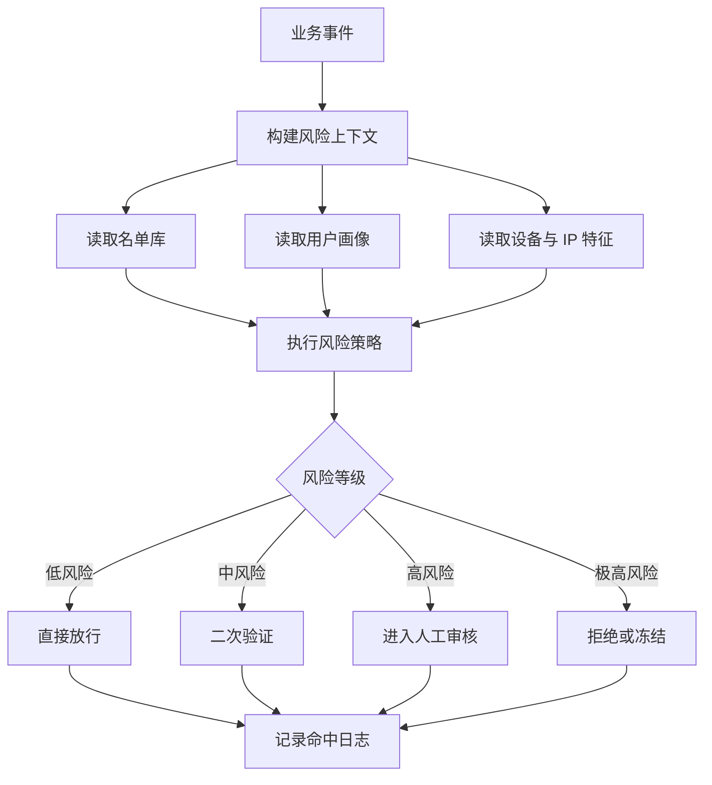
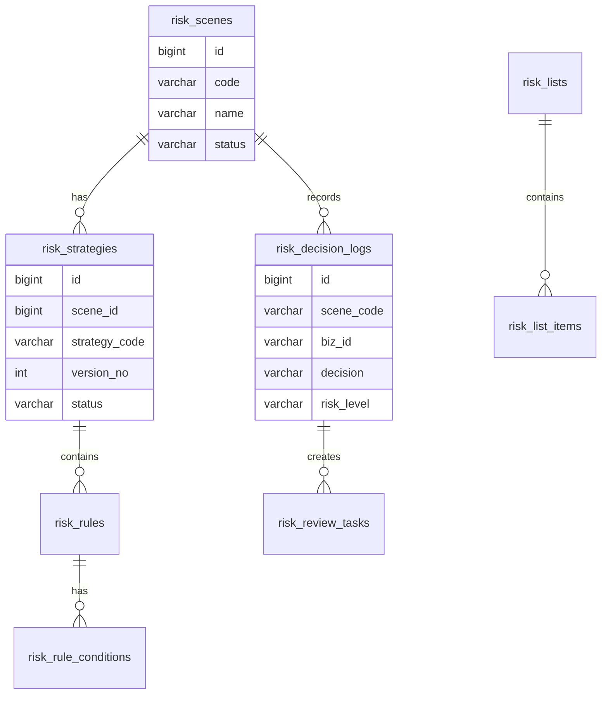
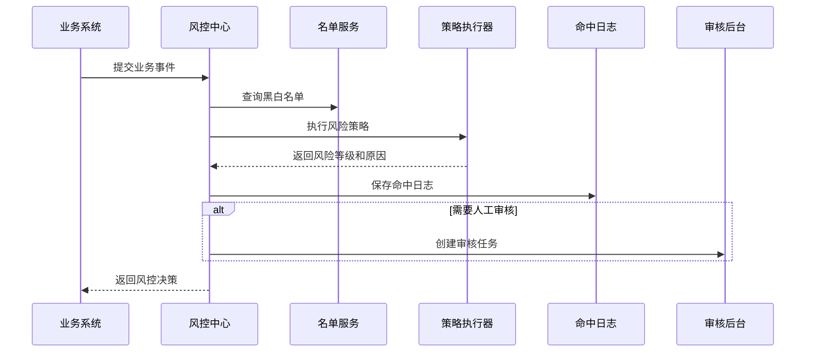

# 风控中心项目案例

## 适合谁看

适合需要做登录风控、交易风控、内容风控、活动防刷、黑白名单、风险评分、人工审核和风险命中日志的开发者。

风控中心不是“写几个 if 判断”。真实项目里，风险判断会涉及业务事件、用户画像、设备信息、名单库、规则策略、模型分数、人工审核和处置动作。风控系统最重要的是可解释、可追踪、可回滚，否则业务会不知道一笔订单为什么被拦截，客服也无法给用户合理解释。

## 业务目标

第一版风控中心支持：

- 接入多个业务场景，例如登录、下单、支付、提现、发券和内容发布。
- 配置风险策略。
- 维护黑名单、白名单和观察名单。
- 记录风险命中日志。
- 返回通过、拒绝、二次验证和人工审核等决策。
- 支持策略灰度发布。
- 支持人工复核。
- 支持风险指标看板。

## 先看风险复核台

复核人员必须看到决策分数如何形成、哪些规则命中、业务采取了什么处置，以及后续验证是否改变风险判断。

<DocFigure
  src="/images/projects/risk-control-case-review.webp"
  alt="提现风险复核台展示风险分数、命中规则、正负分值、冻结处置、补充验证和人工复核时间线"
  caption="风控中心返回决策与原因，业务系统执行处置；双方用同一个 decision_id 串起完整证据。"
  :width="1440"
  :height="900"
/>

图中的 82 分不是无法解释的黑盒结论。每项特征都保留版本和贡献值，人工审核结束后还能按当时的策略与数据重放决策，确认是否发生误伤。

## 风控链路图

这张图要看懂一个关键点：风控中心不应该直接替业务完成所有动作。它应该返回决策和原因，由业务系统按场景执行后续动作。

## 数据模型

## 推荐表结构

| 表 | 作用 | 关键字段 |
| --- | --- | --- |
| `risk_scenes` | 风控场景 | `code`、`name`、`biz_type`、`status` |
| `risk_strategies` | 风控策略版本 | `scene_id`、`version_no`、`status`、`gray_rule` |
| `risk_rules` | 单条风险规则 | `strategy_id`、`rule_code`、`priority`、`risk_score` |
| `risk_rule_conditions` | 规则条件 | `field_code`、`operator`、`expected_value` |
| `risk_lists` | 名单库 | `list_type`、`scene_code`、`owner`、`expire_policy` |
| `risk_list_items` | 名单明细 | `target_type`、`target_value`、`reason`、`expired_at` |
| `risk_decision_logs` | 命中日志 | `scene_code`、`biz_id`、`decision`、`reason_snapshot` |
| `risk_review_tasks` | 人工审核任务 | `log_id`、`assignee_id`、`review_result`、`status` |

命中日志要保留规则快照和输入摘要。不要只保存“命中了规则 A”，因为规则 A 以后可能会被修改。

## 决策流程

风控接口要有明确超时策略。如果风控服务异常，业务必须知道是降级放行、降级拦截，还是转人工审核。

## 风险策略设计

| 策略类型 | 示例 | 常见动作 |
| --- | --- | --- |
| 名单策略 | 手机号命中黑名单 | 拒绝、冻结、人工审核 |
| 频率策略 | 10 分钟内同设备下单 20 次 | 二次验证、限流 |
| 金额策略 | 新用户单笔提现超过阈值 | 人工审核 |
| 设备策略 | 设备指纹频繁切换账号 | 提高风险分 |
| 地域策略 | 登录地和常用地差异过大 | 二次验证 |
| 组合策略 | 新账号、异常 IP、高金额同时出现 | 拒绝或人工审核 |

第一版不要追求模型化。先把规则、名单、日志和人工审核做稳定，再考虑机器学习模型或外部风控服务。

## 前端页面拆分

| 页面 | 作用 | 注意点 |
| --- | --- | --- |
| 风控场景列表 | 管理登录、支付、提现等场景 | 场景编码发布后不要随意修改 |
| 风险策略 | 配置策略版本和优先级 | 区分草稿、灰度、已发布 |
| 规则编辑器 | 配置条件、分值和动作 | 字段必须来自白名单 |
| 名单库 | 维护黑白名单 | 支持有效期和原因 |
| 命中日志 | 查询决策过程 | 支持按业务 ID、用户、设备查询 |
| 人工审核 | 处理待复核任务 | 展示证据、历史记录和审核动作 |
| 风险看板 | 查看拦截率、误杀率和审核量 | 指标要按场景拆分 |

## 实际项目常见问题

### 问题 1：用户反馈订单被拦截，但客服查不到原因

根因通常是命中日志只记录了最终结果，没有保存规则快照、输入摘要和决策链路。解决方式是把每次决策的场景、业务 ID、命中规则、风险分、处置动作和原因文案保存下来。

### 问题 2：风控策略一发布就误伤大量正常用户

说明缺少灰度和试算。策略发布前要支持用历史事件回放，发布时先按租户、用户分组或流量比例灰度。

### 问题 3：业务方希望风控接口永远不能失败

这是不现实的。风控中心必须和业务约定降级策略，例如登录场景可以二次验证，提现场景可以转人工审核，高风险场景可以临时拒绝。

## 验收清单

- 每个风控场景有稳定编码。
- 风险策略有版本、状态和发布记录。
- 规则字段、操作符和动作白名单化。
- 名单库支持原因、来源和有效期。
- 命中日志能解释风险策略的判断过程。
- 支持二次验证、拒绝、人工审核等决策。
- 高风险动作有审计记录。
- 策略支持灰度和回滚。
- 风控服务异常时有明确降级策略。
- 风险看板能展示命中率、拦截率和人工审核量。

## 下一步学习

继续学习 [规则引擎项目案例](/projects/rule-engine-case)、[审计中心项目案例](/projects/audit-center-case) 和 [灰度发布后台项目案例](/projects/gray-release-admin-case)。
