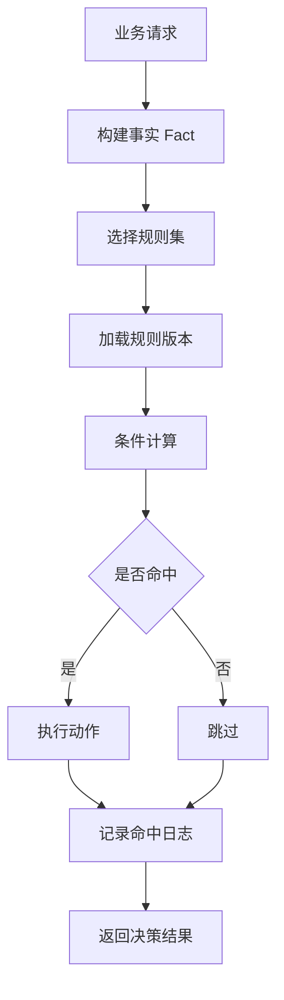
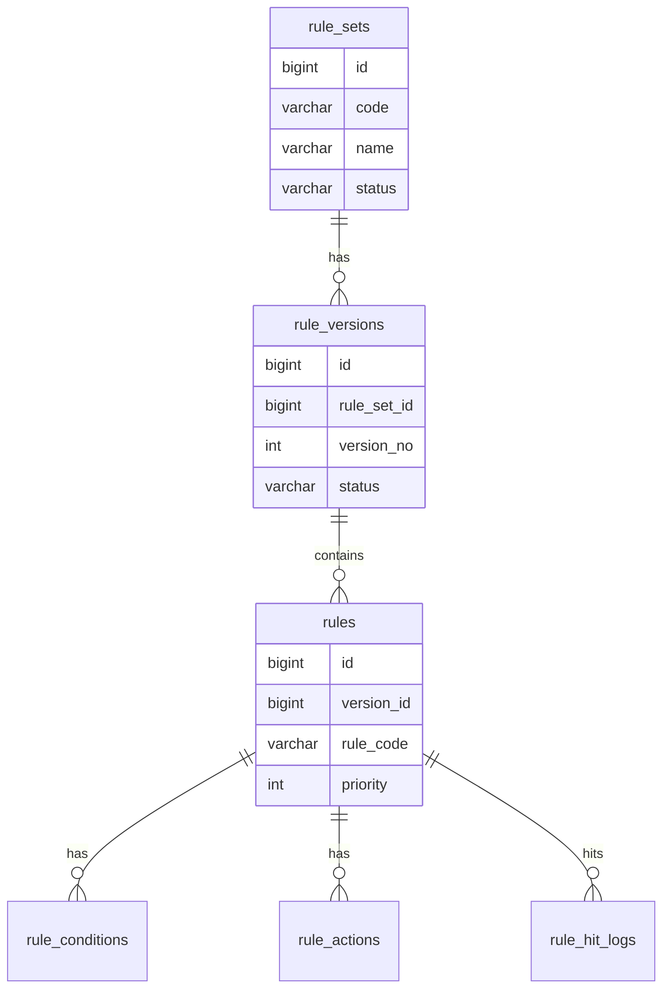
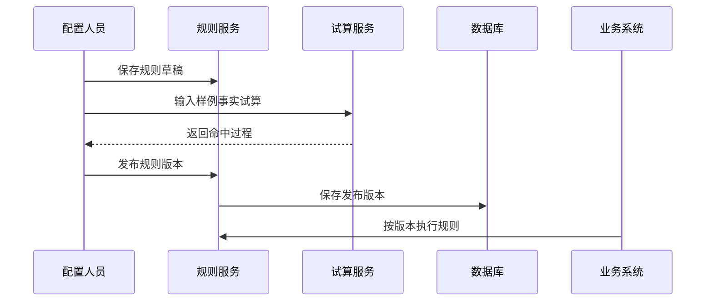

# 规则引擎项目案例

## 适合谁看

适合需要做风控规则、运营规则、审批条件、计费规则、权益规则、动态校验和规则发布的开发者。

规则引擎不是“让用户写一段表达式”。真实项目里，规则会涉及规则建模、条件组合、动作执行、版本发布、灰度、命中日志、性能、回滚和安全边界。规则越灵活，越需要限制能力范围，否则很容易把系统变成不可控的黑盒。

## 业务目标

第一版规则引擎支持：

- 配置规则集。
- 配置条件和动作。
- 支持规则版本。
- 支持发布和回滚。
- 支持规则试算。
- 支持命中日志。
- 支持灰度启用。
- 支持规则执行结果解释。

## 规则执行链路

规则引擎要回答“为什么命中”和“为什么没命中”。否则业务反馈规则异常时很难排查。

## 数据模型

## 推荐表结构

| 表 | 作用 | 关键字段 |
| --- | --- | --- |
| `rule_sets` | 规则集 | `code`、`name`、`biz_scene`、`status` |
| `rule_versions` | 规则版本 | `rule_set_id`、`version_no`、`status`、`published_at` |
| `rules` | 单条规则 | `rule_code`、`priority`、`enabled` |
| `rule_conditions` | 条件配置 | `field_code`、`operator`、`expected_value` |
| `rule_actions` | 动作配置 | `action_type`、`action_config` |
| `rule_hit_logs` | 命中日志 | `rule_code`、`fact_snapshot`、`result` |

规则配置要结构化保存。不要直接让用户写任意 JavaScript 或 SQL。

## 发布流程

发布前必须支持试算。没有试算的规则配置器，很容易把错误规则直接推到生产。

## 条件和动作

| 类型 | 示例 | 注意点 |
| --- | --- | --- |
| 条件 | 用户等级等于 VIP | 字段必须来自白名单 |
| 条件 | 订单金额大于 1000 | 注意金额精度 |
| 条件 | IP 风险等级为高 | 外部特征要有降级方案 |
| 动作 | 拒绝交易 | 高风险动作要审计 |
| 动作 | 发放优惠券 | 动作要幂等 |
| 动作 | 进入人工审核 | 要创建后续任务 |

规则动作不要直接做不可逆操作。高风险动作可以返回决策结果，由业务服务执行并记录审计。

## 前端页面拆分

| 页面 | 作用 | 注意点 |
| --- | --- | --- |
| 规则集列表 | 管理业务场景 | 区分草稿、已发布、停用 |
| 规则编辑器 | 配置条件和动作 | 字段和操作符白名单 |
| 规则试算 | 输入样例并查看命中过程 | 展示每个条件结果 |
| 版本管理 | 查看发布和回滚 | 发布后不可变 |
| 命中日志 | 排查规则效果 | 支持按业务 ID 查询 |
| 灰度配置 | 控制生效范围 | 支持按租户、用户、比例 |

## 常见问题

### 问题 1：规则太灵活，没人敢改

说明缺少试算、版本、灰度和回滚。规则引擎必须先让修改可验证、可追踪、可回退。

### 问题 2：规则命中了但业务结果没变化

规则引擎只负责决策，业务服务负责执行动作。要检查规则返回结果是否被业务消费。

### 问题 3：规则执行很慢

不要每次请求都从数据库加载完整规则。发布版本可以缓存，规则变更时主动失效。

## 验收清单

- 规则字段、操作符和动作白名单化。
- 规则有草稿和发布版本。
- 发布前支持试算。
- 命中过程可解释。
- 规则执行有日志。
- 支持灰度和回滚。
- 高风险动作有审计。
- 规则缓存有失效机制。
- 动作执行具备幂等性。

## 下一步学习

继续学习 [工作流配置器项目案例](/projects/workflow-builder-case)、[运营活动项目案例](/projects/marketing-campaign-case) 和 [审计中心项目案例](/projects/audit-center-case)。
