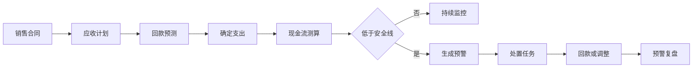
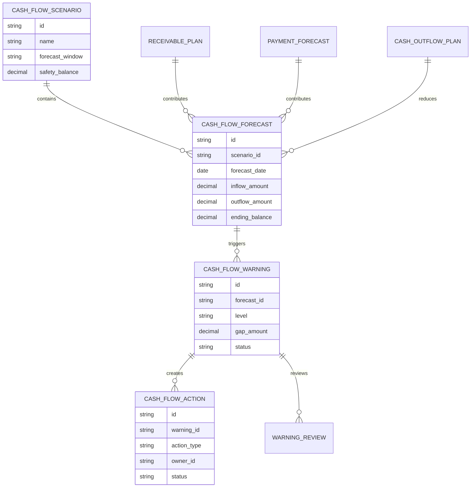
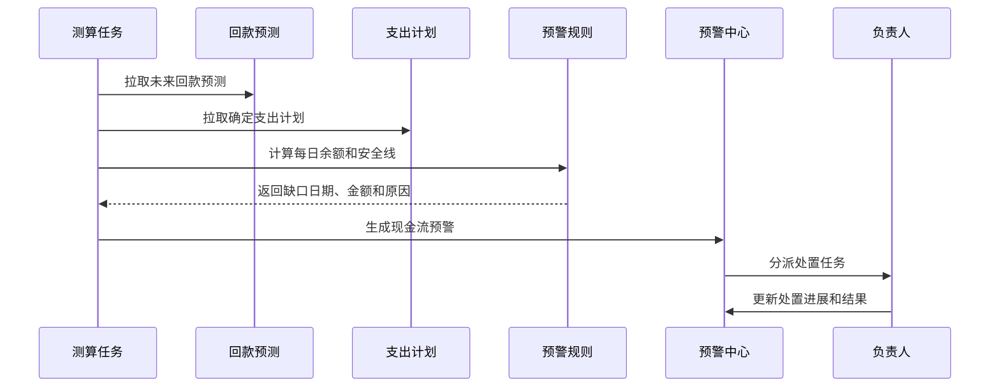
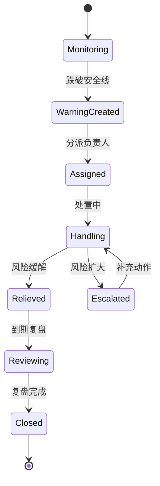
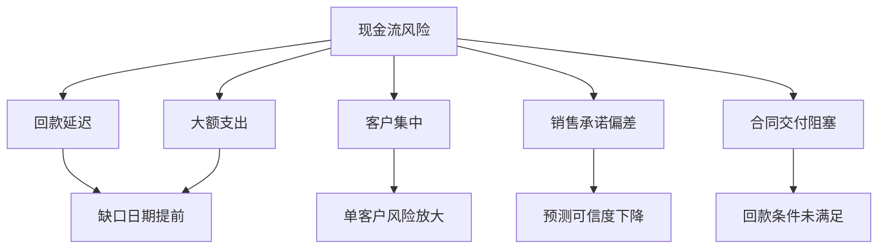

# 销售现金流预警项目案例

## 适合谁看

- 想理解销售回款、应收账款、资金计划和现金流风险之间关系的前端开发者。
- 正在做 CRM、财务看板、资金计划、经营分析或销售管理系统的团队。
- 希望把“月底才发现现金流紧张”升级为“提前预警、提前调度、提前处置”的项目负责人。

## 业务目标

销售现金流预警的目标，是把未来一段时间的预计回款、确定支出、资金缺口、客户逾期、合同交付和销售承诺合并起来，提前识别现金流风险。

它通常要回答 5 个问题：

1. 未来 7 天、30 天、90 天预计能进账多少。
2. 哪些回款延迟会影响资金安全线。
3. 哪些客户、区域或销售团队贡献了主要风险。
4. 需要提前催收、调整付款节奏还是申请融资。
5. 预警关闭后，实际现金流是否恢复。

## 现金流预警链路

初学者可以把它理解成“销售回款驱动的资金安全雷达”。它不是财务报表，而是一个面向未来的风险提醒系统。

## 核心概念

| 概念 | 说明 | 例子 |
| --- | --- | --- |
| 现金流安全线 | 公司希望保留的最低可用资金 | 未来 30 天不低于 300 万 |
| 预计现金流入 | 未来可能到账的钱 | 销售回款、退款返还、融资到账 |
| 确定现金流出 | 已确定或高概率发生的支出 | 工资、采购款、税费、租金 |
| 缺口日期 | 现金余额可能跌破安全线的日期 | 7 月 25 日预计缺口 80 万 |
| 预警等级 | 缺口严重程度和紧迫性 | 提醒、重要、严重 |
| 处置动作 | 降低风险的动作 | 催收、延期付款、临时融资 |

## 数据模型

## 推荐表结构

| 表 | 关键字段 | 作用 |
| --- | --- | --- |
| `cash_flow_scenario` | `name`、`forecast_window`、`safety_balance`、`enabled` | 预警场景配置 |
| `cash_flow_forecast` | `scenario_id`、`forecast_date`、`inflow_amount`、`outflow_amount`、`ending_balance` | 每日现金流预测 |
| `cash_outflow_plan` | `payee_type`、`amount`、`planned_date`、`confidence` | 支出计划 |
| `cash_flow_warning` | `forecast_id`、`level`、`gap_amount`、`trigger_reason`、`status` | 预警事件 |
| `cash_flow_action` | `warning_id`、`action_type`、`owner_id`、`deadline_at`、`status` | 处置任务 |
| `warning_review` | `warning_id`、`actual_balance`、`review_result`、`deviation_reason` | 预警复盘 |

## 预警计算流程

## 预警状态设计

## 风险因素拆解

第一版建议先做规则预警：

- 未来 7 天余额低于安全线：严重预警。
- 未来 30 天余额低于安全线：重要预警。
- 单客户回款占未来流入超过 40% 且有逾期风险：集中风险。
- 销售承诺连续两次未兑现：降低流入可信度。

## 前端页面拆分

| 页面 | 主要内容 | 设计重点 |
| --- | --- | --- |
| 现金流预警看板 | 未来余额曲线、缺口日期、缺口金额、预警数量 | 用趋势图表达风险发生时间 |
| 预警列表 | 预警等级、日期、缺口金额、原因、负责人、状态 | 支持按时间窗口筛选 |
| 预警详情 | 预测明细、关键回款、支出计划、风险原因 | 让负责人知道从哪里下手 |
| 处置任务 | 催收、付款延期、融资申请、费用控制 | 每个动作要有负责人和截止时间 |
| 预警复盘 | 预测余额、实际余额、偏差原因、处置效果 | 反向优化预警规则 |

## 接口拆分建议

| 接口 | 方法 | 说明 |
| --- | --- | --- |
| `/api/cash-flow/forecasts` | GET | 查询现金流预测 |
| `/api/cash-flow/warnings` | GET | 查询预警列表 |
| `/api/cash-flow/warnings/:id` | GET | 查询预警详情 |
| `/api/cash-flow/warnings/:id/actions` | POST | 新增处置动作 |
| `/api/cash-flow/scenarios` | POST | 保存预警场景 |
| `/api/cash-flow/recalculate` | POST | 重新测算 |
| `/api/cash-flow/warnings/:id/review` | POST | 提交预警复盘 |

## 实际项目常见问题

### 1. 现金流预测金额和财务报表对不上

现金流预警看的是未来流入流出，不是历史利润。页面必须明确口径：预测余额、实际余额、应收金额、预计到账金额不能混用。

建议在指标旁展示口径说明和更新时间。

### 2. 预警太频繁，业务不再关注

要设置去重和冷却期。同一个缺口日期、同一个主要原因，在风险未变化时不要每天重复推送。

只有缺口金额扩大、日期提前或等级升级时才再次提醒。

### 3. 支出计划不完整导致预警失真

第一版可以只接入确定性强的支出，例如工资、税费、已审批采购款。不要把低可信支出和确定支出混在一起。

支出计划要有可信度字段，测算时可区分保守场景和乐观场景。

### 4. 销售觉得这是财务的事

现金流预警要把风险拆到具体回款和客户。销售只需要处理与自己客户相关的回款动作，不需要理解完整资金模型。

任务详情里应直接显示“你需要在某日期前确认某客户的某笔回款”。

### 5. 预警关闭没有复盘

预警关闭后要记录实际余额和处置效果。否则系统无法判断预警是否准确，也无法优化安全线和规则。

## 权限与审计

| 动作 | 权限建议 | 审计内容 |
| --- | --- | --- |
| 查看现金流总览 | 财务、经营管理层 | 查询范围和时间窗口 |
| 查看客户回款明细 | 客户负责人、销售主管、财务 | 客户和金额范围 |
| 配置安全线 | 财务主管 | 修改前后安全线 |
| 创建处置动作 | 预警负责人 | 动作类型和截止时间 |
| 关闭预警 | 财务主管或预警负责人 | 关闭原因和复盘结果 |

## 验收清单

- 能按 7 天、30 天、90 天展示现金流预测。
- 能按安全线生成预警等级。
- 每个预警能解释缺口来源。
- 预警能生成处置任务并跟踪状态。
- 预警关闭后能复盘预测偏差。
- 预测口径、更新时间和数据来源清晰可见。

## 下一步学习

完成这个案例后，可以继续学习：

- [销售回款预测调度项目案例](/projects/sales-payment-prediction-scheduling-case)
- [资金计划项目案例](/projects/cash-flow-planning-case)
- [客户应收催收自动化项目案例](/projects/customer-receivable-collection-automation-case)

