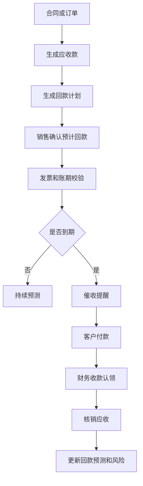
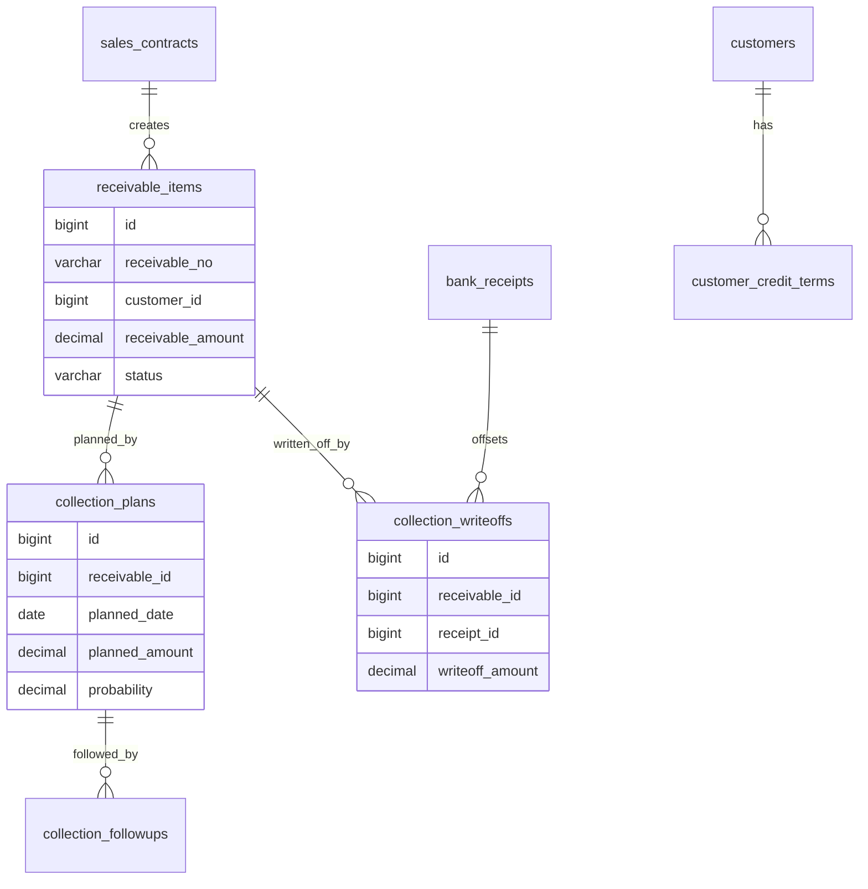
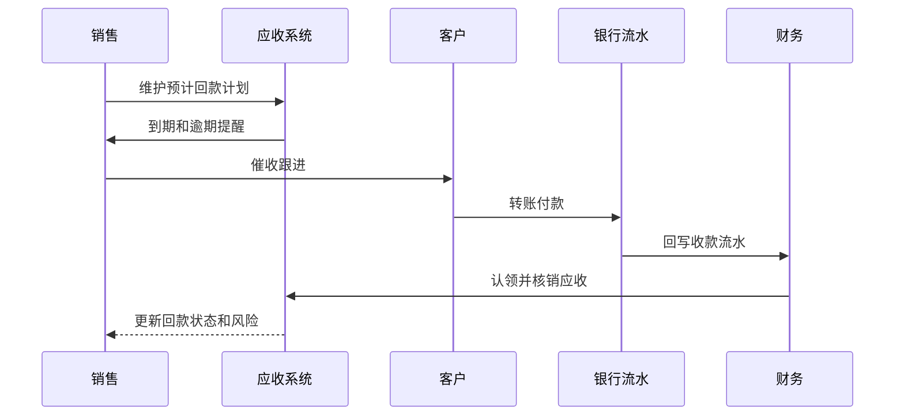

# 销售回款计划项目案例

## 适合谁看

适合需要做应收账款、回款计划、账期、催收提醒、回款预测、收款核销、逾期风险和销售财务协同的开发者。

销售回款计划不是“记录客户什么时候付款”。真实项目里，回款会连接合同、订单、发票、客户账期、销售预测、资金计划、财务收款和催收动作。系统要能回答：客户应收多少、预计什么时候回、实际回了多少、逾期多久、谁在跟进、对现金流有什么影响。

## 业务目标

第一版销售回款计划支持：

- 基于合同、订单或账单生成应收和回款计划。
- 支持按付款节点、账期和发票生成计划。
- 支持销售维护预计回款日期和回款概率。
- 支持财务收款回写、认领和核销。
- 支持逾期提醒、分层催收和跟进记录。
- 支持客户授信、账期、风险等级和暂停交易联动。
- 支持回款预测、现金流计划和销售业绩看板。
- 支持坏账、延期、部分回款和争议处理。

## 销售回款计划链路

回款计划的关键是“计划和实际分离”。计划用于预测，收款用于事实，核销用于确认两者的对应关系。

## 核心概念

| 概念 | 说明 | 示例 |
| --- | --- | --- |
| 应收款 | 客户应该支付的金额 | 合同尾款 20 万 |
| 回款计划 | 预计收款的时间和金额 | 7 月 30 日回 10 万 |
| 账期 | 客户允许延期付款的期限 | 开票后 30 天 |
| 回款概率 | 销售对预计回款的判断 | 本月 80% |
| 收款认领 | 识别银行流水对应哪个客户和单据 | 客户转账 5 万 |
| 核销 | 用实际收款抵扣应收 | 核销发票应收 |
| 逾期 | 到期未收到足额款项 | 逾期 15 天 |
| 催收 | 对逾期客户进行提醒和跟进 | 短信、电话、律师函 |

回款计划不能直接当财务凭证。它是业务预测，必须经过实际收款和核销后才成为财务事实。

## 数据模型

## 推荐表结构

| 表 | 作用 | 关键字段 |
| --- | --- | --- |
| `receivable_items` | 应收款 | `receivable_no`、`customer_id`、`source_type`、`receivable_amount`、`due_date`、`status` |
| `collection_plans` | 回款计划 | `receivable_id`、`planned_date`、`planned_amount`、`probability`、`owner_id` |
| `collection_plan_versions` | 计划版本 | `plan_id`、`version_no`、`changed_reason`、`snapshot_json` |
| `bank_receipts` | 银行收款 | `receipt_no`、`customer_name`、`received_amount`、`received_at`、`claim_status` |
| `collection_writeoffs` | 收款核销 | `receivable_id`、`receipt_id`、`writeoff_amount`、`writeoff_at` |
| `collection_followups` | 催收跟进 | `receivable_id`、`followup_type`、`content`、`next_followup_at` |
| `collection_risk_events` | 回款风险 | `customer_id`、`risk_type`、`risk_level`、`status` |
| `customer_credit_terms` | 客户账期 | `customer_id`、`credit_limit`、`term_days`、`enabled` |

计划调整要版本化。销售频繁修改预计回款日期时，管理层需要看到计划变化原因和预测准确度。

## 催收和核销流程

催收过程要有节奏。轻微逾期可以自动提醒，严重逾期需要销售主管、法务或风控介入。

## 回款状态设计

| 状态 | 含义 | 注意点 |
| --- | --- | --- |
| 待计划 | 应收已生成但未维护计划 | 销售待办 |
| 计划中 | 已维护预计回款 | 可调整 |
| 即将到期 | 距离到期很近 | 自动提醒 |
| 已逾期 | 超过到期日未足额回款 | 进入催收 |
| 部分回款 | 已收到部分金额 | 继续催收余额 |
| 已回款 | 应收已全部核销 | 关闭计划 |
| 争议中 | 客户对金额或服务有争议 | 暂缓普通催收 |
| 坏账处理中 | 长期无法回款 | 走审批和财务处理 |

逾期是风险状态，不一定是终态。应收可能同时处于“部分回款”和“逾期风险”。

## 前端页面拆分

| 页面或组件 | 作用 | 注意点 |
| --- | --- | --- |
| 回款工作台 | 展示本月计划、即将到期、逾期和风险 | 销售和财务视角不同 |
| 应收详情 | 查看合同、订单、发票、账期和核销 | 证据链完整 |
| 回款计划编辑 | 维护预计日期、金额、概率和原因 | 支持分期 |
| 收款认领 | 财务匹配银行流水和客户 | 支持模糊匹配 |
| 核销页面 | 用收款抵扣应收 | 支持部分核销 |
| 催收跟进 | 记录电话、邮件、承诺付款 | 保留下一步动作 |
| 逾期风险看板 | 分析客户、销售、账龄和金额 | 支持升级处理 |
| 现金流预测 | 按概率汇总未来回款 | 给资金计划使用 |

回款工作台要区分“我负责跟进”和“我负责核销”。销售关注客户承诺，财务关注流水和凭证。

## 接口拆分建议

| 接口 | 作用 | 注意点 |
| --- | --- | --- |
| `POST /receivables/generate` | 生成应收款 | 来源单据幂等 |
| `POST /collection-plans` | 创建回款计划 | 金额不能超过未计划余额 |
| `POST /collection-plans/{id}/adjust` | 调整计划 | 保存版本和原因 |
| `GET /receivables/overdue` | 查询逾期应收 | 支持账龄筛选 |
| `POST /bank-receipts/{id}/claim` | 认领收款 | 识别客户和来源 |
| `POST /collection-writeoffs` | 收款核销 | 支持部分核销 |
| `POST /receivables/{id}/followups` | 记录催收 | 保存承诺回款日期 |
| `GET /collection-forecast` | 回款预测 | 按概率和期间汇总 |

## 实际项目常见问题

### 问题 1：销售计划回款和财务实际回款对不上

计划、收款、核销要分开。计划代表销售预测，银行流水代表实际到账，核销代表到账款项抵扣了哪笔应收。

### 问题 2：客户打款备注不清，财务无法认领

收款认领要支持客户名称、金额、账号、历史付款习惯和销售提示匹配。无法自动匹配时进入待认领池。

### 问题 3：逾期提醒太粗暴影响客户关系

催收策略要按客户等级、逾期天数、金额和历史信用分层。重点客户可以先由销售沟通，严重逾期再升级法务。

### 问题 4：回款预测总是过于乐观

系统要记录计划达成率。销售频繁延期或低准确率时，预测看板应降低权重或提示风险。

## 权限与审计

销售回款计划权限至少要区分：

- 查看自己客户应收。
- 维护回款计划。
- 调整计划日期和概率。
- 查看全部应收和逾期。
- 认领银行收款。
- 执行收款核销。
- 标记争议和坏账。
- 导出回款预测和逾期报表。

计划调整、收款认领、核销、坏账、争议标记和客户账期变更都要审计。回款数据直接影响业绩和现金流。

## 验收清单

- 应收款可从合同、订单或账单生成。
- 回款计划支持分期、概率和负责人。
- 计划调整有版本和原因。
- 财务收款和业务计划分离。
- 支持收款认领和部分核销。
- 逾期应收可提醒和分层催收。
- 催收跟进有记录和下一步动作。
- 客户账期和授信可影响风险。
- 回款预测能按期间和概率汇总。
- 关键金额操作有审计记录。

## 下一步学习

继续学习 [客户账期项目案例](/projects/customer-credit-term-case)、[合同付款项目案例](/projects/contract-payment-case)、[资金计划项目案例](/projects/cash-flow-planning-case) 和 [复杂财务对账项目案例](/projects/finance-reconciliation-case)。
