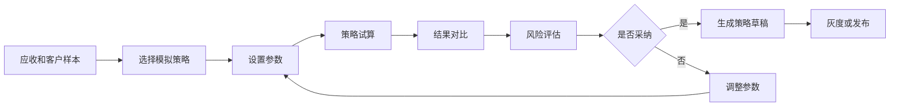
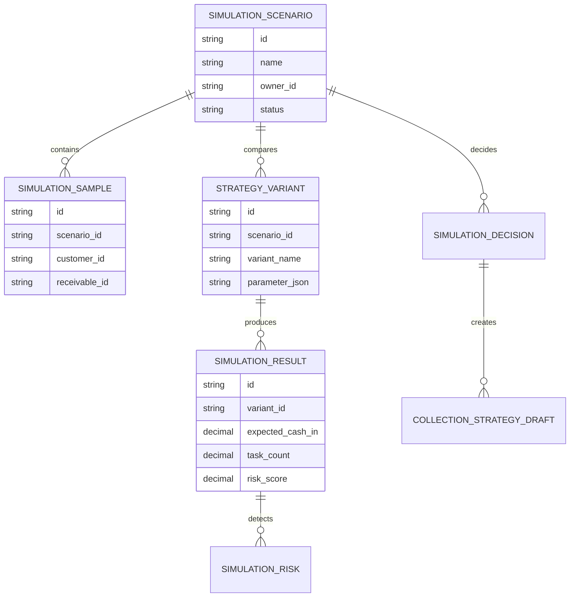
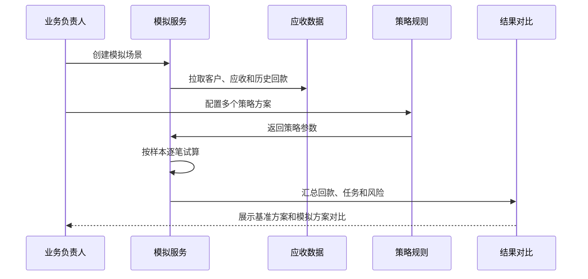
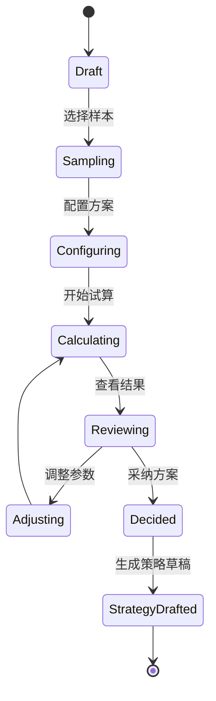
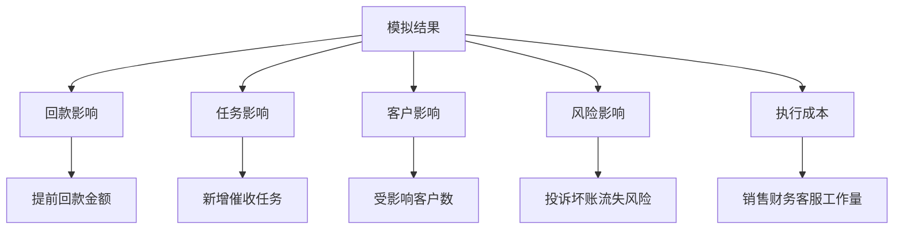

# 销售回款策略模拟项目案例

## 适合谁看

- 想理解回款策略、账期调整、催收动作和现金流结果之间关系的前端开发者。
- 正在做 CRM、应收催收、销售经营、财务分析或资金计划系统的团队。
- 希望在真正调整客户策略前，先模拟不同策略对回款、客户关系和风险影响的项目负责人。

## 业务目标

销售回款策略模拟的目标，是在不直接影响真实客户和真实账款的情况下，对不同回款策略做试算和对比。

常见策略包括：

- 缩短某类客户账期。
- 提前对高风险客户催收。
- 对按期回款客户提供折扣。
- 对长期逾期客户冻结额度。
- 将销售、财务、客服协同催收的时间点提前。

系统要帮助团队回答：如果策略这样改，预计能提前回多少钱，会影响多少客户，会增加多少人工任务，会不会带来投诉或坏账风险。

## 策略模拟链路

可以把它理解成“回款策略的沙盘”。沙盘里的结果不会直接改真实账期，但能帮助管理者提前看到可能影响。

## 核心概念

| 概念 | 说明 | 举例 |
| --- | --- | --- |
| 模拟样本 | 用于试算的客户和应收数据 | 华东 A 类渠道、逾期 30 天以上客户 |
| 策略参数 | 可调整的动作条件 | 账期缩短 15 天、折扣 1% |
| 基准方案 | 不调整策略时的预测结果 | 维持当前催收节奏 |
| 模拟方案 | 调整策略后的预测结果 | 提前催收 + 额度冻结 |
| 影响评估 | 方案对回款、任务、客户和风险的影响 | 提前回款 120 万、增加 80 个任务 |
| 采纳动作 | 将模拟结果转为实际策略 | 策略草稿、灰度发布、催收任务 |

## 数据模型

## 推荐表结构

| 表 | 关键字段 | 作用 |
| --- | --- | --- |
| `simulation_scenario` | `name`、`sample_scope_json`、`owner_id`、`status` | 模拟场景 |
| `simulation_sample` | `scenario_id`、`customer_id`、`receivable_id`、`baseline_json` | 参与试算的样本 |
| `strategy_variant` | `scenario_id`、`variant_name`、`parameter_json` | 策略方案 |
| `simulation_result` | `variant_id`、`expected_cash_in`、`task_count`、`risk_score` | 模拟结果 |
| `simulation_risk` | `result_id`、`risk_type`、`level`、`description` | 风险提示 |
| `simulation_decision` | `scenario_id`、`selected_variant_id`、`decision_type`、`reason` | 采纳决策 |

## 模拟流程

## 模拟状态设计

## 模拟指标拆解

模拟结果不能只看“多回款多少”。如果一个策略能提前回款 100 万，但会影响 200 个核心客户并增加大量投诉，它可能不是好策略。

## 前端页面拆分

| 页面 | 主要内容 | 设计重点 |
| --- | --- | --- |
| 模拟场景列表 | 场景、样本范围、状态、负责人、采纳结果 | 区分草稿、计算中和已采纳 |
| 创建模拟 | 选择客户、区域、账龄、金额区间 | 引导用户先定义样本 |
| 方案配置 | 账期、折扣、催收频率、冻结条件 | 支持多个方案对比 |
| 结果对比 | 基准方案、模拟方案、回款、风险、任务量 | 用表格和图形突出差异 |
| 采纳决策 | 采纳方案、生成策略草稿、灰度范围 | 从模拟走向执行 |

## 接口拆分建议

| 接口 | 方法 | 说明 |
| --- | --- | --- |
| `/api/collection-simulations` | POST | 创建模拟场景 |
| `/api/collection-simulations/:id/samples` | POST | 生成模拟样本 |
| `/api/collection-simulations/:id/variants` | POST | 保存策略方案 |
| `/api/collection-simulations/:id/calculate` | POST | 执行试算 |
| `/api/collection-simulations/:id/results` | GET | 查询结果对比 |
| `/api/collection-simulations/:id/decision` | POST | 提交采纳决策 |
| `/api/collection-simulations/:id/create-strategy` | POST | 生成策略草稿 |

## 实际项目常见问题

### 1. 模拟结果被当成确定结果

模拟只是预测，不是承诺。页面要展示假设条件、数据时间、样本范围和可信度。

如果历史数据不足，应该提示“结果仅供参考”，不要给出过于精确的结论。

### 2. 策略参数太自由，用户不会配置

可以先提供模板：保守催收、标准催收、激进催收、折扣激励、额度控制。

用户从模板开始调整，比从空白规则开始更容易。

### 3. 样本范围选择不合理

试算前要展示样本分布，例如账龄、金额、客户等级、区域。样本太少或过于集中时要提示。

### 4. 只比较回款金额，忽略执行成本

模拟要同时展示新增任务数、涉及角色和预计工作量。否则策略可能在财务上好看，但一线根本执行不了。

### 5. 模拟方案无法落地

采纳后应生成策略草稿或灰度发布单，而不是只导出报告。

这样才能形成“模拟 -> 决策 -> 执行 -> 复盘”的闭环。

## 权限与审计

| 动作 | 权限建议 | 审计内容 |
| --- | --- | --- |
| 创建模拟 | 销售主管、财务分析 | 样本范围和数据时间 |
| 配置方案 | 策略负责人 | 参数变化 |
| 查看结果 | 销售、财务、管理层 | 查询范围 |
| 采纳方案 | 业务负责人审批 | 采纳理由 |
| 生成策略 | 策略管理员 | 来源场景和方案 |

## 验收清单

- 能选择样本并展示样本分布。
- 能配置多个回款策略方案。
- 能展示基准方案和模拟方案对比。
- 能同时展示回款、风险、客户影响和任务量。
- 能把采纳方案转为策略草稿。
- 模拟结果能追溯数据时间和参数。

## 下一步学习

完成这个案例后，可以继续学习：

- [销售回款预测调度项目案例](/projects/sales-payment-prediction-scheduling-case)
- [销售现金流预警项目案例](/projects/sales-cash-flow-warning-case)
- [客户应收催收自动化项目案例](/projects/customer-receivable-collection-automation-case)

