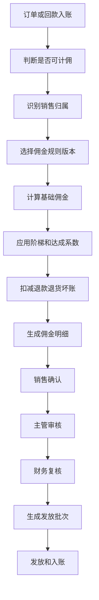
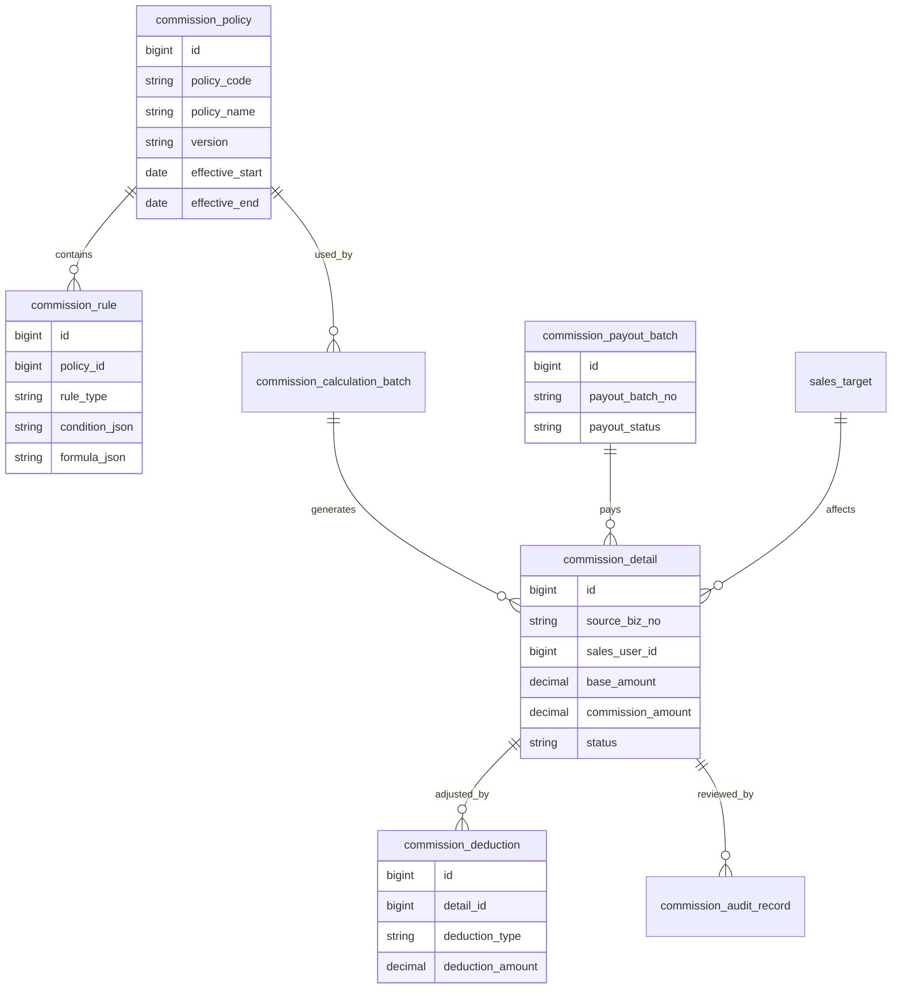
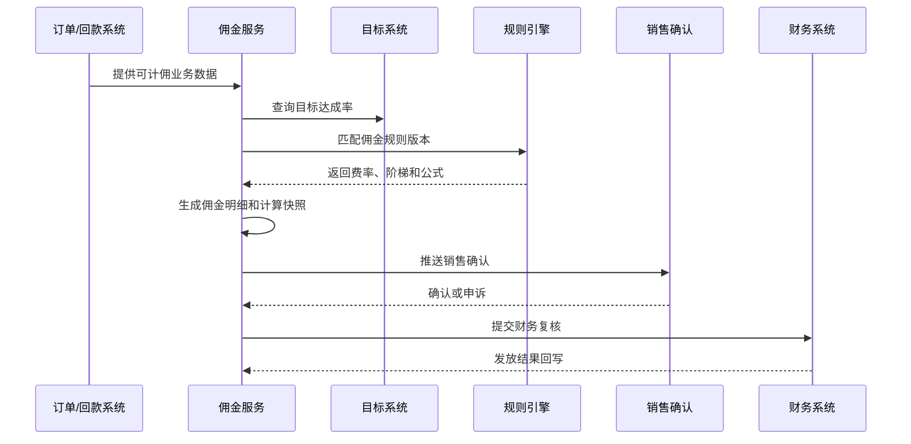
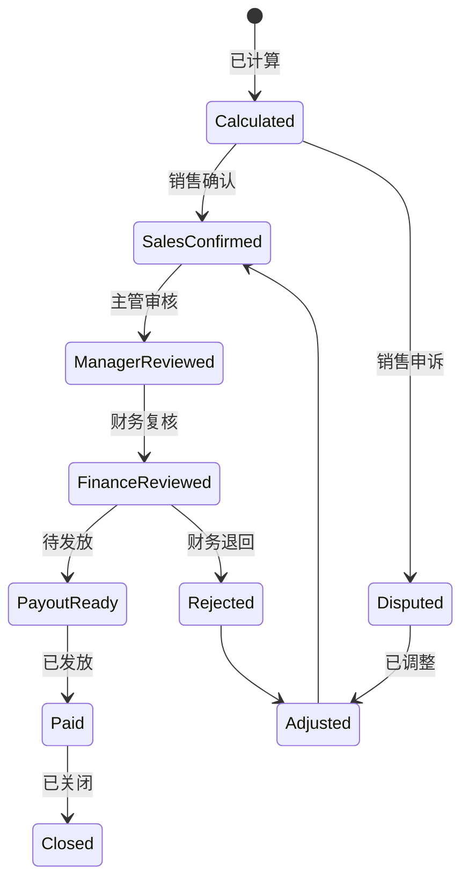

# 销售佣金核算项目案例

## 适合谁看

如果你做过 CRM、订单、回款或财务结算，但不清楚销售提成为什么经常算不准，可以先看这一篇。

销售佣金核算看起来是“按比例乘一下”，真实项目里却会涉及目标达成、回款确认、退货冲减、阶梯提成、团队分摊、特殊产品、手工调整和财务结算。

## 业务目标

销售佣金系统要回答 6 个问题：

- 哪些订单或回款可以计入佣金。
- 佣金归属到哪个销售、团队或渠道。
- 按什么规则和版本计算佣金。
- 退货、退款、坏账和折扣如何冲减。
- 计算结果是否需要主管或财务确认。
- 最终佣金如何发放、入账和追溯。

佣金系统最怕“规则写死”。销售政策每年、每季度甚至每个产品线都会变，所以规则版本和计算明细比最终金额更重要。

## 销售佣金核算链路

这条链路应该尽量自动化，但不能黑盒化。销售人员必须能看到“我为什么拿到这笔佣金”，财务必须能追到每一分钱来自哪笔订单或回款。

## 核心概念

| 概念 | 说明 | 项目里的典型字段 |
| --- | --- | --- |
| 计佣口径 | 按订单、发货、开票、回款或毛利计佣 | commission_basis |
| 归属规则 | 判断佣金属于谁 | owner_rule |
| 规则版本 | 某段时间生效的佣金政策 | policy_version |
| 阶梯提成 | 达到不同业绩区间使用不同费率 | tier_code |
| 达成系数 | 目标完成率影响佣金比例 | achievement_factor |
| 冲减项 | 退货、退款、坏账、折扣等扣减 | deduction_type |
| 发放批次 | 财务实际发放的一组佣金 | payout_batch_no |

新手要先区分“应计佣金”和“实发佣金”。应计佣金是按规则算出来的，实发佣金还要经过确认、扣减、审批和发放。

## 数据模型

`commission_detail` 要保存计算快照，不要每次打开页面都重新实时计算。否则规则变更后，历史月份的佣金会被算成新规则。

## 推荐表结构

| 表 | 用途 | 关键字段 |
| --- | --- | --- |
| commission_policy | 佣金政策主表 | policy_code、version、effective_start、effective_end、status |
| commission_rule | 佣金规则 | policy_id、rule_type、condition_json、formula_json、priority |
| commission_calculation_batch | 计算批次 | batch_no、period、policy_version、status、created_by |
| commission_detail | 佣金明细 | batch_id、source_biz_no、sales_user_id、base_amount、commission_amount、status |
| commission_deduction | 冲减明细 | detail_id、deduction_type、deduction_amount、reason |
| commission_audit_record | 审核记录 | detail_id、auditor_id、audit_result、comment |
| commission_payout_batch | 发放批次 | payout_batch_no、period、total_amount、payout_status |

如果公司有多产品线或多销售组织，规则表里不要只保存一个费率字段，而要用条件和公式描述规则，否则扩展会很痛苦。

## 佣金计算流程

佣金计算建议按批次执行。批次让你能暂停、重算、对比和回滚，比实时散算更适合财务类业务。

## 佣金状态设计

销售申诉不能直接改金额，应该生成调整记录。这样财务能看到原始计算、申诉原因和调整依据。

## 前端页面拆分

| 页面 | 主要功能 | 新手容易漏掉 |
| --- | --- | --- |
| 佣金政策页 | 政策版本、适用范围、启停 | 政策不能直接覆盖历史版本 |
| 规则配置页 | 条件、阶梯、公式、优先级 | 规则要能模拟计算 |
| 计算批次页 | 创建批次、执行、重算、锁定 | 批次锁定后不能随意改 |
| 佣金明细页 | 每个销售的佣金来源和金额 | 必须展示计算公式和来源单据 |
| 销售确认页 | 销售确认或发起申诉 | 申诉期限和附件要明确 |
| 财务复核页 | 汇总、抽查、调整、发放 | 财务需要导出和审计 |
| 发放批次页 | 实发金额、发放状态、回写 | 支持失败重试和人工标记 |

佣金明细页要尽量把“来源金额、费率、系数、扣减、最终金额”拆开显示，不要只给一个最终提成。

## 接口拆分建议

| 接口 | 方法 | 说明 |
| --- | --- | --- |
| /api/commission-policies | GET/POST | 查询和创建佣金政策 |
| /api/commission-policies/:id/rules | GET/POST | 维护政策规则 |
| /api/commission-rules/simulate | POST | 模拟计算佣金 |
| /api/commission-batches | POST | 创建计算批次 |
| /api/commission-batches/:id/run | POST | 执行计算 |
| /api/commission-details | GET | 查询佣金明细 |
| /api/commission-details/:id/confirm | POST | 销售确认 |
| /api/commission-details/:id/dispute | POST | 销售申诉 |
| /api/commission-payout-batches | POST | 创建发放批次 |

规则模拟接口很重要。没有模拟能力，运营和财务配置完规则后只能等真实计算才知道错没错。

## 实际项目常见问题

### 问题 1：退货后佣金没有扣回

销售佣金只接了订单数据，没有接退货、退款或坏账数据。

解决方式：

- 佣金来源统一抽象为正向计佣和反向冲减。
- 退货退款生成负向佣金明细。
- 发放后的冲减进入下个发放周期扣回。
- 明细里标记原始来源单据。

### 问题 2：规则变了，历史佣金被重新算错

通常是只保存规则 ID，不保存规则版本和计算快照。

解决方式：

- 政策和规则必须有版本。
- 佣金明细保存计算时的公式、费率和系数快照。
- 历史批次锁定后只允许生成调整单。
- 重算必须创建新批次，不能覆盖旧结果。

### 问题 3：团队协作订单不知道提成归谁

一个客户可能有销售、售前、渠道和客户成功共同参与。

解决方式：

- 建立销售归属规则。
- 支持按角色、比例和阶段分摊。
- 归属变更要有生效时间。
- 冲突订单进入人工确认队列。

### 问题 4：销售看不懂佣金怎么算的

页面只展示最终金额，缺少解释。

解决方式：

- 展示来源单据、计佣基数、费率、系数和扣减。
- 支持展开规则说明。
- 提供申诉入口和申诉期限。
- 常见规则用自然语言展示。

## 权限与审计

| 权限 | 建议 |
| --- | --- |
| 查看个人佣金 | 销售只能看自己的明细 |
| 查看团队佣金 | 主管按组织范围查看 |
| 配置规则 | 运营或财务专员，必须审批 |
| 调整佣金 | 财务角色，必须填写原因 |
| 发放佣金 | 财务负责人，支持二次确认 |
| 导出数据 | 导出带水印，并记录导出条件 |

佣金数据属于敏感薪酬类数据，不能像普通订单列表一样开放给所有业务人员。

## 验收清单

- 同一来源单据不会重复计佣。
- 退货、退款和坏账能生成冲减明细。
- 规则版本变化不会影响历史批次。
- 销售能看到佣金计算过程。
- 申诉、调整、审核和发放都有审计记录。
- 发放失败可以重试或人工处理。
- 主管只能查看授权范围内的团队佣金。

## 下一步学习

建议继续阅读：

- [CRM 销售管理项目案例](/projects/crm-sales-management-case)
- [销售目标拆解项目案例](/projects/sales-target-breakdown-case)
- [销售回款计划项目案例](/projects/sales-collection-plan-case)
- [财务对账项目案例](/projects/finance-reconciliation-case)
