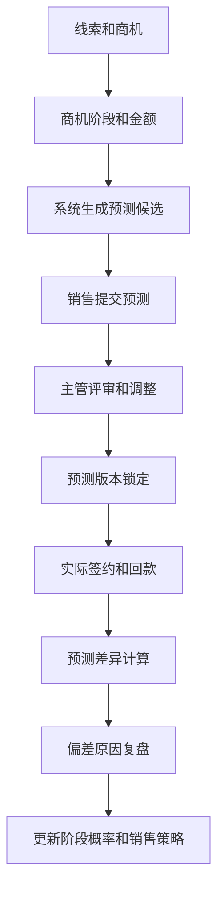
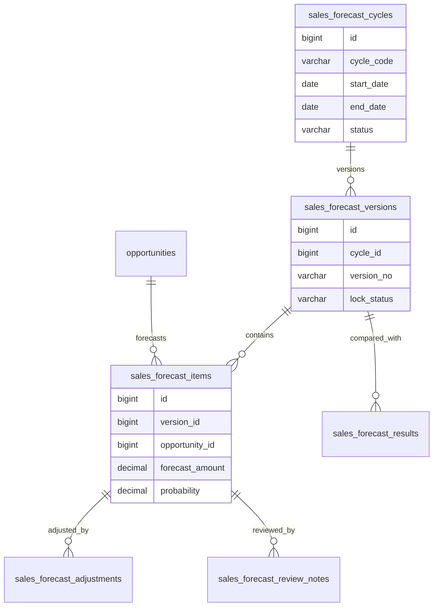
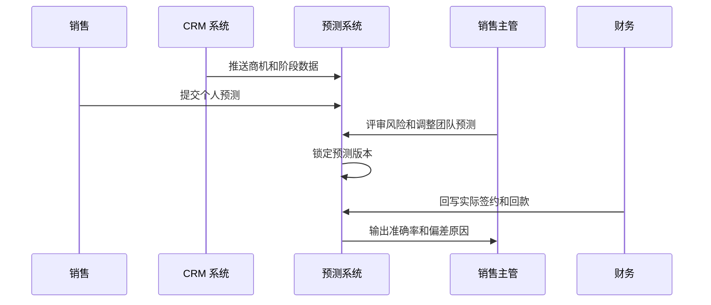

# 销售预测复盘项目案例

## 适合谁看

适合需要做销售预测、商机阶段、预测提交、预测调整、预测准确率、销售漏斗、回款预测、业绩复盘和经营分析的开发者。

销售预测复盘不是“销售填一个预计金额”。真实项目里，预测来自线索、商机、报价、合同、客户账期、历史成交率和销售主观判断。系统要能回答：这个月预计签多少、预测依据是什么、哪些机会有风险、实际结果和预测差多少、偏差原因是什么、下次如何提高准确率。

## 业务目标

第一版销售预测复盘支持：

- 基于商机、报价、合同和历史转化率生成预测候选。
- 支持销售提交个人预测、主管汇总团队预测。
- 支持按金额、阶段、概率、预计签约日和产品线预测。
- 支持预测调整、锁版、版本对比和审批。
- 支持实际签约、回款和预测差异对比。
- 支持预测偏差原因、漏斗质量和销售动作复盘。
- 支持按销售、团队、行业、产品和客户分层分析。
- 支持预测准确率、延期率和赢单率看板。

## 销售预测复盘链路

预测复盘的关键是“版本锁定”。如果销售可以事后改预测，就无法判断预测质量。

## 核心概念

| 概念 | 说明 | 示例 |
| --- | --- | --- |
| 预测周期 | 预测覆盖的时间范围 | 2026 年 7 月 |
| 预测版本 | 某次提交和锁定的预测快照 | 周一版本、月末版本 |
| 商机概率 | 商机成交可能性 | 80% |
| Commit | 销售承诺较高的预测金额 | 本月必签 50 万 |
| Best Case | 有机会但不确定的预测 | 可能签 30 万 |
| Pipeline | 漏斗中全部潜在金额 | 总商机 200 万 |
| 预测准确率 | 预测和实际的偏差程度 | 误差 8% |
| 偏差原因 | 预测失败或超预期的原因 | 客户预算延期 |

预测金额要区分签约预测和回款预测。签合同不代表当月到账。

## 数据模型

## 推荐表结构

| 表 | 作用 | 关键字段 |
| --- | --- | --- |
| `sales_forecast_cycles` | 预测周期 | `cycle_code`、`start_date`、`end_date`、`status` |
| `sales_forecast_versions` | 预测版本 | `cycle_id`、`version_no`、`submitter_id`、`lock_status`、`locked_at` |
| `sales_forecast_items` | 预测明细 | `version_id`、`opportunity_id`、`forecast_type`、`forecast_amount`、`probability` |
| `sales_forecast_adjustments` | 预测调整 | `item_id`、`before_amount`、`after_amount`、`reason` |
| `sales_forecast_review_notes` | 评审意见 | `item_id`、`reviewer_id`、`risk_level`、`note` |
| `sales_forecast_results` | 实际结果 | `version_id`、`actual_sign_amount`、`actual_collection_amount`、`accuracy_rate` |
| `sales_forecast_deviation_reasons` | 偏差原因 | `item_id`、`reason_code`、`description` |
| `sales_stage_probability_snapshots` | 阶段概率快照 | `stage_code`、`period`、`win_rate`、`sample_count` |

预测复盘要保存商机当时的阶段、金额、预计签约日和负责人快照。商机后续变化不能覆盖历史预测依据。

## 预测评审流程

主管评审不是简单改金额。系统要保留销售原始预测、主管调整、调整原因和最终锁定版本。

## 预测状态设计

| 状态 | 含义 | 注意点 |
| --- | --- | --- |
| 待生成 | 周期已创建但未生成候选 | 可按商机拉取 |
| 待提交 | 销售填写预测中 | 可编辑 |
| 待评审 | 已提交主管评审 | 销售不再随意改 |
| 已调整 | 主管做过调整 | 保留原因 |
| 已锁定 | 版本已冻结 | 用于复盘 |
| 实际回写中 | 等待签约或回款结果 | 财务和 CRM 回写 |
| 已复盘 | 偏差原因已填写 | 进入准确率统计 |
| 已归档 | 周期完成 | 只读 |

锁定后的预测只能通过新版本调整，不能直接覆盖旧版本。

## 前端页面拆分

| 页面或组件 | 作用 | 注意点 |
| --- | --- | --- |
| 预测工作台 | 查看本周期预测、待提交、待评审 | 按销售角色展示 |
| 个人预测提交 | 销售选择商机、金额、概率、分类 | 支持 Commit、Best Case |
| 团队预测评审 | 主管查看团队预测和风险 | 展示历史准确率 |
| 预测版本对比 | 比较不同版本金额和商机变化 | 支持锁版前后对比 |
| 实际结果回写 | 展示签约、回款和商机结果 | 和预测明细对应 |
| 偏差原因复盘 | 填写延期、丢单、提前成交原因 | 结构化原因 |
| 预测准确率看板 | 分析团队、个人、产品和行业 | 避免只看总金额 |
| 阶段概率配置 | 根据历史赢单率调整概率 | 保留版本 |

预测看板不要只显示一个总预测金额。要拆出 Commit、Best Case、Pipeline、实际签约、实际回款和偏差。

## 接口拆分建议

| 接口 | 作用 | 注意点 |
| --- | --- | --- |
| `POST /sales-forecasts/cycles` | 创建预测周期 | 支持月度、季度 |
| `POST /sales-forecasts/{cycleId}/generate` | 生成预测候选 | 从商机和报价拉取 |
| `POST /sales-forecasts/{versionId}/submit` | 提交预测 | 冻结个人预测 |
| `POST /sales-forecasts/{versionId}/review` | 主管评审 | 保存调整原因 |
| `POST /sales-forecasts/{versionId}/lock` | 锁定版本 | 后续只读 |
| `POST /sales-forecasts/{versionId}/results` | 回写实际结果 | 关联合同和回款 |
| `POST /sales-forecasts/{itemId}/deviation` | 填写偏差原因 | 用于复盘 |
| `GET /sales-forecasts/accuracy` | 查询准确率 | 支持团队和个人 |

## 实际项目常见问题

### 问题 1：销售事后修改预测导致准确率失真

预测提交和评审后要锁定版本。后续调整只能生成新版本，并保留旧版本用于复盘。

### 问题 2：预测总额高，但实际签约很低

要区分 Commit、Best Case 和 Pipeline，并结合历史阶段赢单率。不能把所有商机都按 100% 统计。

### 问题 3：签约预测和回款预测混在一起

签约预测面向收入和销售目标，回款预测面向现金流。二者要关联但不能用同一个字段。

### 问题 4：复盘只写一句“客户延期”

偏差原因要结构化，例如预算延期、竞品失败、法务延期、关键人变动、价格争议、交付风险。否则无法沉淀改进。

## 权限与审计

销售预测复盘权限至少要区分：

- 提交个人预测。
- 查看团队预测。
- 调整团队预测。
- 锁定预测版本。
- 回写实际结果。
- 填写偏差原因。
- 配置阶段概率。
- 导出预测和准确率报表。

预测金额调整、版本锁定、主管调整、实际结果回写和阶段概率变更都要审计。预测数据影响经营决策和销售管理。

## 验收清单

- 支持按周期创建预测。
- 能从商机、报价和合同生成预测候选。
- 支持 Commit、Best Case、Pipeline 分类。
- 销售提交和主管评审有独立记录。
- 预测版本可锁定和对比。
- 实际签约和回款可回写。
- 能计算预测准确率和偏差。
- 偏差原因可结构化沉淀。
- 支持按个人、团队、产品、行业分析。
- 关键预测动作有审计记录。

## 下一步学习

继续学习 [CRM 销售管理项目案例](/projects/crm-sales-management-case)、[销售回款计划项目案例](/projects/sales-collection-plan-case)、[报价中心项目案例](/projects/quotation-center-case) 和 [数据看板项目案例](/projects/analytics-dashboard-case)。
