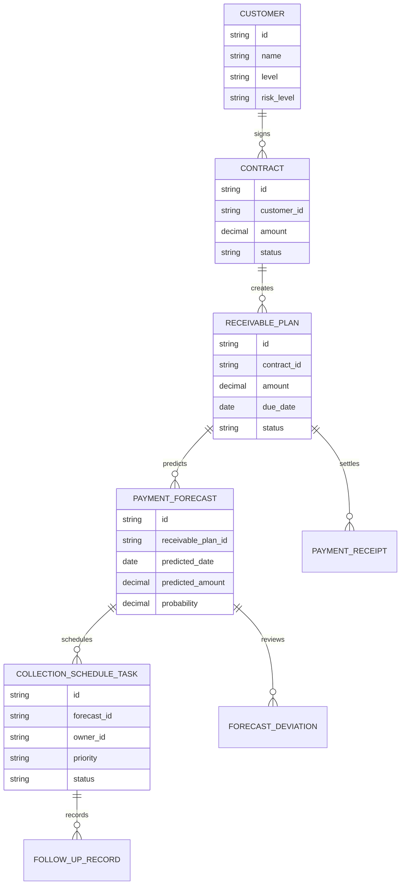
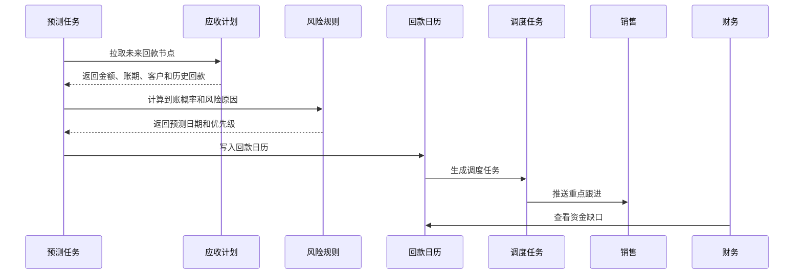
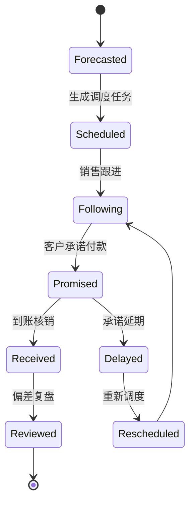
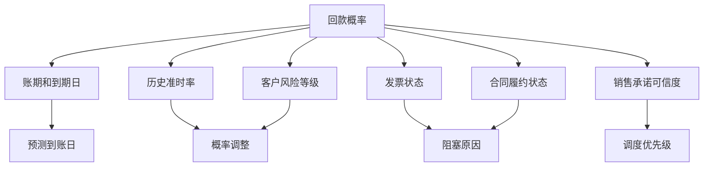

# 销售回款预测调度项目案例

## 适合谁看

- 想理解销售预测、回款计划、应收账款和现金流之间关系的前端开发者。
- 正在做 CRM、财务应收、销售经营分析或资金计划系统的团队。
- 希望把“销售口头预计回款”升级为“可预测、可调度、可复盘”的项目负责人。

## 业务目标

销售回款预测调度的目标，是把订单、合同、发票、应收、历史回款、客户风险和销售承诺合并起来，预测未来一段时间可能到账的金额，并把风险回款提前分配给负责人跟进。

它解决的不是“这个客户欠多少钱”这么简单的问题，而是：

1. 本周、本月、下季度预计能回多少钱。
2. 哪些回款大概率会延迟。
3. 哪些客户需要提前跟进。
4. 销售承诺和实际到账偏差有多大。
5. 财务和销售如何围绕同一份回款计划协作。

## 回款预测调度链路

可以把它理解成“销售回款的排班系统”。系统不只展示金额，还要告诉团队什么时候跟进、谁跟进、优先跟进哪一笔。

## 核心概念

| 概念 | 说明 | 容易误解的点 |
| --- | --- | --- |
| 应收计划 | 合同或订单约定的收款节点 | 不等于实际到账 |
| 预测到账日 | 系统估算的可能到账日期 | 可能晚于合同约定日期 |
| 回款概率 | 某笔应收按期到账的概率 | 不是最终结论，只是调度依据 |
| 调度任务 | 为提升到账概率分配的跟进动作 | 不是普通销售跟进，要关联应收 |
| 偏差复盘 | 预测和实际到账的差异分析 | 用来持续修正规则或模型 |
| 资金缺口 | 预计到账低于资金需求 | 需要提前触发财务预警 |

## 数据模型

## 推荐表结构

| 表 | 关键字段 | 作用 |
| --- | --- | --- |
| `receivable_plan` | `contract_id`、`amount`、`due_date`、`status` | 保存合同收款计划 |
| `payment_forecast` | `receivable_plan_id`、`predicted_date`、`probability`、`reason_json` | 保存预测结果 |
| `collection_schedule_task` | `forecast_id`、`owner_id`、`priority`、`deadline_at`、`status` | 回款调度任务 |
| `follow_up_record` | `task_id`、`channel`、`result`、`next_action_at` | 跟进记录 |
| `payment_receipt` | `customer_id`、`amount`、`received_at`、`matched_plan_id` | 到账与核销 |
| `forecast_deviation` | `forecast_id`、`actual_date`、`actual_amount`、`deviation_reason` | 偏差复盘 |

## 预测调度流程

## 调度状态设计

## 预测因素拆解

第一版可以先用规则预测，不必一上来做机器学习：

- 未开票：预测日期后移。
- 历史准时率低：概率降低。
- 合同未完成交付：标记履约阻塞。
- 销售近期有可靠承诺：概率上调，但保留承诺来源。

## 前端页面拆分

| 页面 | 主要内容 | 设计重点 |
| --- | --- | --- |
| 回款预测看板 | 本月预测回款、风险金额、资金缺口、预测偏差 | 管理层先看整体现金流 |
| 回款日历 | 按日、周、月展示预计到账金额 | 支持点击日期查看明细 |
| 调度任务列表 | 客户、金额、概率、风险原因、负责人、截止时间 | 用优先级帮助销售排序 |
| 预测详情 | 应收计划、预测依据、历史回款、跟进记录 | 解释为什么这样预测 |
| 偏差复盘 | 预测日期、实际到账、偏差天数、偏差原因 | 用于改进规则 |

## 接口拆分建议

| 接口 | 方法 | 说明 |
| --- | --- | --- |
| `/api/payment-forecasts` | GET | 查询回款预测 |
| `/api/payment-forecasts/calendar` | GET | 查询回款日历 |
| `/api/payment-forecasts/:id` | GET | 查询预测详情 |
| `/api/payment-forecasts/recalculate` | POST | 重新计算预测 |
| `/api/collection-schedule/tasks` | GET | 查询调度任务 |
| `/api/collection-schedule/tasks/:id/follow-ups` | POST | 新增跟进记录 |
| `/api/forecast-deviations` | POST | 提交偏差复盘 |

## 实际项目常见问题

### 1. 销售填的预计回款太乐观

销售承诺不能直接覆盖系统预测。建议同时保存“系统预测”和“销售承诺”，并统计每个销售的承诺兑现率。

承诺兑现率低的人，后续承诺对预测概率的影响应降低。

### 2. 财务看到的金额和销售看到的不一致

要明确金额口径：合同金额、应收金额、已开票金额、未税金额、含税金额、预计到账金额都不同。

页面上每个金额指标都要显示口径说明，接口也要返回 `amount_type`。

### 3. 回款预测无法解释

预测详情必须展示原因，例如“客户历史准时率 62%”“发票未开”“合同验收未完成”。

如果只有一个概率数字，业务不会信任系统。

### 4. 调度任务太多，销售不处理

任务要按优先级排序，并控制每日任务量。可以先生成重点任务，例如金额大、概率中等、可通过跟进提升的应收。

已经确定无法回款的任务不应占用销售时间，应转为风险处置。

### 5. 预测复盘没有闭环

每次实际到账后，要自动计算预测偏差。偏差原因可以从销售跟进、发票状态、客户反馈中归因。

复盘结果要反向影响下一次预测规则。

## 权限与审计

| 动作 | 权限建议 | 审计内容 |
| --- | --- | --- |
| 查看回款预测 | 销售、销售主管、财务 | 查询客户和范围 |
| 修改销售承诺 | 客户负责人 | 修改前后日期和金额 |
| 调整预测规则 | 财务分析或管理员 | 规则版本和原因 |
| 关闭调度任务 | 任务负责人或主管 | 关闭依据 |
| 导出预测数据 | 财务主管 | 导出范围和字段 |

## 验收清单

- 能按周、月展示预测回款金额。
- 每笔预测都有概率、预测日期和原因说明。
- 高风险回款能生成调度任务。
- 销售承诺和系统预测能分开记录。
- 实际到账后能自动计算预测偏差。
- 管理者可以看到资金缺口和任务执行情况。

## 下一步学习

完成这个案例后，可以继续学习：

- [销售回款计划项目案例](/projects/sales-collection-plan-case)
- [客户回款风险预测项目案例](/projects/customer-payment-risk-prediction-case)
- [客户应收催收自动化项目案例](/projects/customer-receivable-collection-automation-case)

