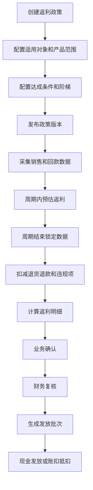
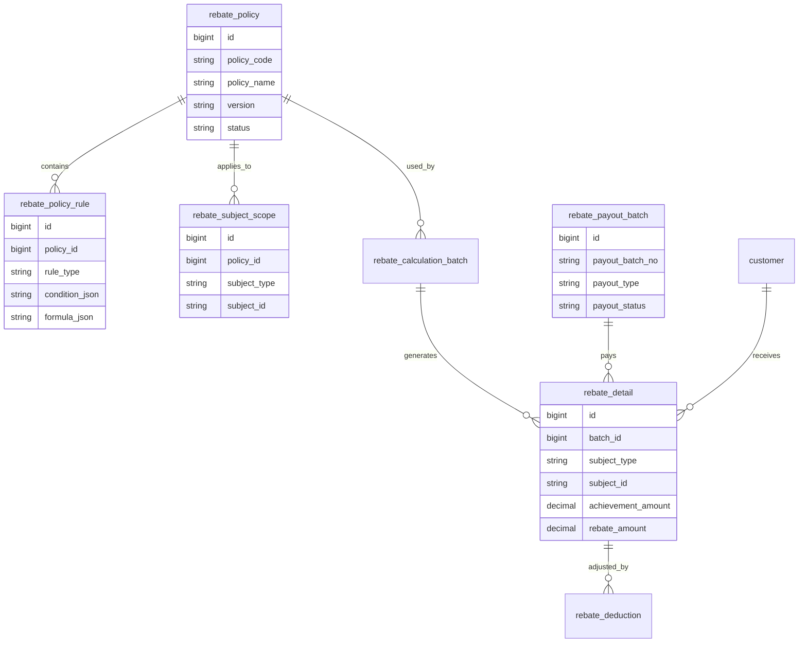
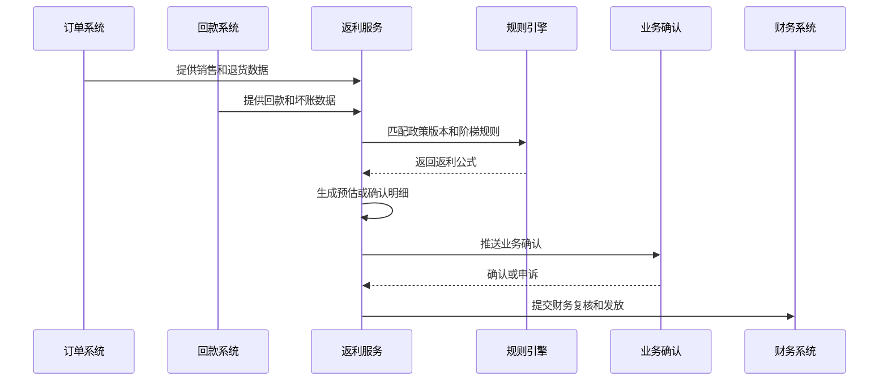
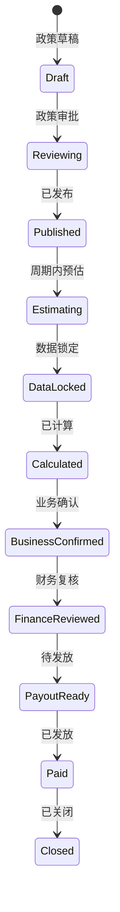
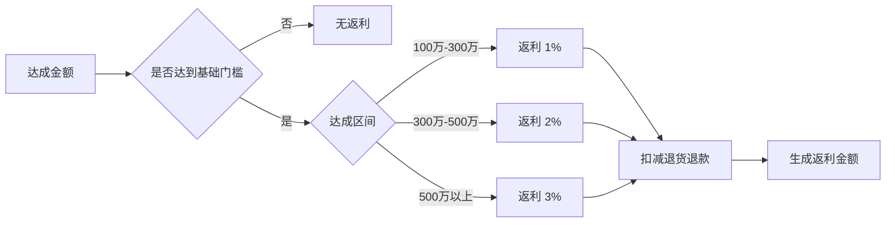

# 销售返利政策项目案例

## 适合谁看

如果你做过销售订单、渠道、经销商、会员营销或财务结算，但不清楚“返利政策为什么比优惠券复杂得多”，可以先看这一篇。

销售返利政策通常用于经销商、渠道商、大客户或销售团队。它根据销售额、回款、产品组合、增长率、任务达成和合规条件，在周期结束后计算返利或奖励。

## 业务目标

返利系统要回答 6 个问题：

- 哪些客户、渠道或销售对象适用返利政策。
- 按销售额、回款额、毛利、件数还是增长率计算。
- 返利是实时预估，还是周期结束后确认。
- 退货、退款、折扣、坏账和违规行为如何扣减。
- 返利以现金、账扣、货补、积分还是抵扣券发放。
- 返利政策、计算过程和发放结果如何被审计。

返利和佣金不同。佣金通常面向销售人员，返利通常面向客户、渠道或合作伙伴。

## 销售返利政策链路

返利链路要有“预估”和“确认”两层。预估帮助业务过程管理，确认才进入财务结算。

## 核心概念

| 概念 | 说明 | 项目里的典型字段 |
| --- | --- | --- |
| 返利政策 | 一套返利规则和适用范围 | rebate_policy |
| 政策版本 | 某个生效周期的政策快照 | policy_version |
| 适用对象 | 客户、渠道商、经销商、区域 | subject_type |
| 达成口径 | 销售额、回款额、毛利、数量 | achievement_basis |
| 阶梯规则 | 不同达成区间对应不同返利 | tier_rule |
| 预估返利 | 周期内动态估算金额 | estimated_rebate |
| 确认返利 | 结算周期锁定后的金额 | confirmed_rebate |
| 发放方式 | 现金、账扣、货补、积分 | payout_type |

新手要先区分“政策配置”“过程预估”“结算确认”“实际发放”。这四个阶段不能混成一张表。

## 数据模型

返利明细要保存政策版本和计算快照。政策调整后，历史返利不能被新政策重新解释。

## 推荐表结构

| 表 | 用途 | 关键字段 |
| --- | --- | --- |
| rebate_policy | 返利政策主表 | policy_code、version、period_type、status、effective_date |
| rebate_policy_rule | 返利规则 | policy_id、rule_type、condition_json、formula_json、priority |
| rebate_subject_scope | 适用对象 | policy_id、subject_type、subject_id、scope_status |
| rebate_calculation_batch | 计算批次 | batch_no、period、policy_version、status |
| rebate_detail | 返利明细 | batch_id、subject_type、subject_id、achievement_amount、rebate_amount |
| rebate_deduction | 扣减明细 | detail_id、deduction_type、deduction_amount、reason |
| rebate_payout_batch | 发放批次 | payout_batch_no、payout_type、total_amount、status |

返利政策经常要支持多个对象类型。不要把表设计成只支持客户 ID，否则渠道、门店、区域返利会很难接入。

## 返利计算流程

返利计算要明确数据截止时间。否则周期结束后订单、退货和回款不断变化，会导致结算金额反复变动。

## 返利状态设计

政策发布和返利发放是两个不同生命周期。政策可以已发布，但某个周期的返利还在预估或审核。

## 阶梯规则示例

阶梯规则要说明是“全额按最高档”还是“分段累进”。这两个口径结果差异很大。

## 前端页面拆分

| 页面 | 主要功能 | 新手容易漏掉 |
| --- | --- | --- |
| 返利政策页 | 政策版本、适用对象、周期 | 政策发布后不能直接改历史版本 |
| 规则配置页 | 阶梯、公式、门槛、排除项 | 支持模拟计算 |
| 返利预估页 | 周期内预计达成和预计返利 | 显示数据截止时间 |
| 返利结算页 | 锁定数据、计算、确认、复核 | 锁定后变更要生成调整 |
| 返利明细页 | 对象、来源数据、扣减、金额 | 能追到订单和回款来源 |
| 返利发放页 | 发放方式、批次、状态 | 支持现金、账扣、货补等方式 |
| 返利申诉页 | 渠道或业务申诉 | 申诉要有期限和附件 |

返利页面要面向业务解释规则。只展示 JSON 公式会让运营、渠道经理和财务都无法确认。

## 接口拆分建议

| 接口 | 方法 | 说明 |
| --- | --- | --- |
| /api/rebate-policies | GET/POST | 查询和创建返利政策 |
| /api/rebate-policies/:id/rules | GET/POST | 维护返利规则 |
| /api/rebate-policies/simulate | POST | 模拟返利计算 |
| /api/rebate-batches | POST | 创建计算批次 |
| /api/rebate-batches/:id/run | POST | 执行返利计算 |
| /api/rebate-details | GET | 查询返利明细 |
| /api/rebate-details/:id/confirm | POST | 业务确认 |
| /api/rebate-payout-batches | POST | 创建发放批次 |

模拟接口能极大降低上线风险。返利规则一旦算错，影响的是渠道信任和财务成本。

## 实际项目常见问题

### 问题 1：退货后返利没有扣回

返利只采集销售订单，没有采集退货退款。

解决方式：

- 返利来源统一支持正向销售和反向扣减。
- 退货退款进入 `rebate_deduction`。
- 已发放返利在下个周期冲减。
- 明细展示原始订单和扣减单据。

### 问题 2：政策修改影响历史结算

政策没有版本，页面实时读取最新规则。

解决方式：

- 政策发布后生成版本快照。
- 返利批次保存 policy_version。
- 历史批次锁定后只能调整，不能覆盖。
- 调整单独记录原因和审批。

### 问题 3：渠道认为返利少算了

业务只给最终金额，没有给计算过程。

解决方式：

- 明细展示达成金额、阶梯、费率、扣减和最终金额。
- 提供申诉入口。
- 申诉处理结果写入审计。
- 规则用自然语言辅助说明。

### 问题 4：返利发放方式混乱

现金、账扣、货补混在一起，没有统一批次。

解决方式：

- 发放批次记录 payout_type。
- 不同发放方式走不同下游接口。
- 发放结果回写返利明细。
- 财务报表按发放方式汇总。

## 权限与审计

| 权限 | 建议 |
| --- | --- |
| 查看政策 | 运营、销售、财务按业务线查看 |
| 配置政策 | 运营角色，发布需要审批 |
| 计算返利 | 运营或财务，按周期执行 |
| 调整返利 | 财务角色，必须填写原因 |
| 确认发放 | 财务负责人，二次确认 |
| 导出明细 | 敏感数据导出审计和水印 |

返利政策直接影响渠道利益，所有规则变更、计算批次和人工调整都要可追溯。

## 验收清单

- 返利政策支持版本、生效期和适用对象。
- 规则能模拟计算，并能解释阶梯口径。
- 预估返利和确认返利分开。
- 退货、退款、坏账和违规能扣减。
- 历史结算不受新政策影响。
- 发放批次能区分现金、账扣、货补等方式。
- 申诉、调整、审批和发放都有审计记录。

## 下一步学习

建议继续阅读：

- [渠道结算项目案例](/projects/channel-settlement-case)
- [销售佣金核算项目案例](/projects/sales-commission-settlement-case)
- [销售目标拆解项目案例](/projects/sales-target-breakdown-case)
- [财务对账项目案例](/projects/finance-reconciliation-case)
