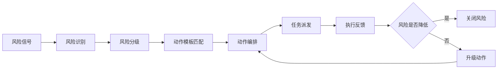
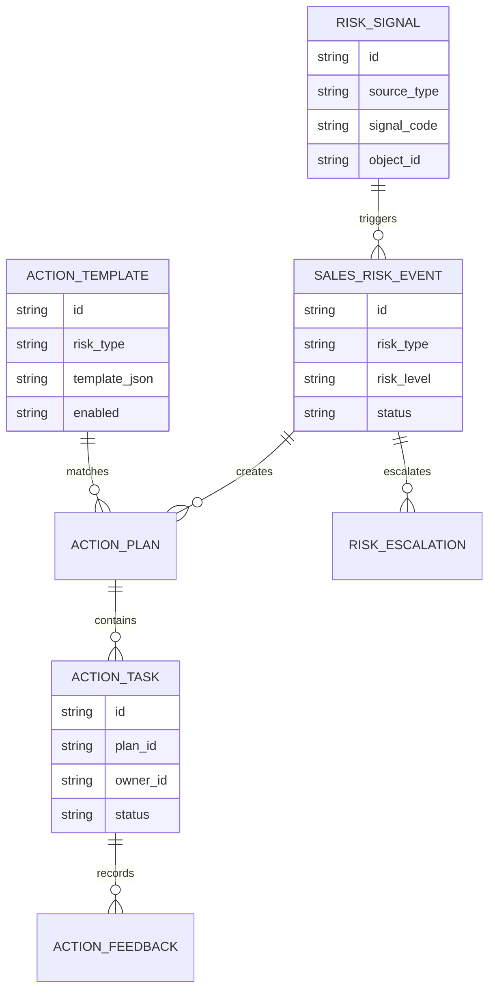
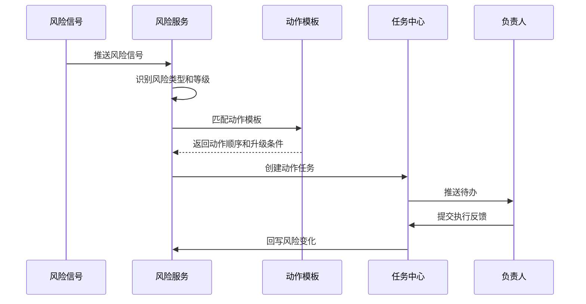
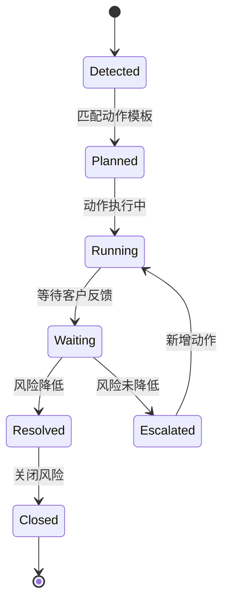
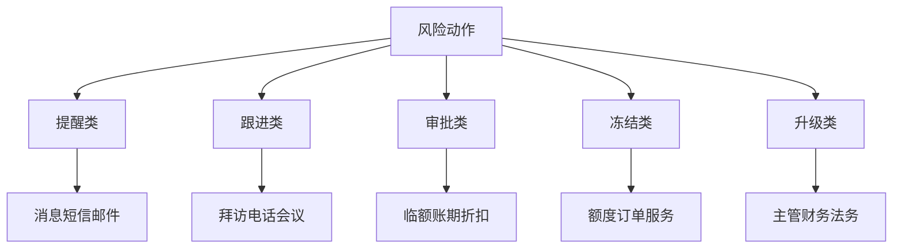

# 销售风险动作编排项目案例

## 适合谁看

- 想理解销售风险识别后如何自动生成处置动作的前端开发者。
- 正在做 CRM、客户成功、回款催收、风控中心或销售运营后台的团队。
- 希望把“发现风险后靠人想办法”升级为“系统按风险类型编排动作”的项目负责人。

## 业务目标

销售风险动作编排的目标，是把客户流失、回款逾期、商机停滞、合同风险、低活跃和投诉升级等风险，转成可执行的动作组合，并跟踪动作是否有效。

它要回答 5 个问题：

1. 风险从哪里来。
2. 应该触发哪些动作。
3. 动作由谁负责、何时完成。
4. 多个动作之间是否有顺序和依赖。
5. 风险是否因为动作而降低。

## 风险动作编排链路

可以把它理解成“销售风险的自动处置剧本”。风险识别只是发现问题，动作编排才是真正推动解决问题。

## 核心概念

| 概念 | 说明 | 举例 |
| --- | --- | --- |
| 风险信号 | 触发风险判断的数据 | 逾期 30 天、商机 20 天无跟进 |
| 风险事件 | 系统识别出的具体风险 | 客户回款风险、商机流失风险 |
| 动作模板 | 某类风险的处理动作集合 | 销售跟进、主管介入、财务提醒 |
| 编排规则 | 动作的顺序、条件和升级方式 | 未完成则 3 天后升级 |
| 动作任务 | 分派给具体人的执行事项 | 电话回访、发送账单、主管拜访 |
| 效果回写 | 动作执行后风险是否变化 | 回款到账、客户恢复活跃 |

## 数据模型

## 推荐表结构

| 表 | 关键字段 | 作用 |
| --- | --- | --- |
| `risk_signal` | `source_type`、`signal_code`、`object_id`、`payload_json` | 风险信号 |
| `sales_risk_event` | `risk_type`、`risk_level`、`object_id`、`status` | 风险事件 |
| `action_template` | `risk_type`、`template_json`、`priority`、`enabled` | 动作模板 |
| `action_plan` | `risk_event_id`、`template_id`、`plan_status` | 编排计划 |
| `action_task` | `plan_id`、`owner_id`、`action_type`、`deadline_at`、`status` | 动作任务 |
| `action_feedback` | `task_id`、`result`、`evidence_url`、`next_action` | 执行反馈 |
| `risk_escalation` | `risk_event_id`、`from_level`、`to_level`、`reason` | 风险升级 |

## 动作编排流程

## 风险动作状态设计

## 动作类型拆解

第一版不要把动作编排做成复杂工作流引擎。可以先用模板化动作列表，加上条件升级。

## 前端页面拆分

| 页面 | 主要内容 | 设计重点 |
| --- | --- | --- |
| 风险动作看板 | 风险数量、动作完成率、升级数量、关闭率 | 先看风险是否被处理 |
| 风险事件列表 | 客户、风险类型、等级、当前动作、负责人 | 支持按风险类型筛选 |
| 风险详情 | 信号来源、动作计划、执行时间线、反馈 | 让负责人知道为什么要做 |
| 动作模板配置 | 风险条件、动作顺序、负责人规则、升级条件 | 业务可配置但要受控 |
| 效果复盘 | 动作完成、风险变化、客户结果、偏差原因 | 优化模板 |

## 接口拆分建议

| 接口 | 方法 | 说明 |
| --- | --- | --- |
| `/api/sales-risk/events` | GET | 查询风险事件 |
| `/api/sales-risk/events/:id` | GET | 查询风险详情 |
| `/api/sales-risk/action-templates` | POST | 保存动作模板 |
| `/api/sales-risk/events/:id/actions` | POST | 手动追加动作 |
| `/api/action-tasks/:id/feedback` | POST | 提交动作反馈 |
| `/api/sales-risk/events/:id/escalate` | POST | 升级风险 |
| `/api/sales-risk/effect-review` | GET | 查询动作效果 |

## 实际项目常见问题

### 1. 风险很多，但动作任务也很多

不要对所有风险都生成重任务。低风险可以只提醒，高风险才创建强制任务。

任务量应该受负责人容量限制，否则系统会变成新的噪音源。

### 2. 动作模板配置太自由

动作类型要枚举化，负责人规则要模板化。不要让业务直接写复杂表达式。

模板配置页面应提供预览：命中哪些风险，会生成哪些动作。

### 3. 动作完成不代表风险解决

动作状态和风险状态要分开。电话已打完不代表客户会回款。

风险关闭应依赖结果信号，例如回款到账、客户回复、合同签署或投诉解除。

### 4. 多角色协作混乱

动作计划要明确主负责人和协同人。只有主负责人负责推进状态，协同人提供材料或审批。

### 5. 风险升级没有依据

升级条件要可解释，例如任务逾期、客户拒绝、承诺未兑现、风险金额扩大。

升级记录要保留原因，避免主管收到无上下文的提醒。

## 权限与审计

| 动作 | 权限建议 | 审计内容 |
| --- | --- | --- |
| 查看风险 | 销售、主管、财务 | 查询范围 |
| 配置模板 | 销售运营管理员 | 模板变更 |
| 执行动作 | 任务负责人 | 反馈和证据 |
| 升级风险 | 主管或系统自动 | 升级原因 |
| 关闭风险 | 风险负责人或主管 | 关闭依据 |

## 验收清单

- 能从风险信号生成风险事件。
- 能按风险类型匹配动作模板。
- 动作任务有负责人、截止时间和反馈。
- 风险状态和动作状态分开管理。
- 风险未降低时能自动升级。
- 能统计动作效果并优化模板。

## 下一步学习

完成这个案例后，可以继续学习：

- [销售回款策略模拟项目案例](/projects/sales-collection-strategy-simulation-case)
- [销售现金流预警项目案例](/projects/sales-cash-flow-warning-case)
- [客户应收催收自动化项目案例](/projects/customer-receivable-collection-automation-case)

