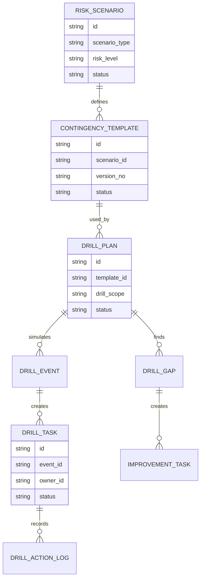
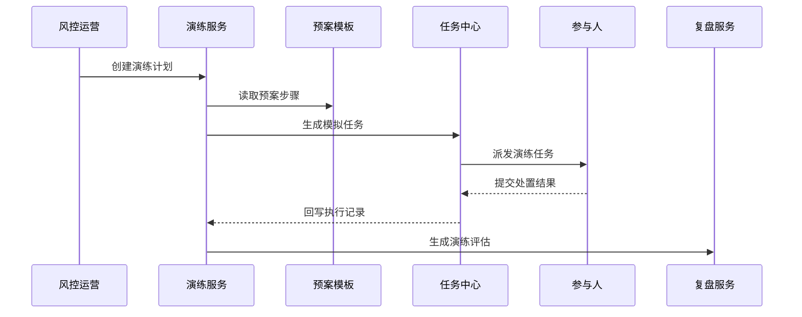
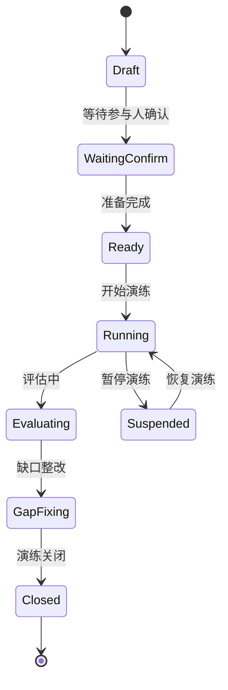
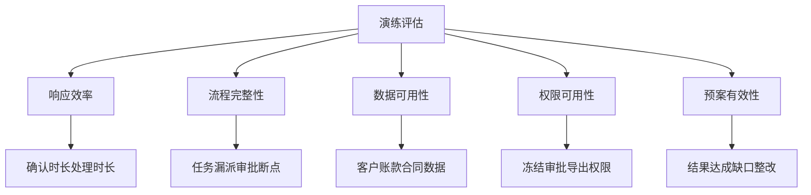

# 销售风险预案演练项目案例

## 适合谁看

- 想理解销售风险预案如何从纸面规则变成可演练、可复盘系统能力的前端开发者。
- 正在做 CRM、回款风控、客户授信、销售运营或应收管理系统的团队。
- 希望在真实风险爆发前，提前验证处置链路、人员响应和策略有效性的项目负责人。

## 业务目标

销售风险处置复盘关注“发生后怎么总结”，销售风险预案演练关注“发生前怎么准备”。它要把客户逾期、现金流缺口、集中坏账、关键客户流失、区域风险爆发等场景提前做成预案，并通过演练验证：

- 风险信号触发后，系统能不能快速识别风险级别。
- 责任人、销售主管、财务、法务和风控是否知道各自要做什么。
- 催收、额度冻结、合同重谈、客户沟通、专项审批是否能按时完成。
- 预案是否存在缺口，例如通知不到人、权限不足、数据不准、审批过慢。

这个模块的核心价值是把风险管理从“临场反应”升级为“提前排练”。

## 预案演练链路

演练不是发一份通知让大家看文档，而是模拟真实风险触发后的任务、通知、审批、处置和复盘全过程。

## 核心概念

| 概念 | 说明 |
| --- | --- |
| 风险场景 | 可演练的风险类型，例如大客户逾期、区域集中坏账、回款断档。 |
| 预案模板 | 预先定义的处置步骤、角色职责、时限和升级规则。 |
| 演练计划 | 某一次演练的范围、时间、参与人、模拟数据和评估指标。 |
| 模拟事件 | 演练时生成的虚拟风险事件，不影响真实客户和真实账务。 |
| 演练任务 | 系统派发给参与人的动作，例如确认客户情况、提交沟通记录、审批额度冻结。 |
| 演练缺口 | 演练中发现的问题，例如响应超时、流程断点、权限不足、数据缺失。 |

## 数据模型

演练数据要和真实风险数据隔离。推荐在字段上标记 `is_drill` 或单独建演练表，避免模拟任务误触发真实催收、冻结和客户通知。

## 推荐表结构

| 表 | 作用 | 关键字段 |
| --- | --- | --- |
| `risk_scenario` | 保存风险场景 | `scenario_type`、`risk_level`、`description`、`enabled` |
| `contingency_template` | 保存预案模板 | `scenario_id`、`version_no`、`steps`、`status` |
| `drill_plan` | 保存演练计划 | `template_id`、`drill_scope`、`start_at`、`end_at`、`status` |
| `drill_participant` | 保存参与人 | `drill_plan_id`、`user_id`、`role_code`、`confirmed_at` |
| `drill_event` | 保存模拟风险事件 | `drill_plan_id`、`mock_customer_id`、`risk_score`、`triggered_at` |
| `drill_task` | 保存演练任务 | `event_id`、`task_type`、`owner_id`、`deadline`、`status` |
| `drill_gap` | 保存演练缺口 | `drill_plan_id`、`gap_type`、`severity`、`owner_id`、`status` |

## 演练执行流程

演练任务要明确标识“演练”。界面上可以使用明显标签，避免参与人误以为是真实客户风险事件。

## 演练状态设计

演练状态要能支持暂停。实际企业演练可能跨部门、跨区域，遇到生产或销售高峰时需要暂停，而不是只能取消。

## 演练评估指标拆解

不要只评价“是否完成演练”。真正有价值的是发现预案哪里不可靠，并能转成整改任务。

## 前端页面拆分

| 页面 | 核心内容 | 设计重点 |
| --- | --- | --- |
| 风险场景库 | 场景类型、风险等级、适用范围、启用状态 | 场景要用业务语言，避免只有技术枚举。 |
| 预案模板 | 处置步骤、角色职责、时限、升级规则 | 步骤要可视化，便于业务人员理解。 |
| 演练计划 | 范围、时间、参与人、模拟数据、状态 | 清楚区分真实数据和模拟数据。 |
| 演练工作台 | 待办任务、模拟事件、提交记录、超时提醒 | 参与人只看自己该做的事。 |
| 演练复盘 | 指标、时间线、缺口、整改任务、版本建议 | 复盘结论要能回写预案版本。 |

## 接口拆分建议

| 接口 | 作用 |
| --- | --- |
| `GET /api/sales-risk-scenarios` | 查询风险场景库。 |
| `GET /api/sales-contingency-templates` | 查询预案模板。 |
| `POST /api/sales-risk-drills` | 创建演练计划。 |
| `GET /api/sales-risk-drills/:id` | 查询演练详情。 |
| `POST /api/sales-risk-drills/:id/start` | 开始演练。 |
| `GET /api/sales-risk-drills/:id/tasks` | 查询演练任务。 |
| `POST /api/sales-risk-drill-tasks/:id/submit` | 提交演练任务结果。 |
| `POST /api/sales-risk-drills/:id/gaps` | 提交演练缺口。 |

## 实际项目常见问题

### 1. 演练误触发真实业务动作

模拟风险事件如果复用真实动作服务，可能误发客户通知或冻结额度。解决方式是演练链路必须有隔离标识，外部动作默认进入模拟模式。

### 2. 只有流程演示，没有评估指标

演练结束后只写“完成”，无法改进预案。解决方式是预先定义响应时长、任务完成率、缺口数量、关键数据可用率等指标。

### 3. 参与人不知道自己的职责

预案写得很完整，但参与人只看到大段文字。解决方式是按角色拆任务，把职责转成待办和时限。

### 4. 演练缺口没有整改闭环

发现权限不足、审批断点后没有后续跟进。解决方式是缺口必须生成整改任务，并关联下次演练验证结果。

### 5. 预案版本没有升级

演练发现的问题没有回到预案模板，下一次还是同样错误。解决方式是演练复盘可以生成预案版本变更建议。

## 权限与审计

| 权限 | 说明 |
| --- | --- |
| 管理场景库 | 可以新增、停用风险场景。 |
| 管理预案模板 | 可以编辑预案步骤和角色职责。 |
| 创建演练 | 可以创建演练计划和选择参与人。 |
| 执行演练任务 | 可以处理分配给自己的演练任务。 |
| 关闭演练 | 可以确认复盘结论和整改计划。 |

演练数据也要审计。特别是演练过程中的权限验证、任务提交、模拟动作调用和缺口关闭，都要能追溯。

## 验收清单

- 能维护销售风险场景和预案模板。
- 能创建演练计划并选择范围、时间和参与人。
- 能生成模拟风险事件和演练任务。
- 演练任务不会触发真实客户通知、额度冻结或财务动作。
- 能记录任务执行过程、响应时长和提交证据。
- 能生成演练缺口和整改任务。
- 能把复盘结论转成预案版本优化建议。

## 下一步学习

- [销售风险处置复盘项目案例](/projects/sales-risk-disposal-review-case)
- [销售风险动作编排项目案例](/projects/sales-risk-action-orchestration-case)
- [客户回款风险预测项目案例](/projects/customer-payment-risk-prediction-case)
