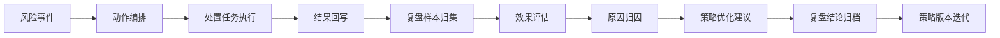
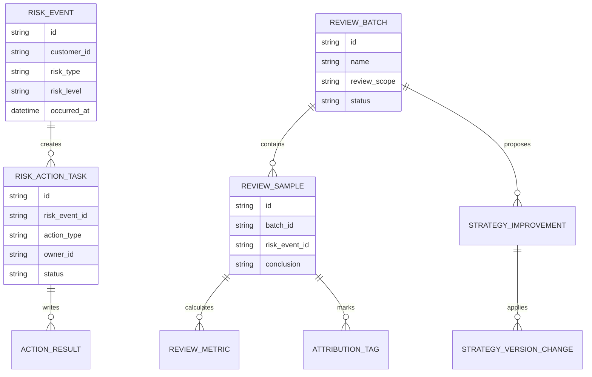
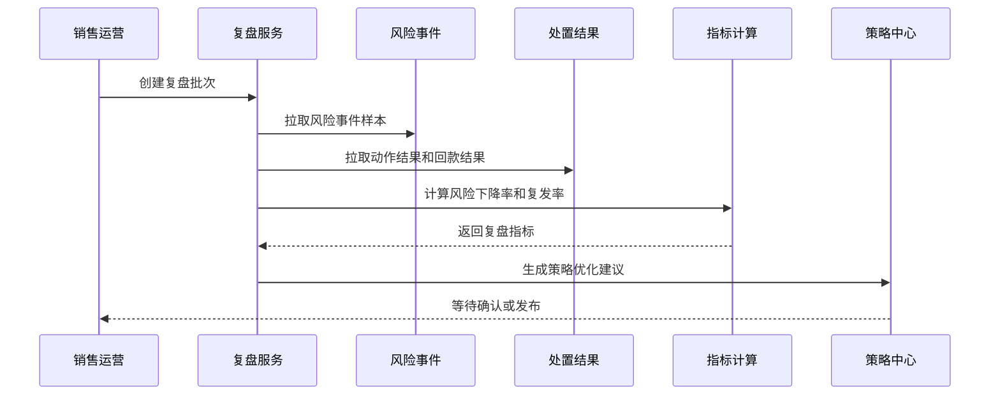
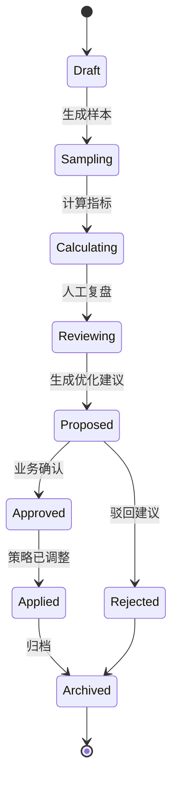
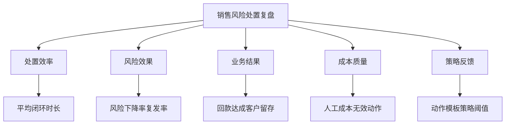

# 销售风险处置复盘项目案例

## 适合谁看

- 想理解销售风险处置后如何复盘效果、沉淀策略和优化动作的前端开发者。
- 正在做 CRM、应收回款、授信风控、催收管理或销售运营系统的团队。
- 希望把“风险任务做完了”升级为“风险是否真的下降、动作是否有效、策略是否要调整”的项目负责人。

## 业务目标

销售风险动作编排能把风险信号转成处置任务，但任务执行完成不代表风险已经解决。销售风险处置复盘要回答：

- 哪些风险动作真正降低了逾期、坏账或客户流失？
- 哪些动作只是完成了流程，但没有带来结果？
- 哪些客户、销售、区域或产品线的风险反复出现？
- 哪些策略需要升级、降级、废弃或转成人工专项？

这个模块的价值是把处置结果回写到风险策略，让系统越来越懂“什么场景下用什么动作更有效”。

## 处置复盘链路

复盘不要只看任务完成率。一个销售打了电话、发了提醒、提交了承诺回款日期，只能说明动作被执行；真正要看的是客户是否按承诺回款、风险等级是否下降、后续是否再次触发风险。

## 核心概念

| 概念 | 说明 |
| --- | --- |
| 复盘批次 | 按时间、策略、区域或活动生成的一组风险处置样本。 |
| 处置结果 | 任务完成、客户响应、承诺回款、实际回款、授信调整等结果。 |
| 效果指标 | 风险下降率、回款达成率、复发率、处置成本、平均闭环时长。 |
| 归因标签 | 用于解释处置有效或无效的原因，例如客户资金紧张、销售跟进不足、策略动作不匹配。 |
| 策略建议 | 根据复盘结果生成的规则调整、动作模板优化或人工专项建议。 |
| 复盘结论 | 最终沉淀的业务判断，后续审计和策略迭代都要能追溯。 |

## 数据模型

这个模型把“风险事件、动作任务、结果回写、复盘批次、策略优化”拆开。拆开的好处是：复盘可以跨策略、跨周期、跨组织维度统计，而不会被某一个任务表绑定死。

## 推荐表结构

| 表 | 作用 | 关键字段 |
| --- | --- | --- |
| `risk_event` | 保存销售风险事件 | `customer_id`、`risk_type`、`risk_level`、`risk_score`、`occurred_at` |
| `risk_action_task` | 保存处置动作任务 | `risk_event_id`、`action_type`、`owner_id`、`status`、`deadline` |
| `action_result` | 保存处置结果 | `task_id`、`result_type`、`result_value`、`proof_file_id`、`written_at` |
| `review_batch` | 保存复盘批次 | `name`、`review_scope`、`start_date`、`end_date`、`status` |
| `review_sample` | 保存复盘样本 | `batch_id`、`risk_event_id`、`strategy_id`、`conclusion` |
| `review_metric` | 保存复盘指标 | `sample_id`、`metric_code`、`metric_value`、`baseline_value` |
| `attribution_tag` | 保存归因标签 | `sample_id`、`tag_code`、`tag_name`、`confidence` |
| `strategy_improvement` | 保存策略优化建议 | `batch_id`、`strategy_id`、`proposal_type`、`priority`、`status` |

## 复盘流程

复盘批次建议异步生成。实际项目里样本可能涉及 CRM、应收、合同、回款、授信多个系统，同步接口会很慢，也容易因为一个系统超时导致整次复盘失败。

## 复盘状态设计

不要让复盘批次只有“已完成”一个状态。复盘失败时必须知道卡在样本生成、指标计算、人工复核还是策略发布，否则排查成本很高。

## 复盘指标拆解

指标要分层看。只看回款达成率会忽略高成本动作，只看风险下降率会忽略销售体验，只看完成率会掩盖处置无效。

## 前端页面拆分

| 页面 | 核心内容 | 设计重点 |
| --- | --- | --- |
| 复盘批次列表 | 批次范围、样本数、状态、负责人、结论 | 能快速判断哪些批次未完成或有高风险结论。 |
| 复盘详情 | 样本范围、指标概览、趋势对比、归因分布 | 指标要能下钻到样本和任务。 |
| 样本明细 | 风险事件、动作链路、客户响应、回款结果 | 方便业务人员判断单个样本是否合理。 |
| 归因分析 | 无效动作、复发原因、客户/销售/区域维度 | 不要只展示标签，要能看到证据。 |
| 策略建议 | 建议类型、影响范围、风险等级、审批状态 | 策略调整前必须能看影响面。 |

## 接口拆分建议

| 接口 | 作用 |
| --- | --- |
| `GET /api/sales-risk-reviews` | 查询复盘批次列表。 |
| `POST /api/sales-risk-reviews` | 创建复盘批次。 |
| `GET /api/sales-risk-reviews/:id` | 查询复盘详情。 |
| `POST /api/sales-risk-reviews/:id/generate-samples` | 生成复盘样本。 |
| `GET /api/sales-risk-reviews/:id/samples` | 查询样本明细。 |
| `GET /api/sales-risk-reviews/:id/metrics` | 查询复盘指标。 |
| `POST /api/sales-risk-reviews/:id/conclusions` | 提交复盘结论。 |
| `POST /api/sales-risk-reviews/:id/strategy-proposals` | 生成策略优化建议。 |

## 实际项目常见问题

### 1. 只看任务完成率，误以为处置有效

任务完成率只能证明动作被执行，不能证明风险下降。解决方式是把回款、逾期、客户响应、风险复发一起纳入复盘指标。

### 2. 样本口径不稳定

同一个复盘批次如果每次刷新都重新取样，指标会前后不一致。解决方式是生成复盘样本快照，批次创建后样本范围保持稳定。

### 3. 归因标签太随意

如果归因标签允许随便输入，后续统计会变成一堆近义词。解决方式是维护标签字典，同时保留补充说明字段。

### 4. 策略建议直接自动发布

复盘建议可能影响客户额度、催收频率和销售动作，不能绕过审批。解决方式是把建议和发布拆开，建议先进入待评审状态。

### 5. 缺少负样本

只复盘成功案例会导致策略越来越乐观。复盘批次必须包含失败、复发、无响应和人工兜底样本。

## 权限与审计

| 权限 | 说明 |
| --- | --- |
| 查看复盘 | 可以查看批次和指标，但不一定能看客户敏感字段。 |
| 查看样本明细 | 可以查看风险事件、处置动作和回款结果。 |
| 提交结论 | 可以写入复盘结论和归因标签。 |
| 生成策略建议 | 可以把复盘结果转成策略优化建议。 |
| 发布策略变更 | 可以把已审批建议应用到策略版本。 |

所有策略建议、结论修改、样本重新生成都要写审计日志。尤其是样本重新生成，必须记录原因，否则后续指标变化无法解释。

## 验收清单

- 能按时间、策略、区域和风险类型创建复盘批次。
- 能生成稳定的复盘样本快照。
- 能查看处置动作、客户响应、回款结果和风险变化。
- 能计算风险下降率、复发率、回款达成率和平均闭环时长。
- 能为样本打归因标签并查看标签分布。
- 能生成策略优化建议，但不能绕过审批直接发布。
- 能追溯复盘结论、样本变化和策略变更记录。

## 下一步学习

- [销售风险动作编排项目案例](/projects/sales-risk-action-orchestration-case)
- [客户回款风险预测项目案例](/projects/customer-payment-risk-prediction-case)
- [销售回款策略模拟项目案例](/projects/sales-collection-strategy-simulation-case)
