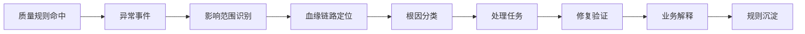
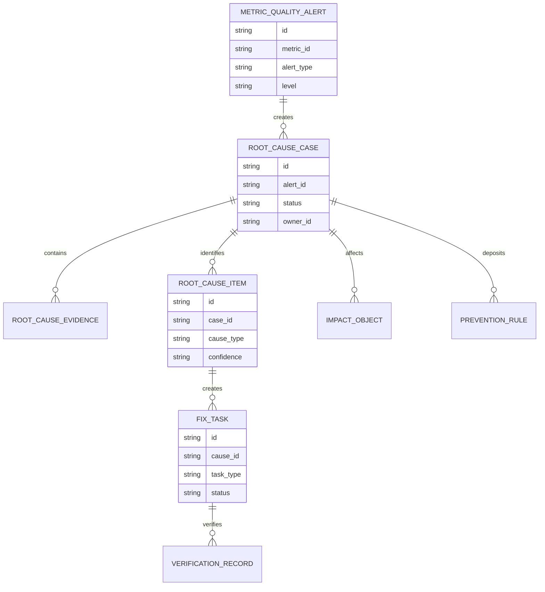
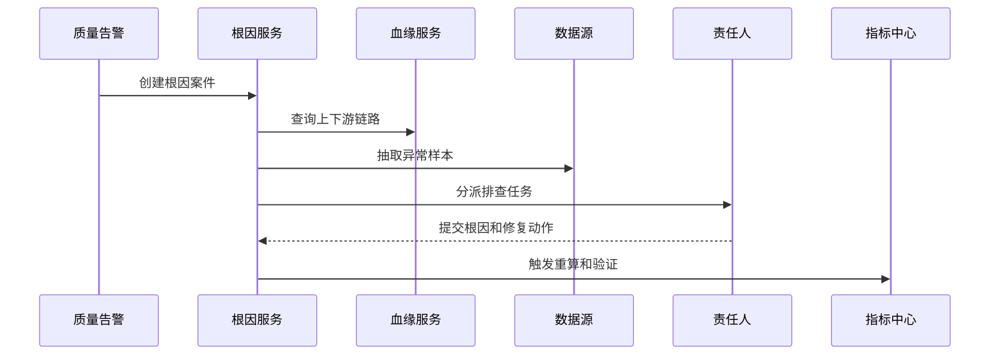
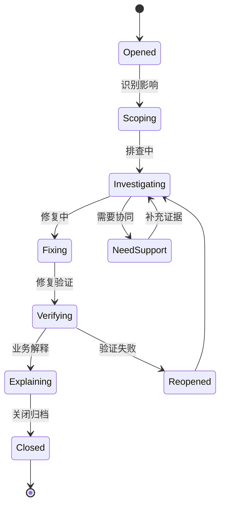
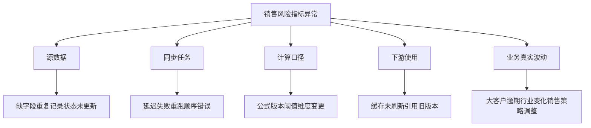

# 销售风险指标异常根因项目案例

## 适合谁看

- 想理解销售风险指标异常后如何定位原因、分派处理和防止复发的前端开发者。
- 正在做 CRM、指标平台、销售风控、经营分析、数据质量或监控告警系统的团队。
- 希望避免“看板报警很多，但没人知道是数据错、口径错、策略错还是业务真的变差”的项目负责人。

## 业务目标

销售风险指标血缘审计能告诉我们指标从哪里来、被谁使用，但当指标出现突增、突降、空值、延迟或和其他指标冲突时，还需要一套根因定位机制。

指标异常根因要解决：

- 异常是源数据问题、同步问题、计算问题、口径变更还是业务真实波动。
- 异常影响了哪些客户、团队、看板、策略和审批。
- 谁负责确认异常，谁负责修复，谁负责对业务解释。
- 异常处理后如何验证指标恢复可信。
- 同类异常如何沉淀为规则，避免每次都从零排查。

## 异常根因链路

异常根因不是只关闭告警，而是要证明指标重新可信，并让业务方知道这段时间的数据是否还能使用。

## 核心概念

| 概念 | 说明 |
| --- | --- |
| 异常事件 | 指标质量规则触发后的业务事件，例如空值、延迟、突增、突降、重复或冲突。 |
| 根因分类 | 把异常归因到源系统、同步任务、计算公式、口径版本、人工补数或真实业务变化。 |
| 影响范围 | 被异常指标影响的客户、团队、看板、策略、审批和导出任务。 |
| 排查证据 | 血缘节点状态、源数据样本、任务日志、公式版本、历史趋势和业务日历。 |
| 修复验证 | 处理后重新计算、回补数据、比较样本和确认下游恢复。 |
| 复发规则 | 从根因中沉淀新的质量规则、监控阈值或变更审批要求。 |

## 数据模型

根因项可以有多个。一个指标异常可能同时包含源数据延迟和计算任务失败，不能强行只填一个原因。

## 推荐表结构

| 表 | 作用 | 关键字段 |
| --- | --- | --- |
| `metric_quality_alert` | 保存指标质量告警 | `metric_id`、`alert_type`、`level`、`detected_at` |
| `root_cause_case` | 保存根因案件 | `alert_id`、`owner_id`、`status`、`priority` |
| `root_cause_evidence` | 保存排查证据 | `case_id`、`evidence_type`、`source_ref`、`summary` |
| `root_cause_item` | 保存根因结论 | `case_id`、`cause_type`、`confidence`、`responsible_team` |
| `impact_object` | 保存影响对象 | `case_id`、`object_type`、`object_id`、`impact_level` |
| `fix_task` | 保存修复任务 | `cause_id`、`task_type`、`owner_id`、`due_at` |
| `verification_record` | 保存验证结果 | `task_id`、`verify_type`、`before_value`、`after_value` |
| `prevention_rule` | 保存预防规则 | `case_id`、`rule_type`、`enabled`、`owner_id` |

## 根因定位流程

根因系统要自动收集第一批证据，例如血缘链路、任务日志和样本差异。否则处理人会把时间花在重复查资料上。

## 根因案件状态设计

验证失败要允许重新打开，否则异常会被错误关闭，后续业务继续使用不可信指标。

## 根因类型拆解

前端应让用户先选根因大类，再展示对应证据和处理动作，避免所有字段堆在一张表里。

## 前端页面拆分

| 页面 | 核心内容 | 设计重点 |
| --- | --- | --- |
| 异常案件列表 | 指标、异常类型、风险等级、影响范围、状态、负责人 | 优先处理影响策略和审批的异常。 |
| 根因详情 | 趋势图、样本、血缘链路、证据、根因结论 | 让处理人看到完整排查路径。 |
| 影响范围 | 受影响看板、策略、客户、团队和导出记录 | 方便业务解释和修复优先级排序。 |
| 修复任务 | 数据回补、任务重跑、公式修正、缓存刷新 | 每个根因都要有可执行动作。 |
| 预防规则 | 新增质量规则、监控阈值、变更审批要求 | 把一次事故变成长期改进。 |

## 接口拆分建议

| 接口 | 作用 |
| --- | --- |
| `GET /api/sales-risk-metric-root-cases` | 查询根因案件列表。 |
| `POST /api/sales-risk-metric-root-cases` | 从告警创建根因案件。 |
| `GET /api/sales-risk-metric-root-cases/:id` | 查询根因详情。 |
| `POST /api/sales-risk-metric-root-cases/:id/evidence` | 补充排查证据。 |
| `POST /api/sales-risk-metric-root-cases/:id/causes` | 提交根因结论。 |
| `POST /api/sales-risk-metric-root-cases/:id/fix-tasks` | 创建修复任务。 |
| `POST /api/sales-risk-metric-root-cases/:id/verify` | 提交修复验证。 |
| `POST /api/sales-risk-metric-root-cases/:id/prevention-rules` | 沉淀预防规则。 |

## 实际项目常见问题

### 1. 告警太多，处理人只会关闭

同一指标可能连续触发多条告警。解决方式是按指标、时间窗口和根因相似度聚合为根因案件。

### 2. 只修了数据，没有解释影响

业务已经用异常指标做了审批或预警。解决方式是根因案件必须输出影响范围和业务解释。

### 3. 根因结论没有证据

处理人直接填“数据延迟”，后续复盘无法验证。解决方式是根因结论必须关联日志、样本或血缘节点证据。

### 4. 修复后没有验证

任务重跑了，但指标是否恢复不知道。解决方式是修复任务关闭前必须生成验证记录。

### 5. 同类异常反复出现

每次都靠人工排查。解决方式是把根因转成质量规则、监控阈值或发布前检查项。

## 权限与审计

| 权限 | 说明 |
| --- | --- |
| 查看根因案件 | 可以查看指标异常和影响范围。 |
| 提交证据 | 可以上传或关联排查证据。 |
| 确认根因 | 可以提交根因分类和责任团队。 |
| 关闭案件 | 可以在验证通过后关闭异常。 |
| 管理预防规则 | 可以把根因沉淀为规则。 |

根因结论、责任团队、修复动作、验证结果和业务解释都要保留审计记录。

## 验收清单

- 能从指标质量告警创建根因案件。
- 能展示异常趋势、影响范围和血缘证据。
- 能按根因类型归类并绑定证据。
- 能把根因拆成数据、同步、计算、使用和业务波动。
- 能生成修复任务并验证指标恢复。
- 能输出业务解释，说明异常期间数据是否可用。
- 能沉淀预防规则，降低同类异常复发。

## 下一步学习

- [销售风险指标血缘审计项目案例](/projects/sales-risk-metric-lineage-audit-case)
- [销售风险指标治理项目案例](/projects/sales-risk-metric-governance-case)
- [数据质量专项项目案例](/projects/data-quality-special-case)
