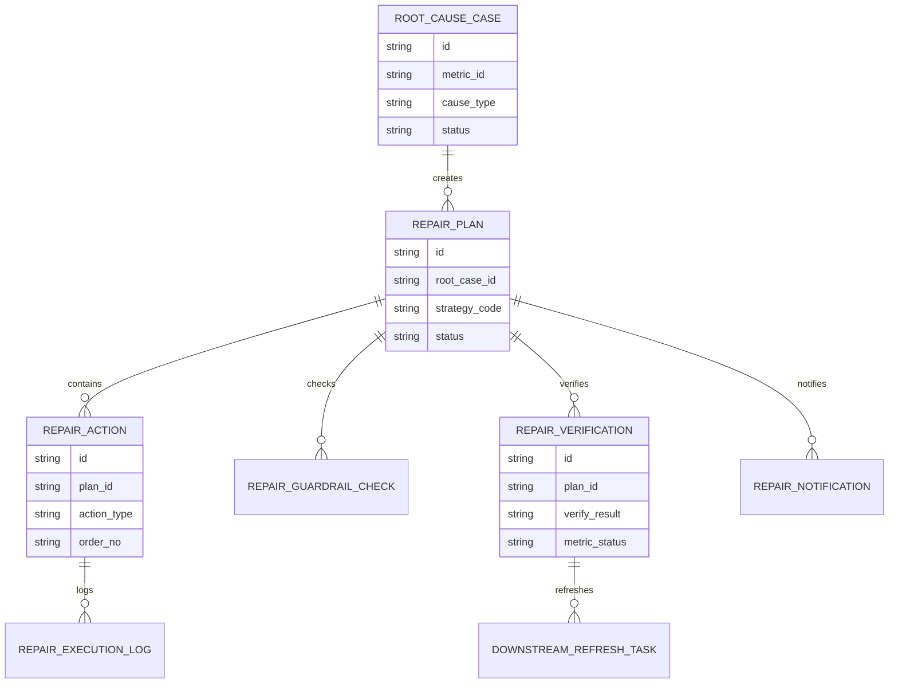
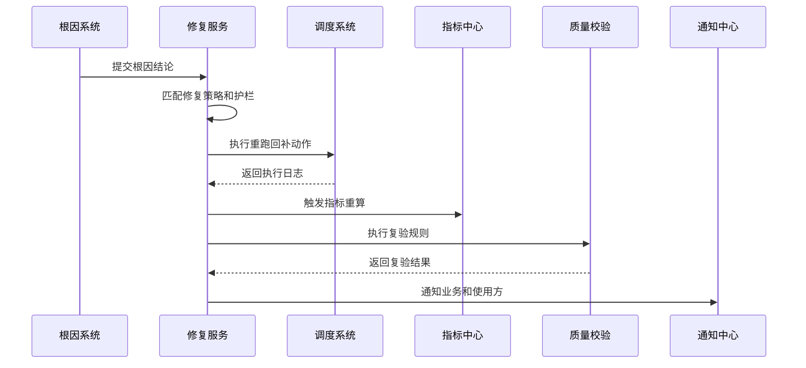
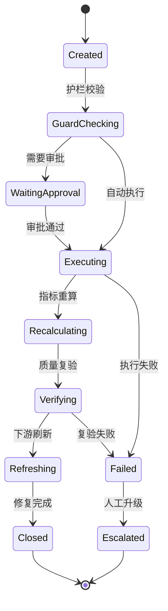
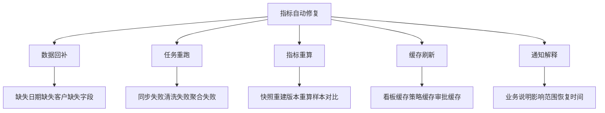

# 销售风险指标自动修复项目案例

## 适合谁看

- 想理解销售风险指标异常后如何自动重跑、回补、校验和恢复可信的前端开发者。
- 正在做指标平台、销售风控、CRM、数据质量、任务调度或经营分析系统的团队。
- 希望避免“异常已经定位出来，但修复还靠人工跑脚本，恢复慢且容易二次出错”的项目负责人。

## 业务目标

销售风险指标异常根因能定位问题来源，但很多异常的处理动作是可标准化的，例如同步任务失败后重跑、源数据延迟后回补、缓存未刷新后清理、指标快照缺失后重新计算。自动修复的目标不是把所有问题交给机器，而是把高频、低风险、可验证的修复动作自动化。

指标自动修复要解决：

- 哪些异常可以自动修复，哪些必须人工确认。
- 自动修复前如何判断影响范围和风险等级。
- 修复动作如何串联重跑、回补、重算、刷新和通知。
- 修复后如何验证指标恢复，避免“任务执行了但数据仍不可信”。
- 自动修复失败时如何回退、升级和保留证据。

## 自动修复链路

自动修复必须以根因结论为前提。没有根因就直接修复，很容易把真实业务波动误处理成数据错误。

## 核心概念

| 概念 | 说明 |
| --- | --- |
| 修复策略 | 针对某类根因配置的动作模板，例如重跑任务、回补数据、刷新缓存或切换口径版本。 |
| 修复前校验 | 判断异常是否允许自动处理，例如影响金额、指标等级、审批状态和业务冻结窗口。 |
| 修复动作 | 实际执行的任务，可以是同步重跑、指标重算、快照补齐、下游刷新或通知。 |
| 复验规则 | 修复后再次执行的质量规则，用于证明指标恢复可信。 |
| 回退方案 | 修复失败或修复后指标更异常时的撤销、冻结和人工升级机制。 |
| 修复证据 | 自动修复的输入、动作、日志、结果和复验记录。 |

## 数据模型

修复计划和修复动作要分开。一个计划可能包含多个动作，例如先回补源数据，再重算指标，再刷新策略缓存。

## 推荐表结构

| 表 | 作用 | 关键字段 |
| --- | --- | --- |
| `repair_strategy` | 保存修复策略模板 | `strategy_code`、`cause_type`、`risk_level`、`enabled` |
| `repair_plan` | 保存修复计划 | `root_case_id`、`strategy_code`、`status`、`owner_id` |
| `repair_guardrail_check` | 保存护栏校验 | `plan_id`、`check_type`、`result`、`block_reason` |
| `repair_action` | 保存修复动作 | `plan_id`、`action_type`、`order_no`、`config_json` |
| `repair_execution_log` | 保存执行日志 | `action_id`、`start_at`、`end_at`、`result` |
| `repair_verification` | 保存复验结果 | `plan_id`、`verify_result`、`before_value`、`after_value` |
| `downstream_refresh_task` | 保存下游刷新任务 | `verification_id`、`scene`、`target_id`、`status` |
| `repair_notification` | 保存通知记录 | `plan_id`、`receiver_id`、`message_type`、`sent_at` |

## 自动修复执行流程

自动修复链路里最重要的是复验。只有复验通过，才能恢复指标的可信状态。

## 修复计划状态设计

有些自动修复需要审批，例如会影响已发布经营看板或会触发策略重新计算的指标。

## 修复动作拆解

前端页面要能展示每个动作的输入、输出和日志，不能只显示“修复中”。

## 前端页面拆分

| 页面 | 核心内容 | 设计重点 |
| --- | --- | --- |
| 修复计划列表 | 指标、根因、策略、风险等级、状态、负责人 | 优先显示自动失败和影响大的计划。 |
| 修复计划详情 | 根因证据、护栏结果、动作链、执行日志、复验结果 | 让用户看懂系统为什么这样修。 |
| 策略配置 | 根因类型、动作模板、审批条件、风险阈值 | 支持低风险自动化，高风险人工确认。 |
| 复验结果 | 修复前后数值、质量规则、样本差异、下游状态 | 用数据证明指标恢复可信。 |
| 通知记录 | 业务解释、影响范围、接收人、确认状态 | 修复后要让使用方知道是否可继续使用。 |

## 接口拆分建议

| 接口 | 作用 |
| --- | --- |
| `GET /api/sales-risk-metric-repair-plans` | 查询修复计划列表。 |
| `POST /api/sales-risk-metric-repair-plans` | 从根因案件创建修复计划。 |
| `GET /api/sales-risk-metric-repair-plans/:id` | 查询修复计划详情。 |
| `POST /api/sales-risk-metric-repair-plans/:id/execute` | 执行自动修复。 |
| `POST /api/sales-risk-metric-repair-plans/:id/approve` | 审批高风险修复。 |
| `POST /api/sales-risk-metric-repair-plans/:id/verify` | 执行修复复验。 |
| `POST /api/sales-risk-metric-repair-plans/:id/refresh-downstream` | 刷新下游使用方。 |
| `POST /api/sales-risk-metric-repair-plans/:id/escalate` | 修复失败后人工升级。 |

## 实际项目常见问题

### 1. 把所有异常都自动修复

真实业务波动也被回补或重算，导致风险被掩盖。解决方式是只有明确根因且命中低风险策略时才自动修复。

### 2. 任务执行成功但指标仍然异常

调度系统返回成功不代表指标恢复。解决方式是必须执行指标复验和样本对比。

### 3. 下游没有刷新

指标修好了，但看板、策略或审批还在用旧缓存。解决方式是修复计划要包含下游刷新任务。

### 4. 自动修复没有审批边界

高价值客户或高金额指标被自动重算，影响经营决策。解决方式是配置护栏和审批条件。

### 5. 修复后业务方不知道

业务不清楚异常期间的数据是否可用。解决方式是自动生成影响说明和恢复通知。

## 权限与审计

| 权限 | 说明 |
| --- | --- |
| 查看修复计划 | 可以查看自动修复过程和复验结果。 |
| 配置修复策略 | 可以维护根因到动作的映射。 |
| 审批高风险修复 | 可以批准影响较大的自动修复。 |
| 手动执行修复 | 可以人工触发修复计划。 |
| 人工升级 | 可以把失败计划转交处理人。 |

自动修复涉及数据回补和指标重算，策略配置、护栏判断、执行动作、复验结果和通知都必须留痕。

## 验收清单

- 能从根因案件创建自动修复计划。
- 能按根因类型匹配修复策略。
- 能执行护栏校验并阻断高风险自动修复。
- 能串联数据回补、任务重跑、指标重算和缓存刷新。
- 能执行复验规则并判断指标是否恢复可信。
- 能在失败时自动升级人工处理。
- 能向下游使用方发送影响说明和恢复通知。

## 下一步学习

- [销售风险指标异常根因项目案例](/projects/sales-risk-metric-anomaly-root-cause-case)
- [销售风险指标血缘审计项目案例](/projects/sales-risk-metric-lineage-audit-case)
- [任务调度项目案例](/projects/task-scheduler-case)
