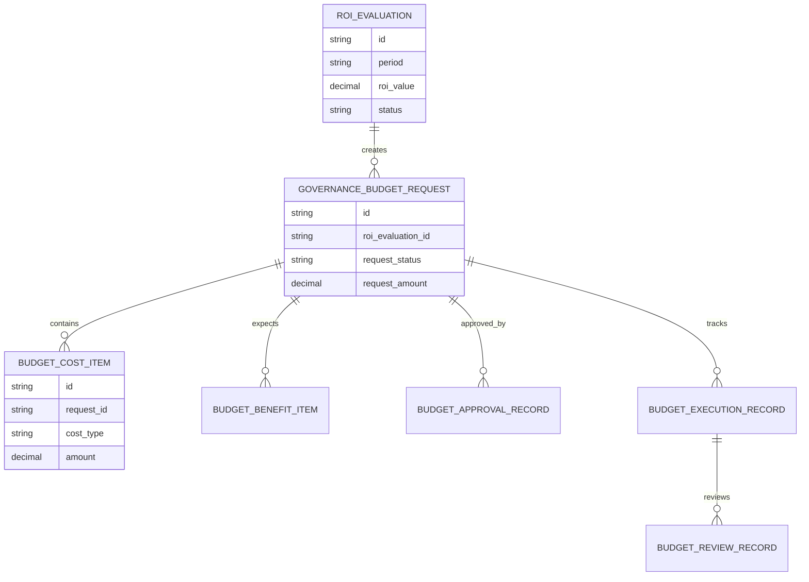
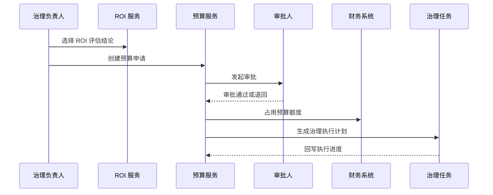
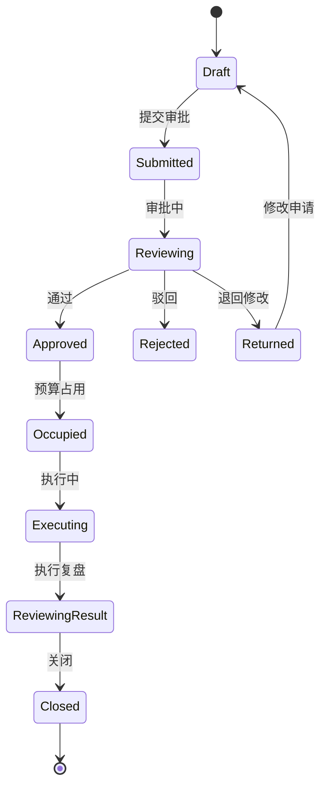
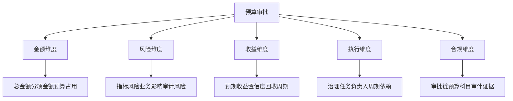

# 销售风险指标治理预算审批项目案例

## 适合谁看

- 想理解指标治理 ROI 之后，如何把预算申请、审批和执行闭环落到系统里的前端开发者。
- 正在做销售风控、指标平台、数据治理、预算管理、经营分析或管理驾驶舱的团队。
- 希望避免“ROI 评估证明了价值，但预算申请仍靠线下表格和会议推进”的项目负责人。

## 业务目标

销售风险指标治理成本收益评估能证明治理投入是否值得，但真正要获得资源，还需要把评估结论转成预算申请、审批、执行和复盘。预算审批要把治理目标、预算明细、预期收益、风险说明、优先级、审批意见和执行进度连接起来。

预算审批要解决：

- 哪些治理动作需要预算审批，哪些可以走常规运营成本。
- 预算申请如何引用 ROI 评估和指标风险证据。
- 审批人如何看懂投入、收益、风险和优先级。
- 预算通过后如何跟踪执行、核销和偏差。
- 预算执行结果如何回写治理 ROI 和下一轮计划。

## 预算审批链路

预算审批不是财务系统的孤立流程，它要服务于指标治理优先级和资源分配。

## 核心概念

| 概念 | 说明 |
| --- | --- |
| 预算申请 | 针对一组指标治理动作提出的资源申请。 |
| 预算明细 | 人力、系统、数据、外包、培训和运营投入的拆分。 |
| 预期收益 | 由 ROI 评估带出的风险降低、效率提升和审计节省。 |
| 审批矩阵 | 根据金额、风险等级、业务线和收益置信度决定审批链。 |
| 预算占用 | 审批通过后锁定预算额度，防止重复申请。 |
| 执行复盘 | 对比预算、实际成本、治理收益和偏差原因。 |

## 数据模型

预算申请要绑定 ROI 评估或风险证据，否则审批人很难判断为什么需要这笔钱。

## 推荐表结构

| 表 | 作用 | 关键字段 |
| --- | --- | --- |
| `governance_budget_request` | 保存预算申请 | `roi_evaluation_id`、`request_amount`、`request_status`、`owner_id` |
| `budget_cost_item` | 保存成本明细 | `request_id`、`cost_type`、`amount`、`use_purpose` |
| `budget_benefit_item` | 保存预期收益 | `request_id`、`benefit_type`、`expected_amount`、`confidence_level` |
| `budget_approval_record` | 保存审批记录 | `request_id`、`approver_role`、`approval_result`、`comment` |
| `budget_execution_record` | 保存执行记录 | `request_id`、`used_amount`、`progress`、`execution_status` |
| `budget_review_record` | 保存预算复盘 | `request_id`、`actual_cost`、`actual_benefit`、`deviation_reason` |

## 审批执行流程

审批通过后要立刻形成预算占用和执行计划，否则审批结论很容易悬空。

## 预算状态设计

驳回和退回要分开。驳回表示不支持预算，退回表示材料或口径需要补充。

## 审批维度拆解

审批页面应先展示决策摘要，再允许审批人展开成本和收益明细。

## 预算执行闭环

预算管理不能只到审批通过为止，真正的治理价值来自执行和复盘。

## 前端页面拆分

| 页面 | 核心内容 | 设计重点 |
| --- | --- | --- |
| 预算申请列表 | 指标范围、金额、ROI、状态、负责人 | 优先展示待审批和高金额申请。 |
| 申请详情 | ROI 结论、成本明细、收益证据、风险说明 | 让审批人快速判断是否值得投入。 |
| 审批工作台 | 待办、审批链、意见、退回原因 | 支持多角色审批。 |
| 执行跟踪 | 预算占用、实际花费、治理任务、进度 | 预算和任务联动展示。 |
| 预算复盘 | 预算偏差、实际收益、ROI 回写、下期建议 | 支持管理层复盘。 |

## 接口拆分建议

| 接口 | 作用 |
| --- | --- |
| `GET /api/sales-risk-metric-governance-budget-requests` | 查询预算申请。 |
| `POST /api/sales-risk-metric-governance-budget-requests` | 创建预算申请。 |
| `GET /api/sales-risk-metric-governance-budget-requests/:id` | 查询申请详情。 |
| `POST /api/sales-risk-metric-governance-budget-requests/:id/submit` | 提交审批。 |
| `POST /api/sales-risk-metric-governance-budget-requests/:id/approve` | 审批预算。 |
| `POST /api/sales-risk-metric-governance-budget-requests/:id/occupy` | 占用预算。 |
| `POST /api/sales-risk-metric-governance-budget-requests/:id/review` | 提交预算复盘。 |

## 实际项目常见问题

### 1. 预算申请没有 ROI 证据

审批人只看到金额，看不到为什么要花。解决方式是申请必须引用 ROI 评估或风险证据。

### 2. 收益过度乐观

预算容易通过，但执行后达不到预期。解决方式是收益项必须配置置信等级和证据来源。

### 3. 审批链固定

小额低风险和高额高风险走同一条链，效率低。解决方式是按金额、风险和业务线配置审批矩阵。

### 4. 预算通过后无人跟踪

审批完成后任务没有推进。解决方式是预算通过后自动生成治理执行计划。

### 5. 预算复盘没有回写

下一轮预算仍然从零开始解释。解决方式是执行复盘回写 ROI 和预算建议。

## 权限与审计

| 权限 | 说明 |
| --- | --- |
| 创建预算申请 | 可以基于 ROI 评估申请预算。 |
| 查看收益证据 | 可以查看成本收益和敏感指标。 |
| 审批预算 | 可以通过、退回或驳回申请。 |
| 占用预算 | 可以与财务系统同步额度。 |
| 提交复盘 | 可以维护实际成本和收益结果。 |

预算申请、成本收益明细、审批意见、预算占用、执行记录和复盘结论都要保留审计。

## 验收清单

- 能从 ROI 评估创建预算申请。
- 能维护成本明细和预期收益。
- 能按审批矩阵生成审批链。
- 能完成提交、退回、驳回和通过。
- 能在审批通过后占用预算并生成任务。
- 能跟踪实际成本和治理进度。
- 能复盘预算偏差并回写 ROI。

## 下一步学习

- [销售风险指标治理成本收益评估项目案例](/projects/sales-risk-metric-governance-cost-benefit-evaluation-case)
- [预算管理项目案例](/projects/budget-management-case)
- [销售风险指标治理运营看板项目案例](/projects/sales-risk-metric-governance-operations-dashboard-case)
