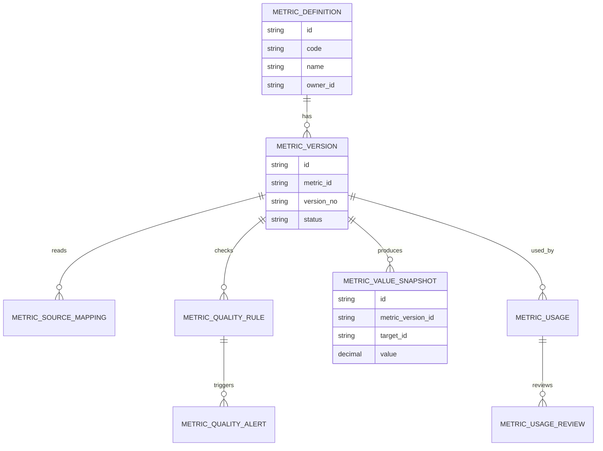
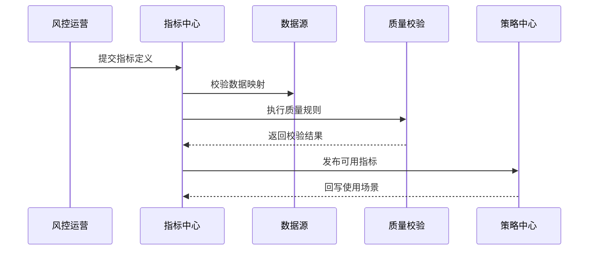
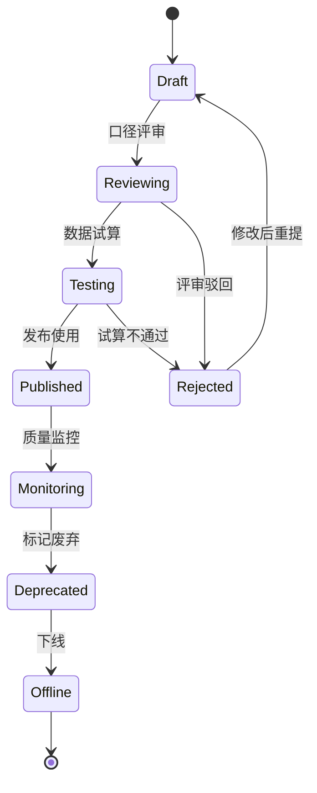
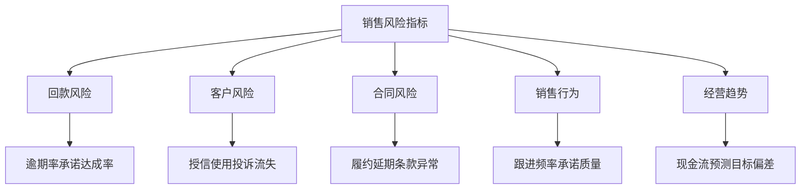

# 销售风险指标治理项目案例

## 适合谁看

- 想理解销售风险指标如何定义、计算、校验和治理的前端开发者。
- 正在做 CRM、应收风控、销售预测、客户授信或经营分析系统的团队。
- 希望避免“指标很多但口径不一致、看板不可信、策略无法解释”的项目负责人。

## 业务目标

销售风险动作编排、处置复盘和预案演练都依赖风险指标。如果指标口径不清楚，风险等级、处置优先级和策略效果都会失真。

销售风险指标治理要解决：

- 哪些指标可以代表销售风险。
- 指标从哪些系统取数，口径是否一致。
- 指标异常时谁来确认、修正和追溯。
- 指标版本变化后，历史看板和策略是否还能解释。
- 指标是否被错误使用，例如把销售主观评分当成强风控依据。

## 指标治理链路

指标治理不是单纯建一张指标表，而是把“定义、来源、计算、校验、使用、迭代”串成闭环。

## 核心概念

| 概念 | 说明 |
| --- | --- |
| 指标定义 | 指标名称、业务含义、计算公式、适用范围和责任人。 |
| 口径版本 | 同一个指标在不同时期的计算方式版本。 |
| 数据血缘 | 指标依赖的源表、字段、接口和加工任务。 |
| 质量规则 | 判断指标是否异常的规则，例如空值、突增、重复、延迟。 |
| 使用场景 | 指标被用于看板、预警、评分、策略、审批或复盘。 |
| 指标下线 | 指标不再可信或不再适用时的停用和替换流程。 |

## 数据模型

指标定义和指标版本要分开。版本化后，历史策略才能解释当时使用的是哪个口径。

## 推荐表结构

| 表 | 作用 | 关键字段 |
| --- | --- | --- |
| `metric_definition` | 保存指标基础信息 | `code`、`name`、`business_meaning`、`owner_id`、`status` |
| `metric_version` | 保存指标口径版本 | `metric_id`、`version_no`、`formula`、`effective_at`、`status` |
| `metric_source_mapping` | 保存数据来源 | `metric_version_id`、`source_system`、`source_field`、`transform_rule` |
| `metric_quality_rule` | 保存质量规则 | `metric_version_id`、`rule_type`、`threshold`、`enabled` |
| `metric_value_snapshot` | 保存指标快照 | `metric_version_id`、`target_type`、`target_id`、`value`、`stat_date` |
| `metric_usage` | 保存使用场景 | `metric_version_id`、`scene`、`business_id`、`usage_level` |
| `metric_quality_alert` | 保存质量异常 | `metric_id`、`rule_id`、`level`、`status`、`detected_at` |

## 指标发布流程

指标发布前必须有质量校验。否则一个延迟或空值指标可能直接触发错误预警。

## 指标状态设计

废弃和下线要分开。废弃表示不建议新场景使用，但历史场景还可能需要它。

## 指标分类拆解

指标分类能帮助用户理解风险来源，也能帮助策略设计者选择合适的指标组合。

## 前端页面拆分

| 页面 | 核心内容 | 设计重点 |
| --- | --- | --- |
| 指标目录 | 指标名称、分类、责任人、状态、使用场景 | 先让用户知道有哪些可信指标。 |
| 指标详情 | 业务含义、公式、来源、版本、质量规则 | 解释清楚“这个指标怎么算”。 |
| 指标试算 | 样本客户、计算结果、异常样本、差异对比 | 发布前验证口径是否合理。 |
| 质量告警 | 异常指标、影响场景、责任人、处理进度 | 告警要能追踪到使用场景。 |
| 使用审计 | 哪些策略、看板、审批使用了该指标 | 便于指标变更前评估影响。 |

## 接口拆分建议

| 接口 | 作用 |
| --- | --- |
| `GET /api/sales-risk-metrics` | 查询指标目录。 |
| `POST /api/sales-risk-metrics` | 创建指标定义。 |
| `GET /api/sales-risk-metrics/:id` | 查询指标详情。 |
| `POST /api/sales-risk-metrics/:id/versions` | 创建指标版本。 |
| `POST /api/sales-risk-metric-versions/:id/trial` | 执行指标试算。 |
| `POST /api/sales-risk-metric-versions/:id/publish` | 发布指标版本。 |
| `GET /api/sales-risk-metrics/:id/usages` | 查询指标使用场景。 |
| `GET /api/sales-risk-metric-alerts` | 查询指标质量异常。 |

## 实际项目常见问题

### 1. 指标名称相同但口径不同

不同团队都叫“逾期率”，但一个按金额算，一个按客户数算。解决方式是指标必须有唯一编码、业务解释和公式。

### 2. 指标变更没有版本

公式改了以后历史趋势突然变化。解决方式是指标口径版本化，并让看板展示当前使用版本。

### 3. 数据源延迟导致误报

回款到账数据晚到，系统误判客户逾期。解决方式是为指标配置数据时效规则和延迟保护窗口。

### 4. 指标被滥用

一个适合看板观察的指标被直接用于客户冻结。解决方式是为指标配置使用等级，区分观察、预警、审批和强控制。

### 5. 指标异常没人负责

发现指标异常后没人处理。解决方式是指标必须绑定业务 owner 和数据 owner，并生成质量处理任务。

## 权限与审计

| 权限 | 说明 |
| --- | --- |
| 创建指标 | 可以提交新指标定义。 |
| 评审口径 | 可以审核指标业务含义和公式。 |
| 发布版本 | 可以把试算通过的指标发布给策略使用。 |
| 查看使用场景 | 可以查看指标被哪些系统引用。 |
| 处理质量告警 | 可以确认、修正或关闭指标异常。 |

指标定义、公式、来源映射、版本发布和下线都必须写审计日志。

## 验收清单

- 能维护销售风险指标目录和分类。
- 能为指标配置公式、来源、责任人和使用等级。
- 能创建指标口径版本并执行试算。
- 能配置质量规则并生成质量告警。
- 能追踪指标被哪些看板、策略和审批使用。
- 能废弃或下线指标，并保留历史版本解释能力。
- 能审计指标变更、发布和质量异常处理记录。

## 下一步学习

- [销售风险预案演练项目案例](/projects/sales-risk-contingency-drill-case)
- [销售风险处置复盘项目案例](/projects/sales-risk-disposal-review-case)
- [客户回款风险预测项目案例](/projects/customer-payment-risk-prediction-case)
