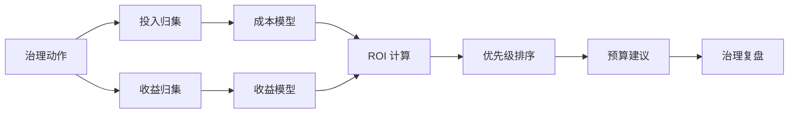
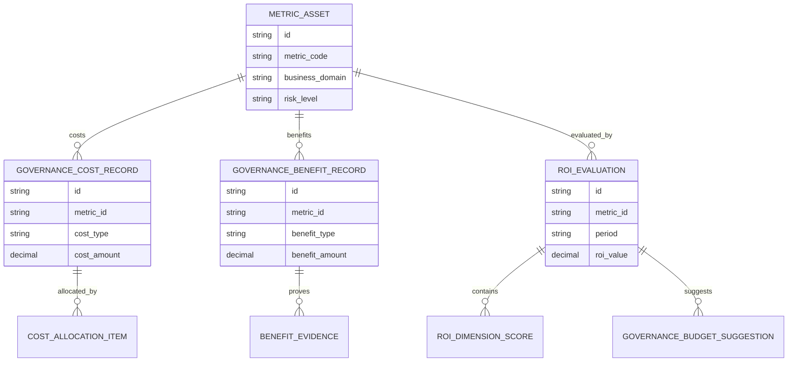
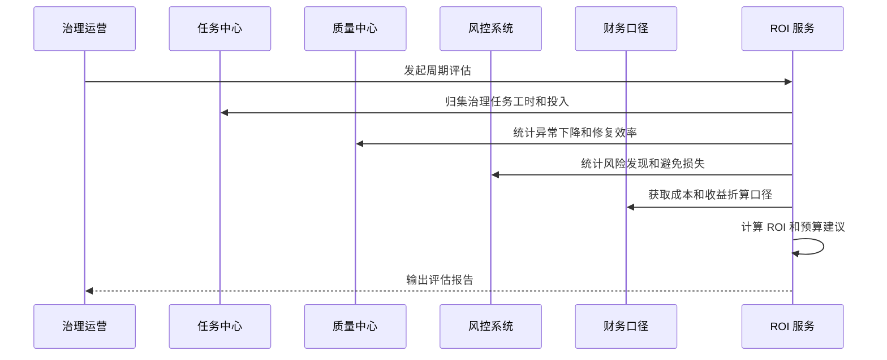
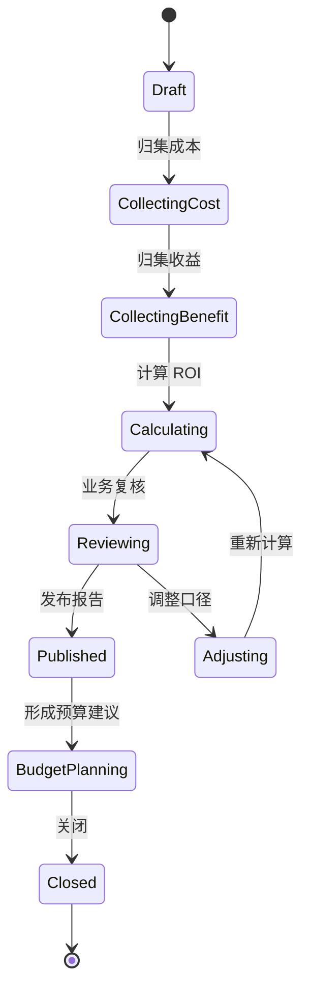
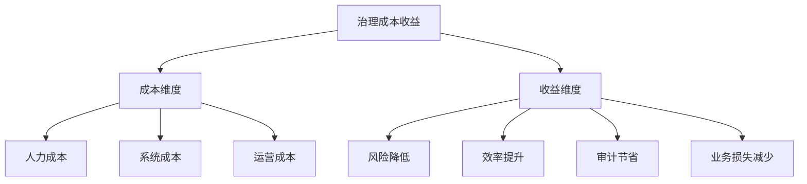
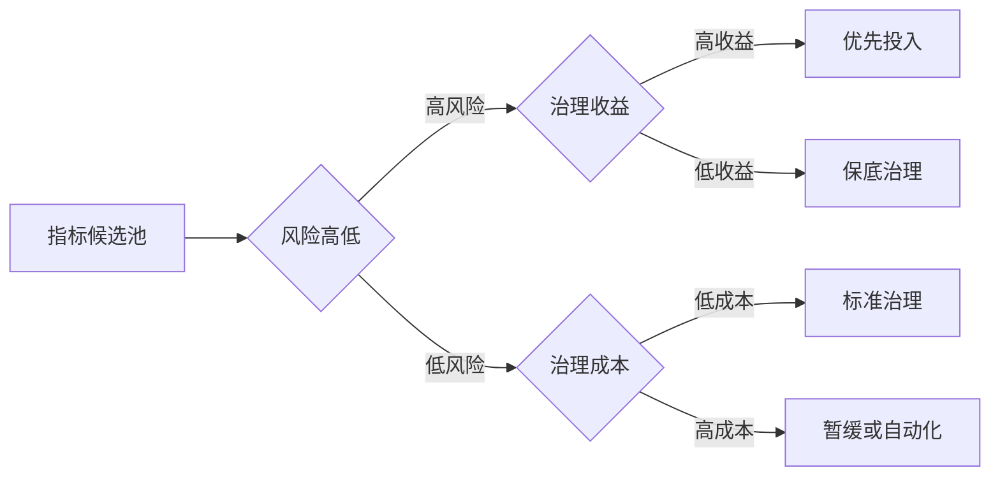

# 销售风险指标治理成本收益评估项目案例

## 适合谁看

- 想理解销售风险指标治理如何证明投入产出的前端开发者。
- 正在做销售风控、指标平台、数据治理、经营分析、CRM 或治理运营看板的团队。
- 希望避免“治理做了很多任务，但管理层看不到节省了多少成本、降低了多少风险”的项目负责人。

## 业务目标

销售风险指标治理运营看板能展示指标健康度和任务闭环，但治理团队还需要回答一个更现实的问题：治理投入是否值得。成本收益评估要把治理人力、系统建设、规则维护、异常处理和自动修复投入，与风险降低、人工节省、决策效率提升、审计成本下降和业务损失减少放在同一套口径下评估。

成本收益评估要解决：

- 指标治理投入如何量化。
- 治理收益如何从风险、效率、审计和业务损失维度计算。
- 哪些指标应该优先治理，哪些指标暂时维持低成本治理。
- 治理动作是否真正降低异常和人工处理成本。
- 如何向管理层解释治理价值和下一阶段预算。

## 成本收益评估链路

治理 ROI 不是单纯财务公式。很多收益是避免损失、减少返工和降低审计风险，需要用业务可接受的估算口径表达。

## 核心概念

| 概念 | 说明 |
| --- | --- |
| 治理成本 | 指标梳理、口径修订、质量规则、血缘建设、自动修复和任务运营产生的投入。 |
| 治理收益 | 减少异常、减少人工核查、降低坏账风险、提升决策效率和降低审计成本带来的价值。 |
| 避免损失 | 因指标更可信而提前发现风险、避免错误决策或减少业务损失。 |
| 人工节省 | 异常定位、数据核查、复算和解释工作减少的工时。 |
| ROI 分层 | 按指标、业务线、治理动作和时间周期分别评估。 |
| 预算建议 | 根据收益、风险和成熟度差距给出下一阶段治理投入建议。 |

## 数据模型

成本和收益要分开建模。成本通常来自任务、人力和系统，收益通常来自异常、风控、审计和业务结果。

## 推荐表结构

| 表 | 作用 | 关键字段 |
| --- | --- | --- |
| `governance_cost_record` | 保存治理成本 | `metric_id`、`cost_type`、`cost_amount`、`period` |
| `cost_allocation_item` | 保存成本分摊 | `cost_id`、`allocation_target`、`allocation_ratio`、`reason` |
| `governance_benefit_record` | 保存治理收益 | `metric_id`、`benefit_type`、`benefit_amount`、`confidence_level` |
| `benefit_evidence` | 保存收益证据 | `benefit_id`、`evidence_type`、`evidence_value`、`source_system` |
| `roi_evaluation` | 保存 ROI 评估 | `metric_id`、`period`、`roi_value`、`payback_period` |
| `roi_dimension_score` | 保存维度评分 | `evaluation_id`、`dimension`、`score`、`summary` |
| `governance_budget_suggestion` | 保存预算建议 | `evaluation_id`、`suggested_budget`、`priority`、`reason` |

## ROI 计算流程

收益折算口径要提前和财务、业务负责人确认，否则 ROI 报告很容易被质疑。

## 评估状态设计

ROI 评估要允许复核和调整口径，但每次调整都要保留原因。

## 成本收益维度拆解

成本收益不要只看总额。不同指标的收益来源不同，有的偏风险，有的偏效率，有的偏审计。

## 优先级矩阵

高风险不等于一定大投入。若治理收益低或成本极高，应先做保底治理和监控。

## 前端页面拆分

| 页面 | 核心内容 | 设计重点 |
| --- | --- | --- |
| ROI 总览 | 总投入、总收益、ROI、回收周期、预算建议 | 管理层优先看趋势和结论。 |
| 指标 ROI 列表 | 指标、风险等级、成本、收益、ROI、优先级 | 支持按业务线和负责人筛选。 |
| 评估详情 | 成本明细、收益证据、计算口径、复核记录 | 让 ROI 结果可解释。 |
| 预算建议 | 下一阶段投入、预期收益、风险说明、审批状态 | 把评估结果转为资源申请。 |
| 口径配置 | 成本类型、收益类型、折算规则、置信等级 | 防止不同周期口径不一致。 |

## 接口拆分建议

| 接口 | 作用 |
| --- | --- |
| `GET /api/sales-risk-metric-governance-roi-dashboard` | 查询 ROI 总览。 |
| `GET /api/sales-risk-metric-governance-roi-evaluations` | 查询 ROI 评估列表。 |
| `POST /api/sales-risk-metric-governance-roi-evaluations` | 创建评估。 |
| `GET /api/sales-risk-metric-governance-roi-evaluations/:id` | 查询评估详情。 |
| `POST /api/sales-risk-metric-governance-roi-evaluations/:id/calculate` | 计算 ROI。 |
| `POST /api/sales-risk-metric-governance-roi-evaluations/:id/review` | 提交业务复核。 |
| `POST /api/sales-risk-metric-governance-roi-evaluations/:id/budget-suggestions` | 创建预算建议。 |

## 实际项目常见问题

### 1. 只统计成本不统计收益

治理看起来永远是成本中心。解决方式是同步记录异常减少、人工节省、风险降低和审计节省。

### 2. 收益口径太主观

业务不认可节省金额。解决方式是为每类收益配置证据和置信等级。

### 3. ROI 只看短期

指标治理前期投入大，短期 ROI 低。解决方式是同时展示回收周期和长期收益。

### 4. 成本无法分摊到指标

平台级建设服务多个指标。解决方式是按使用量、风险等级或任务量分摊成本。

### 5. 评估报告不能转成预算

报告看完就结束。解决方式是评估详情直接生成预算建议和审批材料。

## 权限与审计

| 权限 | 说明 |
| --- | --- |
| 查看 ROI | 可以查看成本收益评估和趋势。 |
| 维护口径 | 可以配置成本和收益折算规则。 |
| 发起评估 | 可以创建周期性 ROI 评估。 |
| 复核收益 | 可以确认收益证据和金额。 |
| 提交预算建议 | 可以将评估结果转成预算申请。 |

成本归集、收益证据、口径调整、ROI 计算、复核意见和预算建议都要保留审计。

## 验收清单

- 能归集指标治理成本。
- 能记录风险降低、效率提升、审计节省和业务损失减少收益。
- 能按指标、业务线和周期计算 ROI。
- 能解释成本和收益来源。
- 能生成治理优先级排序。
- 能根据 ROI 输出预算建议。
- 能保留评估口径和复核记录。

## 下一步学习

- [销售风险指标治理运营看板项目案例](/projects/sales-risk-metric-governance-operations-dashboard-case)
- [销售风险指标治理成熟度项目案例](/projects/sales-risk-metric-governance-maturity-case)
- [数据资产运营项目案例](/projects/data-asset-operation-case)
