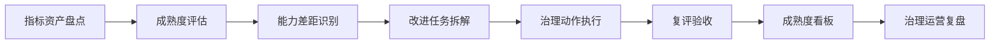
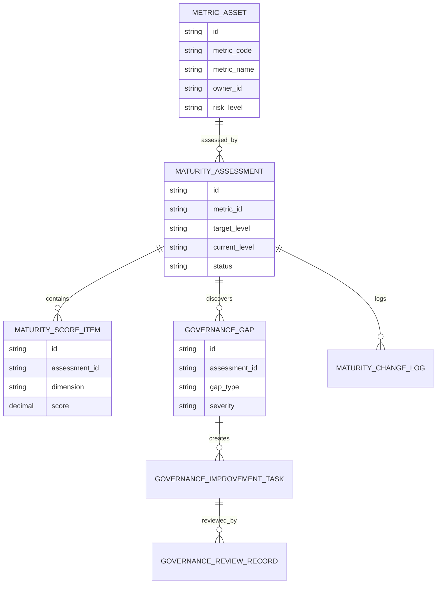
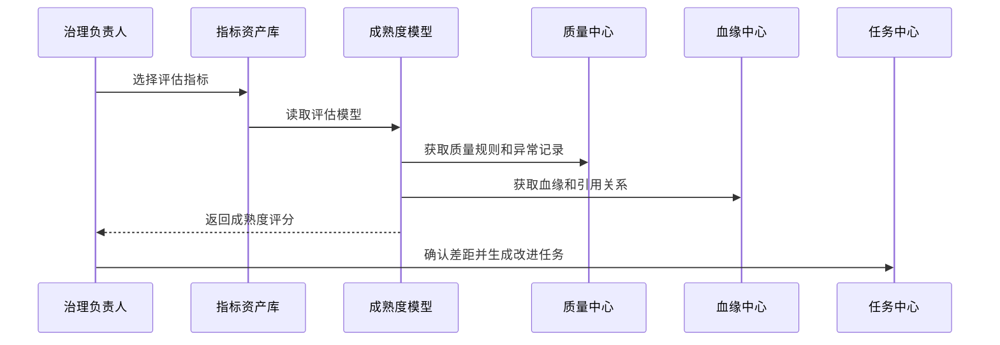
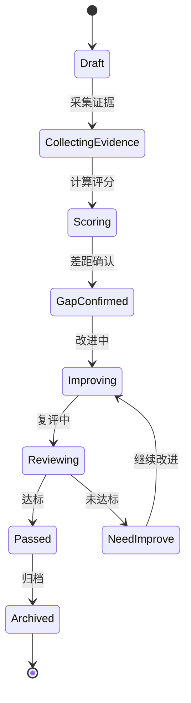
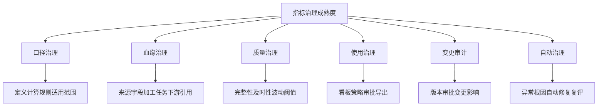
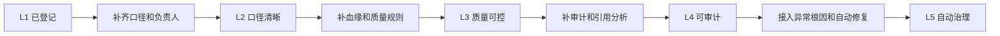

# 销售风险指标治理成熟度项目案例

## 适合谁看

- 想理解销售风险指标从“有人维护”升级到“可度量、可复盘、可持续治理”的前端开发者。
- 正在做销售风控、指标平台、经营分析、CRM、数据治理或管理驾驶舱的团队。
- 希望避免“指标很多，但每个指标的口径、质量、负责人和使用风险都说不清”的项目负责人。

## 业务目标

销售风险指标治理不是一次性把指标做出来，而是让指标在整个生命周期内保持可信。指标上线后会经历口径调整、数据源变化、业务策略迭代、看板引用扩大和审计要求增加。如果没有成熟度治理，系统会逐渐出现指标重复、口径冲突、质量异常无人负责、下游误用和审计难追溯等问题。

指标治理成熟度要解决：

- 如何判断一个指标只是“能查到”，还是已经达到“可运营、可审计、可自动治理”。
- 指标口径、血缘、质量、负责人、使用场景和风险等级如何统一评估。
- 不同成熟度等级分别应该补齐哪些治理动作。
- 如何把成熟度评分转成改进任务，而不是只生成一份报告。
- 指标成熟度如何跟异常根因、自动修复和经营看板联动。

## 成熟度治理链路

成熟度评估不是给指标贴标签，而是为了判断下一步应该优先补口径、补血缘、补质量规则、补负责人还是补使用审计。

## 成熟度等级

| 等级 | 名称 | 判断标准 | 常见风险 |
| --- | --- | --- | --- |
| L0 | 未治理 | 指标存在但无统一定义 | 同名不同义、没人负责 |
| L1 | 已登记 | 有基础信息和负责人 | 口径粗略，使用方仍靠口头解释 |
| L2 | 口径清晰 | 有计算规则、字段来源和适用范围 | 数据质量和血缘不完整 |
| L3 | 质量可控 | 有质量规则、异常告警和处理 SLA | 修复动作依赖人工 |
| L4 | 可审计 | 有血缘、版本、引用和变更记录 | 改进任务缺少闭环 |
| L5 | 自动治理 | 可自动发现、修复、复评和运营 | 需要持续校准评分模型 |

成熟度等级要服务于治理动作。比如一个 L1 指标不应该一上来要求自动修复，而应该先补齐口径、负责人和使用场景。

## 核心概念

| 概念 | 说明 |
| --- | --- |
| 指标资产 | 销售风险相关的业务指标，例如逾期率、回款预测偏差、客户风险评分和现金流预警。 |
| 治理维度 | 口径、血缘、质量、权限、引用、变更、审计和运营等评估方向。 |
| 成熟度评分 | 按维度规则计算出的等级和分数。 |
| 能力差距 | 当前指标距离目标成熟度缺少的治理能力。 |
| 改进任务 | 针对差距生成的补口径、补质量规则、补负责人、补血缘或补审计任务。 |
| 复评机制 | 改进任务完成后重新评估成熟度，确认是否真正达标。 |

## 数据模型

成熟度评估和评分项要分开，因为一个指标的总等级通常由多个维度共同决定。

## 推荐表结构

| 表 | 作用 | 关键字段 |
| --- | --- | --- |
| `metric_asset` | 保存指标资产 | `metric_code`、`metric_name`、`owner_id`、`risk_level` |
| `maturity_model` | 保存成熟度模型 | `model_code`、`dimension_set`、`enabled`、`version_no` |
| `maturity_assessment` | 保存评估记录 | `metric_id`、`model_code`、`current_level`、`target_level`、`status` |
| `maturity_score_item` | 保存维度评分 | `assessment_id`、`dimension`、`score`、`evidence_summary` |
| `governance_gap` | 保存能力差距 | `assessment_id`、`gap_type`、`severity`、`suggestion` |
| `governance_improvement_task` | 保存改进任务 | `gap_id`、`owner_id`、`due_at`、`task_status`、`acceptance_rule` |
| `governance_review_record` | 保存复评记录 | `task_id`、`review_result`、`reviewer_id`、`review_comment` |
| `maturity_change_log` | 保存等级变化 | `metric_id`、`before_level`、`after_level`、`change_reason` |

## 成熟度评估流程

评估流程要尽量自动采集证据，避免治理人员每次都手工填写。

## 评估状态设计

成熟度复评不通过是正常情况，系统要让用户看清楚是哪一个维度没有达标。

## 治理维度拆解

页面上不要只展示总分。用户需要看到每个维度的证据、缺口和下一步动作。

## 成熟度改进路线

改进路线要按指标风险等级分批推进。高风险指标优先到 L4，低风险指标可以先达到 L2 或 L3。

## 前端页面拆分

| 页面 | 核心内容 | 设计重点 |
| --- | --- | --- |
| 成熟度看板 | 指标数量、等级分布、低成熟度指标、逾期任务 | 用分布和趋势判断治理进展。 |
| 指标成熟度详情 | 口径、血缘、质量、使用、审计和自动治理评分 | 支持展开评分证据。 |
| 差距分析 | 缺失能力、严重程度、建议动作、影响范围 | 让治理人员知道先补什么。 |
| 改进任务 | 任务负责人、验收规则、到期时间、复评结果 | 把评估结果转成闭环动作。 |
| 成熟度模型配置 | 维度、权重、等级阈值、适用指标范围 | 支持不同业务线有不同模型。 |

## 接口拆分建议

| 接口 | 作用 |
| --- | --- |
| `GET /api/sales-risk-metric-maturity-dashboard` | 查询成熟度看板。 |
| `POST /api/sales-risk-metric-maturity-assessments` | 创建成熟度评估。 |
| `GET /api/sales-risk-metric-maturity-assessments/:id` | 查询评估详情。 |
| `POST /api/sales-risk-metric-maturity-assessments/:id/collect-evidence` | 采集评估证据。 |
| `POST /api/sales-risk-metric-maturity-assessments/:id/score` | 计算成熟度评分。 |
| `POST /api/sales-risk-metric-governance-gaps/:id/tasks` | 根据差距创建改进任务。 |
| `POST /api/sales-risk-metric-governance-tasks/:id/review` | 提交改进任务复评。 |
| `GET /api/sales-risk-metric-maturity-models` | 查询成熟度模型。 |

## 实际项目常见问题

### 1. 成熟度只有总分

总分 80 分看起来不错，但可能血缘完全缺失。解决方式是总分、等级和维度分必须同时展示。

### 2. 评估依赖人工主观填写

不同负责人评分标准不一致。解决方式是尽量从指标资产、血缘、质量规则、引用记录和变更记录自动采集证据。

### 3. 低成熟度指标没有整改动作

看板知道问题，但没人处理。解决方式是每个能力差距都要能生成改进任务和验收规则。

### 4. 成熟度模型一刀切

经营看板指标和实验分析指标使用同一套目标等级，会导致治理成本过高。解决方式是按风险等级、使用场景和指标类型配置模型。

### 5. 复评只看任务是否关闭

任务关闭不代表指标成熟度提升。解决方式是复评必须重新校验证据和评分。

## 权限与审计

| 权限 | 说明 |
| --- | --- |
| 查看成熟度 | 可以查看指标成熟度等级、评分和趋势。 |
| 发起评估 | 可以对指标创建成熟度评估。 |
| 配置模型 | 可以维护成熟度维度、权重和等级阈值。 |
| 确认差距 | 可以确认能力差距并创建改进任务。 |
| 复评验收 | 可以审核改进任务是否达标。 |

成熟度模型变更、评分证据、差距确认、改进任务、复评结论和等级变化都要保留审计。

## 验收清单

- 能维护成熟度模型和评估维度。
- 能对销售风险指标发起成熟度评估。
- 能自动采集口径、血缘、质量、引用和变更证据。
- 能计算总等级和维度评分。
- 能识别能力差距并生成改进任务。
- 能对改进任务进行复评验收。
- 能展示成熟度等级分布、趋势和低成熟度指标清单。

## 下一步学习

- [销售风险指标自动修复项目案例](/projects/sales-risk-metric-auto-repair-case)
- [销售风险指标血缘审计项目案例](/projects/sales-risk-metric-lineage-audit-case)
- [数据治理平台项目案例](/projects/data-governance-case)
