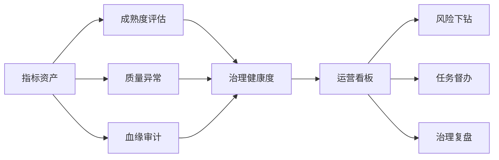
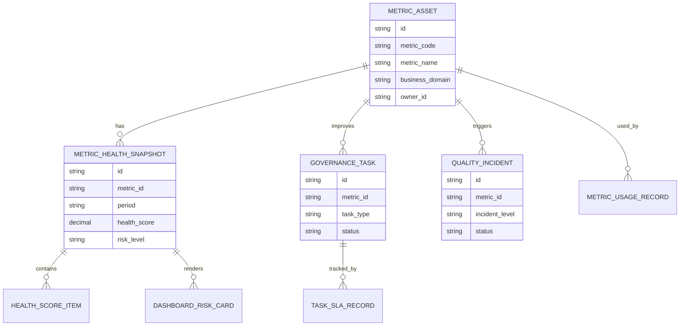
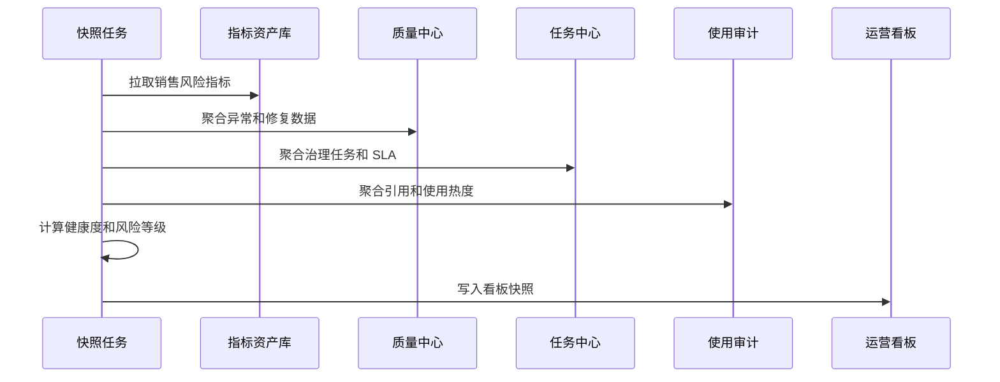
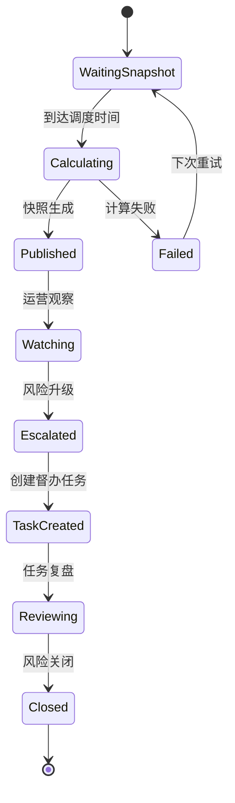
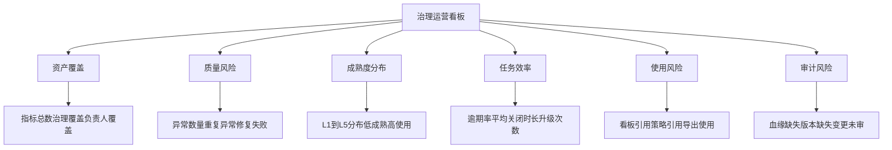
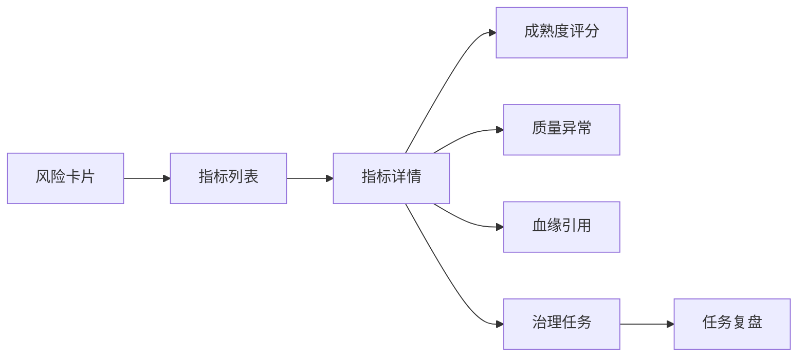

# 销售风险指标治理运营看板项目案例

## 适合谁看

- 想理解销售风险指标治理如何从“任务管理”升级为“持续运营看板”的前端开发者。
- 正在做销售风控、指标平台、数据治理、经营分析、CRM 或管理驾驶舱的团队。
- 希望避免“治理任务很多，但管理层看不到整体健康度、风险趋势和治理投入产出”的项目负责人。

## 业务目标

销售风险指标治理成熟度能判断单个指标是否达标，但管理者还需要从全局看治理效果。运营看板要把指标成熟度、异常趋势、质量规则、修复效率、审计风险、使用热度和改进任务放在同一张运营视图里，帮助团队决定优先治理哪些指标、哪些业务线风险正在扩大、哪些治理动作真正有效。

运营看板要解决：

- 指标资产整体健康度如何展示。
- 哪些指标成熟度低但业务使用频率高。
- 异常发现、根因定位、自动修复和复评的效率是否提升。
- 治理任务是否逾期，是否集中在某些业务线或负责人。
- 管理层如何从看板下钻到指标、异常、任务和审计证据。

## 运营看板链路

运营看板不是把所有数据堆在一起，而是回答三个问题：哪里风险最高、为什么高、下一步谁来处理。

## 核心概念

| 概念 | 说明 |
| --- | --- |
| 指标健康度 | 综合成熟度、质量异常、血缘完整性、使用风险和任务闭环形成的评分。 |
| 治理覆盖率 | 已纳入治理模型的指标占全部销售风险指标的比例。 |
| 高风险低成熟指标 | 被关键业务使用，但成熟度等级低、质量规则缺失或负责人不明确的指标。 |
| 治理效率 | 异常发现到根因定位、修复、复评和关闭的平均耗时。 |
| 任务逾期率 | 治理改进任务超过 SLA 未完成的比例。 |
| 运营复盘 | 按周或按月总结风险变化、治理动作和后续优先级。 |

## 数据模型

运营看板要使用快照表，不能每次打开页面都实时聚合全部指标、异常、任务和引用记录。

## 推荐表结构

| 表 | 作用 | 关键字段 |
| --- | --- | --- |
| `metric_health_snapshot` | 保存指标健康快照 | `metric_id`、`period`、`health_score`、`risk_level`、`snapshot_at` |
| `health_score_item` | 保存健康度明细 | `snapshot_id`、`dimension`、`score`、`reason` |
| `governance_task` | 保存治理任务 | `metric_id`、`task_type`、`owner_id`、`due_at`、`status` |
| `task_sla_record` | 保存 SLA 记录 | `task_id`、`sla_status`、`overdue_hours`、`escalation_level` |
| `quality_incident` | 保存质量异常 | `metric_id`、`incident_level`、`root_cause_type`、`closed_at` |
| `metric_usage_record` | 保存指标使用 | `metric_id`、`usage_scene`、`consumer_id`、`last_used_at` |
| `dashboard_risk_card` | 保存看板卡片配置 | `card_code`、`dimension`、`sort_rule`、`enabled` |

## 看板数据生成流程

看板适合按小时或按天生成快照，详情页再按需实时查询。

## 看板状态设计

看板风险卡片需要可关闭，否则长期红色风险会变成背景噪音。

## 看板指标拆解

看板首页要先显示风险排序，再提供维度切换；不要让用户先选择一堆筛选条件才看到风险。

## 下钻路径设计

所有看板卡片都必须能下钻到明细，否则运营会变成只看数字。

## 前端页面拆分

| 页面 | 核心内容 | 设计重点 |
| --- | --- | --- |
| 治理运营总览 | 健康度、风险卡片、趋势、治理覆盖率 | 先展示高风险指标和变化趋势。 |
| 指标风险列表 | 指标、成熟度、异常数、使用场景、负责人 | 支持按业务线、风险等级和负责人筛选。 |
| 指标运营详情 | 评分明细、异常记录、任务、血缘、使用审计 | 让用户知道风险来自哪里。 |
| 任务督办 | 逾期任务、升级记录、负责人、处理建议 | 适合日常运营会议使用。 |
| 运营复盘 | 周报月报、风险变化、完成动作、下期重点 | 把看板数据转成管理结论。 |

## 接口拆分建议

| 接口 | 作用 |
| --- | --- |
| `GET /api/sales-risk-metric-governance-dashboard` | 查询运营看板总览。 |
| `GET /api/sales-risk-metric-governance-dashboard/risk-cards` | 查询风险卡片。 |
| `GET /api/sales-risk-metric-governance-dashboard/metrics` | 查询指标风险列表。 |
| `GET /api/sales-risk-metrics/:id/operation-detail` | 查询指标运营详情。 |
| `POST /api/sales-risk-metric-health-snapshots/generate` | 生成健康快照。 |
| `POST /api/sales-risk-metric-governance-tasks/:id/escalate` | 升级治理任务。 |
| `POST /api/sales-risk-metric-operation-reviews` | 创建运营复盘。 |

## 实际项目常见问题

### 1. 看板指标太多

管理者不知道先看哪里。解决方式是首页只保留健康度、风险趋势、TOP 风险和逾期任务，其余放到下钻页。

### 2. 健康度没有解释

分数低但不知道为什么。解决方式是健康度必须拆到成熟度、质量、使用、审计和任务维度。

### 3. 实时计算导致页面很慢

每次打开都聚合大量异常和任务。解决方式是使用快照表，详情页再实时查询。

### 4. 任务逾期没有升级

看板能看到逾期，但没有督办动作。解决方式是任务 SLA 要绑定升级规则和通知。

### 5. 看板只给治理团队看

业务负责人不了解指标风险。解决方式是按角色提供管理视图、负责人视图和业务线视图。

## 权限与审计

| 权限 | 说明 |
| --- | --- |
| 查看运营看板 | 可以查看整体健康度和风险趋势。 |
| 查看敏感指标 | 可以查看高风险指标明细和下游使用方。 |
| 生成快照 | 可以手动触发健康快照。 |
| 督办任务 | 可以升级逾期治理任务。 |
| 发布复盘 | 可以发布周报或月报结论。 |

健康度计算、风险卡片生成、任务升级、复盘发布和人工调整都要保留审计。

## 验收清单

- 能生成销售风险指标健康快照。
- 能展示治理覆盖率、成熟度分布和质量异常趋势。
- 能识别高风险低成熟指标。
- 能下钻到指标详情、异常、血缘和任务。
- 能展示任务 SLA、逾期和升级记录。
- 能创建运营复盘并保留历史趋势。
- 能按角色控制看板和敏感指标访问范围。

## 下一步学习

- [销售风险指标治理成熟度项目案例](/projects/sales-risk-metric-governance-maturity-case)
- [销售风险指标治理项目案例](/projects/sales-risk-metric-governance-case)
- [数据资产运营项目案例](/projects/data-asset-operation-case)
