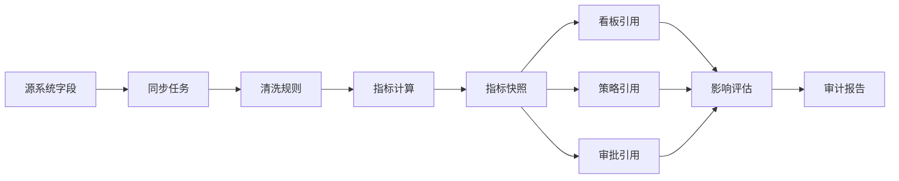
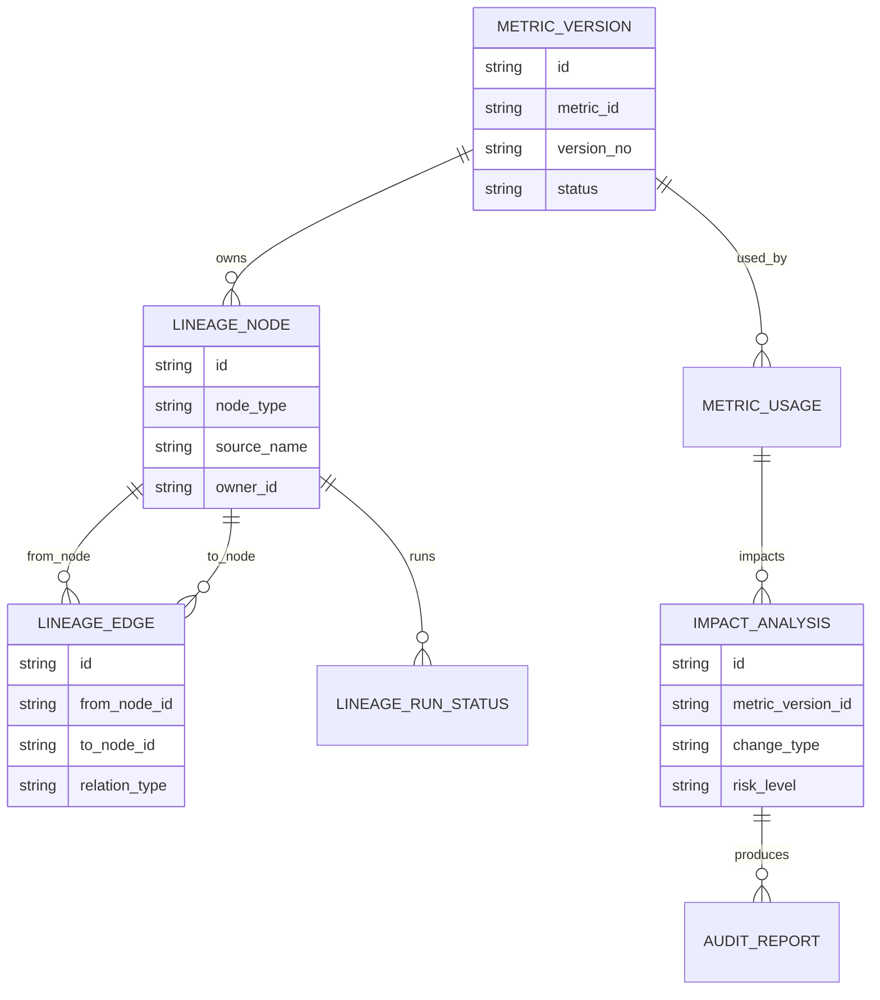
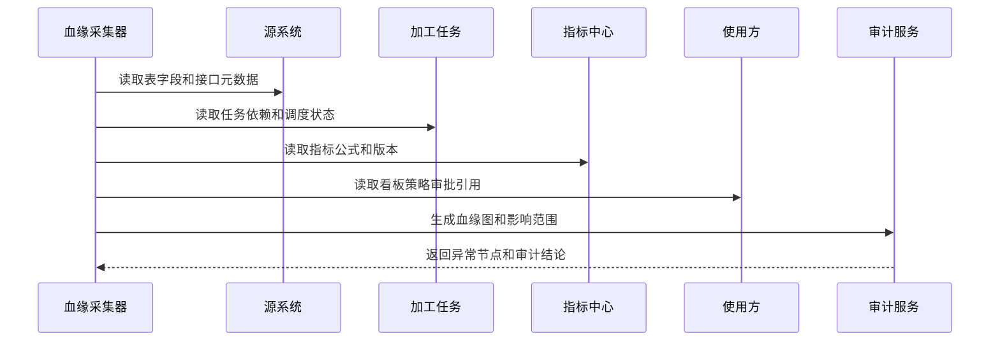
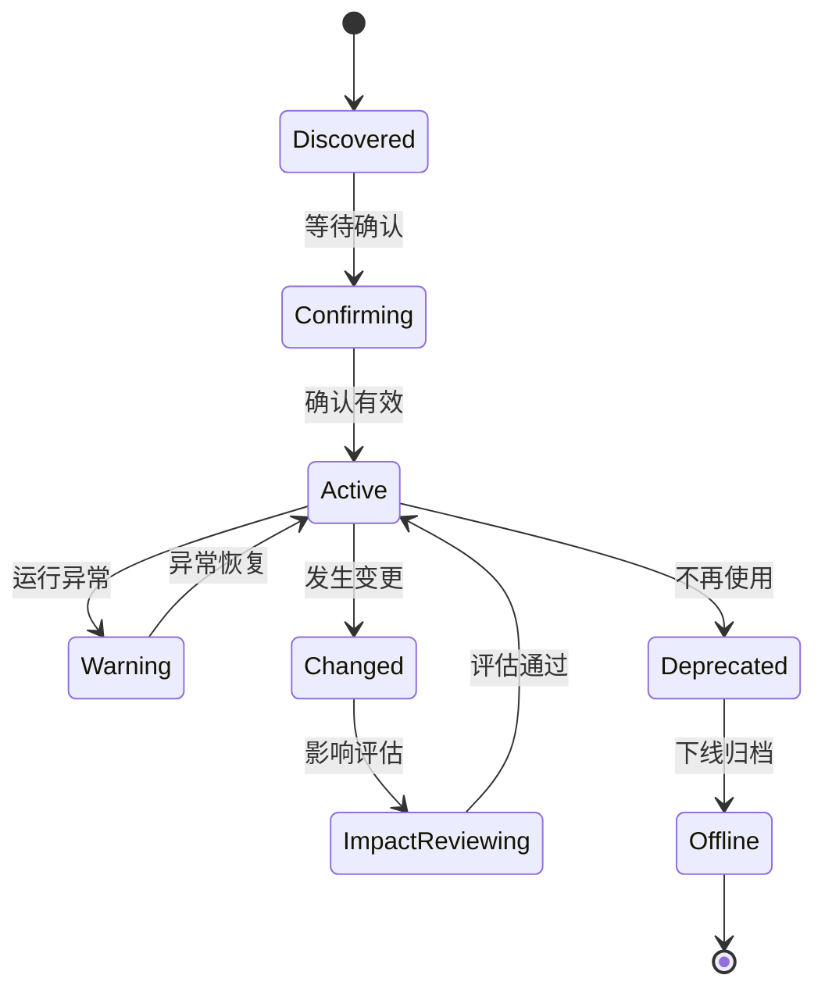
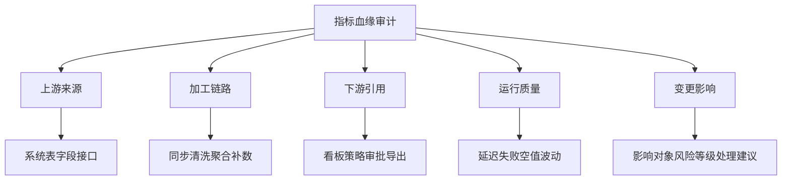

# 销售风险指标血缘审计项目案例

## 适合谁看

- 想理解销售风险指标从数据源到看板、策略和审批如何追踪的前端开发者。
- 正在做 CRM、销售风控、经营分析、指标平台或数据治理平台的团队。
- 希望避免“指标看起来有值，但没人知道它从哪里来、被谁用了、改动会影响什么”的项目负责人。

## 业务目标

销售风险指标治理解决指标定义和口径问题，但当指标进入真实系统后，还需要回答更难的问题：这个指标依赖哪些源字段，经过哪些任务加工，被哪些策略和看板使用，最近一次变更会影响哪些业务结论。

指标血缘审计要解决：

- 指标值来自哪些系统、表、字段、接口和加工任务。
- 指标加工链路是否完整，是否存在人工补数、临时脚本或未知来源。
- 指标被哪些看板、策略、预警、审批和导出任务使用。
- 指标口径、数据源、加工任务变更后，影响范围能否提前评估。
- 指标异常时，能否快速定位是源数据、同步任务、计算逻辑还是使用方配置出了问题。

## 血缘审计链路

血缘审计的核心不是画一张漂亮的图，而是让每个节点都能点开，看见责任人、变更记录、运行状态和影响对象。

## 核心概念

| 概念 | 说明 |
| --- | --- |
| 上游血缘 | 指标依赖的源系统、表、字段、接口、同步任务和清洗规则。 |
| 下游血缘 | 指标被哪些看板、策略、审批、预警、报表或外部接口使用。 |
| 加工节点 | 数据同步、清洗、聚合、补数、口径转换和快照生成等处理环节。 |
| 影响范围 | 指标或加工节点变更后，可能被影响的业务对象和用户范围。 |
| 审计快照 | 某个时间点的血缘关系、指标版本、引用关系和运行状态记录。 |
| 异常定位 | 指标异常时，沿血缘链路逐层判断问题来源。 |

## 数据模型

血缘节点和血缘边要分开存储。节点代表“东西”，边代表“关系”。这样才能支持从上游查下游，也能从下游反查上游。

## 推荐表结构

| 表 | 作用 | 关键字段 |
| --- | --- | --- |
| `metric_version` | 保存指标口径版本 | `metric_id`、`version_no`、`formula`、`status` |
| `lineage_node` | 保存血缘节点 | `node_type`、`system_code`、`object_name`、`owner_id` |
| `lineage_edge` | 保存血缘关系 | `from_node_id`、`to_node_id`、`relation_type`、`confidence` |
| `lineage_run_status` | 保存节点运行状态 | `node_id`、`run_date`、`status`、`delay_minutes` |
| `metric_usage` | 保存下游使用关系 | `metric_version_id`、`usage_scene`、`business_id`、`owner_id` |
| `impact_analysis` | 保存影响评估 | `metric_version_id`、`change_type`、`risk_level`、`affected_count` |
| `audit_report` | 保存审计报告 | `analysis_id`、`summary`、`risk_items`、`generated_at` |

## 血缘采集流程

血缘采集最好自动化。人工维护血缘在早期能跑通流程，但系统变多后会很快失真。

## 血缘节点状态设计

血缘节点出现变更时，不应该直接更新为正常状态，而要先进入影响评估。

## 血缘审计视图拆解

前端页面要能在“业务视角”和“技术视角”之间切换。业务用户关心影响对象，技术用户关心字段和任务。

## 前端页面拆分

| 页面 | 核心内容 | 设计重点 |
| --- | --- | --- |
| 血缘总览 | 指标数量、异常节点、缺失血缘、影响范围 | 先展示风险最高的链路。 |
| 指标血缘图 | 上游节点、加工节点、下游引用、节点状态 | 图上节点要能展开详情。 |
| 节点详情 | 来源系统、责任人、运行状态、字段映射 | 让用户知道问题该找谁。 |
| 影响评估 | 变更类型、影响对象、风险等级、处理建议 | 变更前必须能预判影响。 |
| 审计报告 | 异常链路、证据、结论、整改任务 | 面向管理者和审计人员。 |

## 接口拆分建议

| 接口 | 作用 |
| --- | --- |
| `GET /api/sales-risk-metrics/:id/lineage` | 查询指标血缘图。 |
| `GET /api/sales-risk-lineage-nodes/:id` | 查询血缘节点详情。 |
| `POST /api/sales-risk-lineage/collect` | 触发血缘采集。 |
| `POST /api/sales-risk-metrics/:id/impact-analysis` | 创建影响评估。 |
| `GET /api/sales-risk-impact-analyses/:id` | 查询影响评估详情。 |
| `POST /api/sales-risk-impact-analyses/:id/review` | 提交影响评审意见。 |
| `GET /api/sales-risk-lineage-audit-reports` | 查询审计报告列表。 |

## 实际项目常见问题

### 1. 血缘图只有表级，没有字段级

表级血缘只能说明数据大概来自哪里，无法解释指标公式依赖哪个字段。解决方式是关键指标至少做到字段级血缘。

### 2. 下游引用靠人工登记

看板、策略和审批引用指标后没有回写使用关系。解决方式是指标 SDK 或配置平台在保存时自动登记使用关系。

### 3. 指标异常时只看最终值

最终值异常不代表公式一定错，可能是源表延迟、同步失败或补数脚本覆盖。解决方式是沿血缘链路逐层展示运行状态。

### 4. 变更影响评估太粗

只写“影响销售看板”没有意义。解决方式是影响评估要列出具体页面、策略、审批流、负责人和最近使用量。

### 5. 血缘采集结果没人确认

自动采集可能有误，如果没有责任人确认，血缘图仍然不可信。解决方式是节点绑定 owner，并配置确认和过期复核机制。

## 权限与审计

| 权限 | 说明 |
| --- | --- |
| 查看血缘 | 可以查看指标上下游链路。 |
| 触发采集 | 可以手动执行血缘采集任务。 |
| 确认节点 | 可以确认血缘节点是否有效。 |
| 发起影响评估 | 可以对指标变更生成影响报告。 |
| 审核报告 | 可以确认审计结论并创建整改任务。 |

血缘节点、关系、采集结果、影响评估和审计报告都需要保留版本记录，不能只保留最新结果。

## 验收清单

- 能展示销售风险指标的上游来源、加工链路和下游引用。
- 能区分系统、表、字段、接口、任务、指标、看板和策略节点。
- 能查看每个节点的责任人、运行状态和最近变更。
- 能对指标变更生成影响评估。
- 能从异常指标反查可能的问题节点。
- 能导出审计报告并关联整改任务。
- 能保留血缘快照，支持历史追溯。

## 下一步学习

- [销售风险指标治理项目案例](/projects/sales-risk-metric-governance-case)
- [销售风险处置复盘项目案例](/projects/sales-risk-disposal-review-case)
- [数据治理平台项目案例](/projects/data-governance-case)
