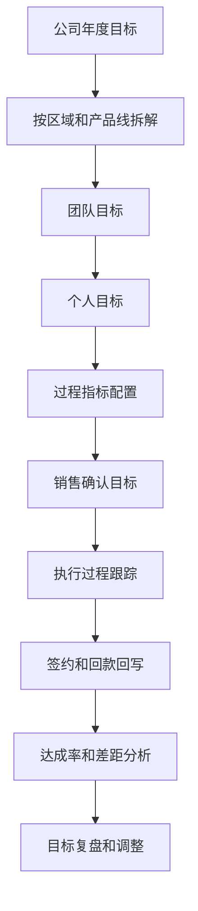
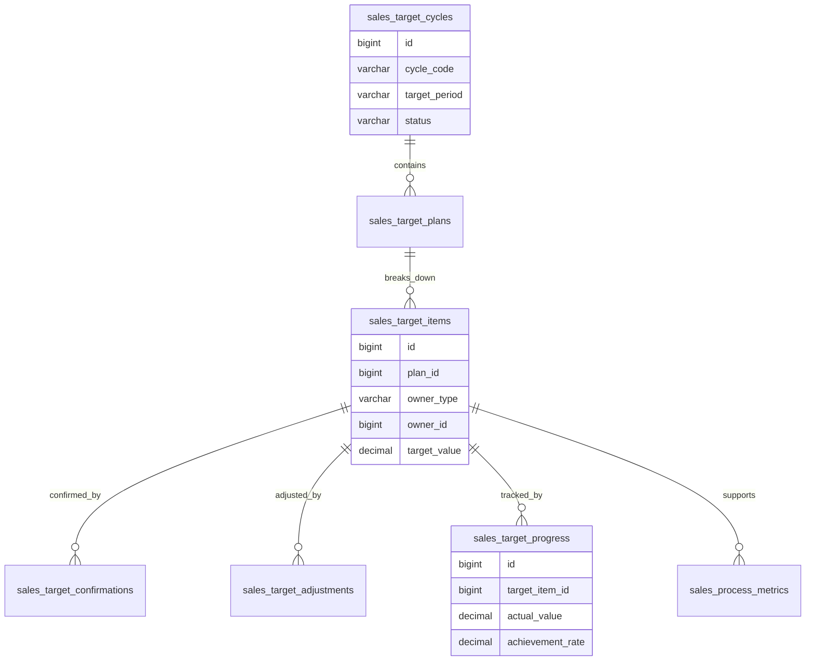
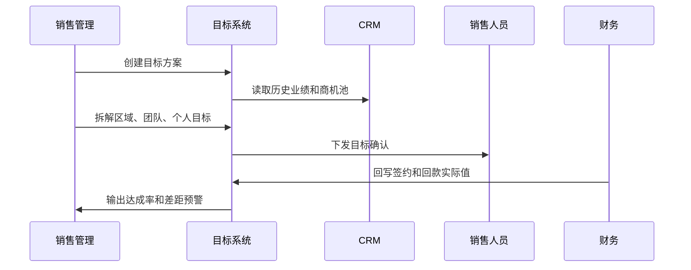

# 销售目标拆解项目案例

## 适合谁看

适合需要做年度销售目标、团队配额、个人目标、产品线目标、区域目标、过程指标、目标调整、达成跟踪和绩效联动的开发者。

销售目标拆解不是“给每个销售填一个金额”。真实项目里，目标会连接历史业绩、客户池、商机漏斗、销售预测、产品线策略、区域市场、回款计划和绩效奖金。系统要能回答：公司目标如何拆到区域和个人、目标依据是什么、过程指标如何支撑结果、目标调整谁审批、达成率怎么算。

## 业务目标

第一版销售目标拆解支持：

- 创建年度、季度、月度销售目标。
- 支持按组织、区域、产品线、客户类型和销售人员拆解。
- 支持签约额、回款额、新增客户、续费额、毛利等多指标目标。
- 支持历史业绩、商机池、预测数据辅助拆解。
- 支持目标下发、确认、调整和审批。
- 支持过程指标，例如拜访数、商机数、报价数、赢单率。
- 支持达成跟踪、差距分析、预警和复盘。
- 支持目标和绩效、提成、经营看板联动。

## 销售目标拆解链路

销售目标拆解的关键是“目标依据”。没有历史业绩、客户池和商机漏斗支撑，目标就容易变成拍脑袋。

## 核心概念

| 概念 | 说明 | 示例 |
| --- | --- | --- |
| 目标周期 | 目标覆盖时间 | 2026 年 Q3 |
| 目标口径 | 目标统计指标 | 签约额、回款额 |
| 目标层级 | 目标归属层级 | 公司、区域、团队、个人 |
| 目标拆解 | 将上级目标分配到下级 | 华东区 3000 万 |
| 过程指标 | 支撑结果的行动指标 | 每月拜访 30 次 |
| 目标确认 | 下级确认收到目标 | 销售确认 |
| 目标调整 | 因市场或组织变化修改目标 | 调整区域目标 |
| 达成率 | 实际完成 / 目标值 | 85% |

目标要区分结果指标和过程指标。只盯签约额，无法提前发现过程不足。

## 数据模型

## 推荐表结构

| 表 | 作用 | 关键字段 |
| --- | --- | --- |
| `sales_target_cycles` | 目标周期 | `cycle_code`、`target_period`、`start_date`、`end_date`、`status` |
| `sales_target_plans` | 目标方案 | `cycle_id`、`plan_name`、`metric_code`、`version_no`、`status` |
| `sales_target_items` | 目标拆解明细 | `plan_id`、`owner_type`、`owner_id`、`target_value`、`parent_item_id` |
| `sales_process_metrics` | 过程指标 | `target_item_id`、`metric_code`、`target_value`、`actual_value` |
| `sales_target_confirmations` | 目标确认 | `target_item_id`、`confirmed_by`、`confirmed_at`、`comment` |
| `sales_target_adjustments` | 目标调整 | `target_item_id`、`before_value`、`after_value`、`reason`、`approval_status` |
| `sales_target_progress` | 达成进度 | `target_item_id`、`actual_value`、`achievement_rate`、`snapshot_date` |
| `sales_target_basis` | 拆解依据 | `target_item_id`、`basis_type`、`basis_value`、`snapshot_json` |

目标拆解要保存依据快照，例如历史业绩、客户数、商机金额、预测金额。否则复盘时不知道目标是否合理。

## 目标下发流程

目标下发后不能随意改。目标调整需要版本、原因和审批，否则绩效结果会被质疑。

## 目标状态设计

| 状态 | 含义 | 注意点 |
| --- | --- | --- |
| 草稿 | 管理层编辑目标 | 可修改 |
| 待下发 | 目标拆解完成未发布 | 校验总和 |
| 待确认 | 已下发等待确认 | 销售可查看 |
| 执行中 | 目标开始统计 | 持续回写进度 |
| 调整中 | 有目标调整申请 | 原目标保留 |
| 已锁定 | 不允许再调整 | 通常用于绩效 |
| 已完成 | 周期结束 | 进入复盘 |
| 已归档 | 复盘完成 | 只读 |

目标总和需要校验。团队目标之和可以等于或略高于上级目标，但规则要明确。

## 前端页面拆分

| 页面或组件 | 作用 | 注意点 |
| --- | --- | --- |
| 目标工作台 | 查看目标周期、下发状态和达成情况 | 管理层视角 |
| 目标拆解表 | 按组织、区域、产品线和人员拆目标 | 支持树形编辑 |
| 拆解依据面板 | 展示历史业绩、商机池、预测和客户数 | 防止拍脑袋 |
| 个人目标确认 | 销售确认目标和过程指标 | 支持确认意见 |
| 目标调整审批 | 处理目标变更 | 保留前后对比 |
| 达成进度 | 展示签约、回款、毛利等实际完成 | 支持每日快照 |
| 差距预警 | 提醒低达成和过程指标不足 | 和 CRM 待办联动 |
| 目标复盘 | 分析目标合理性和实际偏差 | 为下周期提供依据 |

目标拆解表要支持层级汇总。销售管理者通常会一边看区域总额，一边调整个人目标。

## 接口拆分建议

| 接口 | 作用 | 注意点 |
| --- | --- | --- |
| `POST /sales-target-cycles` | 创建目标周期 | 支持年季月 |
| `POST /sales-target-plans` | 创建目标方案 | 指定指标口径 |
| `POST /sales-target-plans/{id}/breakdown` | 保存目标拆解 | 校验层级总和 |
| `POST /sales-target-plans/{id}/publish` | 下发目标 | 生成确认待办 |
| `POST /sales-target-items/{id}/confirm` | 确认个人目标 | 保留意见 |
| `POST /sales-target-items/{id}/adjust` | 目标调整 | 走审批 |
| `POST /sales-target-progress/sync` | 同步达成进度 | 从合同、回款、CRM 获取 |
| `GET /sales-targets/analysis` | 查询目标分析 | 达成率、差距、过程指标 |

## 实际项目常见问题

### 问题 1：目标拆完后下级总和对不上

目标拆解保存前要校验层级总和，并允许配置拆解冗余率，例如团队目标可为公司目标的 105%。

### 问题 2：销售认为目标不合理

目标详情要展示拆解依据，例如历史业绩、客户池、商机金额、区域潜力和产品策略。

### 问题 3：目标达成率和财务口径不一致

签约额、回款额、开票额和收入确认是不同口径。目标方案必须明确使用哪个口径。

### 问题 4：过程指标没有约束力

过程指标要和 CRM 行为数据联动，例如拜访、商机推进、报价、跟进记录。不能只靠销售手填。

## 权限与审计

销售目标拆解权限至少要区分：

- 创建目标周期。
- 拆解团队目标。
- 查看个人目标。
- 确认目标。
- 调整目标。
- 锁定目标。
- 查看达成进度。
- 导出目标复盘。

目标值、调整原因、锁定动作、达成口径、过程指标和绩效关联都要审计。销售目标直接影响绩效和经营判断。

## 验收清单

- 支持年度、季度、月度目标。
- 支持多指标目标，例如签约、回款、毛利、新客。
- 支持公司、区域、团队、个人层级拆解。
- 拆解依据有快照。
- 目标下发和确认可追踪。
- 目标调整有审批和版本。
- 达成进度可从业务事实回写。
- 支持过程指标跟踪。
- 支持差距预警和复盘。
- 关键动作有审计记录。

## 下一步学习

继续学习 [CRM 销售管理项目案例](/projects/crm-sales-management-case)、[销售预测复盘项目案例](/projects/sales-forecast-review-case)、[销售回款计划项目案例](/projects/sales-collection-plan-case) 和 [数据看板项目案例](/projects/analytics-dashboard-case)。
