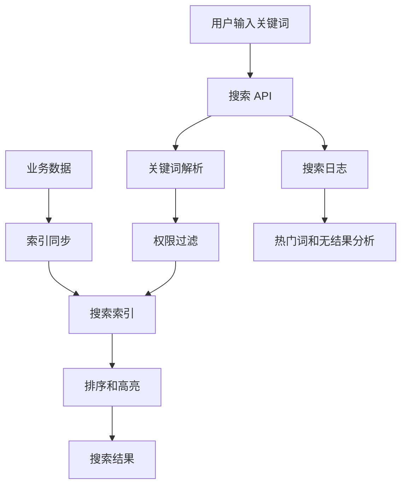
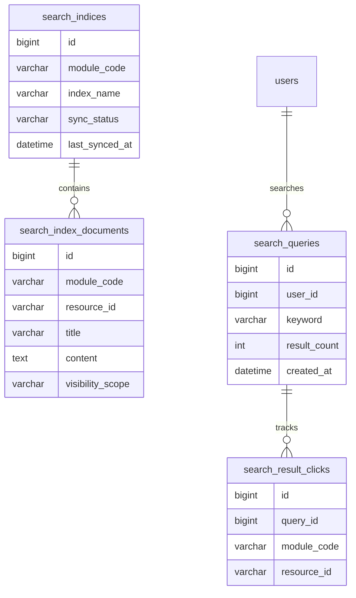
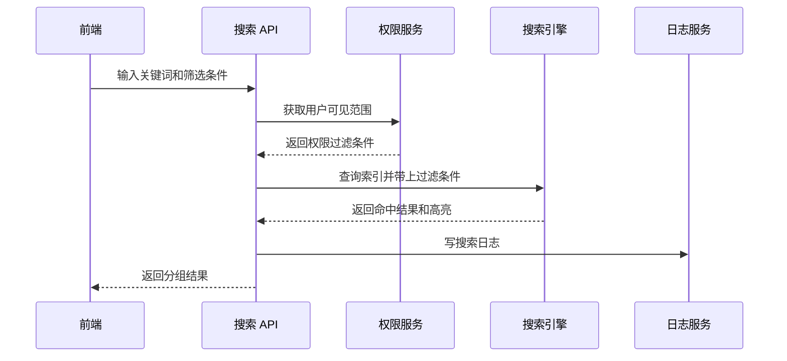

# 搜索中心项目案例

## 适合谁看

适合需要做后台全局搜索、商品搜索、文档搜索、订单检索、筛选排序、高亮、搜索建议和搜索权限控制的开发者。

搜索中心不是“给数据库字段加一个 `LIKE`”。真实项目里，搜索会涉及索引设计、关键词解析、权限过滤、数据同步、排序策略、空结果、搜索日志和性能优化。搜索做得好，用户能快速找到内容；搜索做得差，用户会反复点菜单和筛选。

## 业务目标

第一版搜索中心支持：

- 全局搜索入口。
- 按模块搜索用户、订单、文件、文档。
- 关键词高亮。
- 筛选和排序。
- 权限范围过滤。
- 搜索建议。
- 搜索日志统计。
- 索引重建和增量同步。

## 搜索架构图

第一版可以先用数据库全文索引或普通索引，数据量和搜索复杂度上来后再接入 Elasticsearch、OpenSearch 或 Meilisearch。

## 数据模型

## 推荐表结构

| 表 | 作用 | 关键字段 |
| --- | --- | --- |
| `search_indices` | 索引配置 | `module_code`、`index_name`、`sync_status`、`last_synced_at` |
| `search_index_documents` | 统一搜索文档 | `module_code`、`resource_id`、`title`、`content`、`visibility_scope` |
| `search_queries` | 搜索日志 | `user_id`、`keyword`、`result_count`、`created_at` |
| `search_result_clicks` | 结果点击 | `query_id`、`module_code`、`resource_id`、`rank_position` |
| `search_synced_offsets` | 同步进度 | `module_code`、`last_id`、`last_updated_at` |

如果使用外部搜索引擎，数据库仍然建议保存搜索配置、同步进度和搜索日志。

## 查询流程

搜索权限一定要在后端处理。不要把所有结果返回给前端后再隐藏不可见数据。

## 索引同步策略

| 策略 | 优点 | 风险 | 适合阶段 |
| --- | --- | --- | --- |
| 实时同步 | 数据新鲜 | 写入链路更复杂 | 搜索强依赖业务实时性 |
| 定时同步 | 简单稳定 | 有延迟 | 第一版、后台系统 |
| 事件同步 | 解耦、可扩展 | 要处理重试和乱序 | 中大型系统 |
| 全量重建 | 修复能力强 | 消耗资源 | 夜间任务或人工触发 |

第一版可以用“业务表更新时间 + 定时同步”的方式，先保证可控，再逐步升级为事件驱动。

## 前端页面拆分

| 页面或组件 | 作用 | 注意点 |
| --- | --- | --- |
| 全局搜索框 | 快速输入关键词 | 支持快捷键和清空 |
| 搜索建议面板 | 展示历史词、热门词、模块建议 | 不要阻塞输入 |
| 搜索结果页 | 展示分组结果 | 每条结果要说明来源模块 |
| 筛选区 | 按模块、时间、状态筛选 | 筛选条件要同步到 URL |
| 空结果页 | 引导用户调整关键词 | 展示可能的搜索建议 |
| 索引管理页 | 管理同步状态和重建 | 只给管理员开放 |

## 排序策略

排序不要只按创建时间。可以综合：

- 标题命中优先于正文命中。
- 完全匹配优先于分词匹配。
- 用户有权限的高频模块优先。
- 最近更新的数据优先。
- 被点击更多的结果适当加权。

排序规则需要文档化，否则业务反馈“搜索不准”时很难定位。

## 常见问题

### 问题 1：搜索结果里出现无权限数据

通常是索引里有数据，但查询时没有带权限过滤。解决方式是在搜索 API 层统一拼接租户、部门、角色、数据范围等过滤条件。

### 问题 2：新建数据搜索不到

先确认同步策略。如果是定时同步，要告诉用户存在延迟。如果是事件同步，要查事件是否发送、消费是否失败、索引写入是否成功。

### 问题 3：搜索很慢

不要一次搜索所有模块所有字段。先限制模块范围、关键词长度、分页大小，再优化索引字段和排序规则。

## 验收清单

- 搜索入口明显。
- 结果能显示来源模块和关键字段。
- 筛选条件同步到 URL。
- 后端搜索带权限过滤。
- 搜索日志记录关键词和结果数量。
- 空结果有建议。
- 索引同步状态可查看。
- 支持人工重建索引。
- 大结果集分页返回。

## 下一步学习

继续学习 [数据看板项目案例](/projects/analytics-dashboard-case)、[数据库索引与查询优化](/database/indexes) 和 [浏览器渲染与性能](/browser/rendering-performance)。
