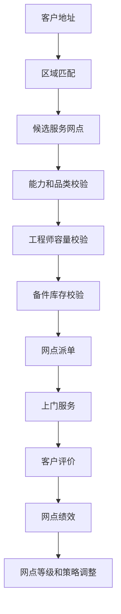
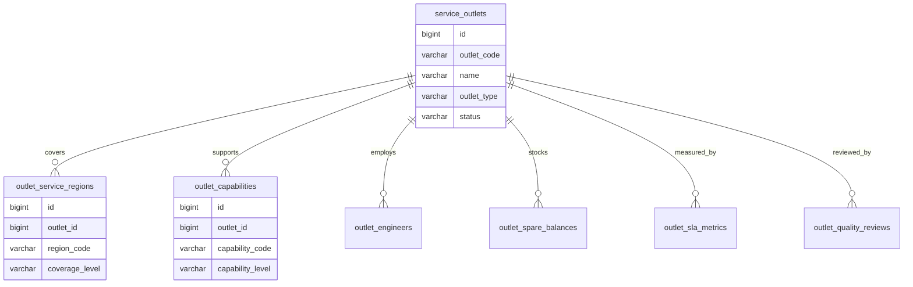
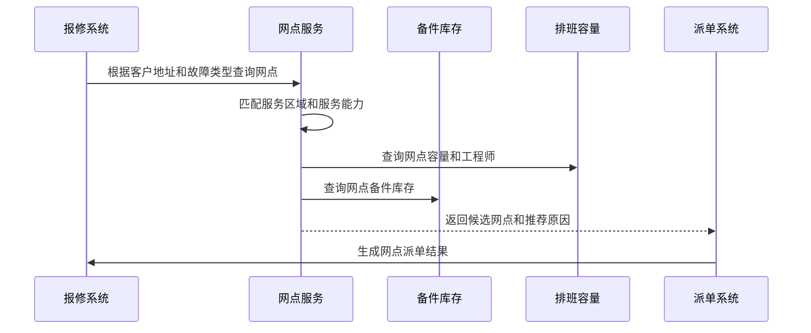

# 服务网点项目案例

## 适合谁看

适合需要做售后服务网点、服务区域、网点能力、工程师管理、派单覆盖、网点库存、服务 SLA 和服务质量评价的开发者。

服务网点不是“地图上标几个门店”。真实项目里，网点会影响报修派单、备件库存、工程师调度、服务时效、客户满意度和区域成本。系统要能回答：这个客户由哪个网点服务、该网点是否有能力处理、是否有备件、是否满足 SLA、服务质量怎么样。

## 业务目标

第一版服务网点支持：

- 维护服务网点档案。
- 配置服务区域和覆盖范围。
- 管理网点服务品类、技能和等级。
- 关联工程师、排班和容量。
- 管理网点备件库存。
- 支持报修派单匹配网点。
- 支持 SLA、服务质量和客户评价统计。
- 支持网点启停、变更和审计。

## 服务网点链路

服务网点的核心是“服务覆盖”。不要只记录网点地址，要记录覆盖区域、服务能力、可服务设备和当前容量。

## 核心概念

| 概念 | 说明 | 示例 |
| --- | --- | --- |
| 服务网点 | 提供本地服务的组织或站点 | 上海浦东服务站 |
| 服务区域 | 网点覆盖的行政区或地理范围 | 浦东新区、奉贤区 |
| 服务能力 | 可处理的设备或故障类型 | 空调维修、传感器更换 |
| 网点等级 | 根据能力和绩效划分 | A 级直营网点 |
| 服务容量 | 某天可处理的工单量 | 每天 30 单 |
| 网点库存 | 网点可用备件 | 主板 10 个 |
| 服务质量 | 响应、修复、满意度等指标 | 准时率 95% |

服务网点既可以是直营网点，也可以是第三方合作商。两者在权限、结算和绩效管理上可能不同。

## 数据模型

## 推荐表结构

| 表 | 作用 | 关键字段 |
| --- | --- | --- |
| `service_outlets` | 服务网点 | `outlet_code`、`name`、`outlet_type`、`status`、`manager_id` |
| `outlet_service_regions` | 服务区域 | `outlet_id`、`region_code`、`coverage_level`、`priority` |
| `outlet_capabilities` | 服务能力 | `outlet_id`、`capability_code`、`capability_level`、`enabled` |
| `outlet_engineers` | 网点工程师 | `outlet_id`、`engineer_id`、`role_code`、`enabled` |
| `outlet_capacity_calendars` | 网点容量日历 | `outlet_id`、`service_date`、`capacity`、`used_capacity` |
| `outlet_spare_balances` | 网点备件库存 | `outlet_id`、`part_id`、`available_qty`、`locked_qty` |
| `outlet_sla_metrics` | SLA 指标 | `outlet_id`、`period_code`、`response_rate`、`fix_rate` |
| `outlet_quality_reviews` | 服务评价 | `outlet_id`、`work_order_id`、`score`、`comment` |
| `outlet_change_logs` | 网点变更 | `outlet_id`、`change_type`、`before_json`、`after_json` |

服务区域要结构化保存。只在备注里写“负责上海东部”，派单系统无法自动匹配。

## 网点匹配流程

网点匹配结果要保存推荐原因。后续如果客户投诉服务慢，团队需要知道当时为什么派给这个网点。

## 网点能力设计

| 能力 | 说明 | 影响 |
| --- | --- | --- |
| 品类能力 | 能处理哪些产品线 | 决定是否能接单 |
| 技能等级 | 工程师技能深度 | 决定复杂故障优先级 |
| 服务区域 | 覆盖哪些城市或区县 | 决定派单候选 |
| 服务时段 | 工作日、夜间、节假日 | 影响 SLA |
| 备件能力 | 是否有常用备件 | 影响一次修复率 |
| 合作类型 | 自营、外包、授权服务商 | 影响结算和权限 |

第一版可以先按行政区匹配，后续再接入经纬度、路程时间和动态容量。

## 前端页面拆分

| 页面或组件 | 作用 | 注意点 |
| --- | --- | --- |
| 服务网点列表 | 查看网点状态和区域 | 支持地区、等级、类型筛选 |
| 网点详情 | 展示区域、能力、工程师、库存和指标 | 按运营视角分区 |
| 服务区域配置 | 维护覆盖区域和优先级 | 防止区域冲突 |
| 能力配置 | 配置品类和技能 | 能力变更要审计 |
| 工程师管理 | 维护网点人员和排班 | 显示容量 |
| 网点库存 | 查看备件可用和锁定 | 与备件库存联动 |
| 网点质量看板 | 查看 SLA、评价和返修率 | 按周期统计 |
| 网点变更审批 | 处理启停和能力变更 | 高影响变更审批 |

网点详情页要服务派单决策，不能只是基础资料。区域、能力、容量和库存应放在高可见位置。

## 接口拆分建议

| 接口 | 作用 | 注意点 |
| --- | --- | --- |
| `GET /service-outlets` | 查询服务网点 | 支持地区、能力、状态筛选 |
| `GET /service-outlets/{id}` | 查看网点详情 | 聚合区域、能力、工程师、库存 |
| `POST /service-outlets/{id}/regions` | 配置服务区域 | 校验区域冲突 |
| `POST /service-outlets/{id}/capabilities` | 配置服务能力 | 保存能力版本和审计 |
| `GET /service-outlets/match` | 匹配候选网点 | 返回推荐原因和排序 |
| `POST /service-outlets/{id}/capacity` | 配置容量 | 与排班和工单占用联动 |
| `GET /service-outlets/{id}/metrics` | 查询网点指标 | 支持周期和指标口径 |

## 实际项目常见问题

### 问题 1：客户地址能匹配多个网点，不知道派给谁

需要配置区域优先级，并结合服务能力、容量、距离和备件库存排序。匹配结果应展示推荐原因。

### 问题 2：网点暂停服务后仍然收到工单

派单系统不能只缓存网点列表。网点状态、服务区域和能力变更后，要刷新派单上下文或使用版本号。

### 问题 3：网点服务质量差但系统仍持续派单

网点绩效要反馈到派单策略。SLA 低、返修率高、投诉多的网点应降权或暂停派单。

### 问题 4：第三方网点能看到不该看的客户数据

直营网点和第三方网点权限边界不同。第三方只应看到被派给自己的工单和必要客户联系信息。

## 权限与审计

服务网点权限至少要区分：

- 查看网点。
- 创建网点。
- 修改服务区域。
- 修改服务能力。
- 管理工程师。
- 查看网点库存。
- 修改网点状态。
- 查看绩效指标。
- 导出服务数据。

服务区域、能力、状态和第三方权限变更都要审计。这些变更会直接影响派单和客户服务。

## 验收清单

- 网点档案有类型、状态和负责人。
- 服务区域结构化，可用于派单匹配。
- 网点能力能关联产品、技能和服务等级。
- 工程师、排班和容量能进入候选匹配。
- 网点备件库存可查询。
- 候选网点能返回推荐原因。
- 网点状态变更能影响派单。
- 网点 SLA、评价和返修率可统计。
- 第三方网点数据权限受控。
- 网点关键变更有审计记录。

## 下一步学习

继续学习 [报修派单项目案例](/projects/repair-dispatch-case)、[售后服务项目案例](/projects/after-sales-service-case)、[备件库存项目案例](/projects/spare-parts-inventory-case) 和 [客户成功平台项目案例](/projects/customer-success-case)。
