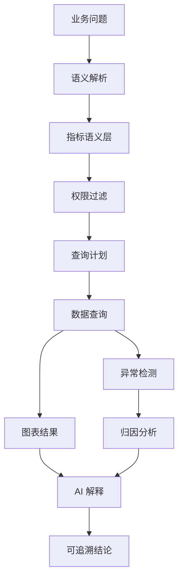
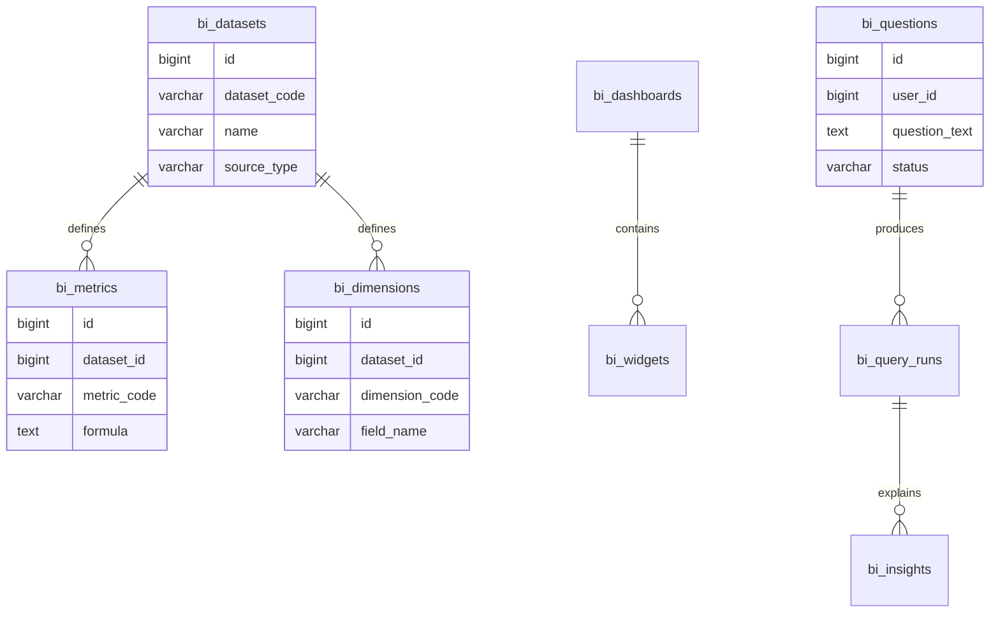
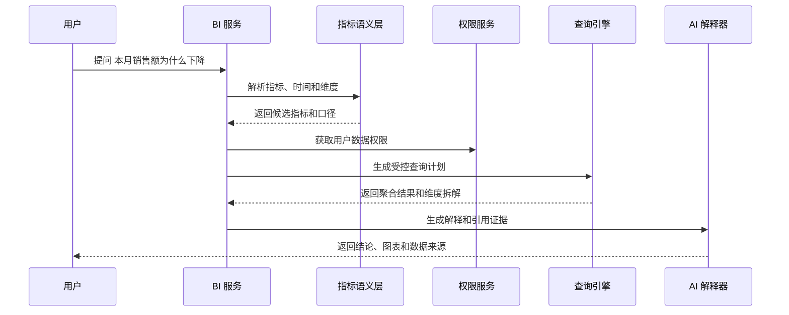

# 智能报表与 BI 分析项目案例

## 适合谁看

适合需要做经营分析、智能问数、指标看板、异常洞察、报表订阅、自然语言查询和数据解释的开发者。

智能报表不是“普通报表加一个聊天框”。真实项目里，用户问“这个月销售为什么下降”时，系统要知道指标口径、权限范围、时间范围、维度拆解、异常归因和引用数据。如果没有指标语义层和权限控制，AI 很容易生成看似合理但不可信的结论。

## 业务目标

第一版智能报表与 BI 分析支持：

- 管理统一指标、维度、数据集和口径说明。
- 支持固定看板和自助分析。
- 支持自然语言问数。
- 支持异常检测和维度归因。
- 支持报表订阅、定时推送和导出。
- 支持数据权限过滤。
- 支持 AI 结论引用数据来源。
- 支持查询日志、成本控制和结果反馈。

## 智能 BI 链路图

关键原则：AI 只负责理解问题、组织解释和辅助分析，指标口径、权限和查询能力必须由受控语义层提供。

## 数据模型

## 推荐表结构

| 表 | 作用 | 关键字段 |
| --- | --- | --- |
| `bi_datasets` | BI 数据集 | `dataset_code`、`source_type`、`refresh_policy` |
| `bi_metrics` | 指标语义 | `metric_code`、`formula`、`business_definition`、`owner_id` |
| `bi_dimensions` | 维度语义 | `dimension_code`、`field_name`、`data_type` |
| `bi_dashboards` | 看板 | `dashboard_code`、`name`、`owner_id`、`visibility` |
| `bi_widgets` | 图表组件 | `dashboard_id`、`widget_type`、`query_config` |
| `bi_questions` | 自然语言问题 | `user_id`、`question_text`、`resolved_metric`、`status` |
| `bi_query_runs` | 查询执行记录 | `question_id`、`query_plan`、`latency_ms`、`row_count` |
| `bi_insights` | AI 洞察 | `query_run_id`、`summary`、`evidence_json`、`confidence` |
| `bi_subscriptions` | 报表订阅 | `dashboard_id`、`receiver_id`、`schedule_cron` |

指标必须有负责人和业务定义。没有口径说明的指标不应该进入智能问数范围。

## 自然语言问数流程

系统不应该直接让 AI 生成 SQL。更稳妥的方式是 AI 选择指标、维度和时间范围，再由查询引擎生成白名单查询。

## 分析能力拆分

| 能力 | 说明 | 第一版做法 |
| --- | --- | --- |
| 固定看板 | 管理层常看的指标 | 使用预设图表和缓存 |
| 自助分析 | 用户选择指标维度 | 限制数据集、字段和时间范围 |
| 智能问数 | 用自然语言查询指标 | 只开放已治理指标 |
| 异常检测 | 发现环比、同比异常 | 设置阈值和波动规则 |
| 归因分析 | 找到影响最大的维度 | 按地区、渠道、产品拆解 |
| 订阅推送 | 定时发送报表 | 保存查询快照和发送记录 |

智能分析要先从可解释的规则开始，不要一开始追求复杂模型。用户更需要可信、可复查的结论。

## 前端页面拆分

| 页面或组件 | 作用 | 注意点 |
| --- | --- | --- |
| BI 首页 | 展示常用看板和最近提问 | 根据权限显示入口 |
| 看板详情 | 查看固定图表 | 显示更新时间和口径 |
| 自助分析页 | 拖拽指标维度 | 限制组合，避免无效查询 |
| 智能问数页 | 输入自然语言问题 | 展示解析结果和可追溯证据 |
| 指标管理 | 维护指标口径 | 指标要有负责人和版本 |
| 异常洞察页 | 查看异常和归因 | 支持确认、忽略和备注 |
| 订阅管理 | 配置推送周期 | 保存接收人和查询快照 |
| 查询日志 | 排查慢查询和错误 | 记录用户、耗时、行数和成本 |

智能问数页要让用户看到“系统理解成了什么”。例如解析出的指标、时间范围、维度和权限范围都应该可见。

## 常见问题

### 问题 1：AI 回答很流畅，但业务不相信

结论必须附带数据来源、指标口径、查询时间、权限范围和图表证据。没有证据的回答只能作为草稿。

### 问题 2：同一个问题不同人问出来数据不一样

通常是数据权限不同或默认时间范围不同。回答里要明确“基于你的权限范围”和具体时间范围。

### 问题 3：自然语言问数经常选错指标

指标命名、同义词和业务描述不够清楚。需要维护指标别名、使用示例和反例，并在低置信度时让用户确认。

### 问题 4：BI 查询拖慢业务库

BI 查询应优先走数仓、只读副本或预聚合表。必须限制时间范围、结果行数、导出上限和并发数。

## 验收清单

- 指标、维度和数据集经过语义层管理。
- 指标有业务定义、负责人和版本。
- 查询必须经过权限过滤。
- AI 不直接执行任意 SQL。
- 自然语言解析结果可见。
- 回答包含数据来源和证据。
- 慢查询、失败查询和高成本查询可追踪。
- 报表订阅保存查询快照。
- 异常洞察可以确认、忽略和复盘。
- 不同权限用户看到的数据范围清晰可解释。

## 下一步学习

继续学习 [报表配置器项目案例](/projects/report-builder-case)、[数据看板项目案例](/projects/analytics-dashboard-case)、[AI 文档问答从零到项目](/ai-engineering/doc-qa-project) 和 [数据治理平台项目案例](/projects/data-governance-case)。
