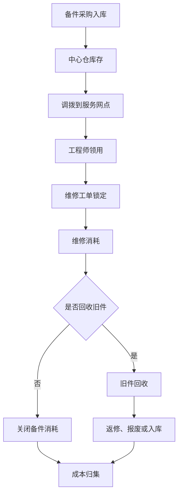
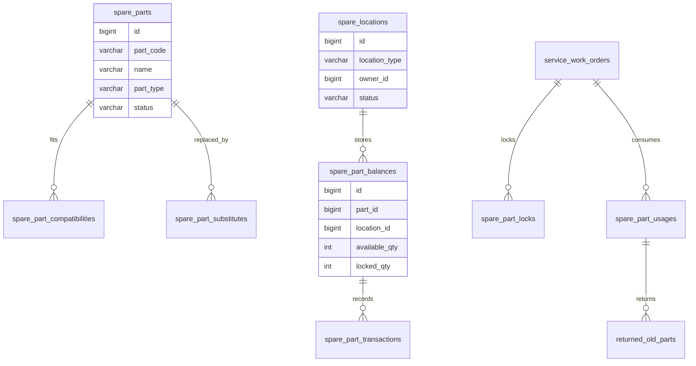
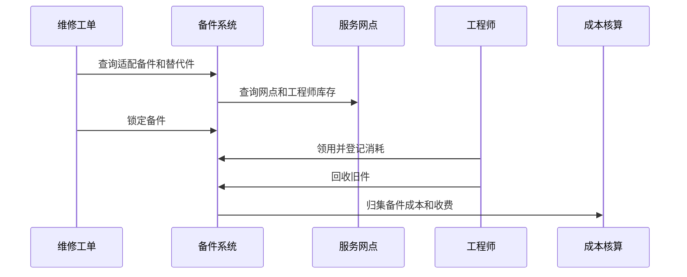

# 备件库存项目案例

## 适合谁看

适合需要做维修备件、服务网点库存、备件领用、备件调拨、旧件回收、备件消耗、补货预警和维修成本分析的开发者。

备件库存不是普通商品库存的简单复制。真实售后维修里，备件会分布在中心仓、服务网点、工程师手中和在途调拨中，还会出现旧件回收、返修件、坏件报废、质保更换和收费更换。系统要能回答：某个工单需要的备件在哪里、能不能锁定、谁领用了、旧件是否回收、库存成本如何核算。

## 业务目标

第一版备件库存支持：

- 维护备件档案、适配设备和替代关系。
- 管理中心仓、网点仓和工程师备件。
- 支持备件入库、领用、退回、调拨和报废。
- 支持维修工单锁定和消耗备件。
- 支持旧件回收和返修件管理。
- 支持备件低库存预警和补货建议。
- 支持备件成本、收费和质保归集。
- 支持备件流水和审计追踪。

## 备件库存链路

备件库存的关键是“位置和责任人”。备件在中心仓、网点、工程师包里和客户现场，管理方式完全不同。

## 核心概念

| 概念 | 说明 | 示例 |
| --- | --- | --- |
| 备件 | 用于维修的零部件 | 主板、电源、传感器 |
| 适配关系 | 备件适用于哪些设备型号 | A 主板适配 X100 |
| 替代件 | 可替代原备件的物料 | B 型电源可替代 A 型 |
| 网点库存 | 服务网点持有的备件 | 上海网点主板 10 个 |
| 工程师库存 | 工程师随身携带备件 | 工程师包库存 |
| 旧件回收 | 更换下来的旧备件 | 换下坏主板 |
| 备件消耗 | 工单实际使用备件 | 工单消耗 1 个主板 |

普通库存只关心 SKU 数量，备件库存还要关心适配、替代、责任人和旧件闭环。

## 数据模型

## 推荐表结构

| 表 | 作用 | 关键字段 |
| --- | --- | --- |
| `spare_parts` | 备件档案 | `part_code`、`name`、`part_type`、`unit`、`status` |
| `spare_part_compatibilities` | 适配关系 | `part_id`、`asset_model`、`compatible_level`、`enabled` |
| `spare_part_substitutes` | 替代关系 | `part_id`、`substitute_part_id`、`priority`、`enabled` |
| `spare_locations` | 备件位置 | `location_type`、`owner_id`、`warehouse_id`、`status` |
| `spare_part_balances` | 备件余额 | `part_id`、`location_id`、`available_qty`、`locked_qty` |
| `spare_part_locks` | 备件锁定 | `part_id`、`work_order_id`、`locked_qty`、`expired_at` |
| `spare_part_transactions` | 备件流水 | `part_id`、`location_id`、`biz_type`、`change_qty`、`biz_no` |
| `spare_part_usages` | 工单消耗 | `work_order_id`、`part_id`、`used_qty`、`cost_amount` |
| `returned_old_parts` | 旧件回收 | `usage_id`、`old_part_status`、`return_status`、`received_at` |
| `spare_replenishment_suggestions` | 补货建议 | `part_id`、`location_id`、`suggest_qty`、`reason` |

备件流水要保存位置。只知道某个备件数量减少了，不知道是哪个网点或哪个工程师消耗，后续无法追责。

## 工单用件流程

备件锁定要有过期时间。工单取消、改约或无需维修时，锁定的备件必须释放。

## 备件动作设计

| 动作 | 库存变化 | 注意点 |
| --- | --- | --- |
| 采购入库 | 中心仓可用增加 | 关联采购和验收 |
| 网点调拨 | 中心仓减少，网点增加 | 支持在途状态 |
| 工程师领用 | 网点减少，工程师增加 | 工程师成为责任人 |
| 工单锁定 | 可用减少，锁定增加 | 防止同一备件被重复使用 |
| 工单消耗 | 锁定减少，生成成本 | 关联维修工单 |
| 旧件回收 | 旧件进入待检测 | 可能返修、报废或入库 |
| 退回备件 | 工程师减少，网点增加 | 校验备件状态 |
| 报废 | 可用减少，生成报废记录 | 高价值备件审批 |

备件库存要区分新件、旧件、返修件和坏件。它们的可用性和成本不同。

## 前端页面拆分

| 页面或组件 | 作用 | 注意点 |
| --- | --- | --- |
| 备件档案 | 管理备件基础信息 | 显示适配设备和替代件 |
| 备件库存总览 | 查看中心仓、网点、工程师库存 | 区分可用、锁定、在途 |
| 工单用件 | 为维修工单选择备件 | 展示适配和库存位置 |
| 调拨管理 | 中心仓、网点、工程师间调拨 | 在途状态清楚 |
| 工程师备件包 | 查看个人领用和退回 | 责任人清晰 |
| 旧件回收 | 跟踪更换下来的旧件 | 未回收要预警 |
| 补货建议 | 查看低库存和建议数量 | 结合消耗速度 |
| 备件成本看板 | 分析消耗、报废和收费 | 按网点、工程师、型号统计 |

工单用件页面要优先展示“可用位置”。工程师需要知道哪个网点有备件、是否可以替代、是否会影响上门时间。

## 接口拆分建议

| 接口 | 作用 | 注意点 |
| --- | --- | --- |
| `GET /spare-parts` | 查询备件档案 | 支持型号、品类、状态筛选 |
| `GET /spare-parts/compatible` | 查询适配备件 | 按设备型号返回备件和替代件 |
| `GET /spare-parts/balances` | 查询库存 | 支持位置、网点、工程师筛选 |
| `POST /spare-parts/locks` | 锁定备件 | 使用工单号保证幂等 |
| `POST /spare-parts/usages` | 登记消耗 | 关联工单和成本 |
| `POST /spare-parts/transfers` | 创建调拨 | 支持中心仓、网点、工程师 |
| `POST /spare-parts/old-returns` | 登记旧件回收 | 跟踪旧件状态 |
| `GET /spare-parts/replenishments` | 查询补货建议 | 返回建议原因 |

## 实际项目常见问题

### 问题 1：工单派出后发现备件被别人用了

派单或预约时需要锁定关键备件。锁定记录要绑定工单，并在工单取消或超时后释放。

### 问题 2：工程师包里的备件长期对不上

工程师领用、消耗、退回和盘点都要生成流水。高价值备件可以要求定期盘点和主管确认。

### 问题 3：旧件没有回收导致成本失控

对需要旧件回收的备件，要在工单完成前检查回收状态。未回收要进入异常任务，并影响工程师或网点考核。

### 问题 4：替代件使用后设备记录不一致

使用替代件要记录原需求备件和实际使用备件，并更新设备维修记录。否则下次维修无法判断设备当前配置。

## 权限与审计

备件库存权限至少要区分：

- 查看备件档案。
- 维护适配关系。
- 查看库存余额。
- 创建调拨。
- 工程师领用。
- 登记工单消耗。
- 登记旧件回收。
- 执行报废。
- 导出备件报表。

调拨、报废、高价值备件消耗和适配关系变更都要审计。备件既影响服务效率，也影响维修成本。

## 验收清单

- 备件档案、适配关系和替代关系清晰。
- 中心仓、网点、工程师库存可区分。
- 备件库存有可用、锁定和在途状态。
- 工单可查询适配备件和可用位置。
- 工单锁定、消耗和释放具备幂等性。
- 旧件回收可追踪。
- 调拨、领用、退回、报废都有流水。
- 补货建议能说明原因。
- 备件成本能关联工单和客户。
- 高风险操作有审批和审计。

## 下一步学习

继续学习 [库存管理项目案例](/projects/inventory-management-case)、[服务网点项目案例](/projects/service-outlet-case)、[报修派单项目案例](/projects/repair-dispatch-case) 和 [设备维保项目案例](/projects/equipment-maintenance-case)。
