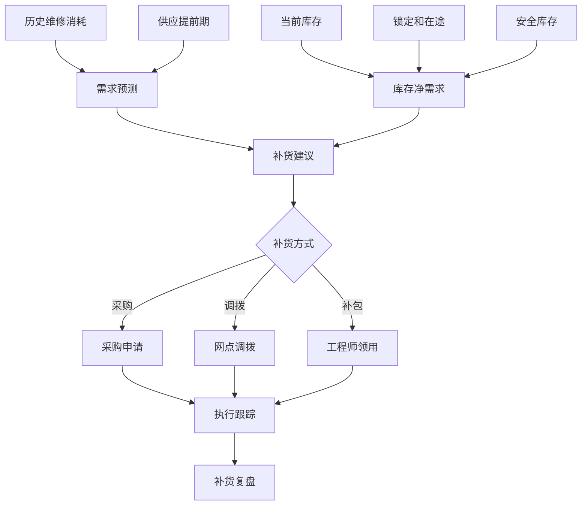
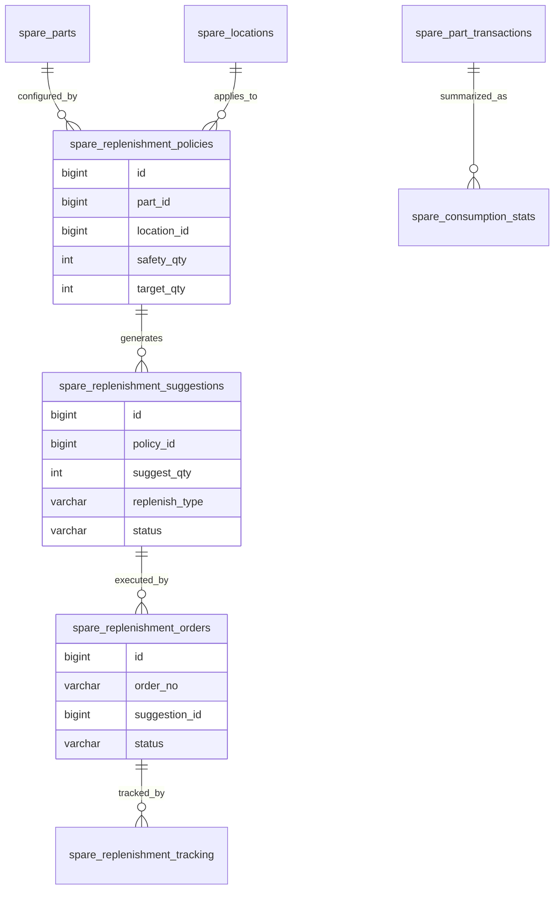
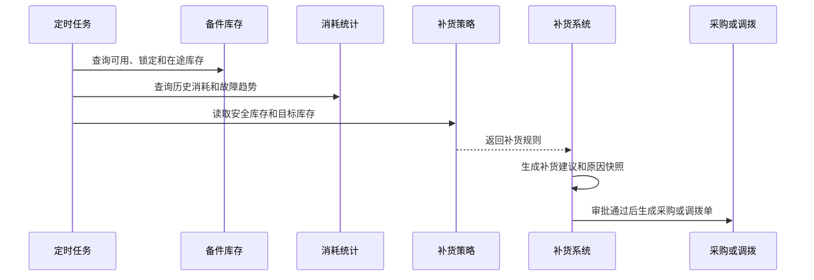

# 备件补货项目案例

## 适合谁看

适合需要做售后备件补货、服务网点补货、工程师备件包补货、库存预警、消耗预测、调拨建议和补货审批的开发者。

备件补货不是“库存低于阈值就采购”。真实项目里，备件补货要考虑设备保有量、故障率、维修消耗、服务网点覆盖、供应提前期、替代件、在途调拨、工程师备件包和资金占用。系统要能解释为什么某个网点需要补 10 个主板，而不是只给一个数量。

## 业务目标

第一版备件补货支持：

- 维护备件安全库存和补货点。
- 按中心仓、服务网点和工程师库存生成补货建议。
- 汇总历史消耗、故障率、在途和锁定库存。
- 支持替代件和适配关系参与补货计算。
- 支持采购补货、网点调拨和工程师补包。
- 支持补货审批、执行跟踪和复盘。
- 支持缺件预警、超储预警和补货成本分析。

## 备件补货链路

备件补货的关键是“补到哪里”。中心仓、网点和工程师包的补货规则不同，不能只维护一个全局库存阈值。

## 核心概念

| 概念 | 说明 | 示例 |
| --- | --- | --- |
| 安全库存 | 防止缺件的缓冲数量 | 网点主板安全库存 5 |
| 补货点 | 触发补货的库存阈值 | 可用加在途小于 8 |
| 目标库存 | 希望补到的库存水平 | 补到 15 个 |
| 净需求 | 扣除可用、锁定、在途后的需求 | 还缺 6 个 |
| 供应提前期 | 从下单到可用的时间 | 7 天 |
| 替代件 | 可替代原备件的物料 | B 可替代 A |
| 补货方式 | 采购、调拨或补包 | 从中心仓调拨 |

第一版可以先用规则计算补货，不必做复杂预测模型。但规则计算过程要展示给业务看。

## 数据模型

## 推荐表结构

| 表 | 作用 | 关键字段 |
| --- | --- | --- |
| `spare_replenishment_policies` | 补货策略 | `part_id`、`location_id`、`safety_qty`、`target_qty`、`lead_days` |
| `spare_consumption_stats` | 消耗统计 | `part_id`、`location_id`、`period_code`、`used_qty`、`fault_count` |
| `spare_replenishment_suggestions` | 补货建议 | `policy_id`、`suggest_qty`、`replenish_type`、`reason_snapshot` |
| `spare_replenishment_orders` | 补货执行单 | `order_no`、`suggestion_id`、`source_location_id`、`target_location_id` |
| `spare_replenishment_approvals` | 补货审批 | `order_id`、`node_name`、`action`、`operator_id` |
| `spare_replenishment_tracking` | 执行跟踪 | `order_id`、`tracking_status`、`executed_qty`、`completed_at` |
| `spare_shortage_alerts` | 缺件预警 | `part_id`、`location_id`、`shortage_qty`、`risk_level` |
| `spare_overstock_alerts` | 超储预警 | `part_id`、`location_id`、`overstock_qty`、`reason` |

补货建议要保存原因快照，例如当前库存、锁定库存、在途数量、近 30 天消耗和提前期。否则后续无法复盘建议是否合理。

## 补货生成流程

补货建议和执行单要分开。建议只是系统计算结果，执行需要业务确认、审批或自动策略触发。

## 补货方式设计

| 补货方式 | 适用场景 | 注意点 |
| --- | --- | --- |
| 采购补货 | 中心仓整体缺货 | 关联供应商和采购周期 |
| 网点调拨 | 某网点缺货、其他网点富余 | 计算运输时间 |
| 工程师补包 | 工程师常用件不足 | 限制随身库存上限 |
| 替代件补货 | 原件缺货但替代件可用 | 需要适配关系 |
| 紧急补货 | 高优先级工单缺件 | 审批和成本单独标记 |
| 退回再分配 | 工程师或网点长期闲置 | 防止超储 |

不要把所有缺件都转成采购。很多时候调拨比采购更快，也能减少资金占用。

## 前端页面拆分

| 页面或组件 | 作用 | 注意点 |
| --- | --- | --- |
| 补货工作台 | 查看缺件、超储和待审批 | 优先展示高风险网点 |
| 补货策略 | 设置安全库存和目标库存 | 支持按网点和备件配置 |
| 补货建议 | 展示建议数量和原因 | 计算过程要可解释 |
| 补货审批 | 审批采购、调拨和补包 | 展示成本和服务风险 |
| 补货执行 | 跟踪采购或调拨状态 | 区分在途和完成 |
| 缺件预警 | 查看影响工单和网点 | 支持升级处理 |
| 超储预警 | 查看长期闲置备件 | 支持调回或调拨 |
| 补货复盘 | 对比建议、执行和实际消耗 | 修正规则参数 |

补货建议页要避免只给数量。至少要展示当前可用、锁定、在途、近期消耗、安全库存和目标库存。

## 接口拆分建议

| 接口 | 作用 | 注意点 |
| --- | --- | --- |
| `GET /spare-replenishment/policies` | 查询补货策略 | 支持备件和位置筛选 |
| `POST /spare-replenishment/generate` | 生成补货建议 | 保存原因快照 |
| `GET /spare-replenishment/suggestions` | 查询建议 | 支持缺件、超储、状态筛选 |
| `POST /spare-replenishment/orders` | 创建补货执行单 | 防止重复转单 |
| `POST /spare-replenishment/orders/{id}/approve` | 补货审批 | 保存审批意见 |
| `POST /spare-replenishment/orders/{id}/execute` | 执行补货 | 关联采购或调拨 |
| `GET /spare-replenishment/alerts` | 查询预警 | 返回影响工单和网点 |
| `GET /spare-replenishment/review` | 查询补货复盘 | 对比建议和实际消耗 |

## 实际项目常见问题

### 问题 1：低库存预警很多，但业务不处理

预警要分级。影响高优先级工单、核心网点和高频故障的缺件要优先处理，长尾低频备件可以降低等级。

### 问题 2：补货后仍然缺件

可能没有考虑供应提前期和在途延迟。补货计算要把预计到货时间纳入判断，而不是只看当前库存。

### 问题 3：某些网点大量备件闲置

要做超储预警和跨网点调拨建议。长期未消耗的备件可以调回中心仓或调给高消耗网点。

### 问题 4：替代件没有参与补货导致误报缺货

补货计算要读取替代关系。原件缺货但替代件可用时，应提示“可替代满足”或建议补替代件。

## 权限与审计

备件补货权限至少要区分：

- 查看补货建议。
- 配置补货策略。
- 生成补货建议。
- 创建补货执行单。
- 审批补货。
- 执行调拨或采购。
- 关闭缺件预警。
- 查看补货复盘。

补货策略、手工调整建议、紧急补货和关闭预警都要审计。补货直接影响服务 SLA 和库存资金占用。

## 验收清单

- 补货策略能按备件和位置配置。
- 当前库存、锁定、在途和历史消耗能进入计算。
- 补货建议保存原因快照。
- 支持采购、调拨和工程师补包。
- 替代件能参与补货判断。
- 缺件和超储有预警。
- 补货建议转执行单有防重。
- 补货执行状态可追踪。
- 补货复盘能对比建议和实际消耗。
- 策略变更和紧急补货有审计记录。

## 下一步学习

继续学习 [备件库存项目案例](/projects/spare-parts-inventory-case)、[服务网点项目案例](/projects/service-outlet-case)、[报修派单项目案例](/projects/repair-dispatch-case) 和 [供应链计划项目案例](/projects/supply-chain-planning-case)。
