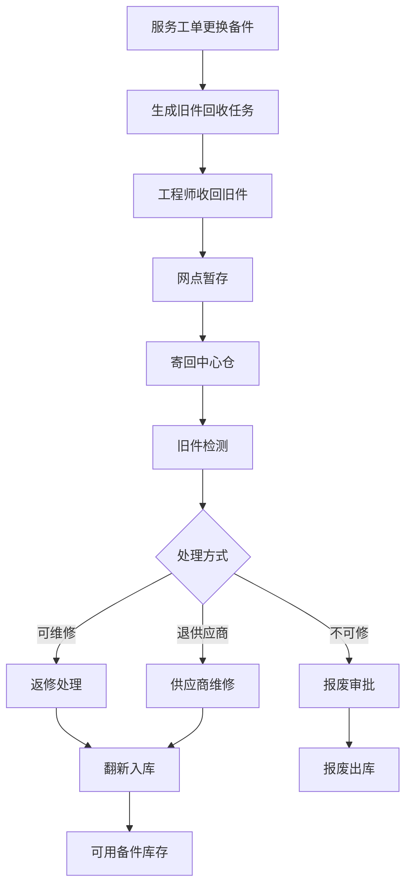
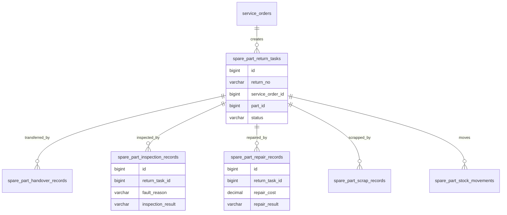
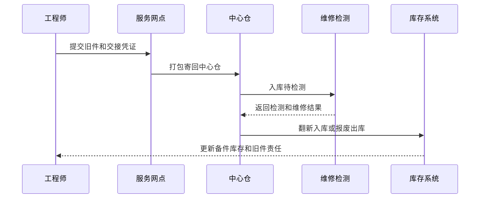

# 备件旧件返修项目案例

## 适合谁看

适合需要做备件旧件回收、返修入库、维修检测、翻新再利用、报废、供应商维修、序列号追踪和成本核算的开发者。

备件旧件返修不是“把坏件寄回来”。真实项目里，旧件可能来自维修工单、换货、服务网点、工程师背包或客户退回。系统要能回答：旧件从哪里来、是否应该回收、当前在哪、是否可修、维修成本多少、修好后能否重新入库、报废原因是什么。

## 业务目标

第一版备件旧件返修支持：

- 从服务工单或备件领用生成旧件回收任务。
- 支持工程师、网点、仓库之间的旧件交接。
- 支持旧件检测、维修、翻新、报废和退供应商。
- 支持序列号、批次、故障原因和维修记录追踪。
- 支持返修成本、可用库存和残值管理。
- 支持旧件逾期未回收提醒。
- 支持返修后重新入库或报废出库。
- 支持审计和质量问题复盘。

## 备件旧件返修链路

旧件返修的关键是“在途和责任”。旧件从工程师手里到网点，再到中心仓，每一步都要知道责任人和交接时间。

## 核心概念

| 概念 | 说明 | 示例 |
| --- | --- | --- |
| 旧件 | 被替换下来的故障备件 | 损坏主板 |
| 回收任务 | 要求工程师或网点归还旧件 | 工单完成后 7 天内回收 |
| 检测 | 判断旧件是否可修 | 外观、通电、功能测试 |
| 返修 | 对旧件进行维修或翻新 | 更换小元件 |
| 报废 | 旧件无维修价值 | 严重烧毁 |
| 退供应商 | 质保期内退回供应商维修 | 厂商返修 |
| 翻新入库 | 修好后重新成为可用库存 | 良品备件 |
| 残值 | 报废或回收剩余价值 | 废料回收金额 |

旧件和新件要用同一套库存思想，但状态不同。旧件在检测前不能当作可用库存。

## 数据模型

## 推荐表结构

| 表 | 作用 | 关键字段 |
| --- | --- | --- |
| `spare_part_return_tasks` | 旧件回收任务 | `return_no`、`service_order_id`、`part_id`、`serial_no`、`status` |
| `spare_part_handover_records` | 交接记录 | `return_task_id`、`from_holder`、`to_holder`、`handover_at`、`proof_file_id` |
| `spare_part_inspection_records` | 检测记录 | `return_task_id`、`fault_reason`、`inspection_result`、`inspector_id` |
| `spare_part_repair_records` | 返修记录 | `return_task_id`、`repair_type`、`repair_cost`、`repair_result` |
| `spare_part_supplier_repairs` | 供应商返修 | `return_task_id`、`supplier_id`、`sent_at`、`returned_at`、`result` |
| `spare_part_scrap_records` | 报废记录 | `return_task_id`、`scrap_reason`、`residual_value`、`approval_status` |
| `spare_part_stock_movements` | 库存流水 | `part_id`、`serial_no`、`movement_type`、`warehouse_id` |
| `spare_part_return_alerts` | 回收预警 | `return_task_id`、`alert_type`、`alert_level`、`status` |

序列号备件必须全程追踪。没有序列号的低值耗材可以按批次处理，但高价值备件不要只按数量管理。

## 旧件处理流程

旧件流程一定要有交接凭证。照片、签收单、物流单号和扫码记录都可以作为责任证据。

## 旧件状态设计

| 状态 | 含义 | 注意点 |
| --- | --- | --- |
| 待回收 | 服务完成后旧件应回收 | 开始计算时限 |
| 工程师持有 | 旧件在工程师手里 | 责任人明确 |
| 网点暂存 | 旧件已交到服务网点 | 等待寄回 |
| 在途 | 旧件寄回中心仓 | 记录物流 |
| 待检测 | 中心仓已收到 | 不可用库存 |
| 维修中 | 正在返修或供应商维修 | 记录成本 |
| 可入库 | 维修完成可复用 | 需要质量确认 |
| 已入库 | 成为可用备件 | 更新库存 |
| 已报废 | 不可继续使用 | 保留审批 |
| 已丢失 | 超期无法追回 | 触发赔付或处罚 |

旧件状态和库存状态要联动，但不要混成一个字段。旧件可能“待检测”，库存上则应该是“不可用库存”。

## 前端页面拆分

| 页面或组件 | 作用 | 注意点 |
| --- | --- | --- |
| 旧件回收任务 | 查看待回收、超期和在途旧件 | 按责任人筛选 |
| 工程师交接 | 工程师提交旧件照片和交接 | 移动端扫码优先 |
| 网点暂存 | 网点确认收件和打包寄回 | 支持批量交接 |
| 中心仓收货 | 扫码收货并进入待检测 | 记录物流差异 |
| 旧件检测 | 填写故障、外观和检测结果 | 支持图片和报告 |
| 返修管理 | 记录维修过程和成本 | 区分自修和供应商修 |
| 报废审批 | 审批不可修旧件 | 展示残值和原因 |
| 旧件追踪详情 | 展示全链路轨迹 | 工单、备件、交接、维修、库存 |

旧件追踪详情页要像物流轨迹一样清晰。业务最常问的问题是“这个旧件现在在哪里，卡在谁手里”。

## 接口拆分建议

| 接口 | 作用 | 注意点 |
| --- | --- | --- |
| `POST /spare-part-returns` | 创建旧件回收任务 | 通常由服务工单触发 |
| `POST /spare-part-returns/{id}/handover` | 旧件交接 | 保存责任人和凭证 |
| `POST /spare-part-returns/{id}/receive` | 中心仓收货 | 校验序列号 |
| `POST /spare-part-returns/{id}/inspect` | 旧件检测 | 保存故障和处理建议 |
| `POST /spare-part-returns/{id}/repair` | 返修记录 | 记录成本和结果 |
| `POST /spare-part-returns/{id}/supplier-repair` | 供应商返修 | 记录发出和返回 |
| `POST /spare-part-returns/{id}/scrap` | 报废申请 | 高价值备件走审批 |
| `GET /spare-part-returns/traces/{serialNo}` | 查询序列号轨迹 | 展示全生命周期 |

## 实际项目常见问题

### 问题 1：工单换件了，但旧件没有追回

服务工单完成时要自动生成旧件回收任务。超期未回收要提醒工程师、网点主管和运营人员。

### 问题 2：旧件回仓后被当作可用库存

旧件回仓只能进入待检测或不可用库存。检测合格并翻新入库后，才能进入可用库存。

### 问题 3：供应商返修周期无法追踪

供应商返修要记录寄出、签收、维修中、寄回、验收结果。不能只在备注里写“已寄给供应商”。

### 问题 4：返修成本超过新件成本

返修前要判断维修成本和新件采购价。超过阈值时应建议报废或走特殊审批。

## 权限与审计

备件旧件返修权限至少要区分：

- 创建旧件回收任务。
- 工程师旧件交接。
- 网点暂存和寄回。
- 中心仓收货。
- 执行旧件检测。
- 登记返修结果。
- 发起供应商返修。
- 发起和审批报废。
- 查看序列号全生命周期。

交接、检测、返修、报废、库存转换和丢失处理都要审计。旧件返修涉及资产和成本，不能只靠线下表格。

## 验收清单

- 服务工单换件后能生成旧件回收任务。
- 旧件责任人、位置和状态清晰。
- 工程师、网点、仓库交接有凭证。
- 支持检测、返修、供应商维修和报废。
- 旧件在检测前不进入可用库存。
- 返修后可翻新入库并生成库存流水。
- 超期未回收可提醒。
- 序列号或批次可追踪。
- 返修成本和报废残值可记录。
- 关键操作有审计记录。

## 下一步学习

继续学习 [备件库存项目案例](/projects/spare-parts-inventory-case)、[备件补货项目案例](/projects/spare-parts-replenishment-case)、[报修派单项目案例](/projects/repair-dispatch-case) 和 [仓储物流项目案例](/projects/warehouse-logistics-case)。
