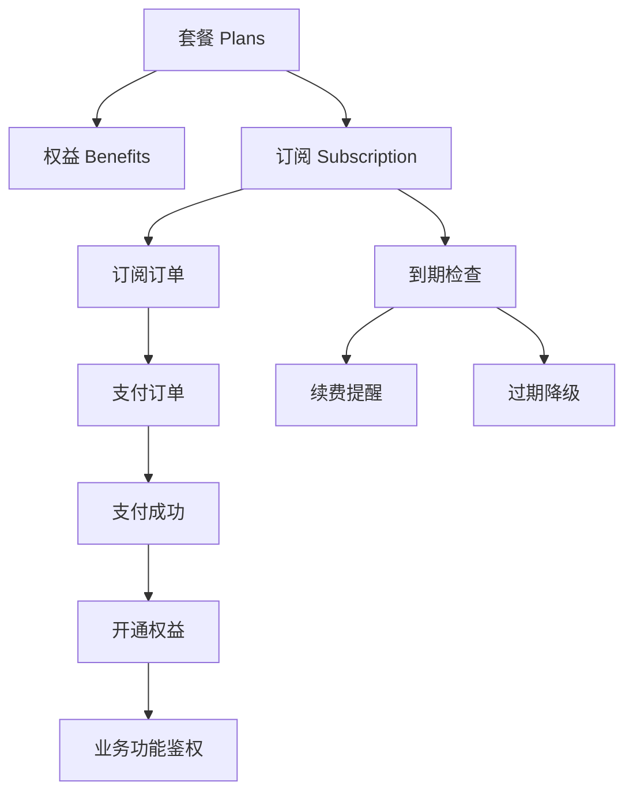
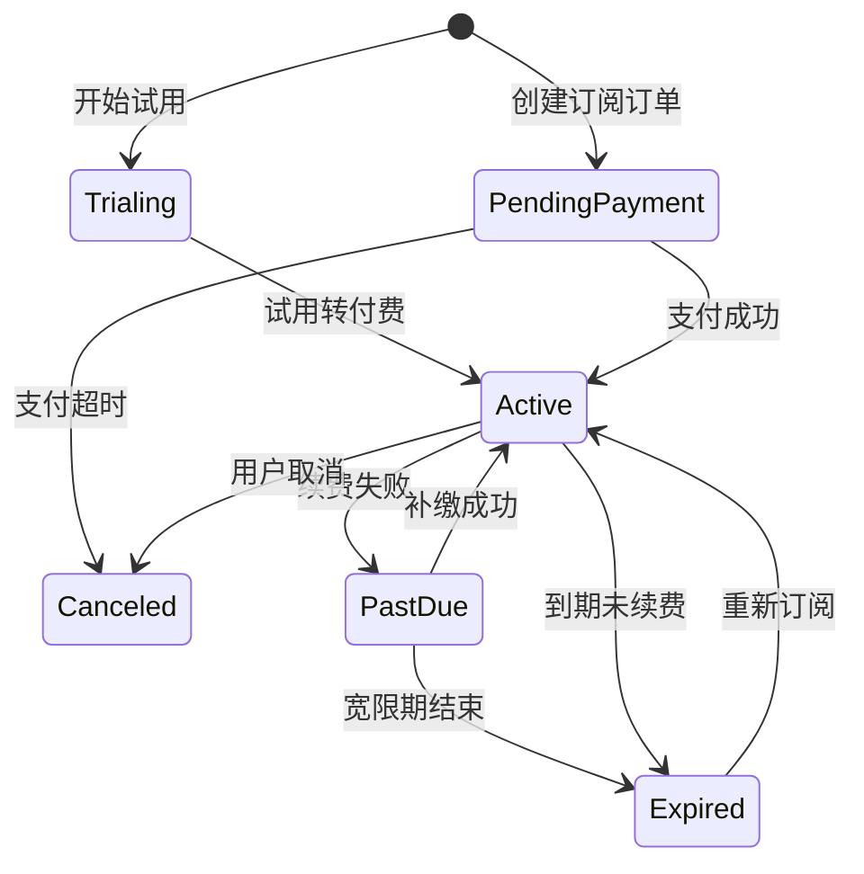
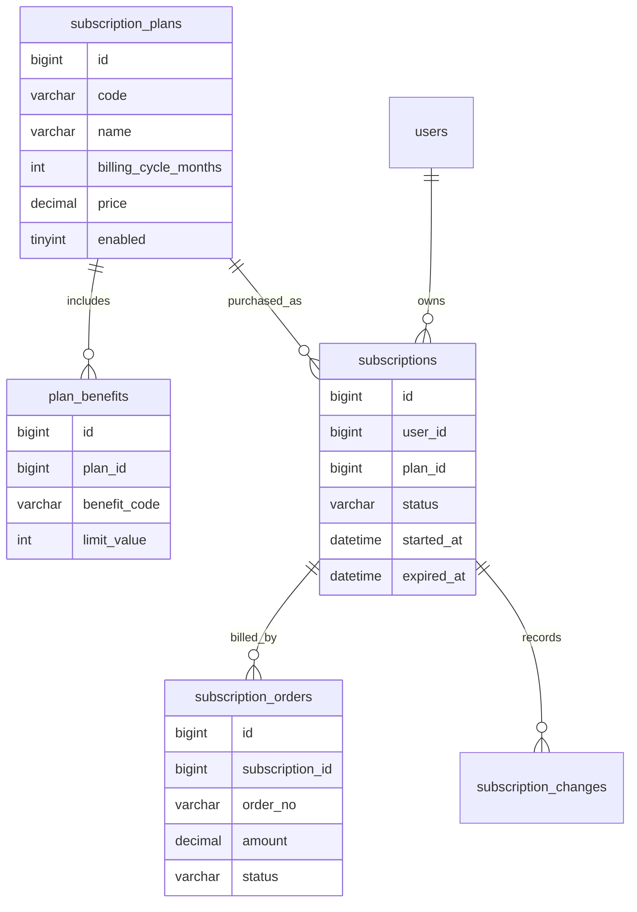
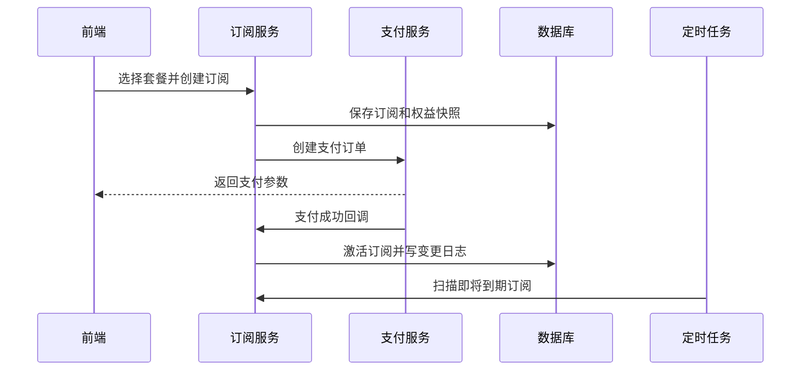

# 会员订阅项目案例

## 适合谁看

适合正在做 SaaS 套餐、会员等级、课程会员、内容订阅、企业席位购买、自动续费和权益控制的开发者。

会员订阅不是“支付成功后给用户加一个会员标记”。真实项目里，它会影响套餐定价、权益快照、试用期、续费、到期、降级、退款、发票、对账、通知和权限判断。设计不好，最容易出现“用户已经付费但权益没开通”或者“会员过期后还能继续使用”的问题。

## 业务目标

第一版会员订阅模块支持：

- 配置套餐和套餐权益。
- 创建订阅订单。
- 支持试用期。
- 支持按月、按年订阅。
- 支持续费和到期关闭。
- 支持套餐升级和降级。
- 支持权益校验。
- 支持订阅变更日志。
- 支持到期前通知。

## 核心关系图



关键点：套餐定义、订阅实例、支付订单和实际权益要分开。套餐可以修改，但历史订阅必须保留当时购买的权益快照。

从用户视角看，订阅模块最重要的体验是“付费后立即开通、到期前能提醒、到期后能降级”。因此后端必须把到期降级当成明确流程，而不是依赖前端页面临时判断。

## 状态机



订阅状态要服务业务判断。不要只看订单是否支付成功，因为一个用户可能支付过历史订单，但当前订阅已经过期。

## 数据模型



## 推荐表结构

| 表 | 作用 | 关键字段 |
| --- | --- | --- |
| `subscription_plans` | 套餐定义 | `code`、`name`、`billing_cycle_months`、`price`、`enabled` |
| `plan_benefits` | 套餐权益 | `plan_id`、`benefit_code`、`limit_value`、`unit` |
| `subscriptions` | 用户订阅实例 | `user_id`、`plan_id`、`status`、`started_at`、`expired_at` |
| `subscription_orders` | 订阅订单 | `subscription_id`、`order_no`、`amount`、`status` |
| `subscription_snapshots` | 订阅权益快照 | `subscription_id`、`plan_snapshot`、`benefit_snapshot` |
| `subscription_changes` | 订阅变更日志 | `subscription_id`、`change_type`、`before_data`、`after_data` |

权益快照很重要。用户购买时看到的是 A 套餐，即使后来套餐价格或权益调整，也不能影响已经生效的历史周期。

## 开通流程



开通订阅要和支付回调保持幂等。支付平台多次回调时，不能重复延长有效期或重复发权益。

## 权益判断

权益判断一般有两类：

| 类型 | 示例 | 判断方式 |
| --- | --- | --- |
| 功能开关 | 是否能使用高级报表 | 查询当前订阅是否包含 `advanced_report` |
| 数量限制 | 最多创建 10 个项目 | 查询权益上限，再统计当前使用量 |

示例：

```ts
async function canCreateProject(userId: string) {
  const entitlement = await subscriptionService.getEntitlement(userId, 'project_count')
  const currentCount = await projectRepository.countByUser(userId)
  return currentCount < entitlement.limitValue
}
```

不要只在前端隐藏按钮。后端接口必须再次校验权益。

## 前端页面拆分

| 页面 | 作用 | 注意点 |
| --- | --- | --- |
| 套餐列表页 | 展示套餐价格和权益 | 清楚说明周期、限制和试用条件 |
| 订阅确认页 | 确认套餐、金额、协议 | 金额由后端返回 |
| 支付结果页 | 展示订阅开通状态 | 不只看前端支付结果 |
| 我的订阅页 | 查看当前套餐和到期时间 | 提供续费、升级、取消入口 |
| 权益用量页 | 展示项目数、成员数、容量等 | 数量限制要让用户看得懂 |
| 订阅日志页 | 查看升级、续费、过期记录 | 便于客服排查 |

## 常见问题

### 问题 1：用户支付成功，但会员没有开通

先查支付回调是否到达、验签是否成功、订阅订单是否已处理、事务是否回滚。前端页面要有“开通确认中”的状态，不要直接显示失败。

### 问题 2：用户升级套餐后，旧套餐权益还在

常见原因是权限或权益缓存没有按订阅变更失效。升级、降级、续费、退款都要清理权益缓存。

### 问题 3：套餐改价后影响了老用户

说明订阅没有保存快照。套餐定义是当前售卖配置，订阅快照才是用户当前周期的合同依据。

## 验收清单

- 套餐和权益可以独立配置。
- 订阅保存套餐和权益快照。
- 支付回调幂等。
- 当前权益以有效订阅为准。
- 升级、降级、续费、取消都有变更日志。
- 到期前能提醒。
- 过期后能自动降级或关闭权益。
- 后端接口校验权益，不只依赖前端显示。
- 金额使用整数分或 decimal，不使用浮点数。

## 下一步学习

继续学习 [支付订单项目案例](/projects/payment-order-case)、[消息通知项目案例](/projects/notification-center-case) 和 [数据库事务](/database/transactions)。
