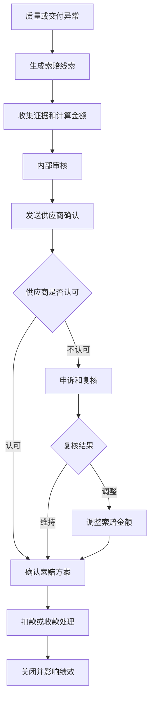
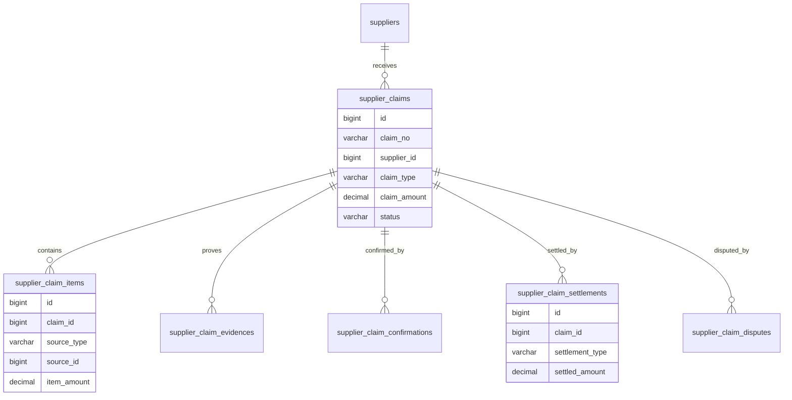
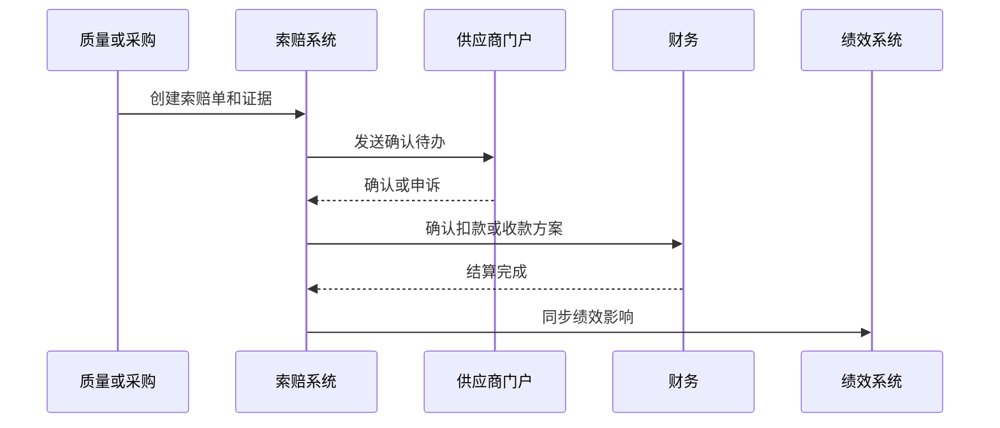

# 供应商索赔项目案例

## 适合谁看

适合需要做供应商质量索赔、交付索赔、缺货索赔、价格差异索赔、扣款、赔付确认、供应商协同和财务结算的开发者。

供应商索赔不是“给供应商发一封邮件要求赔钱”。真实采购项目里，索赔可能来自质量不良、延期交付、少发漏发、包装破损、售后故障、客户赔付、合同违约和价格差异。系统要能回答：索赔依据是什么、金额怎么算、供应商是否认可、是否能从应付账款中扣减、是否影响绩效和准入。

## 业务目标

第一版供应商索赔支持：

- 从质检不合格、售后成本、采购交付、合同违约和财务差异生成索赔线索。
- 支持索赔类型、证据、金额计算和责任判定。
- 支持供应商在线确认、申诉和补充材料。
- 支持采购、质量、法务、财务审批。
- 支持扣款、供应商付款、贷项通知、补货补偿等处理方式。
- 支持索赔和应付账款、发票、采购订单、供应商绩效联动。
- 支持索赔超时、争议升级和关闭复盘。
- 支持索赔金额、成功率、供应商排名和质量成本分析。

## 供应商索赔链路

供应商索赔的关键是“证据和结算闭环”。没有证据，供应商难以认可；没有结算闭环，索赔只停留在业务记录。

## 核心概念

| 概念 | 说明 | 示例 |
| --- | --- | --- |
| 索赔线索 | 可能需要向供应商索赔的事件 | 到货不合格 |
| 索赔单 | 已正式发起的索赔业务单 | 质量索赔单 |
| 索赔依据 | 支持索赔的合同、质检、交付证据 | 质检报告 |
| 索赔金额 | 按规则计算的应赔金额 | 返工费、客户赔付 |
| 供应商确认 | 供应商认可或申诉 | 门户确认 |
| 扣款 | 从应付账款或发票中扣减 | 应付扣 5000 |
| 贷项通知 | 供应商开具抵减凭证 | Credit note |
| 争议升级 | 双方无法达成一致时升级 | 法务介入 |

供应商索赔要和供应商绩效联动。反复索赔说明供应商质量或交付能力存在问题。

## 数据模型

## 推荐表结构

| 表 | 作用 | 关键字段 |
| --- | --- | --- |
| `supplier_claims` | 索赔主表 | `claim_no`、`supplier_id`、`claim_type`、`claim_amount`、`status` |
| `supplier_claim_items` | 索赔明细 | `claim_id`、`source_type`、`source_id`、`item_amount`、`reason_code` |
| `supplier_claim_evidences` | 索赔证据 | `claim_id`、`file_id`、`evidence_type`、`source_no` |
| `supplier_claim_rules` | 索赔规则 | `claim_type`、`formula_config`、`enabled`、`version_no` |
| `supplier_claim_confirmations` | 供应商确认 | `claim_id`、`action`、`comment`、`confirmed_at` |
| `supplier_claim_disputes` | 争议记录 | `claim_id`、`dispute_reason`、`resolution`、`status` |
| `supplier_claim_settlements` | 结算记录 | `claim_id`、`settlement_type`、`payable_id`、`settled_amount` |
| `supplier_claim_impacts` | 绩效影响 | `claim_id`、`score_period`、`impact_score`、`status` |

索赔金额要保存计算快照。合同违约金、返工费、客户赔付和物流损失的计算公式可能不同。

## 索赔确认流程

供应商申诉不是简单驳回。申诉要进入复核，复核结果可能维持、调低、取消或转为其他处理方式。

## 索赔状态设计

| 状态 | 含义 | 注意点 |
| --- | --- | --- |
| 线索 | 系统发现可能索赔 | 可合并或忽略 |
| 草稿 | 内部整理证据和金额 | 可编辑 |
| 待内部审核 | 提交采购、质量、财务审核 | 核心字段冻结 |
| 待供应商确认 | 已发送供应商 | 计算确认时限 |
| 申诉中 | 供应商不认可 | 需要复核 |
| 待结算 | 双方确认等待扣款或收款 | 财务处理 |
| 部分结算 | 已结算部分金额 | 保留余额 |
| 已关闭 | 索赔完成 | 同步绩效 |
| 已取消 | 放弃索赔 | 必填原因 |

索赔关闭前要检查结算结果。供应商口头认可但未扣款，不算闭环。

## 前端页面拆分

| 页面或组件 | 作用 | 注意点 |
| --- | --- | --- |
| 索赔工作台 | 查看线索、待确认、申诉中、待结算 | 按金额和逾期排序 |
| 索赔创建 | 选择来源单据、证据和索赔规则 | 支持批量生成 |
| 索赔详情 | 展示供应商、证据、金额、确认和结算 | 一页看完证据链 |
| 供应商确认页 | 供应商认可或申诉 | 门户权限隔离 |
| 申诉复核 | 处理供应商异议 | 保留复核意见 |
| 结算处理 | 选择扣应付、收款、贷项通知 | 和财务联动 |
| 索赔规则配置 | 配置不同类型公式 | 规则版本化 |
| 索赔分析看板 | 分析金额、成功率、供应商和类型 | 影响绩效 |

索赔详情页要把“索赔依据”和“金额计算过程”放在一起。供应商最常争议的是金额为什么这么算。

## 接口拆分建议

| 接口 | 作用 | 注意点 |
| --- | --- | --- |
| `POST /supplier-claims/from-source` | 从异常来源生成索赔 | 来源幂等 |
| `POST /supplier-claims/{id}/submit` | 提交内部审核 | 冻结金额和证据 |
| `POST /supplier-claims/{id}/send` | 发送供应商确认 | 生成门户待办 |
| `POST /supplier-claims/{id}/confirm` | 供应商确认 | 保存确认意见 |
| `POST /supplier-claims/{id}/dispute` | 提交申诉 | 必填原因和附件 |
| `POST /supplier-claims/{id}/settle` | 索赔结算 | 关联应付或收款 |
| `POST /supplier-claims/{id}/cancel` | 取消索赔 | 必填原因 |
| `GET /supplier-claims/analysis` | 查询索赔分析 | 供应商、类型、期间 |

## 实际项目常见问题

### 问题 1：索赔证据散落在多个系统

索赔单要关联质检报告、到货记录、工单、客户赔付、合同条款和照片附件。不要只靠备注。

### 问题 2：供应商认可了但财务没有扣款

确认和结算要分开。待结算状态必须进入财务待办，直到扣应付、收款或贷项处理完成。

### 问题 3：同一质量问题重复索赔

来源单据和批次要做幂等。一个质检异常可以拆多条索赔明细，但不能重复生成主索赔。

### 问题 4：索赔影响绩效但供应商不知道

索赔关闭后应同步供应商绩效，并让供应商能看到影响原因和申诉记录。

## 权限与审计

供应商索赔权限至少要区分：

- 创建索赔线索。
- 提交索赔审核。
- 查看索赔证据。
- 处理供应商申诉。
- 确认索赔结算。
- 配置索赔规则。
- 取消索赔。
- 导出索赔分析。

索赔金额、证据、供应商确认、申诉复核、结算方式、取消原因和绩效影响都要审计。索赔会影响供应商利益和财务应付。

## 验收清单

- 可从质量、交付、售后、合同和财务差异生成索赔。
- 索赔证据和来源单据完整。
- 索赔金额有规则和计算快照。
- 支持供应商确认和申诉。
- 支持内部复核和审批。
- 支持扣应付、收款、贷项通知等结算方式。
- 索赔结算和索赔确认分离。
- 支持部分结算和取消。
- 索赔结果能影响供应商绩效。
- 关键动作有审计记录。

## 下一步学习

继续学习 [供应商绩效项目案例](/projects/supplier-performance-case)、[供应商合同协同项目案例](/projects/supplier-contract-collaboration-case)、[采购管理项目案例](/projects/procurement-management-case) 和 [质量追溯项目案例](/projects/quality-traceability-case)。
