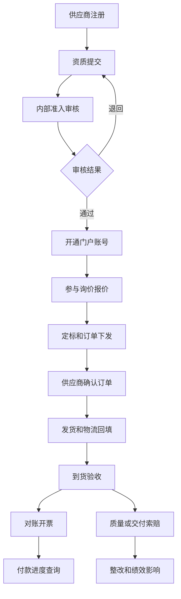
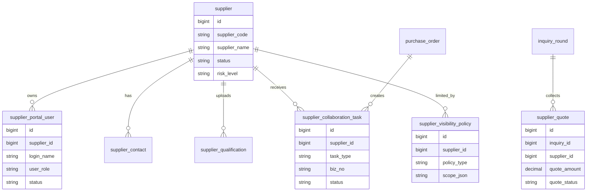
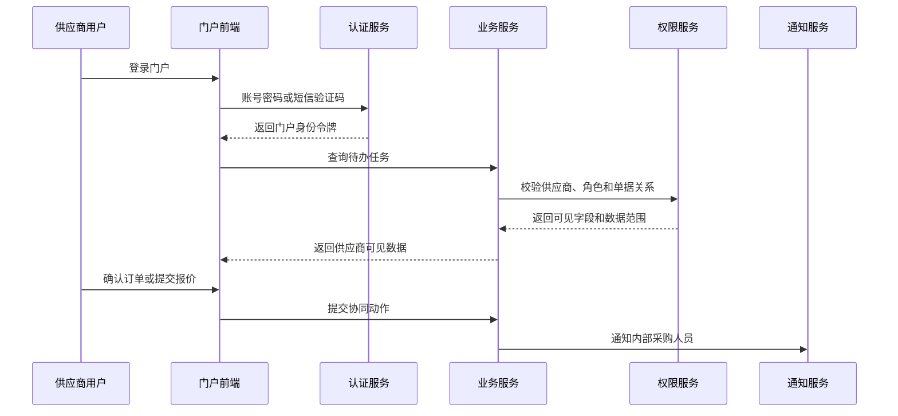
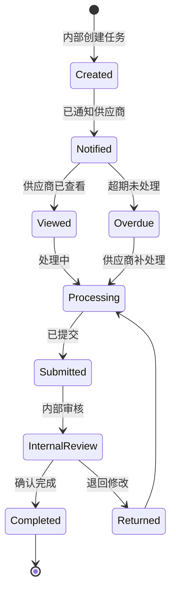

# 供应商协同门户项目案例

## 适合谁看

如果你做过采购、合同、订单或供应商管理，但还没有做过“给外部供应商登录使用的系统”，可以先看这一篇。

供应商协同门户不是把内部采购后台开放出去。它要解决的是外部供应商如何安全地注册、报价、接单、发货、对账、开票、处理索赔和查看绩效。

## 业务目标

供应商门户要让供应商能自己完成高频协作，减少采购人员来回发邮件和手工同步：

- 供应商可以维护企业资料、联系人和资质证照。
- 供应商可以参与询价、提交报价和查看定标结果。
- 供应商可以确认采购订单、填写发货信息和上传物流凭证。
- 供应商可以查看验收、对账、开票、付款和索赔进度。
- 内部人员可以控制供应商能看到哪些业务范围和数据。

真实项目中最关键的是“外部身份隔离”。供应商账号不能和内部员工账号混用权限模型，否则很容易出现越权查看采购价、其他供应商报价或内部审批意见的问题。

## 供应商协同链路

门户的价值不是“多一个登录页面”，而是把采购协作从线下消息变成线上可追踪流程。

## 核心概念

| 概念 | 说明 | 项目里的典型字段 |
| --- | --- | --- |
| 供应商租户 | 外部供应商组织边界 | supplier_id |
| 门户账号 | 供应商员工账号 | portal_user_id |
| 准入范围 | 可供货品类、组织、区域 | category_scope、org_scope |
| 协同任务 | 报价、确认、发货、对账等待办 | task_type、task_status |
| 外部可见字段 | 对供应商开放的字段白名单 | visible_field_policy |
| 供应商联系人 | 商务、财务、物流、质量角色 | contact_role |
| 消息通知 | 站内信、邮件、短信、企微通知 | notice_channel |

供应商门户的权限要按“供应商组织 + 联系人角色 + 业务范围 + 单据关系”共同判断，不能只看角色名。

## 数据模型

`supplier_visibility_policy` 用来描述供应商可见范围。很多项目初期直接在查询条件里写 `supplier_id`，后面遇到集团供应商、多分公司供应商和代理商场景时会很难扩展。

## 推荐表结构

| 表 | 用途 | 关键字段 |
| --- | --- | --- |
| supplier | 供应商主数据 | supplier_code、supplier_name、status、risk_level |
| supplier_portal_user | 门户登录账号 | supplier_id、login_name、mobile、user_role、status |
| supplier_contact | 联系人 | supplier_id、contact_name、contact_role、email、phone |
| supplier_qualification | 资质证照 | supplier_id、qualification_type、file_id、expire_date、audit_status |
| supplier_collaboration_task | 协同待办 | supplier_id、task_type、biz_no、deadline、status |
| supplier_visibility_policy | 可见范围策略 | supplier_id、policy_type、scope_json |
| supplier_portal_audit_log | 门户审计日志 | supplier_id、portal_user_id、action、biz_no、ip |

外部门户一定要保存 IP、设备、登录时间和关键操作日志。供应商经常需要多人协作，出了问题必须能追踪是谁确认了订单、谁上传了发票。

## 门户登录与数据访问流程

外部门户接口要默认“不信任前端”。即使前端隐藏了某些字段，后端也必须按可见字段策略过滤返回数据。

## 协同任务状态设计

任务状态要区分“已通知”和“已查看”。采购人员经常需要知道供应商到底没收到，还是收到了但没有处理。

## 前端页面拆分

| 页面 | 主要功能 | 新手容易漏掉 |
| --- | --- | --- |
| 门户首页 | 待办、公告、快捷入口、超期提醒 | 首页要按角色展示不同入口 |
| 企业资料 | 基本信息、联系人、银行账户 | 银行账户修改需要审批 |
| 资质证照 | 上传、到期提醒、审核状态 | 证照过期要影响可接单范围 |
| 询价报价 | 查看询价、提交报价、澄清问题 | 不能看到其他供应商报价 |
| 订单协同 | 订单确认、交期反馈、变更确认 | 订单价格字段要受可见策略控制 |
| 发货协同 | 发货单、物流、装箱、到货状态 | 支持部分发货和多次发货 |
| 对账开票 | 对账单确认、发票上传、付款进度 | 发票文件和金额要能关联对账行 |
| 索赔整改 | 查看索赔、提交申诉和整改材料 | 申诉期限和证据附件要明确 |

门户页面要减少内部术语。例如内部叫“定标结果”，供应商页面可以叫“中选结果”或“报价结果”。

## 接口拆分建议

| 接口 | 方法 | 说明 |
| --- | --- | --- |
| /api/supplier-portal/auth/login | POST | 供应商门户登录 |
| /api/supplier-portal/profile | GET/PUT | 查看和维护供应商资料 |
| /api/supplier-portal/tasks | GET | 查询协同任务 |
| /api/supplier-portal/inquiries | GET | 查询可参与询价 |
| /api/supplier-portal/quotes | POST | 提交报价 |
| /api/supplier-portal/orders/:id/confirm | POST | 确认采购订单 |
| /api/supplier-portal/shipments | POST | 提交发货信息 |
| /api/supplier-portal/reconciliations | GET | 查询对账单 |
| /api/supplier-portal/invoices | POST | 上传发票 |

建议和内部后台接口分开命名空间。不要让供应商门户复用 `/api/admin` 下的接口，再靠前端隐藏字段。

## 实际项目常见问题

### 问题 1：供应商看到了其他供应商的数据

常见原因是列表查询只按业务状态过滤，忘了加供应商数据范围。

解决方式：

- 每个门户接口都从令牌中解析 `supplier_id`。
- 查询条件强制带上供应商范围。
- 详情接口也要校验单据是否属于当前供应商。
- 对导出接口做同样的数据范围校验。

### 问题 2：供应商多人共用一个账号

这会导致责任无法追踪。

解决方式：

- 支持供应商管理员创建子账号。
- 子账号按商务、财务、物流、质量分配角色。
- 关键动作记录 portal_user_id，而不是只记录 supplier_id。
- 高风险动作要求短信或邮箱二次确认。

### 问题 3：内部字段被外部接口返回

例如内部成本价、评标备注、其他供应商报价。

解决方式：

- 建立外部 DTO，不直接返回内部实体。
- 按接口维护字段白名单。
- 敏感字段在服务层过滤，不依赖前端隐藏。
- 对门户接口增加快照测试或字段检查。

### 问题 4：门户消息发出去了但没人处理

只发邮件不够，供应商可能漏看。

解决方式：

- 协同任务有明确截止时间。
- 支持站内信、邮件、短信多通道。
- 保存通知发送记录和阅读状态。
- 超期任务自动提醒采购人员。

## 权限与审计

| 权限 | 建议 |
| --- | --- |
| 门户登录 | 供应商状态正常、账号启用、密码或验证码校验 |
| 资料维护 | 供应商管理员可改，敏感字段需内部审核 |
| 报价提交 | 只允许被邀请供应商提交 |
| 订单确认 | 只允许订单所属供应商处理 |
| 发票上传 | 财务角色或供应商管理员 |
| 数据导出 | 默认限制，导出必须带水印和审计 |

门户权限的底线是：供应商只能看和自己有关的数据，只能操作自己被授权的任务。

## 验收清单

- 供应商无法访问其他供应商的任务、报价、订单和发票。
- 外部门户不会返回内部审批意见、评标备注和其他供应商价格。
- 供应商账号支持多人、分角色和停用。
- 协同任务能看到通知、查看、提交、退回和超期状态。
- 关键动作有 IP、账号、时间和业务单号审计。
- 证照过期能触发提醒或限制业务范围。
- 内部人员能看到供应商协同进度。

## 下一步学习

建议继续阅读：

- [供应商准入项目案例](/projects/supplier-onboarding-case)
- [供应商合同协同项目案例](/projects/supplier-contract-collaboration-case)
- [供应商索赔项目案例](/projects/supplier-claim-case)
- [数据权限审计项目案例](/projects/data-permission-audit-case)
