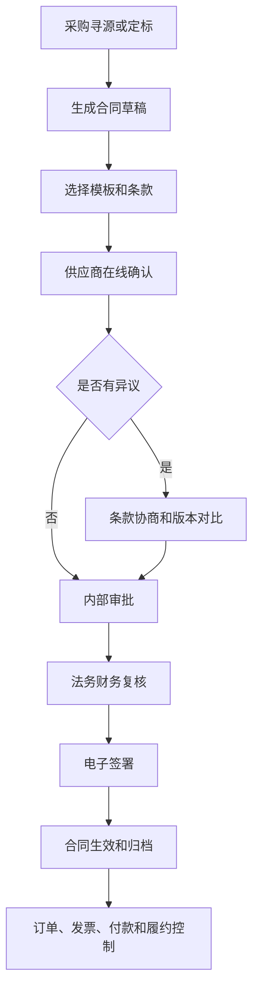
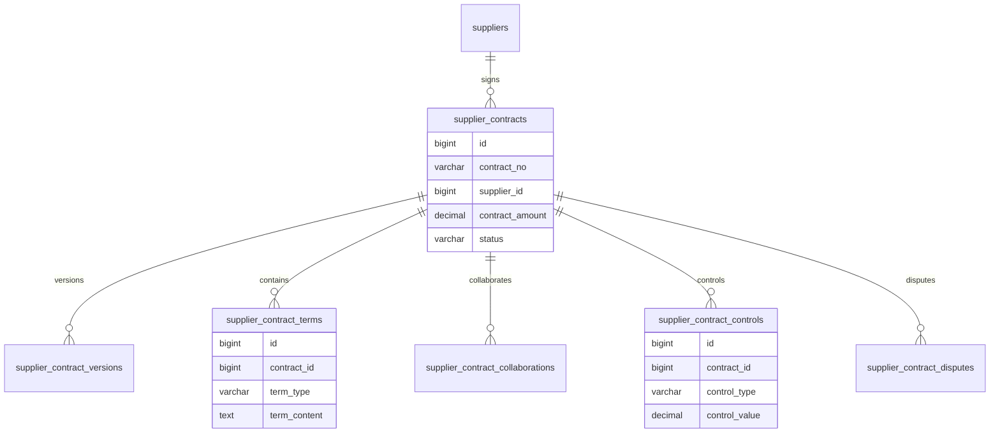
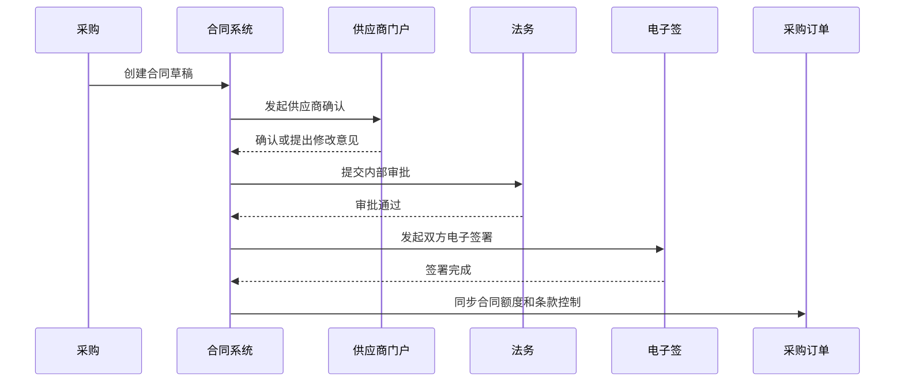

# 供应商合同协同项目案例

## 适合谁看

适合需要做采购合同、供应商在线确认、合同审批、条款协同、电子签署、合同履约、价格协议、补充协议和供应商门户的开发者。

供应商合同协同不是“上传一份 PDF 合同”。真实采购项目里，合同会连接供应商准入、采购寻源、采购订单、价格协议、交付计划、发票付款、质量索赔和供应商绩效。系统要能回答：合同条款谁改过、供应商是否确认、哪些订单受合同约束、是否超出合同额度、履约和付款是否符合约定。

## 业务目标

第一版供应商合同协同支持：

- 从采购寻源、定标或采购订单创建供应商合同。
- 支持合同模板、条款库、商务条款和附件。
- 支持供应商门户在线确认、补充资料和意见反馈。
- 支持采购、法务、财务、质量和业务部门审批。
- 支持电子签署、合同归档和版本管理。
- 支持合同履约节点、价格协议、订单额度和付款条款控制。
- 支持合同变更、续签、终止、补充协议和争议记录。
- 支持供应商合同看板和风险预警。

## 供应商合同协同链路

供应商合同协同的关键是“合同生效后的控制”。如果合同只是归档文件，采购订单、发票和付款就无法按合同条款校验。

## 核心概念

| 概念 | 说明 | 示例 |
| --- | --- | --- |
| 合同草稿 | 尚未审批和签署的合同版本 | 采购合同 V1 |
| 条款库 | 可复用的标准合同条款 | 付款条款、违约条款 |
| 供应商确认 | 供应商在线确认合同内容 | 门户确认价格 |
| 条款协商 | 对价格、交期、质保、付款进行修改 | 付款从 30 天改 45 天 |
| 合同额度 | 合同允许采购或付款的金额 | 框架合同 500 万 |
| 履约控制 | 按合同约束订单、交付、发票和付款 | 超合同额度预警 |
| 补充协议 | 合同生效后的补充约定 | 延长交期 |
| 争议记录 | 双方对履约或条款的异议 | 质量扣款争议 |

供应商合同要区分“文本版本”和“业务控制版本”。文本用于法律归档，业务控制字段用于订单、付款、履约校验。

## 数据模型

## 推荐表结构

| 表 | 作用 | 关键字段 |
| --- | --- | --- |
| `supplier_contracts` | 供应商合同主表 | `contract_no`、`supplier_id`、`contract_type`、`contract_amount`、`status` |
| `supplier_contract_versions` | 合同版本 | `contract_id`、`version_no`、`source_type`、`snapshot_json` |
| `supplier_contract_terms` | 合同条款 | `contract_id`、`term_type`、`term_content`、`risk_level` |
| `supplier_contract_collaborations` | 协同记录 | `contract_id`、`participant_type`、`comment`、`action` |
| `supplier_contract_approvals` | 合同审批 | `contract_id`、`node_name`、`action`、`operator_id` |
| `supplier_contract_signatures` | 签署记录 | `contract_id`、`sign_party`、`sign_status`、`signed_at` |
| `supplier_contract_controls` | 业务控制 | `contract_id`、`control_type`、`control_value`、`used_value` |
| `supplier_contract_disputes` | 争议记录 | `contract_id`、`dispute_type`、`description`、`status` |

合同条款建议结构化关键字段，例如付款周期、质保期、违约金、交付周期、订单额度。只保存全文不利于业务控制。

## 合同协同流程

供应商提出的修改意见要能形成版本对比。法务审批时不能只看到最终文本，还要看到哪些条款被改过。

## 合同状态设计

| 状态 | 含义 | 注意点 |
| --- | --- | --- |
| 草稿 | 采购编辑合同 | 可修改 |
| 待供应商确认 | 已发送供应商门户 | 内部字段可锁定 |
| 协商中 | 供应商提出修改意见 | 生成版本对比 |
| 内部审批中 | 进入公司审批 | 核心条款冻结 |
| 待签署 | 审批通过等待签署 | 跟踪双方签署 |
| 生效中 | 合同已生效 | 控制订单和付款 |
| 变更中 | 有补充协议或变更 | 原合同仍可追踪 |
| 已终止 | 合同提前终止 | 停止新增交易 |
| 已到期 | 超过有效期 | 限制订单和付款 |

合同到期和终止要影响采购交易。不能只在合同列表里显示过期标签。

## 前端页面拆分

| 页面或组件 | 作用 | 注意点 |
| --- | --- | --- |
| 供应商合同列表 | 查询合同状态、金额、有效期和风险 | 支持供应商、品类筛选 |
| 合同编辑器 | 编辑模板、条款、附件和业务字段 | 文本和结构化字段同步 |
| 条款对比 | 展示供应商修改和历史版本 | 法务审批重点 |
| 供应商确认页 | 供应商在线确认、评论和上传附件 | 门户权限隔离 |
| 合同审批 | 采购、法务、财务、质量多角色审批 | 展示风险条款 |
| 签署跟踪 | 查看电子签状态和失败原因 | 支持补偿查询 |
| 合同控制台 | 查看额度、订单、发票、付款使用情况 | 业务控制可解释 |
| 争议和变更 | 处理争议、补充协议和终止 | 关联原合同 |

合同编辑器不要只做富文本。付款条款、有效期、合同额度、品类、组织范围等字段必须结构化。

## 接口拆分建议

| 接口 | 作用 | 注意点 |
| --- | --- | --- |
| `POST /supplier-contracts` | 创建供应商合同 | 可由定标或采购订单触发 |
| `POST /supplier-contracts/{id}/send-to-supplier` | 发起供应商确认 | 生成门户待办 |
| `POST /supplier-contracts/{id}/collaborations` | 提交协同意见 | 保存条款变更 |
| `POST /supplier-contracts/{id}/submit` | 提交内部审批 | 冻结合同版本 |
| `POST /supplier-contracts/{id}/sign` | 发起电子签 | 防止重复签署 |
| `POST /supplier-contracts/{id}/effective` | 合同生效 | 同步业务控制字段 |
| `POST /supplier-contracts/{id}/terminate` | 合同终止 | 停止新增交易 |
| `GET /supplier-contracts/{id}/controls` | 查询控制使用情况 | 展示额度和付款占用 |

## 实际项目常见问题

### 问题 1：供应商口头确认，系统没有证据

供应商确认、修改意见、附件和时间都要在门户中留痕。邮件或线下沟通可作为附件归档，但不能替代系统确认。

### 问题 2：合同签了，但采购订单没有受控制

合同生效后要同步额度、价格、品类、供应商和有效期控制。下单时必须检查是否超合同范围。

### 问题 3：法务看不出哪些条款被改过

协同修改必须生成版本对比，并标记高风险条款。只给法务看最终 PDF 会增加审核风险。

### 问题 4：合同到期后仍能付款

付款前要检查合同状态、有效期和剩余额度。历史已发生的付款可以继续处理，但新增付款要有例外审批。

## 权限与审计

供应商合同协同权限至少要区分：

- 创建供应商合同。
- 编辑合同条款。
- 发送供应商确认。
- 查看供应商反馈。
- 审批合同。
- 发起签署。
- 配置合同业务控制。
- 终止合同。
- 查看争议和变更。

条款修改、供应商确认、审批意见、签署、生效、终止、额度调整和例外放行都要审计。合同是采购交易和付款的核心依据。

## 验收清单

- 合同可从采购寻源、定标或采购订单创建。
- 支持模板、条款、附件和结构化业务字段。
- 供应商可在线确认和反馈意见。
- 条款修改有版本对比。
- 支持采购、法务、财务、质量等多角色审批。
- 支持电子签署和签署状态跟踪。
- 合同生效后能控制订单、发票和付款。
- 支持合同变更、终止、到期和争议记录。
- 合同额度和使用情况可查询。
- 关键协同和审批动作有审计记录。

## 下一步学习

继续学习 [供应商准入项目案例](/projects/supplier-onboarding-case)、[采购寻源项目案例](/projects/procurement-sourcing-case)、[采购管理项目案例](/projects/procurement-management-case) 和 [合同管理项目案例](/projects/contract-management-case)。
