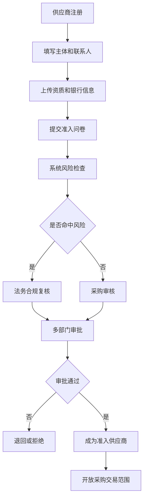
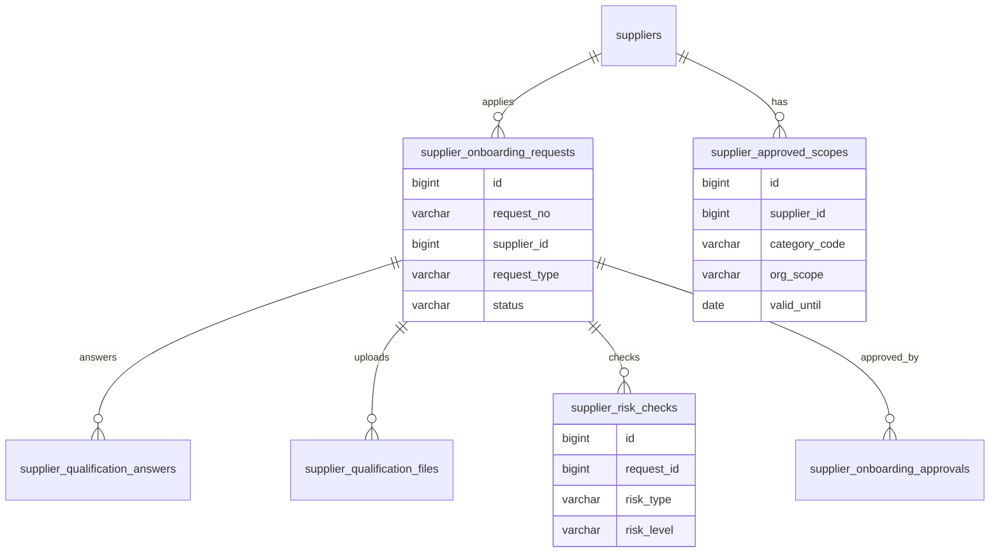
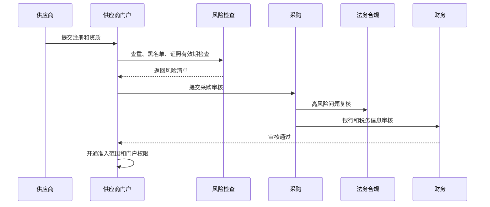

# 供应商准入项目案例

## 适合谁看

适合需要做供应商注册、资质收集、问卷评估、风险审核、准入审批、供应商档案、准入范围和供应商门户的开发者。

供应商准入不是“新增一个供应商名称”。真实采购系统里，供应商在交易前需要完成主体信息、资质证照、银行账户、税务信息、品类能力、合规风险、黑名单检查和内部审批。系统要能回答：供应商是否真实、能供应什么、资质是否过期、风险谁审核、是否允许下单和付款。

## 业务目标

第一版供应商准入支持：

- 支持外部供应商自助注册和内部采购代录入。
- 收集企业主体、联系人、银行、税务、资质和品类能力。
- 支持准入问卷、资质附件、风险问题和内部补充问题。
- 支持采购、法务、财务、质量和合规多部门审批。
- 支持准入范围、有效期、供应品类和交易限制。
- 支持资质到期提醒、复审和准入撤销。
- 支持黑名单、重复供应商和关联方风险检查。
- 支持供应商档案、准入记录和审计。

## 供应商准入链路

供应商准入的关键是“交易前门禁”。没有准入的供应商不应进入采购订单、合同、发票和付款流程。

## 核心概念

| 概念 | 说明 | 示例 |
| --- | --- | --- |
| 注册申请 | 供应商进入系统的申请 | 外部注册链接 |
| 准入问卷 | 用问题收集供应商能力和风险 | 是否有 ISO 认证 |
| 资质证照 | 证明供应商合法和能力的文件 | 营业执照、许可证 |
| 准入范围 | 允许供应的品类和组织 | 办公耗材、华东区域 |
| 风险检查 | 对黑名单、重复、过期、异常进行识别 | 银行账户异常 |
| 准入审批 | 内部多部门确认供应商可交易 | 采购、法务、财务 |
| 复审 | 定期重新审核供应商资格 | 每年复审 |
| 准入撤销 | 因风险或过期停止交易 | 资质过期停用 |

供应商档案和准入申请要分开。一个供应商可以多次申请不同品类或组织的准入。

## 数据模型

## 推荐表结构

| 表 | 作用 | 关键字段 |
| --- | --- | --- |
| `suppliers` | 供应商档案 | `supplier_code`、`name`、`tax_no`、`status`、`created_source` |
| `supplier_onboarding_requests` | 准入申请 | `request_no`、`supplier_id`、`request_type`、`status`、`submitted_at` |
| `supplier_contacts` | 联系人 | `supplier_id`、`name`、`role`、`phone`、`email` |
| `supplier_bank_accounts` | 银行账户 | `supplier_id`、`account_name`、`bank_name`、`account_no`、`verified_status` |
| `supplier_qualification_answers` | 问卷答案 | `request_id`、`question_code`、`answer_value`、`risk_flag` |
| `supplier_qualification_files` | 资质附件 | `request_id`、`file_type`、`file_id`、`valid_until` |
| `supplier_risk_checks` | 风险检查 | `request_id`、`risk_type`、`risk_level`、`check_result` |
| `supplier_onboarding_approvals` | 准入审批 | `request_id`、`node_name`、`action`、`operator_id` |
| `supplier_approved_scopes` | 准入范围 | `supplier_id`、`category_code`、`org_scope`、`valid_until`、`enabled` |

银行账户、税号和资质有效期都是高风险字段。变更时要重新审核，不能允许供应商随意修改后直接生效。

## 准入审批流程

供应商注册通过不等于准入通过。注册只是拿到受限账号，准入通过后才允许参与询价、签合同、下单和收款。

## 准入状态设计

| 状态 | 含义 | 注意点 |
| --- | --- | --- |
| 草稿 | 信息填写中 | 可编辑 |
| 待提交 | 必填项已完成 | 可预检查 |
| 审核中 | 内部审批流转 | 核心字段冻结 |
| 退回补充 | 信息不完整或有疑问 | 供应商补充材料 |
| 已准入 | 允许在指定范围交易 | 有有效期和范围 |
| 已拒绝 | 不允许准入 | 保存原因 |
| 待复审 | 准入即将到期 | 提醒采购和供应商 |
| 已暂停 | 风险或过期导致限制 | 禁止下单或付款 |
| 已撤销 | 准入资格终止 | 保留审计 |

准入状态要能影响交易。比如已暂停供应商可以查看历史单据，但不能新增采购订单。

## 前端页面拆分

| 页面或组件 | 作用 | 注意点 |
| --- | --- | --- |
| 供应商注册页 | 外部供应商填写基本信息 | 移动端和桌面都要可用 |
| 准入申请详情 | 展示主体、资质、问卷、风险 | 审批人集中处理 |
| 资质管理 | 管理证照、有效期和附件 | 到期提醒 |
| 准入问卷配置 | 配置问题、选项和风险分 | 问题版本化 |
| 风险检查面板 | 展示查重、黑名单、异常字段 | 高风险突出 |
| 准入审批 | 多部门审核和意见 | 根据风险动态路由 |
| 准入范围 | 配置品类、组织、有效期和交易限制 | 影响采购交易 |
| 供应商档案 | 汇总准入、绩效、合同、订单 | 档案和申请分离 |

准入申请详情页要把“供应商自己填的内容”和“内部审核补充的信息”区分开，避免责任不清。

## 接口拆分建议

| 接口 | 作用 | 注意点 |
| --- | --- | --- |
| `POST /supplier-onboarding/register` | 创建注册申请 | 支持外部链接 |
| `POST /supplier-onboarding/{id}/submit` | 提交准入 | 校验必填和附件 |
| `POST /supplier-onboarding/{id}/risk-check` | 风险检查 | 查重、黑名单、资质 |
| `POST /supplier-onboarding/{id}/approve` | 审批准入 | 保存节点意见 |
| `POST /supplier-onboarding/{id}/reject` | 拒绝准入 | 必填拒绝原因 |
| `POST /suppliers/{id}/approved-scopes` | 设置准入范围 | 影响交易权限 |
| `POST /suppliers/{id}/suspend` | 暂停供应商 | 需要原因和审批 |
| `GET /suppliers/expiring-qualifications` | 查询即将过期资质 | 用于提醒和复审 |

## 实际项目常见问题

### 问题 1：重复供应商越来越多

准入前要按统一社会信用代码、税号、银行账户、手机号、企业名称相似度查重。名称相似但税号不同也要提示人工确认。

### 问题 2：资质过期后仍然可以下单

资质有效期要进入交易校验。下采购订单、签合同、付款前都应检查供应商状态和准入范围。

### 问题 3：供应商修改银行账户后直接付款

银行账户变更应走单独审批，并在审批完成前保持旧账户可用。高风险账户变更要通知财务复核。

### 问题 4：问卷变更影响历史审批解释

准入问卷要版本化。历史申请要保存当时的问题、答案和风险判定快照。

## 权限与审计

供应商准入权限至少要区分：

- 创建供应商注册。
- 查看供应商敏感信息。
- 配置准入问卷。
- 审核资质。
- 审核银行和税务信息。
- 设置准入范围。
- 暂停或撤销准入。
- 导出供应商档案。

税号、银行账户、资质、准入范围、审批意见、暂停和撤销都要审计。供应商准入会影响采购交易和资金支付。

## 验收清单

- 支持外部注册和内部代录入。
- 供应商档案和准入申请分离。
- 主体、联系人、银行、税务、资质信息完整。
- 准入问卷和风险检查可用。
- 支持采购、法务、财务、质量等多部门审批。
- 准入范围能限制品类、组织和有效期。
- 资质过期可提醒并影响交易。
- 银行账户变更有审批。
- 支持暂停、拒绝、撤销和复审。
- 历史申请和审批记录可追溯。

## 下一步学习

继续学习 [采购管理项目案例](/projects/procurement-management-case)、[采购寻源项目案例](/projects/procurement-sourcing-case)、[供应商绩效项目案例](/projects/supplier-performance-case) 和 [合同管理项目案例](/projects/contract-management-case)。
