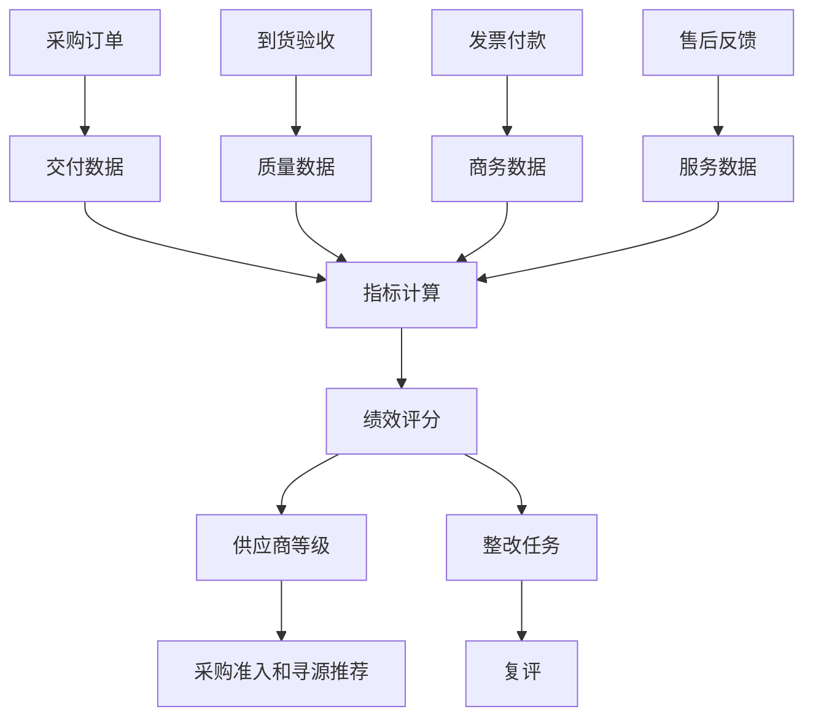
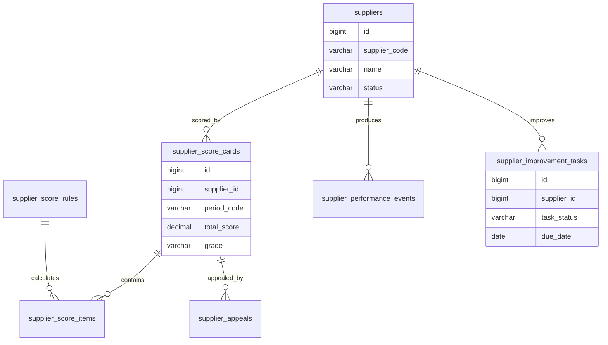
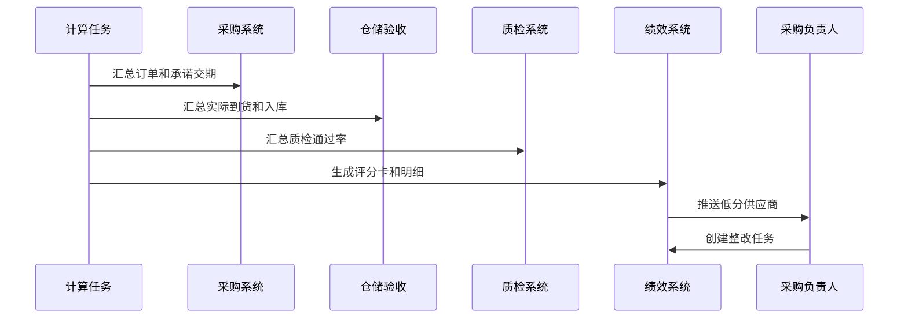

# 供应商绩效项目案例

## 适合谁看

适合需要做供应商评分、供应商分级、交付表现、质量表现、价格表现、服务响应、整改跟踪和供应商淘汰机制的开发者。

供应商绩效不是“给供应商打个星级”。真实项目里，供应商表现会影响采购寻源、采购订单、质量追溯、供应链计划和财务付款。系统要能把到货准时率、质检合格率、价格竞争力、售后响应和合规风险沉淀成评分，并反馈到后续采购决策。

## 业务目标

第一版供应商绩效支持：

- 建立供应商绩效指标体系。
- 从采购、仓储、质检、财务和售后采集数据。
- 计算供应商月度、季度和年度评分。
- 支持供应商等级和黑白名单。
- 支持绩效申诉和人工调整。
- 支持整改任务和复评。
- 在采购寻源和采购订单中提示供应商风险。
- 输出供应商绩效看板。

## 供应商绩效链路

这条链路的重点是“评分要来自业务事实”。人工评分可以存在，但不应该成为全部依据。

## 核心概念

| 概念 | 说明 | 示例 |
| --- | --- | --- |
| 指标项 | 一个可计算或可评价的维度 | 准时交付率 |
| 指标权重 | 指标在总分中的占比 | 交付 30%、质量 40% |
| 评分周期 | 按什么时间计算 | 月度、季度、年度 |
| 供应商等级 | 根据分数划分的等级 | A、B、C、D |
| 整改任务 | 低分或异常后的改进动作 | 提交质量改善计划 |
| 申诉 | 供应商对评分提出异议 | 物流不可抗力导致延期 |
| 准入影响 | 绩效对采购选择的影响 | D 级供应商禁止中标 |

供应商绩效要提前定义指标口径。例如“准时交付”到底按承诺发货日、预计到货日还是实际入库日计算，必须写清楚。

## 数据模型

## 推荐表结构

| 表 | 作用 | 关键字段 |
| --- | --- | --- |
| `supplier_score_rules` | 绩效规则 | `metric_code`、`metric_name`、`weight`、`enabled` |
| `supplier_performance_events` | 业务事件 | `supplier_id`、`event_type`、`source_no`、`event_value` |
| `supplier_score_cards` | 评分卡 | `supplier_id`、`period_code`、`total_score`、`grade` |
| `supplier_score_items` | 评分明细 | `score_card_id`、`metric_code`、`score`、`reason_snapshot` |
| `supplier_grade_policies` | 等级策略 | `grade_code`、`min_score`、`max_score`、`control_policy` |
| `supplier_appeals` | 评分申诉 | `score_card_id`、`appeal_reason`、`appeal_status` |
| `supplier_improvement_tasks` | 整改任务 | `supplier_id`、`issue_type`、`owner_id`、`due_date` |
| `supplier_performance_adjustments` | 人工调整 | `score_card_id`、`adjust_score`、`reason`、`approved_by` |

评分明细要保存原因快照，例如“本周期 12 单，延期 2 单，准时率 83.3%”。只有总分没有解释，业务不会信任评分。

## 绩效计算流程

绩效计算要保存输入快照。否则几个月后订单状态变化，历史评分就解释不清。

## 指标体系示例

| 指标 | 口径 | 常见权重 |
| --- | --- | --- |
| 准时交付率 | 按承诺到货日和实际入库日比较 | 25% |
| 质检合格率 | 合格数量 / 到货数量 | 30% |
| 价格竞争力 | 与历史均价或市场价比较 | 15% |
| 响应及时率 | 询价、异常、售后响应时长 | 10% |
| 发票配合度 | 发票及时性和差错率 | 10% |
| 合规风险 | 黑名单、资质过期、处罚记录 | 10% |

不同品类权重可以不同。设备采购可能更重视质量和售后，耗材采购可能更重视价格和交期。

## 前端页面拆分

| 页面或组件 | 作用 | 注意点 |
| --- | --- | --- |
| 绩效工作台 | 查看供应商等级和风险 | 突出低分和待整改 |
| 供应商评分卡 | 查看总分、等级和趋势 | 必须展示原因明细 |
| 指标配置 | 配置指标、权重和口径 | 权重变更要版本化 |
| 绩效事件 | 查看评分来源数据 | 可追溯到订单、验收、质检 |
| 申诉处理 | 处理供应商异议 | 保留原分和调整记录 |
| 整改任务 | 跟踪改善计划 | 支持复评和关闭 |
| 等级策略 | 配置 A/B/C/D 控制规则 | 与采购准入联动 |
| 绩效看板 | 分析品类、团队、供应商表现 | 指标口径固定 |

评分卡页面不要只显示总分。要让采购、供应商和管理者都能看到“扣分扣在哪里”。

## 接口拆分建议

| 接口 | 作用 | 注意点 |
| --- | --- | --- |
| `GET /suppliers/{id}/score-cards` | 查询评分卡 | 支持按周期查看 |
| `POST /supplier-performance/calculate` | 触发计算 | 可按周期、品类、供应商重算 |
| `GET /supplier-performance/events` | 查询绩效事件 | 支持追溯来源单据 |
| `POST /supplier-performance/appeals` | 提交申诉 | 必须关联评分卡和指标项 |
| `POST /supplier-performance/adjustments` | 人工调整 | 需要审批和原因 |
| `POST /supplier-performance/improvement-tasks` | 创建整改任务 | 绑定问题指标和截止时间 |
| `GET /supplier-performance/rankings` | 查询排名 | 避免跨品类直接比较 |

## 实际项目常见问题

### 问题 1：供应商认为评分不公平

解决方案是公开指标口径、展示评分明细，并允许申诉。申诉通过后不要覆盖原分，要生成调整记录和审批记录。

### 问题 2：不同品类供应商放在一起排名

这会导致排名失真。电子设备、办公耗材和物流服务的评价维度不同，应按品类、采购类型或服务类型分组比较。

### 问题 3：供应商等级调整没有影响采购选择

绩效等级要反馈到采购寻源和采购订单。例如 D 级供应商禁止邀请，C 级供应商需要额外审批，A级供应商优先推荐。

### 问题 4：人工调整分数被滥用

人工调整必须有权限、原因、附件和审批。系统要保留调整前分数、调整后分数和调整人。

## 权限与审计

供应商绩效权限至少要区分：

- 查看评分卡。
- 配置指标和权重。
- 触发绩效计算。
- 处理供应商申诉。
- 人工调整分数。
- 创建整改任务。
- 修改等级策略。
- 导出绩效报表。

指标权重、人工调整、等级策略和黑名单控制都要审计。这些操作会影响供应商利益和采购决策。

## 验收清单

- 绩效指标和口径清晰。
- 评分周期可配置。
- 评分数据能追溯到业务单据。
- 评分卡保存总分、等级和明细原因。
- 支持供应商申诉和人工调整。
- 人工调整有审批和审计。
- 低分供应商能生成整改任务。
- 等级策略能影响采购寻源和订单。
- 支持按品类查看排名和趋势。
- 历史评分不受后续业务数据变化影响。

## 下一步学习

继续学习 [采购寻源项目案例](/projects/procurement-sourcing-case)、[采购管理项目案例](/projects/procurement-management-case)、[供应链计划项目案例](/projects/supply-chain-planning-case) 和 [质量追溯项目案例](/projects/quality-traceability-case)。
