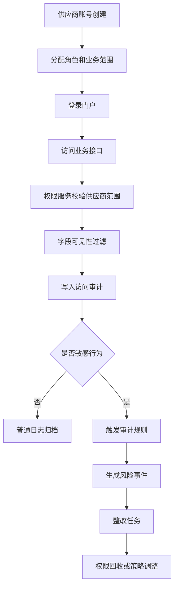
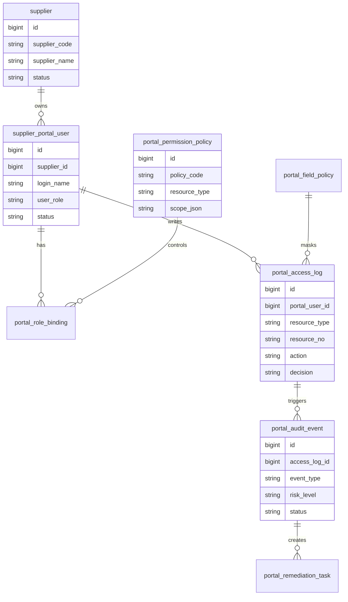
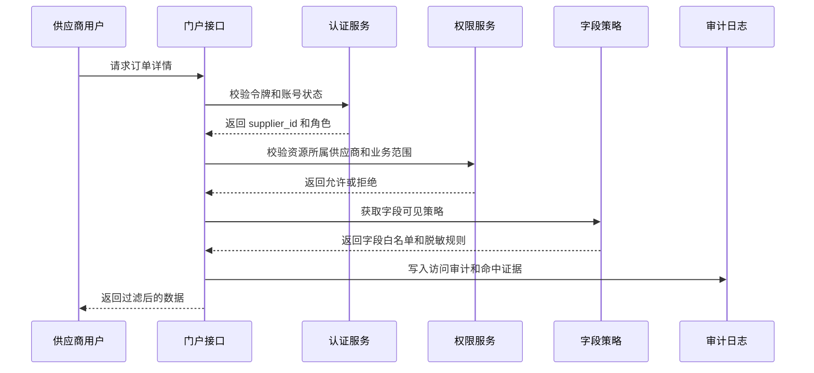
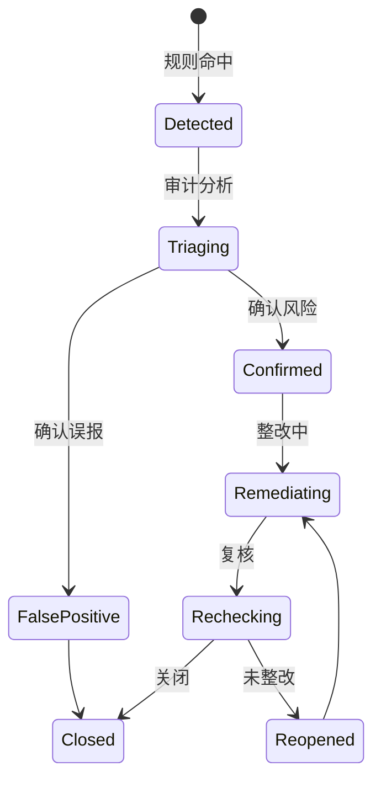
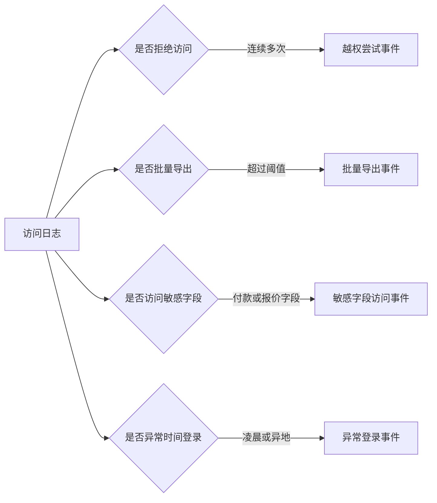

# 供应商门户权限审计项目案例

## 适合谁看

如果你已经理解供应商协同门户，但担心“外部账号会不会看到不该看的数据”，可以继续看这一篇。

供应商门户权限审计不是普通登录日志。它关注的是外部供应商账号、子账号、角色、单据关系、字段可见性、导出行为和异常访问是否被完整记录和定期复核。

## 业务目标

供应商门户权限审计要回答 6 个问题：

- 哪些供应商账号能登录门户。
- 每个账号可以看哪些业务范围和字段。
- 外部账号是否访问了不属于自己的订单、报价、发票或索赔。
- 敏感字段是否被导出、截图或批量查询。
- 供应商离职人员、过期联系人和停用供应商是否仍有权限。
- 审计发现的问题如何整改、关闭和复盘。

真实项目里，供应商门户往往比内部后台更容易被忽视，因为它“功能少”。但只要它能查看价格、合同、发票或付款进度，就必须纳入权限审计。

## 供应商门户权限审计链路

审计链路要覆盖“谁访问了什么”和“系统为什么允许访问”。只记录 URL 和账号，不足以证明权限判断是正确的。

## 核心概念

| 概念 | 说明 | 项目里的典型字段 |
| --- | --- | --- |
| 门户主体 | 外部供应商用户 | portal_user_id |
| 供应商边界 | 当前用户所属供应商 | supplier_id |
| 业务范围 | 品类、组织、区域、订单关系 | scope_json |
| 字段策略 | 哪些字段可见或脱敏 | field_policy |
| 敏感行为 | 导出、批量查询、查看付款信息 | sensitive_action |
| 访问证据 | 请求、结果、权限命中原因 | evidence_json |
| 审计事件 | 规则命中的风险记录 | audit_event |
| 整改任务 | 权限回收、账号停用、策略修复 | remediation_task |

权限审计不是替代权限控制。正确顺序是先控制，再记录，再分析，再整改。

## 数据模型

`portal_access_log` 要记录允许和拒绝两类结果。只记录成功访问，会漏掉大量越权尝试。

## 推荐表结构

| 表 | 用途 | 关键字段 |
| --- | --- | --- |
| supplier_portal_user | 门户账号 | supplier_id、login_name、user_role、status、last_login_at |
| portal_role_binding | 角色绑定 | portal_user_id、role_code、scope_json、expire_at |
| portal_permission_policy | 资源权限策略 | resource_type、action、scope_rule、enabled |
| portal_field_policy | 字段可见策略 | resource_type、field_code、visible_rule、mask_rule |
| portal_access_log | 访问审计日志 | portal_user_id、resource_type、resource_no、action、decision、evidence_json |
| portal_audit_event | 审计风险事件 | event_type、risk_level、event_status、owner_id |
| portal_remediation_task | 整改任务 | event_id、task_type、assignee_id、due_date、close_result |

门户权限审计最好单独建表，不要只写普通操作日志。普通日志面向排错，审计日志面向证明和追责。

## 权限判断流程

字段过滤要在服务端完成。前端隐藏字段不是安全策略，只是界面展示策略。

## 审计事件状态设计

审计事件不能只停留在“发现问题”。必须有负责人、截止时间、整改动作和关闭证据。

## 审计规则示例

规则要支持阈值和白名单。某些供应商财务角色需要批量下载对账单，不能简单地把所有导出都当成风险。

## 前端页面拆分

| 页面 | 主要功能 | 新手容易漏掉 |
| --- | --- | --- |
| 门户账号审计 | 账号、角色、状态、最后登录 | 过期联系人和停用账号标识 |
| 权限策略页 | 资源、动作、范围、字段策略 | 显示策略命中示例 |
| 访问日志页 | 查询访问结果、资源、IP、设备 | 要能筛选拒绝访问 |
| 敏感行为页 | 导出、批量查询、敏感字段访问 | 行为要能关联业务单据 |
| 审计事件页 | 风险事件、等级、负责人、状态 | 事件要能转整改任务 |
| 整改任务页 | 回收权限、停用账号、策略修复 | 关闭时上传证据 |
| 审计报表页 | 越权尝试、导出趋势、整改率 | 按供应商和资源维度统计 |

权限审计页面不要只给技术人员看。采购、财务、法务和安全人员都可能参与复核，所以页面文案要用业务语言解释风险。

## 接口拆分建议

| 接口 | 方法 | 说明 |
| --- | --- | --- |
| /api/supplier-portal-audit/users | GET | 查询门户账号审计 |
| /api/supplier-portal-audit/policies | GET | 查询权限策略 |
| /api/supplier-portal-audit/access-logs | GET | 查询访问审计日志 |
| /api/supplier-portal-audit/events | GET | 查询审计事件 |
| /api/supplier-portal-audit/events/:id/confirm | POST | 确认风险或误报 |
| /api/supplier-portal-audit/remediations | POST | 创建整改任务 |
| /api/supplier-portal-audit/reports | GET | 查询审计报表 |

访问日志写入接口不要暴露给前端。它应该由后端网关或业务服务在权限判断后自动写入。

## 实际项目常见问题

### 问题 1：供应商账号停用了，但子账号还能登录

只停用供应商主账号，没有级联处理子账号。

解决方式：

- 供应商状态变更时同步影响门户账号。
- 登录时同时校验用户状态和供应商状态。
- 停用动作写审计日志。
- 定期扫描停用供应商下的启用账号。

### 问题 2：接口拒绝了越权访问，但没有留下证据

权限服务直接返回 403，没有记录访问日志。

解决方式：

- 允许和拒绝都写入访问审计。
- 记录资源类型、资源编号、判断规则和拒绝原因。
- 对连续拒绝访问触发风险事件。
- 审计日志避免记录敏感明文。

### 问题 3：供应商导出了大量对账数据

导出接口复用了查询权限，没有额外审计。

解决方式：

- 导出权限单独控制。
- 导出记录保存筛选条件、文件 ID 和水印编号。
- 大批量导出触发审计事件。
- 文件下载链接设置有效期。

### 问题 4：字段脱敏只在前端做

浏览器接口仍然返回完整字段，用户可以从网络请求看到敏感数据。

解决方式：

- 服务端返回外部门户专用 DTO。
- 字段策略在服务层执行。
- 敏感字段默认不返回，必要时脱敏。
- 对接口响应做字段白名单测试。

## 权限与审计

| 权限 | 建议 |
| --- | --- |
| 查看审计日志 | 安全、采购负责人、审计角色 |
| 查看敏感字段日志 | 更高权限，按数据分类控制 |
| 处理审计事件 | 指定负责人，动作必须留痕 |
| 修改门户策略 | 权限管理员，发布需要审批 |
| 导出审计报表 | 审计角色，文件水印和下载记录 |
| 关闭整改任务 | 需要复核人确认，不允许处理人直接关闭 |

审计系统本身也需要权限控制。否则任何人都能查看供应商访问记录，会产生新的数据风险。

## 验收清单

- 门户接口会校验供应商范围、角色和单据关系。
- 字段可见性在服务端过滤或脱敏。
- 允许和拒绝访问都会写审计日志。
- 批量导出、敏感字段访问和异常登录能触发事件。
- 审计事件有确认、整改、复核和关闭流程。
- 停用供应商后，其门户账号无法继续登录。
- 审计报表能按供应商、账号、资源和风险类型统计。

## 下一步学习

建议继续阅读：

- [供应商协同门户项目案例](/projects/supplier-collaboration-portal-case)
- [数据权限审计项目案例](/projects/data-permission-audit-case)
- [供应商准入项目案例](/projects/supplier-onboarding-case)
- [行业合规审计项目案例](/projects/compliance-audit-case)
